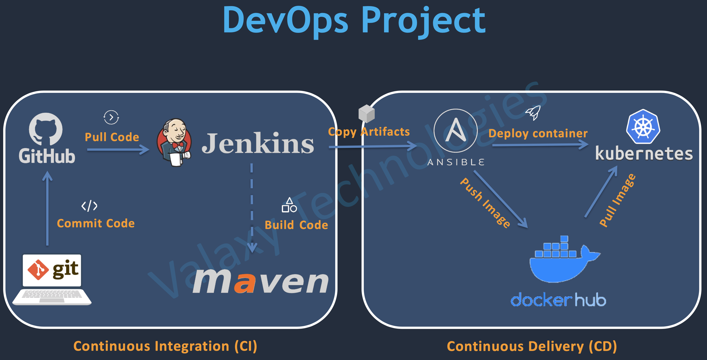
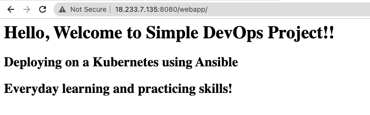
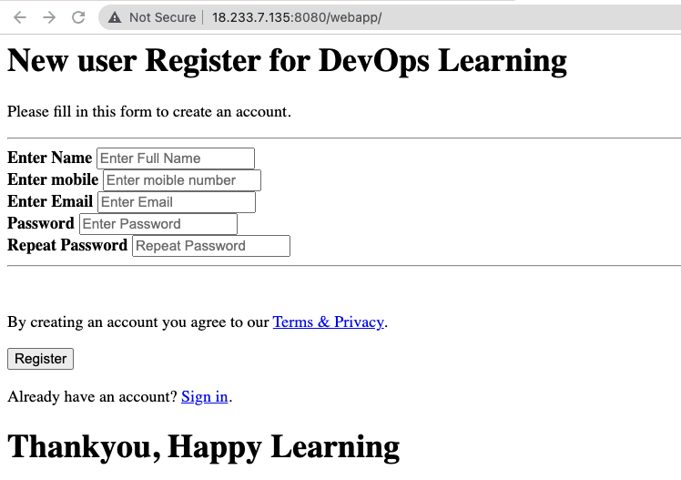

# Jenkins CI/CD Project with Ansible and Kubernetes

*Project Source* : 
  

## CI/CD Pipeline using Git,Jenkins and Maven

### Step1: Configure Jenkins Server

- First we need to launch an EC2 instance with Keypair
```sh
instanceType: t2.micro
AMI: Amazon Linux-2
Security Group: 
22, SSH
8080, Custom TCP
```
- Once our server is running, connect to your server via SSH by using your keypair.
- Next we need to install `Java`,`Jenkins`, `Maven` to our server.
- First switch to root user `sudo su -` and update the packages first `sudo yum update -y`
```shell
sudo wget -O /etc/yum.repos.d/jenkins.repo https://pkg.jenkins.io/redhat-stable/jenkins.repo
sudo rpm --import https://pkg.jenkins.io/redhat-stable/jenkins.io.key
```
- Then we need to install Java
```sh
sudo amazon-linux-extras install java-openjdk11 -y
```
- After installing Java, we can now install Jenkins and start our Jenkins server
```sh
sudo yum install jenkins -y
sudo systemctl enable jenkins
sudo systemctl start jenkins
sudo systemctl status jenkins
```
- Connect to http://<your_server_public_DNS>:8080 from your browser. You can get `initialAdminPassword` for jenkins by running below command:
```sh
sudo cat /var/lib/jenkins/secrets/initialAdminPassword
```
- We need to install git in our Jenkins server, run below command:
```sh
sudo yum install git
```
- Now we can run our first Jenkins job. Go to `Dashboard` -> `New Item` 
```sh
JobName: HelloWorldJob
Type: Free Style Project
Build Step: Execute shell
echo "Hello World!"
```

### Step2: Integrate Git with Jenkins

- We need to go to `Manage Jenkins` -> `Manage Plugins`. Here we will install `Github Integration` and `Maven Integration` plugins.

- Now we can run our Second job to check `Github integration` is working as expected. Create another FreeStyleJob as below:
```sh
SCM: Git
URL: https://github.com/rumeysakdogan/hello-world.git
Save -> Build Now
```

- You can check the Workspace, if your project successfully downloadded from GitHub. In Jenkins server, `/var/lib/jenkins/workspace/` you can see the jobs you have run so far.

### Step3: Install and Configure Maven in Jenkins Server

- We need to install MAVEN in Jenkins server. 

```sh
cd /opt
sudo wget https://dlcdn.apache.org/maven/maven-3/3.8.6/binaries/apache-maven-3.8.6-bin.tar.gz 
tar -xvzf apache-maven-3.8.6-bin.tar.gz 
mv apache-maven-3.8.6-bin maven
```

- Next configure `M2_HOME` and `M2`(binary directory) environment variables and add them to the `PATH` so that we can run `maven` commands in any directory. You can search where is your JVM by using t`find / name java-11*`

- Now you need to edit .bash_profile to add these variables to path and save 
```sh
M2_HOME=/opt/maven
M2=/opt/maven/bin
JAVA_HOME=/usr/lib/jvm/java-11-openjdk-11.0.16.0.8-1.amzn2.0.1.x86_64

PATH=$PATH:$HOME/bin:$M2_HOME:$M2:$JAVA_HOME
export PATH
```
- To apply the changes we have made to .bash_profile, either we can logout and log back in or run `source .bash_profile` command. It will upload the changes.

### Step4: Integrate Maven with Jenkins

- Now go to `Manage Jenkins` and `Global Tool Configuration` to add path fofr Java and Maven.

- We can configure a `Maven Project` to build our Code, go to `Dashboard` -> `NewItem`

```sh
Name = FirstMavenProject
Type: Maven Project
Root Pom: pom.xml
Goals and options: clean install
```

- now we can go to `/var/lib/jenkins/workspace/FirstMavenProject/webapp/target` to see our build artifact webapp.war file.

## Integrating Tomcat server in CI/CD Pipeline

### Step1: Setup Tomcat Server

- First create an EC2 instance for Tomcat Server
```sh
instanceType: t2.micro
AMI: Amazon Linux-2
Security Group: 
22, SSH
8080, Custom TCP
```

- Next install java-11 in Tomcat server, switch to root user `sudo su -` and run below command. Once installed, check `java -version`

```sh
amazon-linux-extras install java-openjdk11
```

- Next we will install Tomcat, switch to `/opt` directory 

```sh
wget https://dlcdn.apache.org/tomcat/tomcat-9/v9.0.68/bin/apache-tomcat-9.0.68.tar.gz
tar -xvzf apache-tomcat-9.0.68.tar.gz
mv apache-tomcat-9.0.68.tar.gz tomcat
```
- Now we can start our Tomcat server

```sh
cd tomcat/bin/
./startup.sh
```
- Now we should be able to access our Tomcat server from browser. Go to `http:<public_ip_of_your_tomcat_server>:8080`

- When we click `Manager App` we should get `403 Access Denied` error. To fix this issue we need to edit `context.xml` file.

```sh
By default the Manager is only accessible from a browser running on the same machine as Tomcat. If you wish to modify this restriction, you'll need to edit the Manager's context.xml file.
``` 

- Go to tomcat directory run `find / -name context.xml` to get the location of `context.xml` file

```sh
/opt/tomcat/webapps/examples/META-INF/context.xml
/opt/tomcat/webapps/host-manager/META-INF/context.xml
/opt/tomcat/webapps/manager/META-INF/context.xml
```

- We should update `context.xml` file under `host-manager` and `manager` directories. Currently it is only allowing access from localhost, we will comment out the part shown below in the xml.

```sh
<!--  <Valve className="org.apache.catalina.valves.RemoteAddrValve"
  allow="127\.\d+\.\d+\.\d+|::1|0:0:0:0:0:0:0:1" /> -->
```

- Once we updated those files, we need to stop and restart our Tomcat server. 
```sh
cd tomcat/bin/
./shutdown.sh
./startup.sh
```

- Now we updated the files, we will no longer get `403 Access Denied` error but it will ask username&password in Tomcat server. To find the credentials, go to under tomcat/conf directory
```sh
cd tomcat/conf/
vim tomcat-users.xml
```

- We will add below users  to the file, and save the file.

```sh
 <role rolename="manager-gui"/>
 <role rolename="manager-script"/>
 <role rolename="manager-jmx"/>
 <role rolename="manager-status"/>
 <user username="admin" password="admin" roles="manager-gui, manager-script, manager-jmx, manager-status"/>
 <user username="deployer" password="deployer" roles="manager-script"/>
 <user username="tomcat" password="s3cret" roles="manager-gui"/>
``` 

- Once we updated the file, we need to stop and restart our Tomcat server. 
```sh
cd tomcat/bin/
./shutdown.sh
./startup.sh
```

### Step2: Integrate Tomcat with Jenkins

- Install `Deploy to Container` plugin in Jenkins. Go to `Manage Jenkins` -> `Manage Plugins`, find the plugin under Available and choose `install without restart`

- Configure Tomcat Server with credentials. Go to `Manage Jenkins` -> `Manage Credentials`. We will select `Add credentials`. We will use the credential we have added to `tomcat-user.xml` file for this step. Since these credentials will be used for deploying app, we will add `deployer` credentials which has `manager-script` role.
```sh
Kind: username with password
username: deployer
pwd: deployer
```

- Now we can create our next job with name of `BuildAndDeployJob`. After build step, the artifact will stored under `webapp/target/` directory as `webapp.war`.  
```sh
Kind: Maven Project
SCM: https://github.com/rumeysakdogan/hello-world.git
Goal and options: clean install
Post Build Actions: Deploy war/ear to a container
WAR/EAR files: **/*.war
Container: Tomcat 8 (even though we have install v9, this plugin is giving some issues with v9, for that reason we will use v8)
Credentials: tomcat_deployer
Tomcat URL: http://<Public_IP_of_Tomcat_server>:8080/ 
```

- `Save` and `Build` the job. When go to Tomcat server under `Manager App`, you will be able to see our application under `webapp/`


### Step3: Automate Build and Deploy using Poll SCM

- We can configure our job to be triggered with `Poll SCM` by scheduling a cron job. It will check the repository based on given schedule. If there is any change in repository, it will trigger job and deployed the new version of app to Tomcat server.

- We can also configure a webhook in our repository, whenever there is any `Git push` happens, job will trigger. To be able to setup Webhooks in Github, Go to `Settings` -> `Webhook` -> `Add webhook` 
```sh
Payload URL: http://<dns_of_your_jenkins_server>:8080/github-webhook/
``` 

## Integrating Docker in CI/CD Pipeline

### Step1: Setup Docker Environment

- First we will create an EC2 instance for Docker and name it as `Docker-Host`. 
```sh
instanceType: t2.micro
AMI: Amazon Linux-2
Security Group: 
22, SSH
8080, Custom TCP
```

- Login to `Docker-Host` server via SSH,  switch to root user `sudo su -` and install docker
```sh
yum install -y
```

### Step2: Create Tomcat container

- Go to `DockerHub`, search for `Tomcat` official image. We can pick a specific tag of the image, but if we don't specify it will pull the image with latest tag. For this project we will use latest Tomcat image.
```sh
docker pull tomcat
```

- Next we will run docker container from this image.
```sh
docker run -d --name tomcat-container -p 8081:8080 tomcat
```

- To be able to reach this container from browser, we need to add port `8081` to our Security Group. We can add a range of port numbers `8081-9000` to Ingress.

- Once we try to reach our container from browser it will give us `404 Not found` error. This is a known issue after Tomcat version 9. We will follow below steps to resolve this issue.

- First we need to go inside container by running below command:
```sh
docker exec -it tomcat-container /bin/bash
```  

- Once we are inside the container, we need to move files under `webapps.dist/` to `webapps/`
```sh
mv webapps webapps2
mv webapps.dist webapps
exit
```

- However, this solution is temporary. Whenever we stop our container and restart the same error will be appeared. To overcome this issue, we will create a Dockerfile and create our own Tomcat image.

### Step3: Create Customized Dockerfile for Tomcat

- We will create a Dockerfile which will fix the issue.

```sh
FROM tomcat
RUN cp -R /usr/local/tomcat/webapps.dist/* /usr/local/tomcat/webapps/
```

- Lets create an image from this Docker file.
```sh
docker build -t tomcat-fixed .
```

- Now we can create a container from this image
```sh
docker run -d --name tomcat-container-fixed -p 8085:8080 tomcat-fixed
```

- We can check our Tomcat server in browser now.


### Step4: Integrate Docker with Jenkins

- We will create a new user/password called `dockeradmin` and add it to `docker` group

```sh
useradd dockeradmin
passwd dockeradmin
usermod -aG docker dockeradmin
```
- Start docker service.
```sh
systemctl status docker
systemctl start docker
systemctl enable docker
systemctl status docker
```
- We can check our new user in `/etc/passwd` and groups `/etc/group`.
```sh
cat /etc/passwd
cat /etc/group
```

- Next we will allow username/password authentication to login to our EC2 instance. By default, EC2s are only allowing connection with Keypair via SSH not username/password.

```sh
vim /etc/ssh/sshd_config
```

- We need to uncomment/comment below lines in `sshd_config` file and save it
```sh
PasswordAuthentication yes
#PasswordAuthentication no
```
- We need to restart sshd service
```sh
service sshd reload
```

- Go to Jenkins , install `Publish over SSH` plugin. next go to `Manage Jenkins` -> `Configure System`
Find `Publish over SSH` -> `SSH Server`. `Apply` changes and `Save`
```sh
Name: dockerhost
Hostname: Private IP of Docker Host(since Jenkins and Docker host are in the same VPC, they would be able to communicate over same network)
Username: dockeradmin
click Advanced
Check use password based authentication
provide password
```

- We will create a Jenkins job with below properties:
```sh
Name: BuildAndDeployOnContainer
Type: Maven Project
SCM: https://github.com/rumeysakdogan/hello-world.git
POLL SCM: * * * * *
Build Goals: clean install
Post build actions: Send build artifacts over ssh
SSH server: dockerhost
TransferSet: webapp/target/*.war
Remove prefix: webapp/target
Remote directory: /home/dockeradmin
```

- Save and build, we can check under dockerhost server if webapp successfully send to /home/dockeradmin by using SSH.

### Step5: Update Tomcat dockerfile to automate deployment process

- Currently artifacts created through Jenkins are sent to `/home/dockeradmin`. We would like to change it to home directory of root user, and give ownership of this new directory to `dockeradmin`

```sh
sudo su - 
cd /opt
mkdir docker
chown -R dockeradmin:dockeradmin docker
```

- We have our Dockerfile under `/home/root`, we will move Dockerfile under `docker` directory and change ownership as well 
```sh
mv Dockerfile /opt/docker
chown -R dockeradmin:dockeradmin docker
```

- We will change our Dockerfile to copy the webapps.war file under webapps/ in Tomcat container.

```sh
FROM tomcat:latest
RUN cp -R /usr/local/tomcat/webapps.dist/* /usr/local/tomcat/webapps/
COPY ./*.war /usr/local/tomcat/webapps
```

- we build the image and create a container from the newly created image.
```sh
docker build -t tomcat:v1 .
docker run -d --name tomcatv1 -p 8086:8080 tomcat:v1
```

- We can check our app from browser http://<public_ip_of_docker_host>:8086/webapp/

- Now we can configure our `BuildAndDeployOnContainer` job to deploy our application. We will add below lines to `Exec Command` part. We also need to change `Remote directory` path as `//opt//docker`

```sh
cd /opt/docker;
docker build -t regapp:v1 .;
docker stop registerapp;
docker rm registerapp;
docker run -d --name registerapp -p 8089:8080 regapp:v1
```

## Integrating Ansible in CI/CD Pipeline

### Step1: Ansible Installation

- First we will create an EC2 instance for Ansible.
```sh
instanceType: t2.micro
AMI: Amazon Linux-2
Security Group: DevOps-Security-Group
```

- Login Ansible server via SSH and create new user named `ansadmin` and add it to `sudoers`
```sh
sudo su - 
useradd ansadmin
passwd ansadmin
```
- Add below line to `/etc/sudoers`s file. to open file in edit mode enter `visudo`.
```sh
## Same thing without a password
# %wheel        ALL=(ALL)       NOPASSWD: ALL
ansadmin ALL=(ALL)       NOPASSWD: ALL
```

- Next we will allow username/password authentication to login to our EC2 instance. By default, EC2s are only allowing connection using KeyPair via SSH not username/password.

```sh
vim /etc/ssh/sshd_config
```

- We need to uncomment/comment below lines in `sshd_config` file and save it
```sh
PasswordAuthentication yes
#PasswordAuthentication no
```
- We need to restart sshd service
```sh
service sshd reload
```

- Next we need to switch to `ansadmin` user and create ssh key. Create key will be stored in `/home/ansadmin/.ssh` directory. `id_rsa` will be our private key, `id_rsa.pub` will be our public key.
```sh
ssh-keygen
```

- Now we can install ansible as root user.
```shell
amazon-linux-extras install ansible2
``` 

- Ansible requires pyhon to be able to run, but Amazon Linux-2 already has python installed for this reason, we don't need to install python


### Step2: Integrate Docker with Ansible

- We need to follow below steps to steup connection between our Ansible node and Docker Host.

```Yaml
On Docker Host:
 - Create ansadmin
 - Add ansadmin to sudoers files
 - Enable password based login
```
```sh
sudo su -
useradd ansadmin
passwd ansadmin
visudo
```
- Add `ansadmin` to `sudoers` file
```sh
## Same thing without a password
# %wheel        ALL=(ALL)       NOPASSWD: ALL
ansadmin ALL=(ALL)       NOPASSWD: ALL
```
- We need to uncomment/comment below lines in `sshd_config` file and save it
```sh
PasswordAuthentication yes
#PasswordAuthentication no
```
- We need to restart sshd service
```sh
service sshd reload
```

```Yaml
On Ansible Node:
 - Add to hosts files
 - Copy ssh public key
 - Test Connection
```
- We need to add dockerhost to `/etc/ansible/hosts` file

- We need to create ssh-key for `ansadmin` user and copy the public key to docker host

```sh
sudo su - ansadmin
ssh-keygen
ssh-copy-id <private-ip-of-docker-host>
```

- We can check connection by running below command in ansible server.
```sh
ansible all -m ping
```
### Step3: Integrate Ansible with Jenkins

- Go to Jenkins server, `Manage jenkins` -> `Configure System`. We need to add below information under `Publish over SSH`:
```sh
Name: ansible-server
Hostname: Private-ip-of-Ansible-server
username: ansadmin
Enable user authentication
password
```

- Now we can create our Jenkins job:
```sh
Name: CopyArtifactsOntoAnsible
Copy from: BuildAndDeployOnContainer
Post build actions: ansiblehost
delete exec commands
```
- Go to ansible server, we need to create `/opt/docker` directory and give ownership to `ansadmin`
```sh
cd /opt
mkdir docker
chown -R ansadmin:ansadmin docker
```

- Save and build the job. `webapp.war` file is successfully copied to ansible server.

### Step4: Build an Image and create container on Ansible

- First we need to install docker in ansible server.And add `ansadmin` user to docker group, start docker service.
```sh
sudo yum install docker -y
sudo usermod -aG docker ansadmin
systemctl status docker
systemctl start docker
systemctl enable docker
systemctl status docker
```

- We will create same Dockerfile under `docker` directory in Ansible host.
We can create image and run container from this image in `ansible` server.
```sh
docker build -t regapp:v1 .
docker run -t --name regapp-server -p 8081:8080 regapp:v1
```

### Step5: Ansible playbook to create image and container

- We will create a simple playbook to create an image and container.
```yaml
---
- hosts: ansible
  
  tasks:
    - name: create docker image
      command: docker build -t regapp:latest .
      args:
        chdir: /opt/docker
```
- Before running this playbook, since we want to run this in ansible server we need to add public key to authorized keys. we can use `ssh-copy-id` command
```sh
ssh-copy-id <private-ip-of-ansible-server>
```
- Next we need to add Ansible server to our `/etc/ansible/hosts` file.
```sh
[dockerhost]
172.31.29.5    ansible_user=ansadmin

[ansible]
172.31.84.3
```
- Now we are ready to run our playbook
```sh
ansible-playbook all <playbook-name>.yml
```

### Step6: Copy image on dockerhub

- For this step we need to have dockerhub username to push our images to dockerhub. It is easy to signup free from the website `https://hub.docker.com/`.

```sh
docker login
Username:
Password:
Login Succeeded
```

- If we want to push an image to our dockerhub it has to be tagged with our docker username. We can tag an existing image by using `docker tag` command like shown below.

```sh
docker tag <image-id> rumeysakdogan/regapp:tagname
docker push rumeysakdogan/regapp:tagname
```

- Now we can update our playbook to add new tasks.
```sh
---
- hosts: ansible
  
  tasks:
    - name: create docker image
      command: docker build -t regapp:latest .
      args:
        chdir: /opt/docker
    - name: create tag to push image onto dockerhub
      command: docker tag regapp:latest rumeysakdogan/regapp:latest

    - name: push docker image
      command: docker push rumeysadogan/regapp:latest
```

- We can dry-run our playbook by giving `--check` flag.
```sh
ansible-playbook regapp.yml --check
``` 

### Step7: Jenkins job to build an image

- We will configure CopyArtifactOntoAnsible job to deploy image with ansible playbook

```sh

under SSH server:
host: ansiblehost
exec command: ansible-playbook /opt/docker/regapp.yml
```
### Step8: Create container on dockerhost using ansible playbook

- We can create another playbook, which can run container from the image that we pushed to our public repository on dockerhub.

```yaml
---
- hosts: dockerhost

  tasks:
    - name: create container
      command: docker run -d --name regapp-server -p 8082:8080 rumeysakdogan/regapp:latest 
```

- But we have a problem in this playbook, when we try to run the same playbook again, it will give an error saying `regapp-server container already exists.` To fix this problem, we will add below tasks to our playbook.
```yaml
- remove existing container
- remove existing image
- create a new container
``` 

- We will make the below updates in our `regapp-deploy.yml` file
```yaml
---
- hosts: dockerhost

  tasks:
    - name: stop existing container
      command: docker stop regapp-server
      ignore_errors: yes

    - name: remove the container
      command: docker rm regapp-server
      ignore_errors: yes

    - name: remove the existing image
      command: docker rmi rumeysakdogan/regapp:latest
      ignore_errors: yes

    - name: create container
      command: docker run -d --name regapp-server -p 8082:8080 rumeysakdogan/regapp:latest 
      ignore_errors: yes
```

- It is time to configure our existing Jenkins job `CopyArtifactsOntoAnsible` , we will add below commands to exec command part under SSH Host.
```sh
ansible-playbook /opt/docker/regapp.yml;
sleep 10;
ansible-playbook /opt/docker/regapp-deploy.yml
```

## Kubernetes cluster on AWS using eksctl

- First we will create an ec2-instance instance to use as EKSCTL bootstrap server.

- As per official documentation https://docs.aws.amazon.com/eks/latest/userguide/getting-started-eksctl.html, we need to install prerequisites shown below as root user:

```YAML
- Latest version of AWS CLI: https://docs.aws.amazon.com/cli/latest/userguide/getting-started-install.html
- kubectl latest version: https://docs.aws.amazon.com/eks/latest/userguide/install-kubectl.html
- eksctl latest version: https://docs.aws.amazon.com/eks/latest/userguide/eksctl.html
- IAM Role with required priviledges
```   

- Create cluster by using eksctl with below command:
```sh
eksctl create cluster --name rd-cluster \
--region us-east-1 \
--node-type t2.small 
```
- To delete cluster, run below command:
```sh
eksctl delete cluster --name rumeysa-cluster
```

## Integrating Kubernetes with CI/CD pipeline

### Step1: Create deployment and service manifest files to create and access pods

- Once our EKS cluster is ready we can run `kubectl` commands to check our cluster resources.

```sh
kubectl get all
kubectl get no
```

- Next we will create a deployment manifest for `regapp`.

```Yaml
apiVersion: apps/v1 
kind: Deployment
metadata:
  name: rumeysa-regapp
  labels: 
     app: regapp

spec:
  replicas: 2 
  selector:
    matchLabels:
      app: regapp

  template:
    metadata:
      labels:
        app: regapp
    spec:
      containers:
      - name: regapp
        image: rumeysakdogan/regapp
        imagePullPolicy: Always
        ports:
        - containerPort: 8080
  strategy:
    type: RollingUpdate
    rollingUpdate:
      maxSurge: 1
      maxUnavailable: 1
```

- We can create and check our deployment with below `kubectl` commands:
```sh
kubectl apply -f regapp-deploy.yml
kubectl get deploy
```

- Now we need to create a service to access our application from browser. We will create a `LoadBalancer` type service manifest for our app.

```yaml
apiVersion: v1
kind: Service
metadata:
  name: rumeysa-service
spec:
  selector:
    app: regapp 
  ports:
    - port: 8080
      targetPort: 8080
  type: LoadBalancer
```

- We can create and check our service with below `kubectl` commands:
```sh
kubectl apply -f regapp-service.yml
kubectl get svc 
```

### Step2: Integrate Kubernetes Bootstrap server with Ansible

- We need to follow below steps to steup connection between our Ansible node and K8s bootstrap server.

```Yaml
On K8s bootstrap server:
 - Create ansadmin
 - Add ansadmin to sudoers files
 - Enable password based login
```
```sh
sudo su -
useradd ansadmin
passwd ansadmin
visudo
```
- Add `ansadmin` to `sudoers` file
```sh
## Same thing without a password
# %wheel        ALL=(ALL)       NOPASSWD: ALL
ansadmin ALL=(ALL)       NOPASSWD: ALL
```
- We need to uncomment/comment below lines in `sshd_config` file and save it
```sh
PasswordAuthentication yes
#PasswordAuthentication no
```
- We need to restart sshd service
```sh
service sshd reload
```

```Yaml
On Ansible Node:
 - Add to hosts files
 - Copy ssh public key
 - Test Connection
```
- We will create a new host file to add  `kubernetes bootstrap server` under `/opt/docker`
```yaml
localhost

[kubernetes]
172.31.94.207

[ansible]
172.31.84.3
```

- We need to copy ansadmin  public ssh key to `k8s bootstrap server`

```sh
ssh-copy-id <private-ip-of-k8s-bootstrap-server>
```

- We can check connection by running below command in ansible server.
```sh
ansible -a uptime all 
```

### Step3: Create Ansible playbooks for deployment and service manifest files

- First we need to create our `kube_deploy.yml` playbook in ansible server.
```yaml
---
- hosts: kubernetes
  user: root

  tasks:
    - name: deploy regapp on kubernetes
      command: kubectl apply -f regapp-deployment.yml
```

- Next we will create our `kube_service.yml` playbook in ansible server.
```yaml
---
- hosts: kubernetes
  user: root

  tasks:
  - name: deploy regapp on kubernetes
    command: kubectl apply -f regapp-service.yml
```

- Since we are running these files as root user we need to copy ssh public key uder home directory of root user for ansible to control. For this action, It will ask root user password. we can easily configure a password for rrot with `passwd root` command in kubernetes bootstrap server.
```sh
ssh-copy-id root@<private_ip_of_kubernetes_bootstrap_server>
```

- Now we are ready to run our playbooks:
```sh
ansible-playbook -i hosts kube_deploy.yml
ansible-playbook -i hosts kube_service.yml
```

- We can check if our deployment is successful via ansible control node by running below command in K8s bootstrap server:
```sh
kubectl get deploy,svc 
```

### Step4: Create Jenkins deployment job for Kubernetes

- We will create a Freestyle job named `DeployOnKubernetes` in Jenkins.
```yaml
Post-build Actions: Send over SSH
server: ansiblehost
Exec command:
ansible-playbook -i /opt/docker/hosts /opt/docker/kube_deploy.yml;
ansible-playbook -i /opt/docker/hosts /opt/docker/kube_service.yml
```
- Before running the job, lets delete existing deployments in our K8s server. Then we can run our job.
```sh
kubectl delete deploy rumeysa-regapp
kubectl delete service rumeysa-service
```

- We can combine playbooks in one by adding `kube_service.yml` as a new task under `kube_deploy.yml`.
```yaml
---
- hosts: kubernetes
  user: root

  tasks:
    - name: deploy regapp on kubernetes
      command: kubectl apply -f regapp-deployment.yml

    - name: create loadbalancer service on kubernetes
      command: kubectl apply -f regapp-service.yml
```

### Step5: CI Job to create Image for Kubernetes

- Here we will just create a job named `RegApp_CI_Job` by using exieting job `CopyArtifactOntoDocker`. Last time we renamed our playbook, we will just update that in Exec Command section
```yaml
ansible-playbook /opt/docker/create_image_regapp.yml
```

### Step6: Enable rolling update to create pod from latest docker image

- To integrate our CI job with CD job, we will configure `PostBuild action` as `Build Other Projects`
```yaml
RegApp_CD_Job
Initialize only when build is stable 
```

- We need to update one more thing in our `kube-deploy.yml` playbook. We need to specify the rollout whenever if new image is pushed to docker hub.
```yaml
  - name: update deployment with new pods if image updated in docker hub
    command: kubectl rollout restart deployment.apps/rumeysa-regapp
```
- We can make an update to `index.jsp` in our `hello-world project` under `hello-world/webapp/src/main/webapp/` directory and push our changes to Github. This will trigger both CI&CD jobs triggered successively. 


