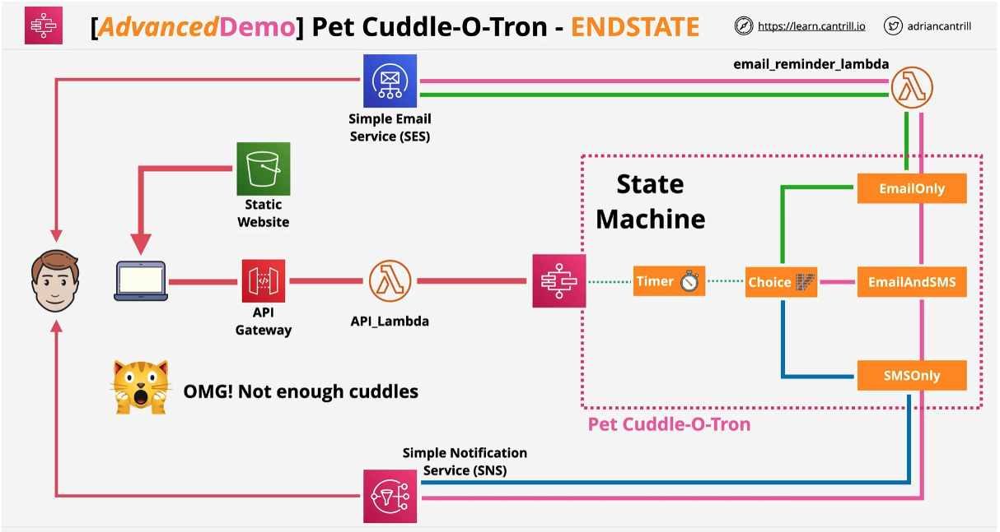

# Advanced Demo - Serverless App - Pet-Cuddle-O-Tron

*Project Source*: https://github.com/acantril/learn-cantrill-io-labs/tree/master/aws-serverless-pet-cuddle-o-tron

In this advanced demo you are going to implement a simple serverless application using S3, API Gateway, Lambda, Step Functions, SNS & SES.  

The advanced demo consists of 6 stages :-

- STAGE 1 : Configure Simple Email service 
- STAGE 2 : Add a email lambda function to use SES to send emails for the serverless application 
- STAGE 3 : Implement and configure the state machine, the core of the application
- STAGE 4 : Implement the API Gateway, API and supporting lambda function
- STAGE 5 : Implement the static frontend application and test functionality
- STAGE 6 : Cleanup the account

