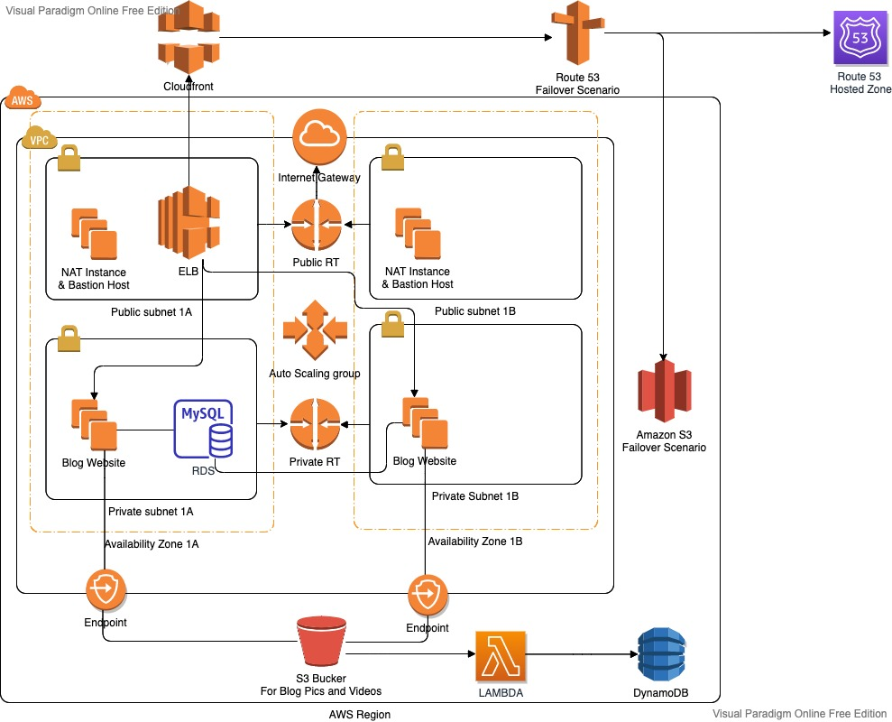

# Project-503 : Blog Page Application (Django) deployed on AWS Application Load Balancer with Auto Scaling, S3, Relational Database Service(RDS), VPC's Components, Lambda, DynamoDB and Cloudfront with Route 53

## Description

The Clarusway Blog Page Application aims to deploy blog application as a web application written Django Framework on AWS Cloud Infrastructure. This infrastructure has Application Load Balancer with Auto Scaling Group of Elastic Compute Cloud (EC2) Instances and Relational Database Service (RDS) on defined VPC. Also, The Cloudfront and Route 53 services are located in front of the architecture and manage the traffic in secure. User is able to upload pictures and videos on own blog page and these are kept on S3 Bucket. This architecture will be created by Firms DevOps Guy.

## Problem Statement



- Your company has recently ended up a project that aims to serve as Blog web application on isolated VPC environment. You and your colleagues have started to work on the project. Your Developer team has developed the application and you are going to deploy the app in production environment.

- Application is coded by Clarusway Fullstack development team and given you as DevOps team. App allows users to write their own blog page to whom user registration data should be kept in separate MySQL database in AWS RDS service and pictures or videos should be kept in S3 bucket. The object list of S3 Bucket containing movies and videos is recorded on DynamoDB table. 

- The web application will be deployed using Django framework.

- The Web Application should be accessible via web browser from anywhere in secure.

- You are requested to push your program to the project repository on the Github. You are going to pull it into the webservers in the production environment on AWS Cloud. 

In the architecture, you can configure your infrastructure using the followings,

  - The application stack should be created with new AWS resources.

  - Specifications of VPC:

    - VPC has two AZs and every AZ has 1 public and 1 private subnets.

    - VPC has Internet Gateway

    - One of public subnets has NAT Instance.

    - You might create new instance as Bastion host on Public subnet or you can use NAT instance as Bastion host.

    - There should be managed private and public route tables.

    - Route tables should be arranged regarding of routing policies and subnet associations based on public and private subnets.

  - You should create Application Load Balancer with Auto Scaling Group of Ubuntu 18.04 EC2 Instances within created VPC.

  - You should create RDS instance within one of private subnets on created VPC and configure it on application.

  - The Auto Scaling Group should use a Launch Template in order to launch instances needed and should be configured to;

    - use all Availability Zones on created VPC.

    - set desired capacity of instances to  ` 2`

    - set minimum size of instances to  ` 2`

    - set maximum size of instances to  ` 4`

    - set health check grace period to  ` 90 seconds`

    - set health check type to  ` ELB`

    - Scaling Policy --> Target Tracking Policy

      - Average CPU utilization (set Target Value ` %70`)

      - seconds warm up before including in metric ---> `200`

      - Set notification to your email address for launch, terminate, fail to launch, fail to terminate instance situations

  - ALB configuration;
    
    - Application Load Balancer should be placed within a security group which allows HTTP (80) and HTTPS (443) connections from anywhere. 
    
    - Certification should be created for secure connection (HTTPS) 
      - To create certificate, AWS Certificate Manager can be utilized.

    - ALB redirects to traffic from HTTP to HTTPS

    - Target Group
      - Health Check Protocol is going to be HTTP

  - The Launch Template should be configured to;

    - Prepare Django environment on EC2 instance based on Developer Notes,

    - Download the "clarusway_aws_capstone" folder from Github repository,

    - Install the requirements using requirements.txt in 'clarusway_aws_capstone' folder

    - Deploy the Django application on port 80.

    - Launch Template only allows HTTP (80) and HTTPS (443) ports coming from ALB Security Group and SSH (22) connections from anywhere.

    - EC2 Instances type can be configured as `t2.micro`.

    - Instance launched should be tagged `Clarusway AWS Capstone Project`

    - Since Django App needs to talk with S3, S3 full access role must be attached EC2s. 

  - For RDS Database Instance;
  
    - Instance type can be configured as `db.t2.micro`

    - Database engine can be `MySQL` with version of `8.0.20`.

    - RDS endpoint should be addressed within settings file of blog application that is explained developer notes.

    - Please read carefully "Developer notes" to manage RDS sub settings.

  - Cloudfront should be set as a cache server which points to Application Load Balance with following configurations;

    - The cloudfront distribution should communicate with ALB securely.

    - Origin Protocol policy can be selected as `HTTPS only`.

    - Viewer Protocol Policy can be selected as `Redirect HTTP to HTTPS`

  - As cache behavior;

    - GET, HEAD, OPTIONS, PUT, POST, PATCH, DELETE methods should be allowed.

    - Forward Cookies must be selected All.

    - Newly created ACM Certificate should be used for securing connections. (You can use same certificate with ALB)

  - Route 53 

    - Connection must be secure (HTTPS). 

    - Your hostname can be used to publish website.

    - Failover routing policy should be set while publishing application
      
      - Primary connection is going to be Cloudformation

      - Secondary connection is going to be a static website placed another S3 bucket. This S3 bucket has just basic static website that has a picture said "the page is under construction" given files within S3_static_Website folder

      - Healthcheck should check If Cloudfront is healthy or not. 

  - As S3 Bucket

    - First S3 Bucket

      - It should be created within the Region that you created VPC

      - Since development team doesn't prefer to expose traffic between S3 and EC2s on internet, Endpoint should be set on created VPC. 

      - S3 Bucket name should be addressed within configuration file of blog application that is explained developer notes.
    
    - Second S3 Bucket 
      
      - This Bucket is going to be used for failover scenario. It has just a basic static website that has a picture said "the page is under construction"

  - To write the objects of S3 on DynamoDB table
    
    - Lambda Function 

      - Lambda function is going to be Python 3.8

      - Python Function can be found in github repo

      - S3 event is set as trigger

      - Since Lambda needs to talk S3 and DynamoDB and to run on created VPC, S3, DynamoDB full access policies and NetworkAdministrator policy must be attached it

      - `S3 Event` must be created first S3 Bucket to trigger Lambda function 

    - DynamoDB Table

      - Create a DynamoDB table which has primary key that is `id`

      - Created DynamoDB table's name should be placed on Lambda function.


## Project Skeleton 

```text
clarusway_blog_proj (folder)
|
|----Readme.md               # Given to the students (Definition of the project)
|----src (folder)            # Given to the students (Django Application's )
|----requirements.txt        # Given to the students (txt file)
|----lambda_function.py      # Given to the students (python file)
|----developer_notes.txt     # Given to the students (txt file)
```

## Expected Outcome


### At the end of the project, following topics are to be covered;

- Bash scripting

- AWS EC2 Launch Template Configuration

- AWS VPC Configuration
  - VPC
  - Private and Public Subnets
  - Private and Public Route Tables
  - Managing routes
  - Subnet Associations
  - Internet Gateway
  - NAT Gateway
  - Bastion Host
  - Endpoint

- AWS EC2 Application Load Balancer Configuration

- AWS EC2 ALB Target Group Configuration

- AWS EC2 ALB Listener Configuration

- AWS EC2 Auto Scaling Group Configuration

- AWS Relational Database Service Configuration

- AWS EC2, RDS, ALB Security Groups Configuration

- IAM Roles configuration

- S3 configuration

- Static website configuration on S3

- DynamoDB Table configuration

- Lambda Function configuration

- Get Certificate with AWS Certification Manager Configuration

- AWS Cloudfront Configuration

- Route 53 Configuration

- Git & Github for Version Control System

### At the end of the project, students will be able to;

- Construct VPC environment with whole components like public and private subnets, route tables and managing their routes, internet Gateway, NAT Instance. 

- Apply web programming skills, importing packages within Python Django Framework

- Configure connection to the `MySQL` database.

- Demonstrate bash scripting skills using `user data` section within launch template to install and setup Blog web application on EC2 Instance.

- Create a Lambda function using S3, Lambda and DynamoDB table.

- Demonstrate their configuration skills of AWS VPC, EC2 Launch Templates, Application Load Balancer, ALB Target Group, ALB Listener, Auto Scaling Group, S3, RDS, Cloudfront, Route 53.

- Apply git commands (push, pull, commit, add etc.) and Github as Version Control System.

## Steps to Solution
  
- Step 1: Create dedicated VPC and whole components

- Step 2: Create Security Groups (ALB ---> EC2 ---> RDS)

- Step 3: Create RDS

- Step 4: Create two S3 Buckets and set one of these as static website.

- Step 5: Download or clone project definition from `Clarusway` repo on Github 

- Step 6: Prepare your Github repository 

- Step 7: Prepare a userdata to be utilized in Launch Template

- Step 8: Write RDS, S3 in settings file given by Clarusway Fullstack Developer team  

- Step 9: Create NAT Instance in Public Subnet

- Step 10: Create Launch Template and IAM role for it

- Step 11: Create certification for secure connection

- Step 12: Create ALB and Target Group

- Step 13: Create Autoscaling Group with Launch Template

- Step 14: Create Cloudfront in front of ALB

- Step 15: Create Route 53 with Failover settings

- Step 16: Create DynamoDB Table

- Step 17-18: Create Lambda function 

- Step 17-18: Create S3 Event and set it as trigger for Lambda Function

## Notes

- RDS database should be located in private subnet. just EC2 machines that has ALB security group can talk with RDS.

- RDS is located on private groups and only EC2s can talk with it on port 3306

- ALB is located public subnet and it redirects traffic from http to https

- EC2's are located in private subnets and only ALB can talk with them


## Resources

- [Python Django Framework](https://www.djangoproject.com/)

- [Python Django Example](https://realpython.com/get-started-with-django-1/)

- [AWS CLI Command Reference](https://docs.aws.amazon.com/cli/latest/index.html)
