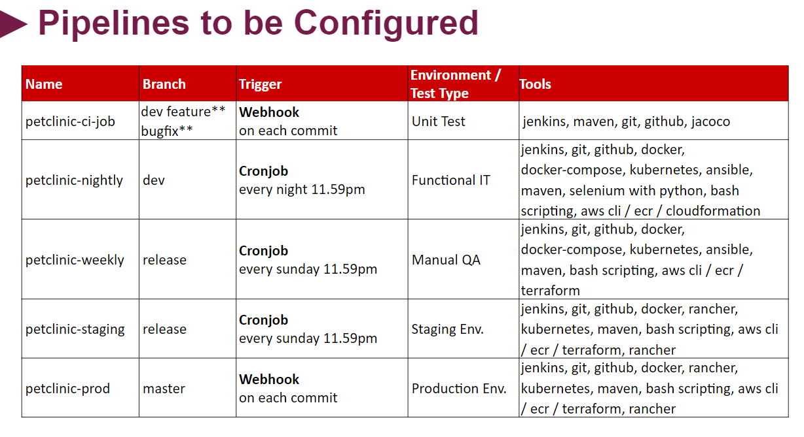
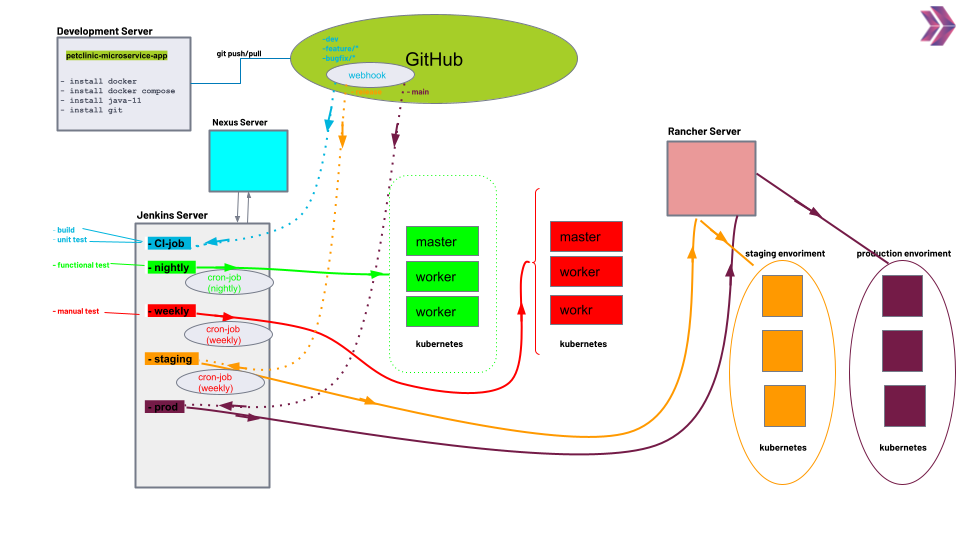

# Project 505: Microservices CI/CD Pipeline

## Description

This project aims to create full CI/CD Pipeline for microservice based applications using [Spring Petclinic Microservices Application](https://github.com/spring-petclinic/spring-petclinic-microservices). Jenkins Server deployed on Elastic Compute Cloud (EC2) Instance is used as CI/CD Server to build pipelines.

## DevOps Pipelines

### Development Diagram


### Pipelines Configurations



### Pipelines Overview



## Flow of Tasks for Project Realization

| Epic | Task  | Task #  | Task Definition   | Branch  |
| ---   | :---  | ---                  | :---              | :---    |
| Local Development Environment | Prepare Development Server Manually on EC2 Instance| MSP-1 | Prepare development server manually on Amazon Linux 2 for developers, enabled with `Docker` , `Docker-Compose` , `Java 11` , `Git` .  |
| Local Development Environment | Prepare GitHub Repository for the Project | MSP-2-1 | Clone the Petclinic app from the Clarusway repository [Petclinic Microservices Application](https://github.com/clarusway/petclinic-microservices.git) |
| Local Development Environment | Prepare GitHub Repository for the Project | MSP-2-2 | Prepare base branches namely `main` , `dev` , `release` for DevOps cycle. |
| Local Development Environment | Check the Maven Build Setup on Dev Branch | MSP-3 | Check the Maven builds for `test` , `package` , and `install` phases on `dev` branch |
| Local Development Environment | Prepare a Script for Packaging the Application | MSP-4 |  Prepare a script to package the application with Maven wrapper | feature/msp-4 |
| Local Development Environment | Prepare Development Server Terraform Files | MSP-5 |  Prepare development server folder with Terraform File for developers, enabled with `Docker` , `Docker-Compose` , `Java 11` , `Git` . | feature/msp-5 |
| Local Development Build | Prepare Dockerfiles for Microservices | MSP-6 | Prepare Dockerfiles for each microservices. | feature/msp-6 |
| Local Development Environment | Prepare Script for Building Docker Images | MSP-7 |  Prepare a script to package and build the docker images for all microservices. | feature/msp-7 |
| Local Development Build | Create Docker Compose File for Local Development | MSP-8-1 |  Prepare docker compose file to deploy the application locally. | feature/msp-8 |
| Local Development Build | Create Docker Compose File for Local Development | MSP-8-2 |  Prepare a script to test the deployment of the app locally. | feature/msp-8 |
| Testing Environment Setup | Implement Unit Tests | MSP-9-1  | Implement 3 Unit Tests locally. | feature/msp-9 |
| Testing Environment Setup | Setup Code Coverage Tool | MSP-9-2  | Update POM file for Code Coverage Report. | feature/msp-9 |
| Testing Environment Setup | Implement Code Coverage | MSP-9-3  | Generate Code Coverage Report manually. | feature/msp-9 |
| Testing Environment Setup | Prepare Selenium Tests | MSP-10-1  | Prepare 3 Selenium Jobs for QA Automation Tests. | feature/msp-10 |
| Testing Environment Setup | Implement Selenium Tests | MSP-10-2  | Run 3 Selenium Tests against local environment. | feature/msp-10 |
| CI Server Setup | Prepare Jenkins Server | MSP-11 | Prepare Jenkins Server for CI/CD Pipeline. | feature/msp-11 |
| CI Server Setup | Configure Jenkins Server for Project | MSP-12  | Configure Jenkins Server for Project Setup. | |
| CI Server Setup | Prepare CI Pipeline | MSP-13 | Prepare CI pipeline (UT only) for all `dev` , `feature` and `bugfix` branches. | feature/msp-13 |
| Registry Setup for Development | Create Docker Registry for Dev Manually | MSP-14  | Create Docker Registry on AWS ECR manually using Jenkins job. | feature/msp-14 |
| QA Automation Setup for Development | Create a QA Automation Environment - Part-1 | MSP-15  | Create a QA Automation Environment with Kubernetes. | feature/msp-15 |
| QA Automation Setup for Development | Create a QA Automation Environment - Part-2 | MSP-16  | Create a QA Automation Environment with Kubernetes. | feature/msp-16 |
| QA Automation Setup for Development | Prepare Petlinic Kubernetes YAML Files | MSP-17  | Prepare Petlinic Kubernetes YAML Files. | feature/msp-17 |
| QA Automation Setup for Development | Prepare a QA Automation Pipeline | MSP-18  | Prepare a QA Automation Pipeline on `dev` branch for Nightly Builds. | feature/msp-18 |
| QA Setup for Release | Create a Key Pair for QA Environment | MSP-19-1  | Create a permanent Key Pair for Ansible to be used in QA Environment on Release. | feature/msp-19 |
| QA Setup for Release | Create a QA Infrastructure with Terrafrom and Ansible | MSP-19-2  | Create a Permanent QA Infrastructure for Kubernetes Cluster with Terraform and Ansible. | feature/msp-19 |
| QA Setup for Release | Prepare Build Scripts for QA Environment | MSP-20  | Prepare Build Scripts for QA Environment | feature/msp-20 |
| QA Setup for Release | Build and Deploy App on QA Environment Manually | MSP-21  | Build and Deploy App for QA Environment Manually using Jenkins Jobs. | feature/msp-21 | 
| QA Setup for Release | Prepare a QA Pipeline | MSP-22  | Prepare a QA Pipeline using Jenkins on `release` branch for Weekly Builds. | feature/msp-22 |
| Staging and Production Setup | Prepare HA RKE Kubernetes Cluster | MSP-23  | Prepare High-availability RKE Kubernetes Cluster on AWS EC2 | feature/msp-23 |
| Staging and Production Setup | Install Rancher App on RKE K8s Cluster | MSP-24  | Install Rancher App on RKE Kubernetes Cluster| |
| Staging and Production Setup | Create Staging and Production Environment with Rancher | MSP-25  | Create Staging and Production Environment with Rancher by creating new cluster for Petclinic | |
| Staging Deployment Setup | Prepare and Configure Nexus Server | MSP-26  | Create and Configure Nexus Server for Pipelines | feature/msp-26|
| Staging Deployment Setup | Prepare a Staging Pipeline | MSP-27  | Prepare a Staging Pipeline on Jenkins Server | feature/msp-27|
| Production Deployment Setup | Prepare a Production Pipeline | MSP-28  | Prepare a Production Pipeline on Jenkins Server | feature/msp-28|
| Production Deployment Setup | Set Domain Name and TLS for Production | MSP-29  | Set Domain Name and TLS for Production Pipeline with Route 53 | feature/msp-29|
| Production Deployment Setup | Set Monitoring Tools | MSP-30  | Set Monitoring tools, Prometheus and Grafana | |

# # # # # # # # # # # # # # # # # # # # # # # # # # # # # # #
## MSP 1 - Prepare Development Server Manually on EC2 Instance
# # # # # # # # # # # # # # # # # # # # # # # # # # # # # # # 

* Prepare development server manually on Amazon Linux 2 (t3a.medium) for developers, enabled with `Docker`,  `Docker-Compose`,  `Java 11`,  `Git`.

``` bash
#! /bin/bash
yum update -y
hostnamectl set-hostname petclinic-dev-server
amazon-linux-extras install docker -y
systemctl start docker
systemctl enable docker
usermod -a -G docker ec2-user
newgrp docker
curl -L "https://github.com/docker/compose/releases/download/1.26.2/docker-compose-$(uname -s)-$(uname -m)" \
-o /usr/local/bin/docker-compose
chmod +x /usr/local/bin/docker-compose
yum install git -y
yum install java-11-amazon-corretto -y
```

# # # # # # # # # # # # # # # # # # # # # # # # # # # # # # #
## MSP 2 - Prepare GitHub Repository for the Project
# # # # # # # # # # # # # # # # # # # # # # # # # # # # # # #

* Connect to your Development Server via `ssh` and clone the petclinic app from the repository [Spring Petclinic Microservices App](https://github.com/clarusway/petclinic-microservices-with-db.git).

``` bash
git clone https://github.com/clarusway/petclinic-microservices-with-db.git
```

* Change your working directory to **petclinic-microservices** and delete the **.git** directory.

```bash
cd petclinic-microservices
rm -rf .git
```

* Create a new repository on your Github account with the name **petclinic-microservices-with-db**.

*  Initiate the cloned repository to make it a git repository and push the local repository to your remote repository.

```bash
git init
git add .
git commit -m "first commit"
git branch -M main
git remote add origin https://[your-token]@github.com/[your-git-account]/[your-repo-name-petclinic-microservices-with-db.git]
git push origin main
```
* Prepare base branches namely `main`,  `dev`,  `release` for DevOps cycle.

  + Create `dev` base branch.

    ``` bash
    git checkout main
    git branch dev
    git checkout dev
    git push --set-upstream origin dev
    ```

  + Create `release` base branch.

    ```bash
    git checkout main
    git branch release
    git checkout release
    git push --set-upstream origin release
    ```

# # # # # # # # # # # # # # # # # # # # # # # # # # # # # # #
## MSP 3 - Check the Maven Build Setup on Dev Branch
# # # # # # # # # # # # # # # # # # # # # # # # # # # # # # #

* Switch to `dev` branch.

``` bash
git checkout dev
```

* Test the compiled source code.

``` bash
./mvnw clean test
```
> Note: If you get `permission denied` error, try to give execution permission to **mvnw**.  

    chmod +x mvnw
  

* Take the compiled code and package it in its distributable `JAR` format.

``` bash
./mvnw clean package
```

* Install distributable `JAR`s into local repository.

``` bash
./mvnw clean install
```

# # # # # # # # # # # # # # # # # # # # # # # # # # # # # # #
## MSP 4 - Prepare a Script for Packaging the Application
# # # # # # # # # # # # # # # # # # # # # # # # # # # # # # #

* Create `feature/msp-4` branch from `dev`.

``` bash
git checkout dev
git branch feature/msp-4
git checkout feature/msp-4
```

* Prepare a script to package the application with maven wrapper and save it as `package-with-mvn-wrapper.sh` under `petclinic-microservices-with-db` folder.

``` bash
./mvnw clean package
```

* Commit and push the new script to remote repo.

``` bash
git add .
git commit -m 'added packaging script'
git push --set-upstream origin feature/msp-4
git checkout dev
git merge feature/msp-4
git push origin dev
```

# # # # # # # # # # # # # # # # # # # # # # # # # # # # # # #
## MSP 5 - Prepare Development Server Terraform Files
# # # # # # # # # # # # # # # # # # # # # # # # # # # # # # #

* Create `feature/msp-5` branch from `dev`.

``` bash
git checkout dev
git branch feature/msp-5
git checkout feature/msp-5
```

* Create a folder for infrastructure setup with the name of `infrastructure` under `petclinic-microservices-with-db` folder.

``` bash
mkdir infrastructure
```

* Prepare development server script with [terraform files](infrastructure/msp-5-dev-server-of-petclinic/dev-server.tf, dev-variable.tf, dev.auto.tfvars, petclinicserver-userdata.sh) for developers, enabled with `Docker`,  `Docker-Compose`,  `Java 11`,  `Git` and save them under `infrastructure` folder.

``` bash
#! /bin/bash
yum update -y
hostnamectl set-hostname petclinic-dev-server
amazon-linux-extras install docker -y
systemctl start docker
systemctl enable docker
usermod -a -G docker ec2-user
curl -L "https://github.com/docker/compose/releases/download/1.26.2/docker-compose-$(uname -s)-$(uname -m)" \
-o /usr/local/bin/docker-compose
chmod +x /usr/local/bin/docker-compose
yum install git -y
yum install java-11-amazon-corretto -y
git clone https://github.com/clarusway/petclinic-microservices.git
cd petclinic-microservices
git fetch
git checkout dev
```

* Commit and push the new script to remote repo.

``` bash
git add .
git commit -m 'added terraform files for dev server'
git push --set-upstream origin feature/msp-5
git checkout dev
git merge feature/msp-5
git push origin dev
```

# # # # # # # # # # # # # # # # # # # # # # # # # # # # # # #
## MSP 6 - Prepare Dockerfiles for Microservices
# # # # # # # # # # # # # # # # # # # # # # # # # # # # # # #

* Create `feature/msp-6` branch from `dev`.

``` bash
git checkout dev
git branch feature/msp-6
git checkout feature/msp-6
```

* Prepare a Dockerfile for the `admin-server` microservice with following content and save it under `spring-petclinic-admin-server`.

``` Dockerfile
FROM openjdk:11-jre
ARG DOCKERIZE_VERSION=v0.6.1
ARG EXPOSED_PORT=9090
ENV SPRING_PROFILES_ACTIVE docker,mysql
ADD https://github.com/jwilder/dockerize/releases/download/${DOCKERIZE_VERSION}/dockerize-alpine-linux-amd64-${DOCKERIZE_VERSION}.tar.gz dockerize.tar.gz
RUN tar -xzf dockerize.tar.gz
RUN chmod +x dockerize
ADD ./target/*.jar /app.jar
EXPOSE ${EXPOSED_PORT}
ENTRYPOINT ["java", "-Djava.security.egd=file:/dev/./urandom","-jar","/app.jar"]
```

* Prepare a Dockerfile for the `api-gateway` microservice with the following content and save it under `spring-petclinic-api-gateway`.

``` Dockerfile
FROM openjdk:11-jre
ARG DOCKERIZE_VERSION=v0.6.1
ARG EXPOSED_PORT=8080
ENV SPRING_PROFILES_ACTIVE docker,mysql
ADD https://github.com/jwilder/dockerize/releases/download/${DOCKERIZE_VERSION}/dockerize-alpine-linux-amd64-${DOCKERIZE_VERSION}.tar.gz dockerize.tar.gz
RUN tar -xzf dockerize.tar.gz
RUN chmod +x dockerize
ADD ./target/*.jar /app.jar
EXPOSE ${EXPOSED_PORT}
ENTRYPOINT ["java", "-Djava.security.egd=file:/dev/./urandom","-jar","/app.jar"]
```

* Prepare a Dockerfile for the `config-server` microservice with the following content and save it under `spring-petclinic-config-server`.

``` Dockerfile
FROM openjdk:11-jre
ARG DOCKERIZE_VERSION=v0.6.1
ARG EXPOSED_PORT=8888
ENV SPRING_PROFILES_ACTIVE docker,mysql
ADD https://github.com/jwilder/dockerize/releases/download/${DOCKERIZE_VERSION}/dockerize-alpine-linux-amd64-${DOCKERIZE_VERSION}.tar.gz dockerize.tar.gz
RUN tar -xzf dockerize.tar.gz
RUN chmod +x dockerize
ADD ./target/*.jar /app.jar
EXPOSE ${EXPOSED_PORT}
ENTRYPOINT ["java", "-Djava.security.egd=file:/dev/./urandom","-jar","/app.jar"]
```

* Prepare a Dockerfile for the `customer-service` microservice with the following content and save it under `spring-petclinic-customer-service`.

``` Dockerfile
FROM openjdk:11-jre
ARG DOCKERIZE_VERSION=v0.6.1
ARG EXPOSED_PORT=8081
ENV SPRING_PROFILES_ACTIVE docker,mysql
ADD https://github.com/jwilder/dockerize/releases/download/${DOCKERIZE_VERSION}/dockerize-alpine-linux-amd64-${DOCKERIZE_VERSION}.tar.gz dockerize.tar.gz
RUN tar -xzf dockerize.tar.gz
RUN chmod +x dockerize
ADD ./target/*.jar /app.jar
EXPOSE ${EXPOSED_PORT}
ENTRYPOINT ["java", "-Djava.security.egd=file:/dev/./urandom","-jar","/app.jar"]
```

* Prepare a Dockerfile for the `discovery-server` microservice with the following content and save it under `spring-petclinic-discovery-server`.

``` Dockerfile
FROM openjdk:11-jre
ARG DOCKERIZE_VERSION=v0.6.1
ARG EXPOSED_PORT=8761
ENV SPRING_PROFILES_ACTIVE docker,mysql
ADD https://github.com/jwilder/dockerize/releases/download/${DOCKERIZE_VERSION}/dockerize-alpine-linux-amd64-${DOCKERIZE_VERSION}.tar.gz dockerize.tar.gz
RUN tar -xzf dockerize.tar.gz
RUN chmod +x dockerize
ADD ./target/*.jar /app.jar
EXPOSE ${EXPOSED_PORT}
ENTRYPOINT ["java", "-Djava.security.egd=file:/dev/./urandom","-jar","/app.jar"]
```

* Prepare a Dockerfile for the `hystrix-dashboard` microservice with the following content and save it under `spring-petclinic-hystrix-dashboard`.

``` Dockerfile
FROM openjdk:11-jre
ARG DOCKERIZE_VERSION=v0.6.1
ARG EXPOSED_PORT=7979
ENV SPRING_PROFILES_ACTIVE docker,mysql
ADD https://github.com/jwilder/dockerize/releases/download/${DOCKERIZE_VERSION}/dockerize-alpine-linux-amd64-${DOCKERIZE_VERSION}.tar.gz dockerize.tar.gz
RUN tar -xzf dockerize.tar.gz
RUN chmod +x dockerize
ADD ./target/*.jar /app.jar
EXPOSE ${EXPOSED_PORT}
ENTRYPOINT ["java", "-Djava.security.egd=file:/dev/./urandom","-jar","/app.jar"]
```

* Prepare a Dockerfile for the `vets-service` microservice with the following content and save it under `spring-petclinic-vets-service`.

``` Dockerfile
FROM openjdk:11-jre
ARG DOCKERIZE_VERSION=v0.6.1
ARG EXPOSED_PORT=8083
ENV SPRING_PROFILES_ACTIVE docker,mysql
ADD https://github.com/jwilder/dockerize/releases/download/${DOCKERIZE_VERSION}/dockerize-alpine-linux-amd64-${DOCKERIZE_VERSION}.tar.gz dockerize.tar.gz
RUN tar -xzf dockerize.tar.gz
RUN chmod +x dockerize
ADD ./target/*.jar /app.jar
EXPOSE ${EXPOSED_PORT}
ENTRYPOINT ["java", "-Djava.security.egd=file:/dev/./urandom","-jar","/app.jar"]
```

* Prepare a Dockerfile for the `visits-service` microservice with the following content and save it under `spring-petclinic-visits-service`.

``` Dockerfile
FROM openjdk:11-jre
ARG DOCKERIZE_VERSION=v0.6.1
ARG EXPOSED_PORT=8082
ENV SPRING_PROFILES_ACTIVE docker,mysql
ADD https://github.com/jwilder/dockerize/releases/download/${DOCKERIZE_VERSION}/dockerize-alpine-linux-amd64-${DOCKERIZE_VERSION}.tar.gz dockerize.tar.gz
RUN tar -xzf dockerize.tar.gz
RUN chmod +x dockerize
ADD ./target/*.jar /app.jar
EXPOSE ${EXPOSED_PORT}
ENTRYPOINT ["java", "-Djava.security.egd=file:/dev/./urandom","-jar","/app.jar"]
```

* Commit the changes, then push the Dockerfiles to the remote repo.

``` bash
git add .
git commit -m 'added Dockerfiles for microservices'
git push --set-upstream origin feature/msp-6
git checkout dev
git merge feature/msp-6
git push origin dev
```

# # # # # # # # # # # # # # # # # # # # # # # # # # # # # # #
## MSP 7 - Prepare Script for Building Docker Images
# # # # # # # # # # # # # # # # # # # # # # # # # # # # # # #

* Create `feature/msp-7` branch from `dev`.

``` bash
git checkout dev
git branch feature/msp-7
git checkout feature/msp-7
```

* Prepare a script to build the docker images and save it as `build-dev-docker-images.sh` under `petclinic-microservices-with-db` folder.

``` bash
./mvnw clean package
docker build --force-rm -t "petclinic-admin-server:dev" ./spring-petclinic-admin-server
docker build --force-rm -t "petclinic-api-gateway:dev" ./spring-petclinic-api-gateway
docker build --force-rm -t "petclinic-config-server:dev" ./spring-petclinic-config-server
docker build --force-rm -t "petclinic-customers-service:dev" ./spring-petclinic-customers-service
docker build --force-rm -t "petclinic-discovery-server:dev" ./spring-petclinic-discovery-server
docker build --force-rm -t "petclinic-hystrix-dashboard:dev" ./spring-petclinic-hystrix-dashboard
docker build --force-rm -t "petclinic-vets-service:dev" ./spring-petclinic-vets-service
docker build --force-rm -t "petclinic-visits-service:dev" ./spring-petclinic-visits-service
docker build --force-rm -t "petclinic-grafana-server:dev" ./docker/grafana
docker build --force-rm -t "petclinic-prometheus-server:dev" ./docker/prometheus
```

* Give execution permission to build-dev-docker-images.sh. 

```bash
chmod +x build-dev-docker-images.sh
```

* Build the images.

```bash
./build-dev-docker-images.sh
```

* Commit the changes, then push the new script to the remote repo.

``` bash
git add .
git commit -m 'added script for building docker images'
git push --set-upstream origin feature/msp-7
git checkout dev
git merge feature/msp-7
git push origin dev
```

# # # # # # # # # # # # # # # # # # # # # # # # # # # # # # #
## MSP 8 - Create Docker Compose File for Local Development
# # # # # # # # # # # # # # # # # # # # # # # # # # # # # # #

* Create `feature/msp-8` branch from `dev`.

``` bash
git checkout dev
git branch feature/msp-8
git checkout feature/msp-8
```

* Prepare docker compose file to deploy the application locally and save it as `docker-compose-local.yml` under `petclinic-microservices-with-db` folder.

``` yaml
version: '2'

services: 
  config-server:
    image: petclinic-config-server:dev
    container_name: config-server
    mem_limit: 512M
    ports: 
      - 8888:8888

  discovery-server:
    image: petclinic-discovery-server:dev
    container_name: discovery-server
    mem_limit: 512M
    ports: 
      - 8761:8761
    depends_on: 
      - config-server
    entrypoint: ["./dockerize", "-wait=tcp://config-server:8888", "-timeout=160s", "--", "java", "-Djava.security.egd=file:/dev/./urandom","-jar","/app.jar"]

  customers-service:
    image: petclinic-customers-service:dev
    container_name: customers-service
    mem_limit: 512M
    ports:
     - 8081:8081
    depends_on: 
     - config-server
     - discovery-server
    entrypoint: ["./dockerize", "-wait=tcp://discovery-server:8761", "-timeout=160s", "--", "java", "-Djava.security.egd=file:/dev/./urandom","-jar","/app.jar" ]
  
  visits-service:
    image: petclinic-visits-service:dev
    container_name: visits-service
    mem_limit: 512M
    ports:
     - 8082:8082
    depends_on: 
     - config-server
     - discovery-server
    entrypoint: ["./dockerize", "-wait=tcp://discovery-server:8761", "-timeout=160s", "--", "java", "-Djava.security.egd=file:/dev/./urandom","-jar","/app.jar" ]
  
  vets-service:
    image: petclinic-vets-service:dev
    container_name: vets-service
    mem_limit: 512M
    ports:
     - 8083:8083
    depends_on: 
     - config-server
     - discovery-server
    entrypoint: ["./dockerize", "-wait=tcp://discovery-server:8761", "-timeout=160s", "--", "java", "-Djava.security.egd=file:/dev/./urandom","-jar","/app.jar" ]
  
  api-gateway:
    image: petclinic-api-gateway:dev
    container_name: api-gateway
    mem_limit: 512M
    ports:
     - 8080:8080
    depends_on: 
     - config-server
     - discovery-server
    entrypoint: ["./dockerize", "-wait=tcp://discovery-server:8761", "-timeout=160s", "--", "java", "-Djava.security.egd=file:/dev/./urandom","-jar","/app.jar" ]
  
  admin-server:
    image: petclinic-admin-server:dev
    container_name: admin-server
    mem_limit: 512M
    ports:
     - 9090:9090
    depends_on: 
     - config-server
     - discovery-server
    entrypoint: ["./dockerize", "-wait=tcp://discovery-server:8761", "-timeout=160s", "--", "java", "-Djava.security.egd=file:/dev/./urandom","-jar","/app.jar" ]

  hystrix-dashboard:
    image: petclinic-hystrix-dashboard:dev
    container_name: hystrix-dashboard
    mem_limit: 512M
    ports:
     - 7979:7979
    depends_on: 
     - config-server
     - discovery-server
    entrypoint: ["./dockerize", "-wait=tcp://discovery-server:8761", "-timeout=160s", "--", "java", "-Djava.security.egd=file:/dev/./urandom","-jar","/app.jar" ]

  tracing-server:
    image: openzipkin/zipkin
    container_name: tracing-server
    mem_limit: 512M
    environment:
    - JAVA_OPTS=-XX:+UnlockExperimentalVMOptions -Djava.security.egd=file:/dev/./urandom
    ports:
     - 9411:9411 
  
  grafana-server:
    image: petclinic-grafana-server:dev
    container_name: grafana-server
    mem_limit: 256M
    ports:
    - 3000:3000

  prometheus-server:
    image: petclinic-prometheus-server:dev
    container_name: prometheus-server
    mem_limit: 256M
    ports:
    - 9091:9090

  mysql-server:
    image: mysql:5.7.8
    container_name: mysql-server
    environment: 
      MYSQL_ROOT_PASSWORD: petclinic
      MYSQL_DATABASE: petclinic
    mem_limit: 256M
    ports:
    - 3306:3306
```

* Prepare a script to test the deployment of the app locally with `docker-compose-local.yml` and save it as `test-local-deployment.sh` under `petclinic-microservices-with-db` folder.

``` bash
docker-compose -f docker-compose-local.yml up
```

* Give execution permission to test-local-deployment.sh.

```bash
chmod +x test-local-deployment.sh
```

* Execute the docker compose.

```bash
./test-local-deployment.sh
```

* Commit the change, then push the docker compose file to the remote repo.

``` bash
git add .
git commit -m 'added docker-compose file and script for local deployment'
git push --set-upstream origin feature/msp-8
git checkout dev
git merge feature/msp-8
git push origin dev
```

