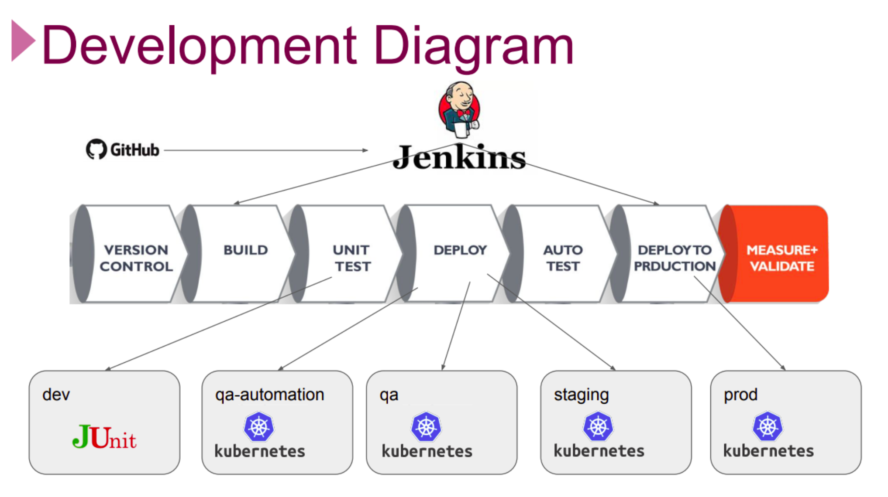

# Project 505: Microservices CI/CD Pipeline

## Description

This project aims to create full CI/CD Pipeline for microservice based applications using [Spring Petclinic Microservices Application](https://github.com/spring-petclinic/spring-petclinic-microservices). Jenkins Server deployed on Elastic Compute Cloud (EC2) Instance is used as CI/CD Server to build pipelines.

## DevOps Pipelines

### Development Diagram



### Pipelines Configurations


### Pipelines Overview


## Flow of Tasks for Project Realization

| Epic | Task  | Task #  | Task Definition   | Branch  |
| ---   | :---  | ---                  | :---              | :---    |
| Local Development Environment | Prepare Development Server Manually on EC2 Instance| MSP-1 | Prepare development server manually on Amazon Linux 2 for developers, enabled with `Docker` , `Docker-Compose` , `Java 11` , `Git` .  |
| Local Development Environment | Prepare GitHub Repository for the Project | MSP-2-1 | Clone the Petclinic app from the Clarusway repository [Petclinic Microservices Application](https://github.com/clarusway/petclinic-microservices.git) |
| Local Development Environment | Prepare GitHub Repository for the Project | MSP-2-2 | Prepare base branches namely `main` , `dev` , `release` for DevOps cycle. |
| Local Development Environment | Check the Maven Build Setup on Dev Branch | MSP-3 | Check the Maven builds for `test` , `package` , and `install` phases on `dev` branch |
| Local Development Environment | Prepare a Script for Packaging the Application | MSP-4 |  Prepare a script to package the application with Maven wrapper | feature/msp-4 |
| Local Development Environment | Prepare Development Server Terraform Files | MSP-5 |  Prepare development server folder with Terraform File for developers, enabled with `Docker` , `Docker-Compose` , `Java 11` , `Git` . | feature/msp-5 |
| Local Development Build | Prepare Dockerfiles for Microservices | MSP-6 | Prepare Dockerfiles for each microservices. | feature/msp-6 |
| Local Development Environment | Prepare Script for Building Docker Images | MSP-7 |  Prepare a script to package and build the docker images for all microservices. | feature/msp-7 |
| Local Development Build | Create Docker Compose File for Local Development | MSP-8-1 |  Prepare docker compose file to deploy the application locally. | feature/msp-8 |
| Local Development Build | Create Docker Compose File for Local Development | MSP-8-2 |  Prepare a script to test the deployment of the app locally. | feature/msp-8 |
| Testing Environment Setup | Implement Unit Tests | MSP-9-1  | Implement 3 Unit Tests locally. | feature/msp-9 |
| Testing Environment Setup | Setup Code Coverage Tool | MSP-9-2  | Update POM file for Code Coverage Report. | feature/msp-9 |
| Testing Environment Setup | Implement Code Coverage | MSP-9-3  | Generate Code Coverage Report manually. | feature/msp-9 |
| Testing Environment Setup | Prepare Selenium Tests | MSP-10-1  | Prepare 3 Selenium Jobs for QA Automation Tests. | feature/msp-10 |
| Testing Environment Setup | Implement Selenium Tests | MSP-10-2  | Run 3 Selenium Tests against local environment. | feature/msp-10 |
| CI Server Setup | Prepare Jenkins Server | MSP-11 | Prepare Jenkins Server for CI/CD Pipeline. | feature/msp-11 |
| CI Server Setup | Configure Jenkins Server for Project | MSP-12  | Configure Jenkins Server for Project Setup. | |
| CI Server Setup | Prepare CI Pipeline | MSP-13 | Prepare CI pipeline (UT only) for all `dev` , `feature` and `bugfix` branches. | feature/msp-13 |
| Registry Setup for Development | Create Docker Registry for Dev Manually | MSP-14  | Create Docker Registry on AWS ECR manually using Jenkins job. | feature/msp-14 |
| QA Automation Setup for Development | Create a QA Automation Environment - Part-1 | MSP-15  | Create a QA Automation Environment with Kubernetes. | feature/msp-15 |
| QA Automation Setup for Development | Create a QA Automation Environment - Part-2 | MSP-16  | Create a QA Automation Environment with Kubernetes. | feature/msp-16 |
| QA Automation Setup for Development | Prepare Petlinic Kubernetes YAML Files | MSP-17  | Prepare Petlinic Kubernetes YAML Files. | feature/msp-17 |
| QA Automation Setup for Development | Prepare a QA Automation Pipeline | MSP-18  | Prepare a QA Automation Pipeline on `dev` branch for Nightly Builds. | feature/msp-18 |
| QA Setup for Release | Create a QA Infrastructure with eksctl | MSP-19  | Create a Permanent QA Infrastructure for Kubernetes Cluster with eksctl. | feature/msp-19 |
| QA Setup for Release | Prepare Build Scripts for QA Environment | MSP-20  | Prepare Build Scripts for QA Environment | feature/msp-20 |
| QA Setup for Release | Build and Deploy App on QA Environment Manually | MSP-21  | Build and Deploy App for QA Environment Manually using Jenkins Jobs. | feature/msp-21 | 
| QA Setup for Release | Prepare a QA Pipeline | MSP-22  | Prepare a QA Pipeline using Jenkins on `release` branch for Weekly Builds. | feature/msp-22 |
| Staging and Production Setup | Prepare HA RKE Kubernetes Cluster | MSP-23  | Prepare High-availability RKE Kubernetes Cluster on AWS EC2 | feature/msp-23 |
| Staging and Production Setup | Install Rancher App on RKE K8s Cluster | MSP-24  | Install Rancher App on RKE Kubernetes Cluster| |
| Staging and Production Setup | Create Staging and Production Environment with Rancher | MSP-25  | Create Staging and Production Environment with Rancher by creating new cluster for Petclinic | |
| Staging Deployment Setup | Prepare and Configure Nexus Server | MSP-26  | Create and Configure Nexus Server for Pipelines | feature/msp-26|
| Staging Deployment Setup | Prepare a Staging Pipeline | MSP-27  | Prepare a Staging Pipeline on Jenkins Server | feature/msp-27|
| Production Deployment Setup | Prepare a Production Pipeline | MSP-28  | Prepare a Production Pipeline on Jenkins Server | feature/msp-28|
| Production Deployment Setup | Set Domain Name and TLS for Production | MSP-29  | Set Domain Name and TLS for Production Pipeline with Route 53 | feature/msp-29|
| Production Deployment Setup | Set Monitoring Tools | MSP-30  | Set Monitoring tools, Prometheus and Grafana | |

# # # # # # # # # # # # # # # # # # # # # # # # # # # # # # #
## MSP 1 - Prepare Development Server Manually on EC2 Instance
# # # # # # # # # # # # # # # # # # # # # # # # # # # # # # #

* Prepare development server manually on Amazon Linux 2 (t3a.medium) for developers, enabled with `Docker`,  `Docker-Compose`,  `Java 11`,  `Git`.

``` bash
#! /bin/bash
yum update -y
hostnamectl set-hostname petclinic-dev-server
amazon-linux-extras install docker -y
systemctl start docker
systemctl enable docker
usermod -a -G docker ec2-user
newgrp docker
curl -L "https://github.com/docker/compose/releases/download/1.26.2/docker-compose-$(uname -s)-$(uname -m)" \
-o /usr/local/bin/docker-compose
chmod +x /usr/local/bin/docker-compose
yum install git -y
yum install java-11-amazon-corretto -y
```

# # # # # # # # # # # # # # # # # # # # # # # # # # # # # # #
## MSP 2 - Prepare GitHub Repository for the Project
# # # # # # # # # # # # # # # # # # # # # # # # # # # # # # #

* Connect to your Development Server via `ssh` and clone the petclinic app from the repository [Spring Petclinic Microservices App](https://github.com/clarusway/petclinic-microservices-with-db.git).

``` bash
git clone https://github.com/clarusway/petclinic-microservices-with-db.git
```

* Change your working directory to **petclinic-microservices** and delete the **.git** directory.

```bash
cd petclinic-microservices
rm -rf .git
```

* Create a new repository on your Github account with the name **petclinic-microservices-with-db**.

*  Initiate the cloned repository to make it a git repository and push the local repository to your remote repository.

```bash
git init
git add .
git commit -m "first commit"
git branch -M main
git remote add origin https://[your-token]@github.com/[your-git-account]/[your-repo-name-petclinic-microservices-with-db.git]
git push origin main
```
* Prepare base branches namely `main`,  `dev`,  `release` for DevOps cycle.

  + Create `dev` base branch.

    ``` bash
    git checkout main
    git branch dev
    git checkout dev
    git push --set-upstream origin dev
    ```

  + Create `release` base branch.

    ```bash
    git checkout main
    git branch release
    git checkout release
    git push --set-upstream origin release
    ```

# # # # # # # # # # # # # # # # # # # # # # # # # # # # # # #
## MSP 3 - Check the Maven Build Setup on Dev Branch
# # # # # # # # # # # # # # # # # # # # # # # # # # # # # # #
* Switch to `dev` branch.

``` bash
git checkout dev
```

* Test the compiled source code.

``` bash
./mvnw clean test
```
> Note: If you get `permission denied` error, try to give execution permission to **mvnw**.  

    chmod +x mvnw
  

* Take the compiled code and package it in its distributable `JAR` format.

``` bash
./mvnw clean package
```

* Install distributable `JAR`s into local repository.

``` bash
./mvnw clean install
```

# # # # # # # # # # # # # # # # # # # # # # # # # # # # # # #
## MSP 4 - Prepare a Script for Packaging the Application
# # # # # # # # # # # # # # # # # # # # # # # # # # # # # # #

* Create `feature/msp-4` branch from `dev`.

``` bash
git checkout dev
git branch feature/msp-4
git checkout feature/msp-4
```

* Prepare a script to package the application with maven wrapper and save it as `package-with-mvn-wrapper.sh` under `petclinic-microservices-with-db` folder.

``` bash
./mvnw clean package
```

* Commit and push the new script to remote repo.

``` bash
git add .
git commit -m 'added packaging script'
git push --set-upstream origin feature/msp-4
git checkout dev
git merge feature/msp-4
git push origin dev
```

# # # # # # # # # # # # # # # # # # # # # # # # # # # # # # #
## MSP 5 - Prepare Development Server Terraform Files
# # # # # # # # # # # # # # # # # # # # # # # # # # # # # # #

* Create `feature/msp-5` branch from `dev`.

``` bash
git checkout dev
git branch feature/msp-5
git checkout feature/msp-5
```

* Create a folder for infrastructure setup with the name of `infrastructure` under `petclinic-microservices-with-db` folder.

``` bash
mkdir infrastructure
```

* Prepare development server script with [terraform files](infrastructure/msp-5-dev-server-of-petclinic/dev-server.tf, dev-variable.tf, dev.auto.tfvars, petclinicserver-userdata.sh) for developers, enabled with `Docker`,  `Docker-Compose`,  `Java 11`,  `Git` and save them under `infrastructure` folder.

``` bash
#! /bin/bash
yum update -y
hostnamectl set-hostname petclinic-dev-server
amazon-linux-extras install docker -y
systemctl start docker
systemctl enable docker
usermod -a -G docker ec2-user
curl -L "https://github.com/docker/compose/releases/download/1.26.2/docker-compose-$(uname -s)-$(uname -m)" \
-o /usr/local/bin/docker-compose
chmod +x /usr/local/bin/docker-compose
yum install git -y
yum install java-11-amazon-corretto -y
git clone https://github.com/clarusway/petclinic-microservices.git
cd petclinic-microservices
git fetch
git checkout dev
```

* Commit and push the new script to remote repo.

``` bash
git add .
git commit -m 'added terraform files for dev server'
git push --set-upstream origin feature/msp-5
git checkout dev
git merge feature/msp-5
git push origin dev
```

# # # # # # # # # # # # # # # # # # # # # # # # # # # # # # #
## MSP 6 - Prepare Dockerfiles for Microservices
# # # # # # # # # # # # # # # # # # # # # # # # # # # # # # #

* Create `feature/msp-6` branch from `dev`.

``` bash
git checkout dev
git branch feature/msp-6
git checkout feature/msp-6
```

* Prepare a Dockerfile for the `admin-server` microservice with following content and save it under `spring-petclinic-admin-server`.

``` Dockerfile
FROM openjdk:11-jre
ARG DOCKERIZE_VERSION=v0.6.1
ARG EXPOSED_PORT=9090
ENV SPRING_PROFILES_ACTIVE docker,mysql
ADD https://github.com/jwilder/dockerize/releases/download/${DOCKERIZE_VERSION}/dockerize-alpine-linux-amd64-${DOCKERIZE_VERSION}.tar.gz dockerize.tar.gz
RUN tar -xzf dockerize.tar.gz
RUN chmod +x dockerize
ADD ./target/*.jar /app.jar
EXPOSE ${EXPOSED_PORT}
ENTRYPOINT ["java", "-Djava.security.egd=file:/dev/./urandom","-jar","/app.jar"]
```

* Prepare a Dockerfile for the `api-gateway` microservice with the following content and save it under `spring-petclinic-api-gateway`.

``` Dockerfile
FROM openjdk:11-jre
ARG DOCKERIZE_VERSION=v0.6.1
ARG EXPOSED_PORT=8080
ENV SPRING_PROFILES_ACTIVE docker,mysql
ADD https://github.com/jwilder/dockerize/releases/download/${DOCKERIZE_VERSION}/dockerize-alpine-linux-amd64-${DOCKERIZE_VERSION}.tar.gz dockerize.tar.gz
RUN tar -xzf dockerize.tar.gz
RUN chmod +x dockerize
ADD ./target/*.jar /app.jar
EXPOSE ${EXPOSED_PORT}
ENTRYPOINT ["java", "-Djava.security.egd=file:/dev/./urandom","-jar","/app.jar"]
```

* Prepare a Dockerfile for the `config-server` microservice with the following content and save it under `spring-petclinic-config-server`.

``` Dockerfile
FROM openjdk:11-jre
ARG DOCKERIZE_VERSION=v0.6.1
ARG EXPOSED_PORT=8888
ENV SPRING_PROFILES_ACTIVE docker,mysql
ADD https://github.com/jwilder/dockerize/releases/download/${DOCKERIZE_VERSION}/dockerize-alpine-linux-amd64-${DOCKERIZE_VERSION}.tar.gz dockerize.tar.gz
RUN tar -xzf dockerize.tar.gz
RUN chmod +x dockerize
ADD ./target/*.jar /app.jar
EXPOSE ${EXPOSED_PORT}
ENTRYPOINT ["java", "-Djava.security.egd=file:/dev/./urandom","-jar","/app.jar"]
```

* Prepare a Dockerfile for the `customer-service` microservice with the following content and save it under `spring-petclinic-customer-service`.

``` Dockerfile
FROM openjdk:11-jre
ARG DOCKERIZE_VERSION=v0.6.1
ARG EXPOSED_PORT=8081
ENV SPRING_PROFILES_ACTIVE docker,mysql
ADD https://github.com/jwilder/dockerize/releases/download/${DOCKERIZE_VERSION}/dockerize-alpine-linux-amd64-${DOCKERIZE_VERSION}.tar.gz dockerize.tar.gz
RUN tar -xzf dockerize.tar.gz
RUN chmod +x dockerize
ADD ./target/*.jar /app.jar
EXPOSE ${EXPOSED_PORT}
ENTRYPOINT ["java", "-Djava.security.egd=file:/dev/./urandom","-jar","/app.jar"]
```

* Prepare a Dockerfile for the `discovery-server` microservice with the following content and save it under `spring-petclinic-discovery-server`.

``` Dockerfile
FROM openjdk:11-jre
ARG DOCKERIZE_VERSION=v0.6.1
ARG EXPOSED_PORT=8761
ENV SPRING_PROFILES_ACTIVE docker,mysql
ADD https://github.com/jwilder/dockerize/releases/download/${DOCKERIZE_VERSION}/dockerize-alpine-linux-amd64-${DOCKERIZE_VERSION}.tar.gz dockerize.tar.gz
RUN tar -xzf dockerize.tar.gz
RUN chmod +x dockerize
ADD ./target/*.jar /app.jar
EXPOSE ${EXPOSED_PORT}
ENTRYPOINT ["java", "-Djava.security.egd=file:/dev/./urandom","-jar","/app.jar"]
```

* Prepare a Dockerfile for the `hystrix-dashboard` microservice with the following content and save it under `spring-petclinic-hystrix-dashboard`.

``` Dockerfile
FROM openjdk:11-jre
ARG DOCKERIZE_VERSION=v0.6.1
ARG EXPOSED_PORT=7979
ENV SPRING_PROFILES_ACTIVE docker,mysql
ADD https://github.com/jwilder/dockerize/releases/download/${DOCKERIZE_VERSION}/dockerize-alpine-linux-amd64-${DOCKERIZE_VERSION}.tar.gz dockerize.tar.gz
RUN tar -xzf dockerize.tar.gz
RUN chmod +x dockerize
ADD ./target/*.jar /app.jar
EXPOSE ${EXPOSED_PORT}
ENTRYPOINT ["java", "-Djava.security.egd=file:/dev/./urandom","-jar","/app.jar"]
```

* Prepare a Dockerfile for the `vets-service` microservice with the following content and save it under `spring-petclinic-vets-service`.

``` Dockerfile
FROM openjdk:11-jre
ARG DOCKERIZE_VERSION=v0.6.1
ARG EXPOSED_PORT=8083
ENV SPRING_PROFILES_ACTIVE docker,mysql
ADD https://github.com/jwilder/dockerize/releases/download/${DOCKERIZE_VERSION}/dockerize-alpine-linux-amd64-${DOCKERIZE_VERSION}.tar.gz dockerize.tar.gz
RUN tar -xzf dockerize.tar.gz
RUN chmod +x dockerize
ADD ./target/*.jar /app.jar
EXPOSE ${EXPOSED_PORT}
ENTRYPOINT ["java", "-Djava.security.egd=file:/dev/./urandom","-jar","/app.jar"]
```

* Prepare a Dockerfile for the `visits-service` microservice with the following content and save it under `spring-petclinic-visits-service`.

``` Dockerfile
FROM openjdk:11-jre
ARG DOCKERIZE_VERSION=v0.6.1
ARG EXPOSED_PORT=8082
ENV SPRING_PROFILES_ACTIVE docker,mysql
ADD https://github.com/jwilder/dockerize/releases/download/${DOCKERIZE_VERSION}/dockerize-alpine-linux-amd64-${DOCKERIZE_VERSION}.tar.gz dockerize.tar.gz
RUN tar -xzf dockerize.tar.gz
RUN chmod +x dockerize
ADD ./target/*.jar /app.jar
EXPOSE ${EXPOSED_PORT}
ENTRYPOINT ["java", "-Djava.security.egd=file:/dev/./urandom","-jar","/app.jar"]
```

* Commit the changes, then push the Dockerfiles to the remote repo.

``` bash
git add .
git commit -m 'added Dockerfiles for microservices'
git push --set-upstream origin feature/msp-6
git checkout dev
git merge feature/msp-6
git push origin dev
```

# # # # # # # # # # # # # # # # # # # # # # # # # # # # # # #
## MSP 7 - Prepare Script for Building Docker Images
# # # # # # # # # # # # # # # # # # # # # # # # # # # # # # #

* Create `feature/msp-7` branch from `dev`.

``` bash
git checkout dev
git branch feature/msp-7
git checkout feature/msp-7
```

* Prepare a script to build the docker images and save it as `build-dev-docker-images.sh` under `petclinic-microservices-with-db` folder.

``` bash
./mvnw clean package
docker build --force-rm -t "petclinic-admin-server:dev" ./spring-petclinic-admin-server
docker build --force-rm -t "petclinic-api-gateway:dev" ./spring-petclinic-api-gateway
docker build --force-rm -t "petclinic-config-server:dev" ./spring-petclinic-config-server
docker build --force-rm -t "petclinic-customers-service:dev" ./spring-petclinic-customers-service
docker build --force-rm -t "petclinic-discovery-server:dev" ./spring-petclinic-discovery-server
docker build --force-rm -t "petclinic-hystrix-dashboard:dev" ./spring-petclinic-hystrix-dashboard
docker build --force-rm -t "petclinic-vets-service:dev" ./spring-petclinic-vets-service
docker build --force-rm -t "petclinic-visits-service:dev" ./spring-petclinic-visits-service
docker build --force-rm -t "petclinic-grafana-server:dev" ./docker/grafana
docker build --force-rm -t "petclinic-prometheus-server:dev" ./docker/prometheus
```

* Give execution permission to build-dev-docker-images.sh. 

```bash
chmod +x build-dev-docker-images.sh
```

* Build the images.

```bash
./build-dev-docker-images.sh
```

* Commit the changes, then push the new script to the remote repo.

``` bash
git add .
git commit -m 'added script for building docker images'
git push --set-upstream origin feature/msp-7
git checkout dev
git merge feature/msp-7
git push origin dev
```

# # # # # # # # # # # # # # # # # # # # # # # # # # # # # # #
## MSP 8 - Create Docker Compose File for Local Development
# # # # # # # # # # # # # # # # # # # # # # # # # # # # # # #

* Create `feature/msp-8` branch from `dev`.

``` bash
git checkout dev
git branch feature/msp-8
git checkout feature/msp-8
```

* Prepare docker compose file to deploy the application locally and save it as `docker-compose-local.yml` under `petclinic-microservices-with-db` folder.

``` yaml
version: '2'

services: 
  config-server:
    image: petclinic-config-server:dev
    container_name: config-server
    mem_limit: 512M
    ports: 
      - 8888:8888

  discovery-server:
    image: petclinic-discovery-server:dev
    container_name: discovery-server
    mem_limit: 512M
    ports: 
      - 8761:8761
    depends_on: 
      - config-server
    entrypoint: ["./dockerize", "-wait=tcp://config-server:8888", "-timeout=160s", "--", "java", "-Djava.security.egd=file:/dev/./urandom","-jar","/app.jar"]

  customers-service:
    image: petclinic-customers-service:dev
    container_name: customers-service
    mem_limit: 512M
    ports:
     - 8081:8081
    depends_on: 
     - config-server
     - discovery-server
    entrypoint: ["./dockerize", "-wait=tcp://discovery-server:8761", "-timeout=160s", "--", "java", "-Djava.security.egd=file:/dev/./urandom","-jar","/app.jar" ]
  
  visits-service:
    image: petclinic-visits-service:dev
    container_name: visits-service
    mem_limit: 512M
    ports:
     - 8082:8082
    depends_on: 
     - config-server
     - discovery-server
    entrypoint: ["./dockerize", "-wait=tcp://discovery-server:8761", "-timeout=160s", "--", "java", "-Djava.security.egd=file:/dev/./urandom","-jar","/app.jar" ]
  
  vets-service:
    image: petclinic-vets-service:dev
    container_name: vets-service
    mem_limit: 512M
    ports:
     - 8083:8083
    depends_on: 
     - config-server
     - discovery-server
    entrypoint: ["./dockerize", "-wait=tcp://discovery-server:8761", "-timeout=160s", "--", "java", "-Djava.security.egd=file:/dev/./urandom","-jar","/app.jar" ]
  
  api-gateway:
    image: petclinic-api-gateway:dev
    container_name: api-gateway
    mem_limit: 512M
    ports:
     - 8080:8080
    depends_on: 
     - config-server
     - discovery-server
    entrypoint: ["./dockerize", "-wait=tcp://discovery-server:8761", "-timeout=160s", "--", "java", "-Djava.security.egd=file:/dev/./urandom","-jar","/app.jar" ]
  
  admin-server:
    image: petclinic-admin-server:dev
    container_name: admin-server
    mem_limit: 512M
    ports:
     - 9090:9090
    depends_on: 
     - config-server
     - discovery-server
    entrypoint: ["./dockerize", "-wait=tcp://discovery-server:8761", "-timeout=160s", "--", "java", "-Djava.security.egd=file:/dev/./urandom","-jar","/app.jar" ]

  hystrix-dashboard:
    image: petclinic-hystrix-dashboard:dev
    container_name: hystrix-dashboard
    mem_limit: 512M
    ports:
     - 7979:7979
    depends_on: 
     - config-server
     - discovery-server
    entrypoint: ["./dockerize", "-wait=tcp://discovery-server:8761", "-timeout=160s", "--", "java", "-Djava.security.egd=file:/dev/./urandom","-jar","/app.jar" ]

  tracing-server:
    image: openzipkin/zipkin
    container_name: tracing-server
    mem_limit: 512M
    environment:
    - JAVA_OPTS=-XX:+UnlockExperimentalVMOptions -Djava.security.egd=file:/dev/./urandom
    ports:
     - 9411:9411 
  
  grafana-server:
    image: petclinic-grafana-server:dev
    container_name: grafana-server
    mem_limit: 256M
    ports:
    - 3000:3000

  prometheus-server:
    image: petclinic-prometheus-server:dev
    container_name: prometheus-server
    mem_limit: 256M
    ports:
    - 9091:9090

  mysql-server:
    image: mysql:5.7.8
    container_name: mysql-server
    environment: 
      MYSQL_ROOT_PASSWORD: petclinic
      MYSQL_DATABASE: petclinic
    mem_limit: 256M
    ports:
    - 3306:3306
```

* Prepare a script to test the deployment of the app locally with `docker-compose-local.yml` and save it as `test-local-deployment.sh` under `petclinic-microservices-with-db` folder.

``` bash
docker-compose -f docker-compose-local.yml up
```

* Give execution permission to test-local-deployment.sh.

```bash
chmod +x test-local-deployment.sh
```

* Execute the docker compose.

```bash
./test-local-deployment.sh
```

* Commit the change, then push the docker compose file to the remote repo.

``` bash
git add .
git commit -m 'added docker-compose file and script for local deployment'
git push --set-upstream origin feature/msp-8
git checkout dev
git merge feature/msp-8
git push origin dev
```

# # # # # # # # # # # # # # # # # # # # # # # # # # # # # # #
## MSP 9 - Setup Unit Tests and Configure Code Coverage Report
# # # # # # # # # # # # # # # # # # # # # # # # # # # # # # #

* Create `feature/msp-9` branch from `dev`.

``` bash
git checkout dev
git branch feature/msp-9
git checkout feature/msp-9
```

* Create following unit tests for `Pet.java` under `customer-service` microservice using the following `PetTest` class and save it as `PetTest.java` under `./spring-petclinic-customers-service/src/test/java/org/springframework/samples/petclinic/customers/model/` folder.

``` java
package org.springframework.samples.petclinic.customers.model;

import static org.junit.jupiter.api.Assertions.assertEquals;

import java.util.Date;

import org.junit.jupiter.api.Test;
public class PetTest {
    @Test
    public void testGetName(){
        //Arrange
        Pet pet = new Pet();
        //Act
        pet.setName("Fluffy");
        //Assert
        assertEquals("Fluffy", pet.getName());
    }
    @Test
    public void testGetOwner(){
        //Arrange
        Pet pet = new Pet();
        Owner owner = new Owner();
        owner.setFirstName("Call");
        //Act
        pet.setOwner(owner);
        //Assert
        assertEquals("Call", pet.getOwner().getFirstName());
    }
    @Test
    public void testBirthDate(){
        //Arrange
        Pet pet = new Pet();
        Date bd = new Date();
        //Act
        pet.setBirthDate(bd);
        //Assert
        assertEquals(bd,pet.getBirthDate());
    }
}
```

* Implement unit tests with maven wrapper for only `customer-service` microservice locally on `Dev Server`. Execute the following command under the `spring-petclinic-customers-service folder`.

``` bash
../mvnw clean test
```

* Commit the change, then push the changes to the remote repo.

``` bash
git add .
git commit -m 'added 3 UTs for customer-service'
git push --set-upstream origin feature/msp-9
```

* Update POM file at root folder for Code Coverage Report using `Jacoco` tool plugin.

``` xml
<plugin>
    <groupId>org.jacoco</groupId>
    <artifactId>jacoco-maven-plugin</artifactId>
    <version>0.8.2</version>
    <executions>
        <execution>
            <goals>
                <goal>prepare-agent</goal>
            </goals>
        </execution>
        <!-- attached to Maven test phase -->
        <execution>
            <id>report</id>
            <phase>test</phase>
            <goals>
                <goal>report</goal>
            </goals>
        </execution>
    </executions>
</plugin>
```

* Create code coverage report for only `customer-service` microservice locally on `Dev Server`. Execute the following command under the `spring-petclinic-customers-service folder`.

``` bash
../mvnw test
```

* Commit the change, then push the changes to the remote repo.

``` bash
git add .
git commit -m 'updated POM with Jacoco plugin'
git push
git checkout dev
git merge feature/msp-9
git push origin dev
```

* Deploy code coverage report (located under relative path `target/site/jacoco` of the microservice) on Simple HTTP Server for only `customer-service` microservice on `Dev Server`.

``` bash
python -m SimpleHTTPServer # for python 2.7
python3 -m http.server # for python 3+
```

# # # # # # # # # # # # # # # # # # # # # # # # # # # # # # #
## MSP 10 - Prepare and Implement Selenium Tests
# # # # # # # # # # # # # # # # # # # # # # # # # # # # # # #

* Create `feature/msp-10` branch from `dev`.

``` bash
git checkout dev
git branch feature/msp-10
git checkout feature/msp-10
```

* Create a folder for Selenium jobs with the name of `selenium-jobs` under under `petclinic-microservices-with-db` folder.

``` bash
mkdir selenium-jobs
```

* Create Selenium job (`QA Automation` test) for testing `Owners >> All` page and save it as `test_owners_all_headless.py` under `selenium-jobs` folder.

``` python
from selenium import webdriver
from selenium.webdriver.common.by import By
from selenium.webdriver.support.ui import WebDriverWait
from selenium.webdriver.support import expected_conditions as EC
from time import sleep
import os

# Set chrome options for working with headless mode (no screen)
chrome_options = webdriver.ChromeOptions()
chrome_options.add_argument("headless")
chrome_options.add_argument("no-sandbox")
chrome_options.add_argument("disable-dev-shm-usage")

# Update webdriver instance of chrome-driver with adding chrome options
driver = webdriver.Chrome(options=chrome_options)
# driver = webdriver.Chrome("/Users/home/Desktop/chromedriver")
# Connect to the application
APP_IP = os.environ['MASTER_PUBLIC_IP']
url = "http://"+APP_IP.strip()+":8080/"
# url = "http://localhost:8080"
print(url)
driver.get(url)
sleep(3)
owners_link = driver.find_element_by_link_text("OWNERS")
owners_link.click()
sleep(2)
all_link = driver.find_element_by_link_text("ALL")
all_link.click()
sleep(2)

# Verify that table loaded
sleep(1)
verify_table = WebDriverWait(driver, 10).until(EC.presence_of_element_located((By.TAG_NAME, "table")))

print("Table loaded")

driver.quit()
```

* Create Selenium job (`QA Automation` test) for testing `Owners >> Register` page and save it as `test_owners_register_headless.py` under `selenium-jobs` folder.

``` python
from selenium import webdriver
from selenium.webdriver.common.keys import Keys
from time import sleep
import random
import os
# Set chrome options for working with headless mode (no screen)
chrome_options = webdriver.ChromeOptions()
chrome_options.add_argument("headless")
chrome_options.add_argument("no-sandbox")
chrome_options.add_argument("disable-dev-shm-usage")

# Update webdriver instance of chrome-driver with adding chrome options
driver = webdriver.Chrome(options=chrome_options)

# Connect to the application
APP_IP = os.environ['MASTER_PUBLIC_IP']
url = "http://"+APP_IP.strip()+":8080/"
print(url)
driver.get(url)
owners_link = driver.find_element_by_link_text("OWNERS")
owners_link.click()
sleep(2)
all_link = driver.find_element_by_link_text("REGISTER")
all_link.click()
sleep(2)
# Register new Owner to Petclinic App
fn_field = driver.find_element_by_name('firstName')
fn = 'Callahan' + str(random.randint(0, 100))
fn_field.send_keys(fn)
sleep(1)
fn_field = driver.find_element_by_name('lastName')
fn_field.send_keys('Clarusway')
sleep(1)
fn_field = driver.find_element_by_name('address')
fn_field.send_keys('Ridge Corp. Street')
sleep(1)
fn_field = driver.find_element_by_name('city')
fn_field.send_keys('McLean')
sleep(1)
fn_field = driver.find_element_by_name('telephone')
fn_field.send_keys('+1230576803')
sleep(1)
fn_field.send_keys(Keys.ENTER)

# Wait 10 seconds to get updated Owner List
sleep(10)
# Verify that new user is added to Owner List
if fn in driver.page_source:
    print(fn, 'is added and found in the Owners Table')
    print("Test Passed")
else:
    print(fn, 'is not found in the Owners Table')
    print("Test Failed")
driver.quit()
```

* Create Selenium job (`QA Automation` test) for testing `Veterinarians` page and save it as `test_veterinarians_headless.py` under `selenium-jobs` folder.

``` python
from selenium import webdriver
from selenium.webdriver.common.by import By
from selenium.webdriver.support.ui import WebDriverWait
from selenium.webdriver.support import expected_conditions as EC
from time import sleep
import os

# Set chrome options for working with headless mode (no screen)
chrome_options = webdriver.ChromeOptions()
chrome_options.add_argument("headless")
chrome_options.add_argument("no-sandbox")
chrome_options.add_argument("disable-dev-shm-usage")

# Update webdriver instance of chrome-driver with adding chrome options
driver = webdriver.Chrome(options=chrome_options)

# Connect to the application
APP_IP = os.environ['MASTER_PUBLIC_IP']
url = "http://"+APP_IP.strip()+":8080/"
print(url)
driver.get(url)
sleep(3)
vet_link = driver.find_element_by_link_text("VETERINARIANS")
vet_link.click()

# Verify that table loaded
sleep(5)
verify_table = WebDriverWait(driver, 10).until(EC.presence_of_element_located((By.TAG_NAME, "table")))

print("Table loaded")

driver.quit()
```

* Commit the change, then push the selenium jobs to the remote repo.

``` bash
git add .
git commit -m 'added selenium jobs written in python'
git push --set-upstream origin feature/msp-10
git checkout dev
git merge feature/msp-10
git push origin dev
```

# # # # # # # # # # # # # # # # # # # # # # # # # # # # # # #
## MSP 11 - Prepare Jenkins Server for CI/CD Pipeline
# # # # # # # # # # # # # # # # # # # # # # # # # # # # # # #

* Create `feature/msp-11` branch from `dev`.

``` bash
git checkout dev
git branch feature/msp-11
git checkout feature/msp-11
```

* Set up a Jenkins Server and enable it with `Git`,  `Docker`,  `Docker Compose`,  `AWS CLI v2`, `Python`,  `Ansible` and `Boto3`.  To do so, prepare a [Terraform file for Jenkins Server](./msp-11-jenkins-server-tf-template) with following scripts (jenkins_variables.tf, jenkins-server.tf, jenkins.auto.tf.vars, jenkinsdata.sh) and save them under `infrastructure` folder.

``` bash
#! /bin/bash
# update os
yum update -y
# set server hostname as jenkins-server
hostnamectl set-hostname jenkins-server
# install git
yum install git -y
# install java 11
yum install java-11-amazon-corretto -y
# install jenkins
wget -O /etc/yum.repos.d/jenkins.repo https://pkg.jenkins.io/redhat/jenkins.repo
rpm --import https://pkg.jenkins.io/redhat/jenkins.io.key
yum install jenkins -y
systemctl start jenkins
systemctl enable jenkins
# install docker
amazon-linux-extras install docker -y
systemctl start docker
systemctl enable docker
usermod -a -G docker ec2-user
usermod -a -G docker jenkins
# configure docker as cloud agent for jenkins
cp /lib/systemd/system/docker.service /lib/systemd/system/docker.service.bak
sed -i 's/^ExecStart=.*/ExecStart=\/usr\/bin\/dockerd -H tcp:\/\/127.0.0.1:2375 -H unix:\/\/\/var\/run\/docker.sock/g' /lib/systemd/system/docker.service
systemctl daemon-reload
systemctl restart docker
systemctl restart jenkins
# install docker compose
curl -L "https://github.com/docker/compose/releases/download/1.26.2/docker-compose-$(uname -s)-$(uname -m)" \
-o /usr/local/bin/docker-compose
chmod +x /usr/local/bin/docker-compose
# uninstall aws cli version 1
rm -rf /bin/aws
# install aws cli version 2
curl "https://awscli.amazonaws.com/awscli-exe-linux-x86_64.zip" -o "awscliv2.zip"
unzip awscliv2.zip
./aws/install
# install python 3
yum install python3 -y
# install ansible
pip3 install ansible
# install boto3
pip3 install boto3
# install terraform
yum install -y yum-utils
yum-config-manager --add-repo https://rpm.releases.hashicorp.com/AmazonLinux/hashicorp.repo
yum -y install terraform
```

* Grant permissions to Jenkins Server within Cloudformation template to create Cloudformation Stack and create ECR Registry, push or pull Docker images to ECR Repo.

* Commit the change, then push the terraform files file to the remote repo.

``` bash
git add .
git commit -m 'added jenkins server terraform files'
git push --set-upstream origin feature/msp-11
git checkout dev
git merge feature/msp-11
git push origin dev
```

# # # # # # # # # # # # # # # # # # # # # # # # # # # # # # #
## MSP 12 - Configure Jenkins Server for Project
# # # # # # # # # # # # # # # # # # # # # # # # # # # # # # #

* Get the initial administrative password.

``` bash
sudo cat /var/lib/jenkins/secrets/initialAdminPassword
```

* Enter the temporary password to unlock the Jenkins.

* Install suggested plugins.

* Create first admin user.

* Open your Jenkins dashboard and navigate to `Manage Jenkins` >> `Manage Plugins` >> `Available` tab

* Search and select `GitHub Integration`,  `Docker Plugin`,  `Docker Pipeline`, and `Jacoco` plugins, then click `Install without restart`. Note: No need to install the other `Git plugin` which is already installed can be seen under `Installed` tab.

# # # # # # # # # # # # # # # # # # # # # # # # # # # # # # #
## MSP 13 - Prepare Continuous Integration (CI) Pipeline
# # # # # # # # # # # # # # # # # # # # # # # # # # # # # # #

* Create `feature/msp-13` branch from `dev`.

``` bash
git checkout dev
git branch feature/msp-13
git checkout feature/msp-13
```

* Create a folder, named `jenkins`, to keep `Jenkinsfiles` and `Jenkins jobs` of the project.

``` bash
mkdir jenkins
```
* Create a ``Jenkins job`` Running Unit Tests on Petclinic Application

```yml
- job name: petclinic-ci-job
- job type: Freestyle project
- GitHub project: https://github.com/[your-github-account]/petclinic-microservices
- Source Code Management: Git
      Repository URL: https://github.com/[your-github-account]/petclinic-microservices.git
- Branches to build:
      Branch Specifier (blank for 'any'): - */dev 
                                          - */feature**
                                          - */bugfix**
- Build triggers: GitHub hook trigger for GITScm polling
- Build Environment: Add timestamps to the Console Output
-Post-build Actions:
     Add post-build action: Record jacoco coverage report
- Build:
      Add build step: Execute Shell
      Command:
```
```bash
echo 'Running Unit Tests on Petclinic Application'
docker run --rm -v $HOME/.m2:/root/.m2 -v `pwd`:/app -w /app maven:3.8-openjdk-11 mvn clean test
```

* Jenkins `CI Job` should be triggered to run on each commit of `feature**` and `bugfix**` branches and on each `PR` merge to `dev` branch.

* Prepare a script for Jenkins CI job (covering Unit Test only) and save it as `jenkins-petclinic-ci-job.sh` under `jenkins` folder.

``` bash
echo 'Running Unit Tests on Petclinic Application'
docker run --rm -v $HOME/.m2:/root/.m2 -v `pwd`:/app -w /app maven:3.8-openjdk-11 mvn clean test
```

* Create a webhook for Jenkins CI Job; 

  + Go to the project repository page and click on `Settings`.

  + Click on the `Webhooks` on the left hand menu, and then click on `Add webhook`.

  + Copy the Jenkins URL, paste it into `Payload URL` field, add `/github-webhook/` at the end of URL, and click on `Add webhook`.
  
  ``` yml
  http://[jenkins-server-hostname]:8080/github-webhook/
  ```

* Commit the change, then push the Jenkinsfile to the remote repo.

``` bash
git add .
git commit -m 'added Jenkins Job for CI pipeline'
git push --set-upstream origin feature/msp-13
git checkout dev
git merge feature/msp-13
git push origin dev
```

# # # # # # # # # # # # # # # # # # # # # # # # # # # # # # #
## MSP 14 - Create Docker Registry for Dev Manually
# # # # # # # # # # # # # # # # # # # # # # # # # # # # # # #

- Create `feature/msp-14` branch from `dev`.

``` bash
git checkout dev
git branch feature/msp-14
git checkout feature/msp-14
```

* Create a ``Jenkins Job`` to create Docker Registry for `dev` on AWS ECR manually.

```yml
- job name: create-ecr-docker-registry-for-dev
- job type: Freestyle project
- Build:
      Add build step: Execute Shell
      Command:
```
```bash
PATH="$PATH:/usr/local/bin"
APP_REPO_NAME="clarusway-repo/petclinic-app-dev"
AWS_REGION="us-east-1"

aws ecr describe-repositories --region ${AWS_REGION} --repository-name ${APP_REPO_NAME} || \
aws ecr create-repository \
--repository-name ${APP_REPO_NAME} \
--image-scanning-configuration scanOnPush=false \
--image-tag-mutability MUTABLE \
--region us-east-1
```

* Prepare a script to create Docker Registry for `dev` on AWS ECR and save it as `create-ecr-docker-registry-for-dev.sh` under `infrastructure` folder.

``` bash
PATH="$PATH:/usr/local/bin"
APP_REPO_NAME="clarusway-repo/petclinic-app-dev"
AWS_REGION="us-east-1"

aws ecr describe-repositories --region ${AWS_REGION} --repository-name ${APP_REPO_NAME} || \
aws ecr create-repository \
--repository-name ${APP_REPO_NAME} \
--image-scanning-configuration scanOnPush=false \
--image-tag-mutability MUTABLE \
--region us-east-1
```

* Commit the change, then push the script to the remote repo.

``` bash
git add .
git commit -m 'added script for creating ECR registry for dev'
git push --set-upstream origin feature/msp-14
git checkout dev
git merge feature/msp-14
git push origin dev
```

# # # # # # # # # # # # # # # # # # # # # # # # # # # # # # #
## MSP 15 - Create a QA Automation Environment with Kubernetes - Part-1
# # # # # # # # # # # # # # # # # # # # # # # # # # # # # # #

- Create `feature/msp-15` branch from `dev`.

```bash
git checkout dev
git branch feature/msp-15
git checkout feature/msp-15
```

* Create a folder for kubernetes infrastructure setup with the name of `dev-k8s-terraform` under `infrastructure` folder.

``` bash
mkdir infrastructure/dev-k8s-terraform
```

- Create a folder for roles of master and worker nodes with the name of `IAM` under the `infrastructure/dev-k8s-terraform/modules` folder.

```bash
mkdir -p infrastructure/dev-k8s-terraform/modules/IAM
```

- Create iam policy file for the master node with the name of `policy_for_master.json`  under the `infrastructure/dev-k8s-terraform/modules/IAM`.

```json
{
    "Version": "2012-10-17",
    "Statement": [
      {
        "Effect": "Allow",
        "Action": [
        "autoscaling:DescribeAutoScalingGroups",
        "autoscaling:DescribeLaunchConfigurations",
        "autoscaling:DescribeTags",
        "ec2:DescribeInstances",
        "ec2:DescribeRegions",
        "ec2:DescribeRouteTables",
        "ec2:DescribeSecurityGroups",
        "ec2:DescribeSubnets",
        "ec2:DescribeVolumes",
        "ec2:CreateSecurityGroup",
        "ec2:CreateTags",
        "ec2:CreateVolume",
        "ec2:ModifyInstanceAttribute",
        "ec2:ModifyVolume",
        "ec2:AttachVolume",
        "ec2:AuthorizeSecurityGroupIngress",
        "ec2:CreateRoute",
        "ec2:DeleteRoute",
        "ec2:DeleteSecurityGroup",
        "ec2:DeleteVolume",
        "ec2:DetachVolume",
        "ec2:RevokeSecurityGroupIngress",
        "ec2:DescribeVpcs",
        "elasticloadbalancing:AddTags",
        "elasticloadbalancing:AttachLoadBalancerToSubnets",
        "elasticloadbalancing:ApplySecurityGroupsToLoadBalancer",
        "elasticloadbalancing:CreateLoadBalancer",
        "elasticloadbalancing:CreateLoadBalancerPolicy",
        "elasticloadbalancing:CreateLoadBalancerListeners",
        "elasticloadbalancing:ConfigureHealthCheck",
        "elasticloadbalancing:DeleteLoadBalancer",
        "elasticloadbalancing:DeleteLoadBalancerListeners",
        "elasticloadbalancing:DescribeLoadBalancers",
        "elasticloadbalancing:DescribeLoadBalancerAttributes",
        "elasticloadbalancing:DetachLoadBalancerFromSubnets",
        "elasticloadbalancing:DeregisterInstancesFromLoadBalancer",
        "elasticloadbalancing:ModifyLoadBalancerAttributes",
        "elasticloadbalancing:RegisterInstancesWithLoadBalancer",
        "elasticloadbalancing:SetLoadBalancerPoliciesForBackendServer",
        "elasticloadbalancing:AddTags",
        "elasticloadbalancing:CreateListener",
        "elasticloadbalancing:CreateTargetGroup",
        "elasticloadbalancing:DeleteListener",
        "elasticloadbalancing:DeleteTargetGroup",
        "elasticloadbalancing:DescribeListeners",
        "elasticloadbalancing:DescribeLoadBalancerPolicies",
        "elasticloadbalancing:DescribeTargetGroups",
        "elasticloadbalancing:DescribeTargetHealth",
        "elasticloadbalancing:ModifyListener",
        "elasticloadbalancing:ModifyTargetGroup",
        "elasticloadbalancing:RegisterTargets",
        "elasticloadbalancing:SetLoadBalancerPoliciesOfListener",
        "iam:CreateServiceLinkedRole",
        "kms:DescribeKey",
        "ecr:GetDownloadUrlForLayer",
        "ecr:BatchGetImage",
        "ecr:BatchCheckLayerAvailability",
        "ecr:PutImage",
        "ecr:InitiateLayerUpload",
        "ecr:UploadLayerPart",
        "ecr:CompleteLayerUpload",
        "ecr:DescribeRepositories",
        "ecr:GetRepositoryPolicy",
        "ecr:ListImages",
        "ecr:DeleteRepository",
        "ecr:BatchDeleteImage",
        "ecr:SetRepositoryPolicy",
        "ecr:DeleteRepositoryPolicy",
        "s3:ListAccessPointsForObjectLambda",
        "s3:GetObjectVersionTagging",
        "s3:GetStorageLensConfigurationTagging",
        "s3:GetObjectAcl",
        "s3:GetBucketObjectLockConfiguration",
        "s3:GetIntelligentTieringConfiguration",
        "s3:GetObjectVersionAcl",
        "s3:GetBucketPolicyStatus",
        "s3:GetObjectRetention",
        "s3:GetBucketWebsite",
        "s3:GetJobTagging",
        "s3:ListJobs",
        "s3:GetMultiRegionAccessPoint",
        "s3:GetObjectAttributes",
        "s3:GetObjectLegalHold",
        "s3:GetBucketNotification",
        "s3:DescribeMultiRegionAccessPointOperation",
        "s3:GetReplicationConfiguration",
        "s3:ListMultipartUploadParts",
        "s3:GetObject",
        "s3:DescribeJob",
        "s3:GetAnalyticsConfiguration",
        "s3:GetObjectVersionForReplication",
        "s3:GetAccessPointForObjectLambda",
        "s3:GetStorageLensDashboard",
        "s3:GetLifecycleConfiguration",
        "s3:GetAccessPoint",
        "s3:GetInventoryConfiguration",
        "s3:GetBucketTagging",
        "s3:GetAccessPointPolicyForObjectLambda",
        "s3:GetBucketLogging",
        "s3:ListBucketVersions",
        "s3:ListBucket",
        "s3:GetAccelerateConfiguration",
        "s3:GetObjectVersionAttributes",
        "s3:GetBucketPolicy",
        "s3:GetEncryptionConfiguration",
        "s3:GetObjectVersionTorrent",
        "s3:GetBucketRequestPayment",
        "s3:GetAccessPointPolicyStatus",
        "s3:GetObjectTagging",
        "s3:GetMetricsConfiguration",
        "s3:GetBucketOwnershipControls",
        "s3:GetBucketPublicAccessBlock",
        "s3:GetMultiRegionAccessPointPolicyStatus",
        "s3:ListBucketMultipartUploads",
        "s3:GetMultiRegionAccessPointPolicy",
        "s3:GetAccessPointPolicyStatusForObjectLambda",
        "s3:ListAccessPoints",
        "s3:GetBucketVersioning",
        "s3:ListMultiRegionAccessPoints",
        "s3:GetBucketAcl",
        "s3:GetAccessPointConfigurationForObjectLambda",
        "s3:ListStorageLensConfigurations",
        "s3:GetObjectTorrent",
        "s3:GetStorageLensConfiguration",
        "s3:GetAccountPublicAccessBlock",
        "s3:ListAllMyBuckets",
        "s3:GetBucketCORS",
        "s3:GetBucketLocation",
        "s3:GetAccessPointPolicy",
        "s3:GetObjectVersion"
        ],
        "Resource": [
          "*"
        ]
      }
    ]
}
```

- Create iam policy file for the worker node with the name of `policy_for_worker.json`  under the `infrastructure/dev-k8s-terraform/modules/IAM`.

```json
{
  "Version": "2012-10-17",
  "Statement": [
    {
      "Effect": "Allow",
      "Action": [
        "ec2:CreateSnapshot",
        "ec2:AttachVolume",
        "ec2:DetachVolume",
        "ec2:ModifyVolume",
        "ec2:DescribeAvailabilityZones",
        "ec2:DescribeInstances",
        "ec2:DescribeSnapshots",
        "ec2:DescribeTags",
        "ec2:DescribeVolumes",
        "ec2:DescribeVolumesModifications",
        "ecr:GetDownloadUrlForLayer",
        "ecr:BatchGetImage",
        "ecr:BatchCheckLayerAvailability",
        "ecr:PutImage",
        "ecr:InitiateLayerUpload",
        "ecr:UploadLayerPart",
        "ecr:CompleteLayerUpload",
        "ecr:DescribeRepositories",
        "ecr:GetRepositoryPolicy",
        "ecr:ListImages",
        "ecr:DeleteRepository",
        "ecr:BatchDeleteImage",
        "ecr:SetRepositoryPolicy",
        "ecr:DeleteRepositoryPolicy"
      ],
      "Resource": "*"
    },
    {
      "Effect": "Allow",
      "Action": [
        "ec2:CreateTags"
      ],
      "Resource": [
        "arn:aws:ec2:*:*:volume/*",
        "arn:aws:ec2:*:*:snapshot/*"
      ],
      "Condition": {
        "StringEquals": {
          "ec2:CreateAction": [
            "CreateVolume",
            "CreateSnapshot"
          ]
        }
      }
    },
    {
      "Effect": "Allow",
      "Action": [
        "ec2:DeleteTags"
      ],
      "Resource": [
        "arn:aws:ec2:*:*:volume/*",
        "arn:aws:ec2:*:*:snapshot/*"
      ]
    },
    {
      "Effect": "Allow",
      "Action": [
        "ec2:CreateVolume"
      ],
      "Resource": "*",
      "Condition": {
        "StringLike": {
          "aws:RequestTag/ebs.csi.aws.com/cluster": "true"
        }
      }
    },
    {
      "Effect": "Allow",
      "Action": [
        "ec2:CreateVolume"
      ],
      "Resource": "*",
      "Condition": {
        "StringLike": {
          "aws:RequestTag/CSIVolumeName": "*"
        }
      }
    },
    {
      "Effect": "Allow",
      "Action": [
        "ec2:DeleteVolume"
      ],
      "Resource": "*",
      "Condition": {
        "StringLike": {
          "ec2:ResourceTag/CSIVolumeName": "*"
        }
      }
    },
    {
      "Effect": "Allow",
      "Action": [
        "ec2:DeleteVolume"
      ],
      "Resource": "*",
      "Condition": {
        "StringLike": {
          "ec2:ResourceTag/ebs.csi.aws.com/cluster": "true"
        }
      }
    },
    {
      "Effect": "Allow",
      "Action": [
        "ec2:DeleteSnapshot"
      ],
      "Resource": "*",
      "Condition": {
        "StringLike": {
          "ec2:ResourceTag/CSIVolumeSnapshotName": "*"
        }
      }
    },
    {
      "Effect": "Allow",
      "Action": [
        "ec2:DeleteSnapshot"
      ],
      "Resource": "*",
      "Condition": {
        "StringLike": {
          "ec2:ResourceTag/ebs.csi.aws.com/cluster": "true"
        }
      }
    }
  ]
}
```

- Create a terraform file for roles with the name of `variables.tf`  under the `infrastructure/dev-k8s-terraform/modules/IAM`.

```go
variable "master-role-policy" {
  default = "petclinic_policy_for_master_role"
}

variable "worker-role-policy" {
  default = "petclinic_policy_for_worker_role"
}

variable "master-role" {
  default = "petclinic_role_master_k8s"
}

variable "worker-role" {
  default = "petclinic_role_worker_k8s"
}

variable "master-role-attachment" {
  default = "petclinic_attachment_for_master"
}

variable "worker-role-attachment" {
  default = "petclinic_attachment_for_worker"
}

variable "profile_for_master" {
  default = "petclinic_profile_for_master"
}

variable "profile_for_worker" {
  default = "petclinic_profile_for_worker"
}
```

- Create a terraform file for roles with the name of `roles.tf`  under the `infrastructure/dev-k8s-terraform/modules/IAM`.

```go
resource "aws_iam_policy" "policy_for_master_role" {
  name        = var.master-role-policy
  policy      = file("./modules/IAM/policy_for_master.json")
}

resource "aws_iam_policy" "policy_for_worker_role" {
  name        = var.worker-role-policy
  policy      = file("./modules/IAM/policy_for_worker.json")
}

resource "aws_iam_role" "role_for_master" {
  name = var.master-role

  # Terraform "jsonencode" function converts a
  # Terraform expression result to valid JSON syntax.
  assume_role_policy = jsonencode({
    Version = "2012-10-17"
    Statement = [
      {
        Action = "sts:AssumeRole"
        Effect = "Allow"
        Sid    = ""
        Principal = {
          Service = "ec2.amazonaws.com"
        }
      },
    ]
  })

  tags = {
    Name = "role_for_master"
  }
}

resource "aws_iam_role" "role_for_worker" {
  name = var.worker-role

  # Terraform "jsonencode" function converts a
  # Terraform expression result to valid JSON syntax.
  assume_role_policy = jsonencode({
    Version = "2012-10-17"
    Statement = [
      {
        Action = "sts:AssumeRole"
        Effect = "Allow"
        Sid    = ""
        Principal = {
          Service = "ec2.amazonaws.com"
        }
      },
    ]
  })

  tags = {
    Name = "role_for_worker"
  }
}

resource "aws_iam_policy_attachment" "attach_for_master" {
  name       = var.master-role-attachment
  roles      = [aws_iam_role.role_for_master.name]
  policy_arn = aws_iam_policy.policy_for_master_role.arn
}

resource "aws_iam_policy_attachment" "attach_for_worker" {
  name       = var.worker-role-attachment
  roles      = [aws_iam_role.role_for_worker.name]
  policy_arn = aws_iam_policy.policy_for_worker_role.arn
}

resource "aws_iam_instance_profile" "profile_for_master" {
  name  = var.profile_for_master
  role = aws_iam_role.role_for_master.name
}

resource "aws_iam_instance_profile" "profile_for_worker" {
  name  = var.profile_for_worker
  role = aws_iam_role.role_for_worker.name
}

output master_profile_name {
  value       = aws_iam_instance_profile.profile_for_master.name
}

output worker_profile_name {
  value       = aws_iam_instance_profile.profile_for_worker.name
}
```

- Prepare a terraform file for kubernetes Infrastructure consisting of 1 master, 2 Worker Nodes and save it as `main.tf` under the `infrastructure/dev-k8s-terraform`.

```go
provider "aws" {
  region  = "us-east-1"
}

module "iam" {
  source = "./modules/IAM"
}

variable "sec-gr-mutual" {
  default = "petclinic-k8s-mutual-sec-group"
}

variable "sec-gr-k8s-master" {
  default = "petclinic-k8s-master-sec-group"
}

variable "sec-gr-k8s-worker" {
  default = "petclinic-k8s-worker-sec-group"
}

data "aws_vpc" "name" {
  default = true
}

resource "aws_security_group" "petclinic-mutual-sg" {
  name = var.sec-gr-mutual
  vpc_id = data.aws_vpc.name.id
}

resource "aws_security_group" "petclinic-kube-worker-sg" {
  name = var.sec-gr-k8s-worker
  vpc_id = data.aws_vpc.name.id

  ingress {
    protocol = "tcp"
    from_port = 10250
    to_port = 10250
    security_groups = [aws_security_group.petclinic-mutual-sg.id]
  }
  ingress {
    protocol = "tcp"
    from_port = 30000
    to_port = 32767
    cidr_blocks = ["0.0.0.0/0"]
  }

  ingress {
    protocol = "tcp"
    from_port = 22
    to_port = 22
    cidr_blocks = ["0.0.0.0/0"]
  }

  ingress {
    protocol = "udp"
    from_port = 8472
    to_port = 8472
    security_groups = [aws_security_group.petclinic-mutual-sg.id]
  }
  
  egress{
    protocol = "-1"
    from_port = 0
    to_port = 0
    cidr_blocks = ["0.0.0.0/0"]
  }
  tags = {
    Name = "kube-worker-secgroup"
    "kubernetes.io/cluster/petclinicCluster" = "owned"
  }
}

resource "aws_security_group" "petclinic-kube-master-sg" {
  name = var.sec-gr-k8s-master
  vpc_id = data.aws_vpc.name.id

  ingress {
    protocol = "tcp"
    from_port = 22
    to_port = 22
    cidr_blocks = ["0.0.0.0/0"]
  }
  ingress {
    protocol = "tcp"
    from_port = 80
    to_port = 80
    cidr_blocks = ["0.0.0.0/0"]
  }
  ingress {
    protocol = "tcp"
    from_port = 6443
    to_port = 6443
    cidr_blocks = ["0.0.0.0/0"]
    #security_groups = [aws_security_group.petclinic-mutual-sg.id]
  }
  ingress {
    protocol = "tcp"
    from_port = 443
    to_port = 443
    cidr_blocks = ["0.0.0.0/0"]
  }
  ingress {
    protocol = "tcp"
    from_port = 2380
    to_port = 2380
    security_groups = [aws_security_group.petclinic-mutual-sg.id]
  }
  ingress {
    protocol = "tcp"
    from_port = 2379
    to_port = 2379
    security_groups = [aws_security_group.petclinic-mutual-sg.id]
  }
  ingress {
    protocol = "tcp"
    from_port = 10250
    to_port = 10250
    security_groups = [aws_security_group.petclinic-mutual-sg.id]
  }
  ingress {
    protocol = "tcp"
    from_port = 10251
    to_port = 10251
    security_groups = [aws_security_group.petclinic-mutual-sg.id]
  }
  ingress {
    protocol = "tcp"
    from_port = 10252
    to_port = 10252
    security_groups = [aws_security_group.petclinic-mutual-sg.id]
  }
  ingress {
    protocol = "tcp"
    from_port = 30000
    to_port = 32767
    cidr_blocks = ["0.0.0.0/0"]
  }
  ingress {
    protocol = "udp"
    from_port = 8472
    to_port = 8472
    security_groups = [aws_security_group.petclinic-mutual-sg.id]
  }
  egress {
    protocol = "-1"
    from_port = 0
    to_port = 0
    cidr_blocks = ["0.0.0.0/0"]
  }
  tags = {
    Name = "kube-master-secgroup"
  }
}

resource "aws_instance" "kube-master" {
    ami = "ami-013f17f36f8b1fefb"
    instance_type = "t3a.medium"
    iam_instance_profile = module.iam.master_profile_name
    vpc_security_group_ids = [aws_security_group.petclinic-kube-master-sg.id, aws_security_group.petclinic-mutual-sg.id]
    key_name = "clarus"
    subnet_id = "subnet-c41ba589"  # select own subnet_id of us-east-1a
    availability_zone = "us-east-1a"
    tags = {
        Name = "kube-master"
        "kubernetes.io/cluster/petclinicCluster" = "owned"
        Project = "tera-kube-ans"
        Role = "master"
        Id = "1"
        environment = "dev"
    }
}

resource "aws_instance" "worker-1" {
    ami = "ami-013f17f36f8b1fefb"
    instance_type = "t3a.medium"
        iam_instance_profile = module.iam.worker_profile_name
    vpc_security_group_ids = [aws_security_group.petclinic-kube-worker-sg.id, aws_security_group.petclinic-mutual-sg.id]
    key_name = "clarus"
    subnet_id = "subnet-c41ba589"  # select own subnet_id of us-east-1a
    availability_zone = "us-east-1a"
    tags = {
        Name = "worker-1"
        "kubernetes.io/cluster/petclinicCluster" = "owned"
        Project = "tera-kube-ans"
        Role = "worker"
        Id = "1"
        environment = "dev"
    }
}

resource "aws_instance" "worker-2" {
    ami = "ami-013f17f36f8b1fefb"
    instance_type = "t3a.medium"
    iam_instance_profile = module.iam.worker_profile_name
    vpc_security_group_ids = [aws_security_group.petclinic-kube-worker-sg.id, aws_security_group.petclinic-mutual-sg.id]
    key_name = "clarus"
    subnet_id = "subnet-c41ba589"  # select own subnet_id of us-east-1a
    availability_zone = "us-east-1a"
    tags = {
        Name = "worker-2"
        "kubernetes.io/cluster/petclinicCluster" = "owned"
        Project = "tera-kube-ans"
        Role = "worker"
        Id = "2"
        environment = "dev"
    }
}

output kube-master-ip {
  value       = aws_instance.kube-master.public_ip
  sensitive   = false
  description = "public ip of the kube-master"
}

output worker-1-ip {
  value       = aws_instance.worker-1.public_ip
  sensitive   = false
  description = "public ip of the worker-1"
}

output worker-2-ip {
  value       = aws_instance.worker-2.public_ip
  sensitive   = false
  description = "public ip of the worker-2"
}
```

- Commit the change, then push the cloudformation template to the remote repo.

```bash
git add .
git commit -m 'added dev-k8s-terraform  for kubernetes infrastructure'
git push --set-upstream origin feature/msp-15
git checkout dev
git merge feature/msp-15
git push origin dev
```

# # # # # # # # # # # # # # # # # # # # # # # # # # # # # # #
## MSP 16 - Create a QA Automation Environment with Kubernetes - Part-2
# # # # # # # # # # # # # # # # # # # # # # # # # # # # # # ##

- Create `feature/msp-16` branch from `dev`.

```bash
git checkout dev
git branch feature/msp-16
git checkout feature/msp-16
git push --set-upstream origin feature/msp-16
```

- Create a ``Jenkins Job`` to test `bash` scripts creating QA Automation Infrastructure for `dev` manually.

```yml
- job name: test-creating-qa-automation-infrastructure
- job type: Freestyle project
- GitHub project: https://github.com/[your-github-account]/petclinic-microservices
- Source Code Management: Git
      Repository URL: https://github.com/[your-github-account]/petclinic-microservices.git
- Branches to build:
      Branch Specifier (blank for 'any'): */feature/msp-16
- Build Environment: Add timestamps to the Console Output
- Build:
      Add build step: Execute Shell
      Command:
```
```bash
echo $PATH
whoami
PATH="$PATH:/usr/local/bin"
python3 --version
pip3 --version
ansible --version
aws --version
terraform --version
```

  * Click `Save`

  * Click `Build Now`

- After running the job above, replace the script with the one below in order to test creating key pair for `ansible`. (Click `Configure`)

```bash
PATH="$PATH:/usr/local/bin"
ANS_KEYPAIR="petclinic-ansible-test-dev.key"
AWS_REGION="us-east-1"
aws ec2 create-key-pair --region ${AWS_REGION} --key-name ${ANS_KEYPAIR} --query "KeyMaterial" --output text > ${ANS_KEYPAIR}
chmod 400 ${ANS_KEYPAIR}
```
  * Click `Save`

  * Click `Build Now`

- After running the job above, replace the script with the one below in order to test creating kubernetes infrastructure with terraform. (Click `Configure`)

```bash
PATH="$PATH:/usr/local/bin"
ANS_KEYPAIR="petclinic-ansible-test-dev.key"
AWS_REGION="us-east-1"
cd infrastructure/dev-k8s-terraform
sed -i "s/clarus/$ANS_KEYPAIR/g" main.tf
terraform init
terraform apply -auto-approve -no-color
```
  * Click `Save`

  * Click `Build Now`

- After running the job above, replace the script with the one below in order to test SSH connection with one of the instances.(Click `Configure`)

```bash
ANS_KEYPAIR="petclinic-ansible-test-dev.key"
ssh -o UserKnownHostsFile=/dev/null -o StrictHostKeyChecking=no -i ${WORKSPACE}/${ANS_KEYPAIR} ubuntu@172.31.91.243 hostname
```
  * Click `Save`

  * Click `Build Now`

- Prepare static inventory file with name of `hosts.ini` for Ansible under `ansible/inventory` folder using Docker machines private IP addresses.

```ini
172.31.91.243   ansible_user=ubuntu  
172.31.87.143   ansible_user=ubuntu
172.31.90.30    ansible_user=ubuntu
```

- Commit the change, then push to the remote repo.

```bash
git add .
git commit -m 'added ansible static inventory host.ini for testing'
git push --set-upstream origin feature/msp-16
```

- Configure `test-creating-qa-automation-infrastructure` job and replace the existing script with the one below in order to test ansible by pinging static hosts.

```bash
PATH="$PATH:/usr/local/bin"
ANS_KEYPAIR="petclinic-ansible-test-dev.key"
export ANSIBLE_INVENTORY="${WORKSPACE}/ansible/inventory/hosts.ini"
export ANSIBLE_PRIVATE_KEY_FILE="${WORKSPACE}/${ANS_KEYPAIR}"
export ANSIBLE_HOST_KEY_CHECKING=False
ansible all -m ping
```

- Prepare dynamic inventory file with name of `dev_stack_dynamic_inventory_aws_ec2.yaml` for Ansible under `ansible/inventory` folder using ec2 instances private IP addresses.

```yaml
plugin: aws_ec2
regions:
  - "us-east-1"
filters:
  tag:Project: tera-kube-ans
  tag:environment: dev
  instance-state-name: running
keyed_groups:
  - key: tags['Project']
    prefix: 'all_instances'
  - key: tags['Role']
    prefix: 'role'
hostnames:
  - "ip-address"
compose:
  ansible_user: "'ubuntu'"
```

- Commit the change, then push the cloudformation template to the remote repo.

```bash
git add .
git commit -m 'added ansible dynamic inventory files for dev environment'
git push
```

- Configure `test-creating-qa-automation-infrastructure` job and replace the existing script with the one below in order to check the Ansible dynamic inventory for `dev` environment. (Click `Configure`)

```bash
APP_NAME="Petclinic"
ANS_KEYPAIR="petclinic-ansible-test-dev.key"
PATH="$PATH:/usr/local/bin"
export ANSIBLE_PRIVATE_KEY_FILE="${WORKSPACE}/${ANS_KEYPAIR}"
export ANSIBLE_HOST_KEY_CHECKING=False
ansible-inventory -v -i ./ansible/inventory/dev_stack_dynamic_inventory_aws_ec2.yaml --graph
```
  * Click `Save`

  * Click `Build Now`

- After running the job above, replace the script with the one below in order to test all instances within dev dynamic inventory by pinging static hosts. (Click `Configure`)

```bash
# Test dev dynamic inventory by pinging
APP_NAME="Petclinic"
ANS_KEYPAIR="petclinic-ansible-test-dev.key"
PATH="$PATH:/usr/local/bin"
export ANSIBLE_PRIVATE_KEY_FILE="${WORKSPACE}/${ANS_KEYPAIR}"
export ANSIBLE_HOST_KEY_CHECKING=False
ansible -i ./ansible/inventory/dev_stack_dynamic_inventory_aws_ec2.yaml all -m ping
```
  * Click `Save`

  * Click `Build Now`

- Create a `ClusterConfiguration file` and save it as `clusterconfig-base.yml` under `ansible/playbooks` folder.

```yml
---
apiVersion: kubeadm.k8s.io/v1beta3
kind: ClusterConfiguration
kubernetesVersion: v1.23.5
controlPlaneEndpoint: ${CONTROLPLANE_ENDPOINT}
networking:
  podSubnet: 10.244.0.0/16
apiServer:
  extraArgs:
    cloud-provider: external
    enable-aggregator-routing: "true"
controllerManager:
  extraArgs:
    cloud-provider: external
---
apiVersion: kubeadm.k8s.io/v1beta3
kind: InitConfiguration
nodeRegistration:
  kubeletExtraArgs:
    cloud-provider: external
---
kind: KubeletConfiguration
apiVersion: kubelet.config.k8s.io/v1beta1
cgroupDriver: systemd
```

- The fields in the `clusterconfig-base.yml` file:
    - ```controlePlaneEndpoint:``` Private IP address of the master node. (It will be paste programmatically.)
    - ```podSubnet:``` Pod CIDR is necessary for Flannel CNI Plug-in.
    - ```cloud-provider:``` With the value ```external``` Kubernetes cluster will be aware of the cloud controller manager. So that the cloud controller manager can implement specific tasks related to nodes, services etc.

- Create a yaml file for Kubernetes `StorageClass` object and name it as `storage.yml` under `ansible/playbooks` folder.

```yaml
kind: StorageClass
apiVersion: storage.k8s.io/v1
metadata:
  name: ebs-sc
provisioner: ebs.csi.aws.com
volumeBindingMode: WaitForFirstConsumer
parameters:
  csi.storage.k8s.io/fstype: xfs
  type: io1
  iopsPerGB: "50"
  encrypted: "true"
allowedTopologies:
- matchLabelExpressions:
  - key: topology.ebs.csi.aws.com/zone
    values:
    - us-east-1a
```

- Create an ansible playbook to install kubernetes and save it as `k8s_setup.yaml` under `ansible/playbooks` folder.

```yaml
---
- hosts: all
  become: true
  tasks:

  - name: change hostnames
    shell: "hostnamectl set-hostname {{ hostvars[inventory_hostname]['private_dns_name'] }}"

  - name: swap off
    shell: |
      free -m
      swapoff -a && sed -i '/ swap / s/^/#/' /etc/fstab

  - name: Enable the nodes to see bridged traffic
    shell: |
      cat << EOF | sudo tee /etc/sysctl.d/k8s.conf
      net.bridge.bridge-nf-call-ip6tables = 1
      net.bridge.bridge-nf-call-iptables = 1
      EOF
      sysctl --system

  - name: update apt-get
    shell: apt-get update

  - name: Install packages that allow apt to be used over HTTPS
    apt:
      name: "{{ packages }}"
      state: present
      update_cache: yes
    vars:
      packages:
      - apt-transport-https  
      - curl
      - ca-certificates

  - name: update apt-get and install kube packages
    shell: |
      curl -s https://packages.cloud.google.com/apt/doc/apt-key.gpg | sudo apt-key add - && \
      echo "deb http://apt.kubernetes.io/ kubernetes-xenial main" | sudo tee /etc/apt/sources.list.d/kubernetes.list && \
      apt-get update -q && \
      apt-get install -qy kubelet=1.23.5-00 kubectl=1.23.5-00 kubeadm=1.23.5-00 docker.io

  - name: Add ubuntu to docker group
    user:
      name: ubuntu
      group: docker

  - name: Restart docker and enable
    service:
      name: docker
      state: restarted
      enabled: yes

  # change the Docker cgroup driver by creating a configuration file `/etc/docker/daemon.json` 
  # and adding the following line then restart deamon, docker and kubelet

  - name: change the Docker cgroup
    shell: |
      echo '{"exec-opts": ["native.cgroupdriver=systemd"]}' | sudo tee /etc/docker/daemon.json
      sudo systemctl daemon-reload
      sudo systemctl restart docker
      sudo systemctl restart kubelet


- hosts: role_master
  tasks:
      
  - name: pull kubernetes images before installation
    become: yes
    shell: kubeadm config images pull

  - name: copy the configuration
    become: yes
    copy: 
      src: ./clusterconfig-base.yml
      dest: /home/ubuntu/
  
  - name: get gettext-base
    become: true
    apt:
      package: gettext-base
      state: present

  - name: change controlplane_endpoint and produce the clusterconfig.yml file
    shell: |
      export CONTROLPLANE_ENDPOINT={{ hostvars[inventory_hostname]['private_ip_address'] }}
      envsubst < /home/ubuntu/clusterconfig-base.yml > /home/ubuntu/clusterconfig.yml

  - name: initialize the Kubernetes cluster using kubeadm
    become: true
    shell: |
      kubeadm init --config /home/ubuntu/clusterconfig.yml
    
  - name: Setup kubeconfig for ubuntu user
    become: true
    command: "{{ item }}"
    with_items:
     - mkdir -p /home/ubuntu/.kube
     - cp -i /etc/kubernetes/admin.conf /home/ubuntu/.kube/config
     - chown ubuntu:ubuntu /home/ubuntu/.kube/config

  - name: Install flannel pod network
    shell: kubectl apply -f https://github.com/coreos/flannel/raw/master/Documentation/kube-flannel.yml

  - name: Generate join command
    become: true
    command: kubeadm token create --print-join-command
    register: join_command_for_workers

  - debug: msg='{{ join_command_for_workers.stdout.strip() }}'

  - name: register join command for workers
    add_host:
      name: "kube_master"
      worker_join: "{{ join_command_for_workers.stdout.strip() }}"

- hosts: role_worker
  become: true
  tasks:

  - name: Join workers to cluster
    shell: "{{ hostvars['kube_master']['worker_join'] }}"
    register: result_of_joining

- hosts: role_master
  become: false
  tasks:

  - name: Patch the instances
    become: false
    shell: |
      cd /home/ubuntu
      kubectl patch node {{ hostvars[groups['role_master'][0]]['private_dns_name'] }} -p '{"spec":{"providerID":"aws:///us-east-1a/{{ hostvars[groups['role_master'][0]]['instance_id'] }}" }}'
      kubectl patch node {{ hostvars[groups['role_worker'][0]]['private_dns_name'] }} -p '{"spec":{"providerID":"aws:///us-east-1a/{{ hostvars[groups['role_worker'][0]]['instance_id'] }}" }}'
      kubectl patch node {{ hostvars[groups['role_worker'][1]]['private_dns_name'] }} -p '{"spec":{"providerID":"aws:///us-east-1a/{{ hostvars[groups['role_worker'][1]]['instance_id'] }}" }}'

  - name: Deploy the required cloud-controller-manager 
    shell: |
      cd /home/ubuntu
      curl -fsSL -o get_helm.sh https://raw.githubusercontent.com/helm/helm/master/scripts/get-helm-3
      chmod 777 get_helm.sh
      ./get_helm.sh
      helm repo add aws-cloud-controller-manager https://kubernetes.github.io/cloud-provider-aws
      helm repo update
      helm upgrade --install aws-cloud-controller-manager aws-cloud-controller-manager/aws-cloud-controller-manager --set image.tag=v1.20.0-alpha.0
      
  - name: Deploy Nginx Ingress 
    shell: kubectl apply -f https://raw.githubusercontent.com/kubernetes/ingress-nginx/controller-v1.1.2/deploy/static/provider/aws/deploy.yaml

  - name: Deploy AWS CSI Driver
    become: false
    shell: kubectl apply -k "github.com/kubernetes-sigs/aws-ebs-csi-driver/deploy/kubernetes/overlays/stable"

  - name: copy the storage.yml file
    become: yes
    copy: 
      src: ./storage.yml
      dest: /home/ubuntu/

  - name: create StorageClass object
    become: false
    shell: kubectl apply -f storage.yml
```

- Commit the change, then push the ansible playbooks to the remote repo.

```bash
git add .
git commit -m 'added ansible playbooks for dev environment'
git push
```

- Configure `test-creating-qa-automation-infrastructure` job and replace the existing script with the one below in order to test the playbooks to create a Kubernetes cluster. (Click `Configure`)

```bash
APP_NAME="Petclinic"
ANS_KEYPAIR="petclinic-ansible-test-dev.key"
PATH="$PATH:/usr/local/bin"
export ANSIBLE_PRIVATE_KEY_FILE="${WORKSPACE}/${ANS_KEYPAIR}"
export ANSIBLE_HOST_KEY_CHECKING=False
# k8s setup
ansible-playbook -i ./ansible/inventory/dev_stack_dynamic_inventory_aws_ec2.yaml ./ansible/playbooks/k8s_setup.yaml
```
  * Click `Save`

  * Click `Build Now`

- After running the job above, replace the script with the one below in order to test tearing down the Kubernetes cluster infrastructure. (Click `Configure`)

```bash
cd infrastructure/dev-k8s-terraform
terraform destroy -auto-approve -no-color
```
  * Click `Save`

  * Click `Build Now`

- After running the job above, replace the script with the one below in order to test deleting existing key pair using AWS CLI with following script. (Click `Configure`)

```bash
PATH="$PATH:/usr/local/bin"
ANS_KEYPAIR="petclinic-ansible-test-dev.key"
AWS_REGION="us-east-1"
aws ec2 delete-key-pair --region ${AWS_REGION} --key-name ${ANS_KEYPAIR}
rm -rf ${ANS_KEYPAIR}
```
  * Click `Save`

  * Click `Build Now`

- Create a script to create QA Automation infrastructure and save it as `create-qa-automation-environment.sh` under `infrastructure` folder. (This script shouldn't be used in one time. It should be applied step by step like above)

```bash
# Environment variables
PATH="$PATH:/usr/local/bin"
APP_NAME="Petclinic"
ANS_KEYPAIR="petclinic-$APP_NAME-dev-${BUILD_NUMBER}.key"
AWS_REGION="us-east-1"
export ANSIBLE_PRIVATE_KEY_FILE="${WORKSPACE}/${ANS_KEYPAIR}"
export ANSIBLE_HOST_KEY_CHECKING=False
# Create key pair for Ansible
aws ec2 create-key-pair --region ${AWS_REGION} --key-name ${ANS_KEYPAIR} --query "KeyMaterial" --output text > ${ANS_KEYPAIR}
chmod 400 ${ANS_KEYPAIR}
# Create infrastructure for kubernetes
cd infrastructure/dev-k8s-terraform
terraform init
terraform apply -auto-approve -no-color
# Install k8s cluster on the infrastructure
ansible-playbook -i ./ansible/inventory/dev_stack_dynamic_inventory_aws_ec2.yaml ./ansible/playbooks/k8s_setup.yaml
# Build, Deploy, Test the application
# Tear down the k8s infrastructure
cd infrastructure/dev-k8s-terraform
terraform destroy -auto-approve -no-color
# Delete key pair
aws ec2 delete-key-pair --region ${AWS_REGION} --key-name ${ANS_KEYPAIR}
rm -rf ${ANS_KEYPAIR}
```

- Commit the change, then push the script to the remote repo.

```bash
git add .
git commit -m 'added scripts for qa automation environment'
git push
git checkout dev
git merge feature/msp-16
git push origin dev
```

# # # # # # # # # # # # # # # # # # # # # # # # # # # # # # #
## MSP 17 - Prepare Petlinic Kubernetes YAML Files
# # # # # # # # # # # # # # # # # # # # # # # # # # # # # # #

* Create `feature/msp-17` branch from `dev`.

``` bash
git checkout dev
git branch feature/msp-17
git checkout feature/msp-17
```

* Create a folder with name of `k8s` under `petclinic-microservices-with-db` folder for keeping the manifest files of Petclinic App on Kubernetes cluster.

* Create a `docker-compose.yml` under `k8s` folder with the following content as to be used in conversion the k8s files.

```yaml
version: '3'
services:
  config-server:
    image: "{{ .Values.IMAGE_TAG_CONFIG_SERVER }}"
    ports:
     - 8888:8888
    labels:
      kompose.image-pull-secret: "regcred"
  discovery-server:
    image: "{{ .Values.IMAGE_TAG_DISCOVERY_SERVER }}"
    ports:
     - 8761:8761
    labels:
      kompose.image-pull-secret: "regcred"
  customers-service:
    image: "{{ .Values.IMAGE_TAG_CUSTOMERS_SERVICE }}"
    deploy:
      replicas: 2
    ports:
    - 8081:8081
    labels:
      kompose.image-pull-secret: "regcred"
  visits-service:
    image: "{{ .Values.IMAGE_TAG_VISITS_SERVICE }}"
    deploy:
      replicas: 2
    ports:
     - 8082:8082
    labels:
      kompose.image-pull-secret: "regcred"
  vets-service:
    image: "{{ .Values.IMAGE_TAG_VETS_SERVICE }}"
    deploy:
      replicas: 2
    ports:
     - 8083:8083
    labels:
      kompose.image-pull-secret: "regcred"
  api-gateway:
    image: "{{ .Values.IMAGE_TAG_API_GATEWAY }}"
    deploy:
      replicas: 1
    ports:
     - 8080:8080
    labels:
      kompose.image-pull-secret: "regcred"
      kompose.service.expose: "{{ .Values.DNS_NAME }}"
      kompose.service.type: "nodeport"
      kompose.service.nodeport.port: "30001"
  tracing-server:
    image: openzipkin/zipkin
    environment:
    - JAVA_OPTS=-XX:+UnlockExperimentalVMOptions -Djava.security.egd=file:/dev/./urandom
    ports:
     - 9411:9411
  admin-server:
    image: "{{ .Values.IMAGE_TAG_ADMIN_SERVER }}"
    ports:
     - 9090:9090
    labels:
      kompose.image-pull-secret: "regcred"
  hystrix-dashboard:
    image: "{{ .Values.IMAGE_TAG_HYSTRIX_DASHBOARD }}"
    ports:
     - 7979:7979
    labels:
      kompose.image-pull-secret: "regcred"
  grafana-server:
    image: "{{ .Values.IMAGE_TAG_GRAFANA_SERVICE }}"
    ports:
    - 3000:3000
    labels:
      kompose.image-pull-secret: "regcred"
  prometheus-server:
    image: "{{ .Values.IMAGE_TAG_PROMETHEUS_SERVICE }}"
    ports:
    - 9091:9090
    labels:
      kompose.image-pull-secret: "regcred"

  mysql-server:
    image: mysql:5.7.8
    environment: 
      MYSQL_ROOT_PASSWORD: petclinic
      MYSQL_DATABASE: petclinic
    ports:
    - 3306:3306
```

* Install [conversion tool](https://kompose.io/installation/) named `Kompose` on your Jenkins Server. [User Guide](https://kompose.io/user-guide/#user-guide)

```bash
curl -L https://github.com/kubernetes/kompose/releases/download/v1.26.1/kompose-linux-amd64 -o kompose
chmod +x kompose
sudo mv ./kompose /usr/local/bin/kompose
kompose version
```

* Install Helm [version 3+](https://github.com/helm/helm/releases) on Jenkins Server. [Introduction to Helm](https://helm.sh/docs/intro/). [Helm Installation](https://helm.sh/docs/intro/install/).

```bash
curl https://raw.githubusercontent.com/helm/helm/master/scripts/get-helm-3 | bash
helm version
```

* Create an helm chart named `petclinic_chart` under `k8s` folder.

```bash
cd k8s
helm create petclinic_chart
```

* Remove all files under the petclinic_chart/templates folder.

```bash
rm -r petclinic_chart/templates/*
```
  
* Convert the `docker-compose.yml` into k8s/petclinic_chart/templates objects and save under `k8s/petclinic_chart` folder.

```bash
kompose convert -f docker-compose.yml -o petclinic_chart/templates
```

* Update deployment files with `init-containers` to launch microservices in sequence. See [Init Containers](https://kubernetes.io/docs/concepts/workloads/pods/init-containers/).

```yaml
# for discovery server
      initContainers:
      - name: init-config-server
        image: busybox
        command: ['sh', '-c', 'until nc -z config-server:8888; do echo waiting for config-server; sleep 2; done;']
# for all other microservices except config-server, discovery-server and mysql-server
      initContainers:
      - name: init-discovery-server
        image: busybox
        command: ['sh', '-c', 'until nc -z discovery-server:8761; do echo waiting for discovery-server; sleep 2; done;']
``` 

* Update `spec.rules.host` field of `api-gateway-ingress.yaml` file and add `ingressClassName: nginx` field under the `spec` field as below.

```yaml
spec:
  ingressClassName: nginx
  rules:
    - host: '{{ .Values.DNS_NAME }}'
      ...
```

* Add `k8s/petclinic_chart/values-template.yaml` file as below.

```yaml
IMAGE_TAG_CONFIG_SERVER: "${IMAGE_TAG_CONFIG_SERVER}"
IMAGE_TAG_DISCOVERY_SERVER: "${IMAGE_TAG_DISCOVERY_SERVER}"
IMAGE_TAG_CUSTOMERS_SERVICE: "${IMAGE_TAG_CUSTOMERS_SERVICE}"
IMAGE_TAG_VISITS_SERVICE: "${IMAGE_TAG_VISITS_SERVICE}"
IMAGE_TAG_VETS_SERVICE: "${IMAGE_TAG_VETS_SERVICE}"
IMAGE_TAG_API_GATEWAY: "${IMAGE_TAG_API_GATEWAY}"
IMAGE_TAG_ADMIN_SERVER: "${IMAGE_TAG_ADMIN_SERVER}"
IMAGE_TAG_HYSTRIX_DASHBOARD: "${IMAGE_TAG_HYSTRIX_DASHBOARD}"
IMAGE_TAG_GRAFANA_SERVICE: "${IMAGE_TAG_GRAFANA_SERVICE}"
IMAGE_TAG_PROMETHEUS_SERVICE: "${IMAGE_TAG_PROMETHEUS_SERVICE}"
DNS_NAME: "DNS Name of your application"
```

### Set up a Helm v3 chart repository in Amazon S3

* This pattern helps you to manage Helm v3 charts efficiently by integrating the Helm v3 repository into Amazon Simple Storage Service (Amazon S3) on the Amazon Web Services (AWS) Cloud. (https://docs.aws.amazon.com/prescriptive-guidance/latest/patterns/set-up-a-helm-v3-chart-repository-in-amazon-s3.html)

* Create an ``S3 bucket`` for Helm charts. In the bucket, create a ``folder`` called ``stable/myapp``. The example in this pattern uses s3://petclinic-helm-charts-<put-your-name>/stable/myapp as the target chart repository.

```bash
aws s3api create-bucket --bucket petclinic-helm-charts-<put-your-name> --region us-east-1
aws s3api put-object --bucket petclinic-helm-charts-<put-your-name> --key stable/myapp/
```

* Install the helm-s3 plugin for Amazon S3.

```bash
helm plugin install https://github.com/hypnoglow/helm-s3.git
```

* On some systems we need to install ``Helm S3 plugin`` as Jenkins user to be able to use S3 with pipeline script.

``` bash
sudo su -s /bin/bash jenkins
export PATH=$PATH:/usr/local/bin
helm version
helm plugin install https://github.com/hypnoglow/helm-s3.git
``` 

* ``Initialize`` the Amazon S3 Helm repository.

```bash
AWS_REGION=us-east-1 helm s3 init s3://petclinic-helm-charts-<put-your-name>/stable/myapp 
```

* The command creates an ``index.yaml`` file in the target to track all the chart information that is stored at that location.

* Verify that the ``index.yaml`` file was created.

```bash
aws s3 ls s3://petclinic-helm-charts-<put-your-name>/stable/myapp/
```

* Add the Amazon S3 repository to Helm on the client machine. 

```bash
helm repo ls
AWS_REGION=us-east-1 helm repo add stable-petclinicapp s3://petclinic-helm-charts-<put-your-name>/stable/myapp/
```

* Update `version` and `appVersion` field of `k8s/petclinic_chart/Chart.yaml` file as below for testing.

```yaml
version: 0.0.1
appVersion: 0.1.0
```

* ``Package`` the local Helm chart.

```bash
cd k8s
helm package petclinic_chart/ 
```

* Store the local package in the Amazon S3 Helm repository.

```bash
HELM_S3_MODE=3 AWS_REGION=us-east-1 helm s3 push ./petclinic_chart-0.0.1.tgz stable-petclinicapp
```

* Search for the Helm chart.

```bash
helm search repo stable-petclinicapp
```

* You get an output as below.

```bash
NAME                                    CHART VERSION   APP VERSION     DESCRIPTION                
stable-petclinicapp/petclinic_chart     0.0.1           0.1.0           A Helm chart for Kubernetes
```

* In ``Chart.yaml``, ``set`` the `version` value to `0.0.2` in Chart.yaml, and then package the chart, this time changing the version in Chart.yaml to 0.0.2. Version control is ideally achieved through automation by using tools like GitVersion or Jenkins build numbers in a CI/CD pipeline. 

```bash
helm package petclinic_chart/
```

* Push the new version to the Helm repository in Amazon S3.

```bash
HELM_S3_MODE=3 AWS_REGION=us-east-1 helm s3 push ./petclinic_chart-0.0.2.tgz stable-petclinicapp
```

* Verify the updated Helm chart.

```bash
helm repo update
helm search repo stable-petclinicapp
helm search repo stable-petclinicapp -l
```

* You get an ``output`` as below.

```bash
NAME                                    CHART VERSION   APP VERSION     DESCRIPTION                
stable-petclinicapp/petclinic_chart     0.0.2           0.1.0           A Helm chart for Kubernetes
```

* To view all the available versions of a chart execute following command.

```bash
helm search repo stable-petclinicapp --versions
```

* Output:

```bash
NAME                                    CHART VERSION   APP VERSION     DESCRIPTION                
stable-petclinicapp/petclinic_chart     0.0.2           0.1.0           A Helm chart for Kubernetes
stable-petclinicapp/petclinic_chart     0.0.1           0.1.0           A Helm chart for Kubernetes
```

* In ``Chart.yaml``, ``set`` the `version` value to `HELM_VERSION` in Chart.yaml for automation in jenkins pipeline.

* Commit the change, then push the script to the remote repo.

``` bash
git add .
git commit -m 'added Configuration YAML Files for Kubernetes Deployment'
git push --set-upstream origin feature/msp-17
git checkout dev
git merge feature/msp-17
git push origin dev
```

# # # # # # # # # # # # # # # # # # # # # # # # # # # # # # #
## MSP 18 - Prepare a QA Automation Pipeline for Nightly Builds
# # # # # # # # # # # # # # # # # # # # # # # # # # # # # # #

- Create `feature/msp-18` branch from `dev`.

```bash
git checkout dev
git branch feature/msp-18
git checkout feature/msp-18
```

- Prepare a script to ``package`` the app with maven Docker container and save it as `package-with-maven-container.sh` and save it under `jenkins` folder.

```bash
docker run --rm -v $HOME/.m2:/root/.m2 -v $WORKSPACE:/app -w /app maven:3.6-openjdk-11 mvn clean package
```

- Prepare a script to create ``ECR tags`` for the dev docker images and save it as `prepare-tags-ecr-for-dev-docker-images.sh` and save it under `jenkins` folder.

```bash
MVN_VERSION=$(. ${WORKSPACE}/spring-petclinic-admin-server/target/maven-archiver/pom.properties && echo $version)
export IMAGE_TAG_ADMIN_SERVER="${ECR_REGISTRY}/${APP_REPO_NAME}:admin-server-v${MVN_VERSION}-b${BUILD_NUMBER}"
MVN_VERSION=$(. ${WORKSPACE}/spring-petclinic-api-gateway/target/maven-archiver/pom.properties && echo $version)
export IMAGE_TAG_API_GATEWAY="${ECR_REGISTRY}/${APP_REPO_NAME}:api-gateway-v${MVN_VERSION}-b${BUILD_NUMBER}"
MVN_VERSION=$(. ${WORKSPACE}/spring-petclinic-config-server/target/maven-archiver/pom.properties && echo $version)
export IMAGE_TAG_CONFIG_SERVER="${ECR_REGISTRY}/${APP_REPO_NAME}:config-server-v${MVN_VERSION}-b${BUILD_NUMBER}"
MVN_VERSION=$(. ${WORKSPACE}/spring-petclinic-customers-service/target/maven-archiver/pom.properties && echo $version)
export IMAGE_TAG_CUSTOMERS_SERVICE="${ECR_REGISTRY}/${APP_REPO_NAME}:customers-service-v${MVN_VERSION}-b${BUILD_NUMBER}"
MVN_VERSION=$(. ${WORKSPACE}/spring-petclinic-discovery-server/target/maven-archiver/pom.properties && echo $version)
export IMAGE_TAG_DISCOVERY_SERVER="${ECR_REGISTRY}/${APP_REPO_NAME}:discovery-server-v${MVN_VERSION}-b${BUILD_NUMBER}"
MVN_VERSION=$(. ${WORKSPACE}/spring-petclinic-hystrix-dashboard/target/maven-archiver/pom.properties && echo $version)
export IMAGE_TAG_HYSTRIX_DASHBOARD="${ECR_REGISTRY}/${APP_REPO_NAME}:hystrix-dashboard-v${MVN_VERSION}-b${BUILD_NUMBER}"
MVN_VERSION=$(. ${WORKSPACE}/spring-petclinic-vets-service/target/maven-archiver/pom.properties && echo $version)
export IMAGE_TAG_VETS_SERVICE="${ECR_REGISTRY}/${APP_REPO_NAME}:vets-service-v${MVN_VERSION}-b${BUILD_NUMBER}"
MVN_VERSION=$(. ${WORKSPACE}/spring-petclinic-visits-service/target/maven-archiver/pom.properties && echo $version)
export IMAGE_TAG_VISITS_SERVICE="${ECR_REGISTRY}/${APP_REPO_NAME}:visits-service-v${MVN_VERSION}-b${BUILD_NUMBER}"
export IMAGE_TAG_GRAFANA_SERVICE="${ECR_REGISTRY}/${APP_REPO_NAME}:grafana-service"
export IMAGE_TAG_PROMETHEUS_SERVICE="${ECR_REGISTRY}/${APP_REPO_NAME}:prometheus-service"
```

- Prepare a script to build the dev docker images tagged for ECR registry and save it as `build-dev-docker-images-for-ecr.sh` and save it under `jenkins` folder.

```bash
docker build --force-rm -t "${IMAGE_TAG_ADMIN_SERVER}" "${WORKSPACE}/spring-petclinic-admin-server"
docker build --force-rm -t "${IMAGE_TAG_API_GATEWAY}" "${WORKSPACE}/spring-petclinic-api-gateway"
docker build --force-rm -t "${IMAGE_TAG_CONFIG_SERVER}" "${WORKSPACE}/spring-petclinic-config-server"
docker build --force-rm -t "${IMAGE_TAG_CUSTOMERS_SERVICE}" "${WORKSPACE}/spring-petclinic-customers-service"
docker build --force-rm -t "${IMAGE_TAG_DISCOVERY_SERVER}" "${WORKSPACE}/spring-petclinic-discovery-server"
docker build --force-rm -t "${IMAGE_TAG_HYSTRIX_DASHBOARD}" "${WORKSPACE}/spring-petclinic-hystrix-dashboard"
docker build --force-rm -t "${IMAGE_TAG_VETS_SERVICE}" "${WORKSPACE}/spring-petclinic-vets-service"
docker build --force-rm -t "${IMAGE_TAG_VISITS_SERVICE}" "${WORKSPACE}/spring-petclinic-visits-service"
docker build --force-rm -t "${IMAGE_TAG_GRAFANA_SERVICE}" "${WORKSPACE}/docker/grafana"
docker build --force-rm -t "${IMAGE_TAG_PROMETHEUS_SERVICE}" "${WORKSPACE}/docker/prometheus"
```

- Prepare a script to push the dev docker images to the ECR repo and save it as `push-dev-docker-images-to-ecr.sh` and save it under `jenkins` folder.

```bash
# Provide credentials for Docker to login the AWS ECR and push the images
aws ecr get-login-password --region ${AWS_REGION} | docker login --username AWS --password-stdin ${ECR_REGISTRY} 
docker push "${IMAGE_TAG_ADMIN_SERVER}"
docker push "${IMAGE_TAG_API_GATEWAY}"
docker push "${IMAGE_TAG_CONFIG_SERVER}"
docker push "${IMAGE_TAG_CUSTOMERS_SERVICE}"
docker push "${IMAGE_TAG_DISCOVERY_SERVER}"
docker push "${IMAGE_TAG_HYSTRIX_DASHBOARD}"
docker push "${IMAGE_TAG_VETS_SERVICE}"
docker push "${IMAGE_TAG_VISITS_SERVICE}"
docker push "${IMAGE_TAG_GRAFANA_SERVICE}"
docker push "${IMAGE_TAG_PROMETHEUS_SERVICE}"
```

- Commit the change, then push the scripts to the remote repo.

```bash
git add .
git commit -m 'added scripts for qa automation environment'
git push --set-upstream origin feature/msp-18
```

  - OPTIONAL: Create a Jenkins job to test the scripts:

```yml
- job name: test-msp-18-scripts
- job type: Freestyle project
- GitHub project: https://github.com/[your-github-account]/petclinic-microservices
- Source Code Management: Git
      Repository URL: https://github.com/[your-github-account]/petclinic-microservices.git
- Branches to build:
      Branch Specifier (blank for 'any'): */feature/msp-18
- Build:
      Add build step: Execute Shell
      Command:
```
```bash
PATH="$PATH:/usr/local/bin"
APP_REPO_NAME="clarusway-repo/petclinic-app-dev" # Write your own repo name
AWS_REGION="us-east-1" #Update this line if you work on another region
ECR_REGISTRY="046402772087.dkr.ecr.us-east-1.amazonaws.com" # Replace this line with your ECR name
aws ecr create-repository \
    --repository-name ${APP_REPO_NAME} \
    --image-scanning-configuration scanOnPush=false \
    --image-tag-mutability MUTABLE \
    --region ${AWS_REGION}
. ./jenkins/package-with-maven-container.sh
. ./jenkins/prepare-tags-ecr-for-dev-docker-images.sh
. ./jenkins/build-dev-docker-images-for-ecr.sh
. ./jenkins/push-dev-docker-images-to-ecr.sh
```
  * Click `Save`
  * Click `Build now` to manually start the job.

- Create Ansible playbook for deploying application as `dev-petclinic-deploy-template` under `ansible/playbooks` folder.

```yaml
- hosts: role_master
  tasks:

  - name: Create .docker folder
    file:
      path: /home/ubuntu/.docker
      state: directory
      mode: '0755'

  - name: copy the docker config file
    become: yes
    copy: 
      src: $JENKINS_HOME/.docker/config.json
      dest: /home/ubuntu/.docker/config.json

  - name: deploy petclinic application
    shell: |
      helm plugin install https://github.com/hypnoglow/helm-s3.git
      kubectl create ns petclinic-dev
      kubectl delete secret regcred -n petclinic-dev || true
      kubectl create secret generic regcred -n petclinic-dev \
        --from-file=.dockerconfigjson=/home/ubuntu/.docker/config.json \
        --type=kubernetes.io/dockerconfigjson
      AWS_REGION=$AWS_REGION helm repo add stable-petclinic s3://petclinic-helm-charts-<put-your-name>/stable/myapp/
      AWS_REGION=$AWS_REGION helm repo update
      AWS_REGION=$AWS_REGION helm upgrade --install \
        petclinic-app-release stable-petclinic/petclinic_chart --version ${BUILD_NUMBER} \
        --namespace petclinic-dev
```

- Create Selenium dummy test with name of `dummy_selenium_test_headless.py` with following content to check the setup for the Selenium jobs and save it under `selenium-jobs` folder.

```python
from selenium import webdriver

chrome_options = webdriver.ChromeOptions()
chrome_options.add_argument("headless")
chrome_options.add_argument("no-sandbox")
chrome_options.add_argument("disable-dev-shm-usage")
driver = webdriver.Chrome(options=chrome_options)

base_url = "https://www.google.com/"
driver.get(base_url)
source = driver.page_source

if "I'm Feeling Lucky" in source:
  print("Test passed")
else:
  print("Test failed")
driver.close()
```

- Create Ansible playbook for running dummy selenium job and save it as `pb_run_dummy_selenium_job.yaml` under `ansible/playbooks` folder.

```yaml
- hosts: all
  tasks:
  - name: run dummy selenium job
    shell: "docker run --rm -v {{ workspace }}:{{ workspace }} -w {{ workspace }} callahanclarus/selenium-py-chrome:latest python {{ item }}"
    with_fileglob: "{{ workspace }}/selenium-jobs/dummy*.py"
    register: output
  
  - name: show results
    debug: msg="{{ item.stdout }}"
    with_items: "{{ output.results }}"
```

- Prepare a script to run the playbook for dummy selenium job on Jenkins Server (localhost) and save it as `run_dummy_selenium_job.sh` under `ansible/scripts` folder.

```bash
PATH="$PATH:/usr/local/bin"
ansible-playbook --connection=local --inventory 127.0.0.1, --extra-vars "workspace=${WORKSPACE}" ./ansible/playbooks/pb_run_dummy_selenium_job.yaml
```

- Run the following command to test the `dummy_selenium_test_headless.py` file.

```bash
cd petclinic-microservices-with-db/
ansible-playbook --connection=local --inventory 127.0.0.1, --extra-vars "workspace=$(pwd)" ./ansible/playbooks/pb_run_dummy_selenium_job.yaml
```

- Next, you can change something in the `dummy_selenium_test_headless.py` (I'm Feeling Lucks) and run the command again. And check the test ``passed`` or ``failed``. 

- Commit the change, then push the scripts for dummy selenium job to the remote repo.

```bash
git add .
git commit -m 'added scripts for running dummy selenium job'
git push --set-upstream origin feature/msp-18
```

- Create a Jenkins job with name of `test-running-dummy-selenium-job` to check the setup for selenium tests by running dummy selenium job on `feature/msp-18` branch.

```yml
- job name: test-running-dummy-selenium-job
- job type: Freestyle project
- Source Code Management: Git
      Repository URL: https://github.com/[your-github-account]/petclinic-microservices.git
- Branches to build:
      Branch Specifier (blank for 'any'): */feature/msp-18
- Build:
      Add build step: Execute Shell
      Command:
```
```bash
ansible-playbook --connection=local --inventory 127.0.0.1, --extra-vars "workspace=$(pwd)" ./ansible/playbooks/pb_run_dummy_selenium_job.yaml
```

- Create Ansible playbook for running all selenium jobs under `selenium-jobs` folder and save it as `pb_run_selenium_jobs.yaml` under `ansible/playbooks` folder.

```yaml
- hosts: all
  tasks:
  - name: run all selenium jobs
    shell: "docker run --rm --env MASTER_PUBLIC_IP={{ master_public_ip }} -v {{ workspace }}:{{ workspace }} -w {{ workspace }} callahanclarus/selenium-py-chrome:latest python {{ item }}"
    register: output
    with_fileglob: "{{ workspace }}/selenium-jobs/test*.py"
  
  - name: show results
    debug: msg="{{ item.stdout }}"
    with_items: "{{ output.results }}"
```

- Change the `port of url field` in the `test_owners_all_headless.py, test_owners_register_headless.py and test_veterinarians_headless.py` as `30001` as below.

```py
APP_IP = os.environ['MASTER_PUBLIC_IP']
url = "http://"+APP_IP.strip()+":30001/"
```
 
- Prepare a script to run the playbook for all selenium jobs on Jenkins Server (localhost) and save it as `run_selenium_jobs.sh` under `ansible/scripts` folder.

```bash
PATH="$PATH:/usr/local/bin"
ansible-playbook -vvv --connection=local --inventory 127.0.0.1, --extra-vars "workspace=${WORKSPACE} master_public_ip=${MASTER_PUBLIC_IP}" ./ansible/playbooks/pb_run_selenium_jobs.yaml
```

- Prepare a Jenkinsfile for `petclinic-nightly` builds and save it as `jenkinsfile-petclinic-nightly` under `jenkins` folder.

```groovy
pipeline {
    agent any
    environment {
        PATH=sh(script:"echo $PATH:/usr/local/bin", returnStdout:true).trim()
        APP_NAME="petclinic"
        APP_REPO_NAME="clarusway-repo/${APP_NAME}-app-dev"
        AWS_ACCOUNT_ID=sh(script:'export PATH="$PATH:/usr/local/bin" && aws sts get-caller-identity --query Account --output text', returnStdout:true).trim()
        AWS_REGION="us-east-1"
        ECR_REGISTRY="${AWS_ACCOUNT_ID}.dkr.ecr.${AWS_REGION}.amazonaws.com"
        ANS_KEYPAIR="petclinic-${APP_NAME}-dev-${BUILD_NUMBER}.key"
        ANSIBLE_PRIVATE_KEY_FILE="${WORKSPACE}/${ANS_KEYPAIR}"
        ANSIBLE_HOST_KEY_CHECKING="False"
    }
    stages {
        stage('Create ECR Repo') {
            steps {
                echo "Creating ECR Repo for ${APP_NAME} app"
                sh '''
                aws ecr describe-repositories --region ${AWS_REGION} --repository-name ${APP_REPO_NAME} || \
                if [[ $(echo $?) -eq 0 ]]
                    then
                       	echo "ecr repo already created"

                       else
                         aws ecr create-repository \
                         --repository-name ${APP_REPO_NAME} \
                         --image-scanning-configuration scanOnPush=true \
                         --image-tag-mutability MUTABLE \
                         --region ${AWS_REGION}
                    fi
                '''
            }
        }
        stage('Package Application') {
            steps {
                echo 'Packaging the app into jars with maven'
                sh ". ./jenkins/package-with-maven-container.sh"
            }
        }
        stage('Prepare Tags for Docker Images') {
            steps {
                echo 'Preparing Tags for Docker Images'
                script {
                    MVN_VERSION=sh(script:'. ${WORKSPACE}/spring-petclinic-admin-server/target/maven-archiver/pom.properties && echo $version', returnStdout:true).trim()
                    env.IMAGE_TAG_ADMIN_SERVER="${ECR_REGISTRY}/${APP_REPO_NAME}:admin-server-v${MVN_VERSION}-b${BUILD_NUMBER}"
                    MVN_VERSION=sh(script:'. ${WORKSPACE}/spring-petclinic-api-gateway/target/maven-archiver/pom.properties && echo $version', returnStdout:true).trim()
                    env.IMAGE_TAG_API_GATEWAY="${ECR_REGISTRY}/${APP_REPO_NAME}:api-gateway-v${MVN_VERSION}-b${BUILD_NUMBER}"
                    MVN_VERSION=sh(script:'. ${WORKSPACE}/spring-petclinic-config-server/target/maven-archiver/pom.properties && echo $version', returnStdout:true).trim()
                    env.IMAGE_TAG_CONFIG_SERVER="${ECR_REGISTRY}/${APP_REPO_NAME}:config-server-v${MVN_VERSION}-b${BUILD_NUMBER}"
                    MVN_VERSION=sh(script:'. ${WORKSPACE}/spring-petclinic-customers-service/target/maven-archiver/pom.properties && echo $version', returnStdout:true).trim()
                    env.IMAGE_TAG_CUSTOMERS_SERVICE="${ECR_REGISTRY}/${APP_REPO_NAME}:customers-service-v${MVN_VERSION}-b${BUILD_NUMBER}"
                    MVN_VERSION=sh(script:'. ${WORKSPACE}/spring-petclinic-discovery-server/target/maven-archiver/pom.properties && echo $version', returnStdout:true).trim()
                    env.IMAGE_TAG_DISCOVERY_SERVER="${ECR_REGISTRY}/${APP_REPO_NAME}:discovery-server-v${MVN_VERSION}-b${BUILD_NUMBER}"
                    MVN_VERSION=sh(script:'. ${WORKSPACE}/spring-petclinic-hystrix-dashboard/target/maven-archiver/pom.properties && echo $version', returnStdout:true).trim()
                    env.IMAGE_TAG_HYSTRIX_DASHBOARD="${ECR_REGISTRY}/${APP_REPO_NAME}:hystrix-dashboard-v${MVN_VERSION}-b${BUILD_NUMBER}"
                    MVN_VERSION=sh(script:'. ${WORKSPACE}/spring-petclinic-vets-service/target/maven-archiver/pom.properties && echo $version', returnStdout:true).trim()
                    env.IMAGE_TAG_VETS_SERVICE="${ECR_REGISTRY}/${APP_REPO_NAME}:vets-service-v${MVN_VERSION}-b${BUILD_NUMBER}"
                    MVN_VERSION=sh(script:'. ${WORKSPACE}/spring-petclinic-visits-service/target/maven-archiver/pom.properties && echo $version', returnStdout:true).trim()
                    env.IMAGE_TAG_VISITS_SERVICE="${ECR_REGISTRY}/${APP_REPO_NAME}:visits-service-v${MVN_VERSION}-b${BUILD_NUMBER}"
                    env.IMAGE_TAG_GRAFANA_SERVICE="${ECR_REGISTRY}/${APP_REPO_NAME}:grafana-service"
                    env.IMAGE_TAG_PROMETHEUS_SERVICE="${ECR_REGISTRY}/${APP_REPO_NAME}:prometheus-service"
                }
            }
        }
        stage('Build App Docker Images') {
            steps {
                echo 'Building App Dev Images'
                sh ". ./jenkins/build-dev-docker-images-for-ecr.sh"
                sh 'docker image ls'
            }
        }
        stage('Push Images to ECR Repo') {
            steps {
                echo "Pushing ${APP_NAME} App Images to ECR Repo"
                sh ". ./jenkins/push-dev-docker-images-to-ecr.sh"
            }
        }
        stage('Create Key Pair for Ansible') {
            steps {
                echo "Creating Key Pair for ${APP_NAME} App"
                sh "aws ec2 create-key-pair --region ${AWS_REGION} --key-name ${ANS_KEYPAIR} --query KeyMaterial --output text > ${ANS_KEYPAIR}"
                sh "chmod 400 ${ANS_KEYPAIR}"
            }
        }

        stage('Create QA Automation Infrastructure') {
            steps {
                echo 'Creating QA Automation Infrastructure for Dev Environment'
                sh """
                    cd infrastructure/dev-k8s-terraform
                    sed -i "s/clarus/$ANS_KEYPAIR/g" main.tf
                    terraform init
                    terraform apply -auto-approve -no-color
                """
                script {
                    echo "Kubernetes Master is not UP and running yet."
                    env.id = sh(script: 'aws ec2 describe-instances --filters Name=tag-value,Values=master Name=tag-value,Values=tera-kube-ans Name=instance-state-name,Values=running --query Reservations[*].Instances[*].[InstanceId] --output text',  returnStdout:true).trim()
                    sh 'aws ec2 wait instance-status-ok --instance-ids $id'
                }
            }
        }


        stage('Create Kubernetes Cluster for QA Automation Build') {
            steps {
                echo "Setup Kubernetes cluster for ${APP_NAME} App"
                sh "ansible-playbook -i ./ansible/inventory/dev_stack_dynamic_inventory_aws_ec2.yaml ./ansible/playbooks/k8s_setup.yaml"
            }
        }

        stage('Deploy App on Kubernetes cluster'){
            steps {
                echo 'Deploying App on Kubernetes'
                sh "envsubst < k8s/petclinic_chart/values-template.yaml > k8s/petclinic_chart/values.yaml"
                sh "sed -i s/HELM_VERSION/${BUILD_NUMBER}/ k8s/petclinic_chart/Chart.yaml"
                sh "helm repo add stable-petclinic s3://petclinic-helm-charts-<put-your-name>/stable/myapp/"
                sh "helm package k8s/petclinic_chart"
                sh "helm s3 push --force petclinic_chart-${BUILD_NUMBER}.tgz stable-petclinic"
                sh "envsubst < ansible/playbooks/dev-petclinic-deploy-template > ansible/playbooks/dev-petclinic-deploy.yaml"
                sh "sleep 60"    
                sh "ansible-playbook -i ./ansible/inventory/dev_stack_dynamic_inventory_aws_ec2.yaml ./ansible/playbooks/dev-petclinic-deploy.yaml"
            }
        }     

        stage('Test the Application Deployment'){
            steps {
                echo "Check if the ${APP_NAME} app is ready or not"
                script {
                    env.MASTER_PUBLIC_IP = sh(script:"aws ec2 describe-instances --region ${AWS_REGION} --filters Name=tag-value,Values=master Name=tag-value,Values=tera-kube-ans Name=instance-state-name,Values=running --query Reservations[*].Instances[*].[PublicIpAddress] --output text", returnStdout:true).trim()
                    while(true) {
                        try{
                            sh "curl -s ${MASTER_PUBLIC_IP}:30001"
                            echo "${APP_NAME} app is successfully deployed."
                            break
                        }
                        catch(Exception){
                            echo "Could not connect to ${APP_NAME} app"
                            sleep(5)
                        }
                    }
                }
            }
        }

        stage('Run QA Automation Tests'){
            steps {
                echo "Run the Selenium Functional Test on QA Environment"
                sh 'ansible-playbook -vvv --connection=local --inventory 127.0.0.1, --extra-vars "workspace=${WORKSPACE} master_public_ip=${MASTER_PUBLIC_IP}" ./ansible/playbooks/pb_run_selenium_jobs.yaml'
            }
        }
 }

    post {
        always {
            echo 'Deleting all local images'
            sh 'docker image prune -af'
            echo 'Delete the Image Repository on ECR'
            sh """
                aws ecr delete-repository \
                  --repository-name ${APP_REPO_NAME} \
                  --region ${AWS_REGION}\
                  --force
                """
            echo 'Tear down the Kubernetes Cluster'
            sh """
            cd infrastructure/dev-k8s-terraform
            terraform destroy -auto-approve -no-color
            """
            echo "Delete existing key pair using AWS CLI"
            sh "aws ec2 delete-key-pair --region ${AWS_REGION} --key-name ${ANS_KEYPAIR}"
            sh "rm -rf ${ANS_KEYPAIR}"
        }
    }
}
```

- Create a Jenkins pipeline with the name of `petclinic-nightly` with the following script to run QA automation tests and configure a `cron job` to trigger the pipeline every night at midnight (`0 0 * * *`) on the `dev` branch. Input `jenkins/jenkinsfile-petclinic-nightly` to the `Script Path` field. Petclinic nightly build pipeline should be built on a temporary QA automation environment.

- Commit the change, then push the script to the remote repo.

```bash
git add .
git commit -m 'added qa automation pipeline for dev'
git push
git checkout dev
git merge feature/msp-18
git push origin dev
```

# # # # # # # # # # # # # # # # # # # # # # # # # # # # # # #
## MSP 19 - Create a QA Environment on EKS Cluster
# # # # # # # # # # # # # # # # # # # # # # # # # # # # # # #

- Create `feature/msp-19` branch from `dev`.

```bash
git checkout dev
git branch feature/msp-19
git checkout feature/msp-19
```

- Create a folder for QA environment on EKS cluster setup with the name of `qa-eks-cluster` under `infrastructure` folder.

- Create a `cluster.yaml` file under `infrastructure/qa-eks-cluster` folder.

```yaml
apiVersion: eksctl.io/v1alpha5
kind: ClusterConfig

metadata:
  name: petclinic-cluster
  region: us-east-1
availabilityZones: ["us-east-1a", "us-east-1b", "us-east-1c"]
managedNodeGroups:
  - name: ng-1
    instanceType: t3a.medium
    desiredCapacity: 2
    minSize: 2
    maxSize: 3
    volumeSize: 8
```

- Commit the change, then push the script to the remote repo.

```bash
git add .
git commit -m 'added cluster.yaml file'
git push --set-upstream origin feature/msp-19
git checkout dev
git merge feature/msp-19
git push origin dev
```
- ### Install eksctl

- Download and extract the latest release of eksctl with the following command.

```bash
curl --silent --location "https://github.com/weaveworks/eksctl/releases/latest/download/eksctl_$(uname -s)_amd64.tar.gz" | tar xz -C /tmp
```

- Move the extracted binary to /usr/local/bin.

```bash
sudo mv /tmp/eksctl /usr/local/bin
```

- Test that your installation was successful with the following command.

```bash
eksctl version
```

### Install kubectl

- Download the Amazon EKS vended kubectl binary.

```bash
curl -o kubectl https://s3.us-west-2.amazonaws.com/amazon-eks/1.23.7/2022-06-29/bin/linux/amd64/kubectl
```

- Apply execute permissions to the binary.

```bash
chmod +x ./kubectl
```

- Move the kubectl binary to /usr/local/bin.

```bash
sudo mv kubectl /usr/local/bin
```

- After you install kubectl , you can verify its version with the following command:

```bash
kubectl version --short --client
```

- Switch user to jenkins for creating eks cluster. Execute following commands as `jenkins` user.

```bash
sudo su - jenkins
```

- Create a `cluster.yaml` file under `/var/lib/jenkins` folder.

```yaml
apiVersion: eksctl.io/v1alpha5
kind: ClusterConfig

metadata:
  name: petclinic-cluster
  region: us-east-1
availabilityZones: ["us-east-1a", "us-east-1b", "us-east-1c"]
managedNodeGroups:
  - name: ng-1
    instanceType: t3a.medium
    desiredCapacity: 2
    minSize: 2
    maxSize: 3
    volumeSize: 8
```

- Create an EKS cluster via `eksctl`. It will take a while.

```bash
eksctl create cluster -f cluster.yaml
```

- After the cluster is up, run the following command to install `ingress controller`.

```bash
export PATH=$PATH:$HOME/bin
kubectl apply -f https://raw.githubusercontent.com/kubernetes/ingress-nginx/controller-v1.3.0/deploy/static/provider/cloud/deploy.yaml
```

# # # # # # # # # # # # # # # # # # # # # # # # # # # # # # #
## MSP 20 - Prepare Build Scripts for QA Environment
# # # # # # # # # # # # # # # # # # # # # # # # # # # # # # #

- Create `feature/msp-20` branch from `dev`.

```bash
git checkout dev
git branch feature/msp-20
git checkout feature/msp-20
```

- Create a ``Jenkins Job`` to create Docker Registry for `QA` manually on AWS ECR.

```yml
- job name: create-ecr-docker-registry-for-petclinic-qa
- job type: Freestyle project
- Build:
      Add build step: Execute Shell
      Command:
```
```bash
PATH="$PATH:/usr/local/bin"
APP_REPO_NAME="clarusway-repo/petclinic-app-qa"
AWS_REGION="us-east-1"

aws ecr describe-repositories --region ${AWS_REGION} --repository-name ${APP_REPO_NAME} || \
aws ecr create-repository \
 --repository-name ${APP_REPO_NAME} \
 --image-scanning-configuration scanOnPush=false \
 --image-tag-mutability MUTABLE \
 --region ${AWS_REGION}
```
* Click `save`.
* Click `Build Now`

- Prepare a script to create ECR tags for the docker images and save it as `prepare-tags-ecr-for-qa-docker-images.sh` and save it under `jenkins` folder.

```bash
MVN_VERSION=$(. ${WORKSPACE}/spring-petclinic-admin-server/target/maven-archiver/pom.properties && echo $version)
export IMAGE_TAG_ADMIN_SERVER="${ECR_REGISTRY}/${APP_REPO_NAME}:admin-server-qa-v${MVN_VERSION}-b${BUILD_NUMBER}"
MVN_VERSION=$(. ${WORKSPACE}/spring-petclinic-api-gateway/target/maven-archiver/pom.properties && echo $version)
export IMAGE_TAG_API_GATEWAY="${ECR_REGISTRY}/${APP_REPO_NAME}:api-gateway-qa-v${MVN_VERSION}-b${BUILD_NUMBER}"
MVN_VERSION=$(. ${WORKSPACE}/spring-petclinic-config-server/target/maven-archiver/pom.properties && echo $version)
export IMAGE_TAG_CONFIG_SERVER="${ECR_REGISTRY}/${APP_REPO_NAME}:config-server-qa-v${MVN_VERSION}-b${BUILD_NUMBER}"
MVN_VERSION=$(. ${WORKSPACE}/spring-petclinic-customers-service/target/maven-archiver/pom.properties && echo $version)
export IMAGE_TAG_CUSTOMERS_SERVICE="${ECR_REGISTRY}/${APP_REPO_NAME}:customers-service-qa-v${MVN_VERSION}-b${BUILD_NUMBER}"
MVN_VERSION=$(. ${WORKSPACE}/spring-petclinic-discovery-server/target/maven-archiver/pom.properties && echo $version)
export IMAGE_TAG_DISCOVERY_SERVER="${ECR_REGISTRY}/${APP_REPO_NAME}:discovery-server-qa-v${MVN_VERSION}-b${BUILD_NUMBER}"
MVN_VERSION=$(. ${WORKSPACE}/spring-petclinic-hystrix-dashboard/target/maven-archiver/pom.properties && echo $version)
export IMAGE_TAG_HYSTRIX_DASHBOARD="${ECR_REGISTRY}/${APP_REPO_NAME}:hystrix-dashboard-qa-v${MVN_VERSION}-b${BUILD_NUMBER}"
MVN_VERSION=$(. ${WORKSPACE}/spring-petclinic-vets-service/target/maven-archiver/pom.properties && echo $version)
export IMAGE_TAG_VETS_SERVICE="${ECR_REGISTRY}/${APP_REPO_NAME}:vets-service-qa-v${MVN_VERSION}-b${BUILD_NUMBER}"
MVN_VERSION=$(. ${WORKSPACE}/spring-petclinic-visits-service/target/maven-archiver/pom.properties && echo $version)
export IMAGE_TAG_VISITS_SERVICE="${ECR_REGISTRY}/${APP_REPO_NAME}:visits-service-qa-v${MVN_VERSION}-b${BUILD_NUMBER}"
export IMAGE_TAG_GRAFANA_SERVICE="${ECR_REGISTRY}/${APP_REPO_NAME}:grafana-service"
export IMAGE_TAG_PROMETHEUS_SERVICE="${ECR_REGISTRY}/${APP_REPO_NAME}:prometheus-service"
```

- Prepare a script to build the dev docker images tagged for ECR registry and save it as `build-qa-docker-images-for-ecr.sh` and save it under `jenkins` folder.

```bash
docker build --force-rm -t "${IMAGE_TAG_ADMIN_SERVER}" "${WORKSPACE}/spring-petclinic-admin-server"
docker build --force-rm -t "${IMAGE_TAG_API_GATEWAY}" "${WORKSPACE}/spring-petclinic-api-gateway"
docker build --force-rm -t "${IMAGE_TAG_CONFIG_SERVER}" "${WORKSPACE}/spring-petclinic-config-server"
docker build --force-rm -t "${IMAGE_TAG_CUSTOMERS_SERVICE}" "${WORKSPACE}/spring-petclinic-customers-service"
docker build --force-rm -t "${IMAGE_TAG_DISCOVERY_SERVER}" "${WORKSPACE}/spring-petclinic-discovery-server"
docker build --force-rm -t "${IMAGE_TAG_HYSTRIX_DASHBOARD}" "${WORKSPACE}/spring-petclinic-hystrix-dashboard"
docker build --force-rm -t "${IMAGE_TAG_VETS_SERVICE}" "${WORKSPACE}/spring-petclinic-vets-service"
docker build --force-rm -t "${IMAGE_TAG_VISITS_SERVICE}" "${WORKSPACE}/spring-petclinic-visits-service"
docker build --force-rm -t "${IMAGE_TAG_GRAFANA_SERVICE}" "${WORKSPACE}/docker/grafana"
docker build --force-rm -t "${IMAGE_TAG_PROMETHEUS_SERVICE}" "${WORKSPACE}/docker/prometheus"
```

- Prepare a script to push the dev docker images to the ECR repo and save it as `push-qa-docker-images-to-ecr.sh` and save it under `jenkins` folder.

```bash
aws ecr get-login-password --region ${AWS_REGION} | docker login --username AWS --password-stdin ${ECR_REGISTRY}
docker push "${IMAGE_TAG_ADMIN_SERVER}"
docker push "${IMAGE_TAG_API_GATEWAY}"
docker push "${IMAGE_TAG_CONFIG_SERVER}"
docker push "${IMAGE_TAG_CUSTOMERS_SERVICE}"
docker push "${IMAGE_TAG_DISCOVERY_SERVER}"
docker push "${IMAGE_TAG_HYSTRIX_DASHBOARD}"
docker push "${IMAGE_TAG_VETS_SERVICE}"
docker push "${IMAGE_TAG_VISITS_SERVICE}"
docker push "${IMAGE_TAG_GRAFANA_SERVICE}"
docker push "${IMAGE_TAG_PROMETHEUS_SERVICE}"
```

- Prepare a script to deploy the application on QA environment and save it as `deploy_app_on_qa_environment.sh` under `jenkins` folder.

```bash
echo 'Deploying App on Kubernetes'
envsubst < k8s/petclinic_chart/values-template.yaml > k8s/petclinic_chart/values.yaml
sed -i s/HELM_VERSION/${BUILD_NUMBER}/ k8s/petclinic_chart/Chart.yaml
AWS_REGION=$AWS_REGION helm repo add stable-petclinic s3://petclinic-helm-charts-<put-your-name>/stable/myapp/ || echo "repository name already exists"
AWS_REGION=$AWS_REGION helm repo update
helm package k8s/petclinic_chart
AWS_REGION=$AWS_REGION helm s3 push --force petclinic_chart-${BUILD_NUMBER}.tgz stable-petclinic
kubectl create ns petclinic-qa || echo "namespace petclinic-qa already exists"
kubectl delete secret regcred -n petclinic-qa || echo "there is no regcred secret in petclinic-qa namespace"
kubectl create secret generic regcred -n petclinic-qa \
    --from-file=.dockerconfigjson=/var/lib/jenkins/.docker/config.json \
    --type=kubernetes.io/dockerconfigjson
AWS_REGION=$AWS_REGION helm repo update
AWS_REGION=$AWS_REGION helm upgrade --install \
    petclinic-app-release stable-petclinic/petclinic_chart --version ${BUILD_NUMBER} \
    --namespace petclinic-qa
```

- Commit the change, then push the script to the remote repo.

```bash
git add .
git commit -m 'added build scripts for QA Environment'
git push --set-upstream origin feature/msp-20
git checkout dev
git merge feature/msp-20
git push origin dev
```

# # # # # # # # # # # # # # # # # # # # # # # # # # # # # # #
## MSP 21 - Build and Deploy App on QA Environment Manually
# # # # # # # # # # # # # # # # # # # # # # # # # # # # # # #

- Create `feature/msp-21` branch from `dev`.

```bash
git checkout dev
git branch feature/msp-21
git checkout feature/msp-21
```

- Create a ``Jenkins Job`` with name of `build-and-deploy-petclinic-on-qa-env` to build and deploy the app on `QA environment` manually on `release` branch using following script, and save the script as `build-and-deploy-petclinic-on-qa-env-manually.sh` under `jenkins` folder.

```yml
- job name: build-and-deploy-petclinic-on-qa-env  
- job type: Freestyle project
- Source Code Management: Git
      Repository URL: https://github.com/[your-github-account]/petclinic-microservices.git
- Branches to build:
      Branch Specifier (blank for 'any'): */release
- Build:
      Add build step: Execute Shell
      Command:
```
```bash
PATH="$PATH:/usr/local/bin:$HOME/bin"
APP_NAME="petclinic"
APP_REPO_NAME="clarusway-repo/petclinic-app-qa"
AWS_ACCOUNT_ID=$(aws sts get-caller-identity --query Account --output text)
export AWS_REGION="us-east-1"
ECR_REGISTRY="${AWS_ACCOUNT_ID}.dkr.ecr.${AWS_REGION}.amazonaws.com"
echo 'Packaging the App into Jars with Maven'
. ./jenkins/package-with-maven-container.sh
echo 'Preparing QA Tags for Docker Images'
. ./jenkins/prepare-tags-ecr-for-qa-docker-images.sh
echo 'Building App QA Images'
. ./jenkins/build-qa-docker-images-for-ecr.sh
echo "Pushing App QA Images to ECR Repo"
. ./jenkins/push-qa-docker-images-to-ecr.sh
echo 'Deploying App on Kubernetes Cluster'
. ./jenkins/deploy_app_on_qa_environment.sh
echo 'Deleting all local images'
docker image prune -af
```
* Click `save`.

- Commit the change, then push the script to the remote repo.

```bash
git add .
git commit -m 'added script for jenkins job to build and deploy app on QA environment'
git push --set-upstream origin feature/msp-21
git checkout dev
git merge feature/msp-21
git push origin dev
```

- Merge `dev` into `release` branch, then run `build-and-deploy-petclinic-on-qa-env` job to build and deploy the app on `QA environment` manually.

```bash
git checkout release
git merge dev
git push origin release
```
* Click `Build Now`

- bind ingress address to your host name that defines in api-gateway-ingress.yaml on the route53 service.

# # # # # # # # # # # # # # # # # # # # # # # # # # # # # # #
## MSP 22 - Prepare a QA Pipeline
# # # # # # # # # # # # # # # # # # # # # # # # # # # # # # #

- Create `feature/msp-22` branch from `dev`.

```bash
git checkout dev
git branch feature/msp-22
git checkout feature/msp-22
```

- Prepare a Jenkinsfile for `petclinic-weekly-qa` builds and save it as `jenkinsfile-petclinic-weekly-qa` under `jenkins` folder.

```groovy
pipeline {
    agent any
    environment {
        PATH=sh(script:"echo $PATH:/usr/local/bin:$HOME/bin", returnStdout:true).trim()
        APP_NAME="petclinic"
        APP_REPO_NAME="clarusway-repo/petclinic-app-qa"
        AWS_ACCOUNT_ID=sh(script:'export PATH="$PATH:/usr/local/bin" && aws sts get-caller-identity --query Account --output text', returnStdout:true).trim()
        AWS_REGION="us-east-1"
        ECR_REGISTRY="${AWS_ACCOUNT_ID}.dkr.ecr.${AWS_REGION}.amazonaws.com"
    }
    stages {
        stage('Package Application') {
            steps {
                echo 'Packaging the app into jars with maven'
                sh ". ./jenkins/package-with-maven-container.sh"
            }
        }
        stage('Prepare Tags for Docker Images') {
            steps {
                echo 'Preparing Tags for Docker Images'
                script {
                    MVN_VERSION=sh(script:'. ${WORKSPACE}/spring-petclinic-admin-server/target/maven-archiver/pom.properties && echo $version', returnStdout:true).trim()
                    env.IMAGE_TAG_ADMIN_SERVER="${ECR_REGISTRY}/${APP_REPO_NAME}:admin-server-qa-v${MVN_VERSION}-b${BUILD_NUMBER}"
                    MVN_VERSION=sh(script:'. ${WORKSPACE}/spring-petclinic-api-gateway/target/maven-archiver/pom.properties && echo $version', returnStdout:true).trim()
                    env.IMAGE_TAG_API_GATEWAY="${ECR_REGISTRY}/${APP_REPO_NAME}:api-gateway-qa-v${MVN_VERSION}-b${BUILD_NUMBER}"
                    MVN_VERSION=sh(script:'. ${WORKSPACE}/spring-petclinic-config-server/target/maven-archiver/pom.properties && echo $version', returnStdout:true).trim()
                    env.IMAGE_TAG_CONFIG_SERVER="${ECR_REGISTRY}/${APP_REPO_NAME}:config-server-qa-v${MVN_VERSION}-b${BUILD_NUMBER}"
                    MVN_VERSION=sh(script:'. ${WORKSPACE}/spring-petclinic-customers-service/target/maven-archiver/pom.properties && echo $version', returnStdout:true).trim()
                    env.IMAGE_TAG_CUSTOMERS_SERVICE="${ECR_REGISTRY}/${APP_REPO_NAME}:customers-service-qa-v${MVN_VERSION}-b${BUILD_NUMBER}"
                    MVN_VERSION=sh(script:'. ${WORKSPACE}/spring-petclinic-discovery-server/target/maven-archiver/pom.properties && echo $version', returnStdout:true).trim()
                    env.IMAGE_TAG_DISCOVERY_SERVER="${ECR_REGISTRY}/${APP_REPO_NAME}:discovery-server-qa-v${MVN_VERSION}-b${BUILD_NUMBER}"
                    MVN_VERSION=sh(script:'. ${WORKSPACE}/spring-petclinic-hystrix-dashboard/target/maven-archiver/pom.properties && echo $version', returnStdout:true).trim()
                    env.IMAGE_TAG_HYSTRIX_DASHBOARD="${ECR_REGISTRY}/${APP_REPO_NAME}:hystrix-dashboard-qa-v${MVN_VERSION}-b${BUILD_NUMBER}"
                    MVN_VERSION=sh(script:'. ${WORKSPACE}/spring-petclinic-vets-service/target/maven-archiver/pom.properties && echo $version', returnStdout:true).trim()
                    env.IMAGE_TAG_VETS_SERVICE="${ECR_REGISTRY}/${APP_REPO_NAME}:vets-service-qa-v${MVN_VERSION}-b${BUILD_NUMBER}"
                    MVN_VERSION=sh(script:'. ${WORKSPACE}/spring-petclinic-visits-service/target/maven-archiver/pom.properties && echo $version', returnStdout:true).trim()
                    env.IMAGE_TAG_VISITS_SERVICE="${ECR_REGISTRY}/${APP_REPO_NAME}:visits-service-qa-v${MVN_VERSION}-b${BUILD_NUMBER}"
                    env.IMAGE_TAG_GRAFANA_SERVICE="${ECR_REGISTRY}/${APP_REPO_NAME}:grafana-service"
                    env.IMAGE_TAG_PROMETHEUS_SERVICE="${ECR_REGISTRY}/${APP_REPO_NAME}:prometheus-service"
                }
            }
        }
        stage('Build App Docker Images') {
            steps {
                echo 'Building App Dev Images'
                sh ". ./jenkins/build-qa-docker-images-for-ecr.sh"
                sh 'docker image ls'
            }
        }
        stage('Push Images to ECR Repo') {
            steps {
                echo "Pushing ${APP_NAME} App Images to ECR Repo"
                sh ". ./jenkins/push-qa-docker-images-to-ecr.sh"
            }
        }
        stage('Deploy App on Kubernetes Cluster'){
            steps {
                echo 'Deploying App on Kubernetes Cluster'
                sh '. ./jenkins/deploy_app_on_qa_environment.sh'
            }
        }
    }
    post {
        always {
            echo 'Deleting all local images'
            sh 'docker image prune -af'
        }
    }
}
```

- Commit the change, then push the script to the remote repo.

```bash
git add .
git commit -m 'added jenkinsfile petclinic-weekly-qa for release branch'
git push --set-upstream origin feature/msp-22
git checkout dev
git merge feature/msp-22
git push origin dev
```

- Merge `dev` into `release` branch to build and deploy the app on `QA environment` with pipeline.

```bash
git checkout release
git merge dev
git push origin release
```

- Create a QA ``Pipeline`` on Jenkins with name of `petclinic-weekly-qa` with following script and configure a `cron job` to trigger the pipeline every Sundays at midnight (`59 23 * * 0`) on `release` branch. Petclinic weekly build pipeline should be built on permanent QA environment.

```yml
- job name: petclinic-weekly-qa
- job type: pipeline
- Source Code Management: Git
      Repository URL: https://github.com/[your-github-account]/petclinic-microservices.git
- Branches to build:
      Branch Specifier (blank for 'any'): */release
- Pipeline:
      Script Path: jenkins/jenkinsfile-petclinic-weekly-qa
```
* Click `save`.
* Click `Build Now`

- Delete  EKS cluster via `eksctl`. It will take a while.

```bash
eksctl delete cluster -f cluster.yaml
```


# # # # # # # # # # # # # # # # # # # # # # # # # # # # # # #
## MSP 23 - Prepare High-availability RKE Kubernetes Cluster on AWS EC2
# # # # # # # # # # # # # # # # # # # # # # # # # # # # # # #

* Create `feature/msp-23` branch from `release`.

``` bash
git checkout release
git branch feature/msp-23
git checkout feature/msp-23
```

* Explain [Rancher Container Management Tool](https://rancher.com/docs/rancher/v2.x/en/overview/architecture/).

* Create an IAM Policy with name of `petclinic-rke-controlplane-policy.json` and also save it under `infrastructure` for `Control Plane` node to enable Rancher to create or remove EC2 resources.

``` json
{
"Version": "2012-10-17",
"Statement": [
  {
    "Effect": "Allow",
    "Action": [
      "autoscaling:DescribeAutoScalingGroups",
      "autoscaling:DescribeLaunchConfigurations",
      "autoscaling:DescribeTags",
      "ec2:DescribeInstances",
      "ec2:DescribeRegions",
      "ec2:DescribeRouteTables",
      "ec2:DescribeSecurityGroups",
      "ec2:DescribeSubnets",
      "ec2:DescribeVolumes",
      "ec2:CreateSecurityGroup",
      "ec2:CreateTags",
      "ec2:CreateVolume",
      "ec2:ModifyInstanceAttribute",
      "ec2:ModifyVolume",
      "ec2:AttachVolume",
      "ec2:AuthorizeSecurityGroupIngress",
      "ec2:CreateRoute",
      "ec2:DeleteRoute",
      "ec2:DeleteSecurityGroup",
      "ec2:DeleteVolume",
      "ec2:DetachVolume",
      "ec2:RevokeSecurityGroupIngress",
      "ec2:DescribeVpcs",
      "elasticloadbalancing:AddTags",
      "elasticloadbalancing:AttachLoadBalancerToSubnets",
      "elasticloadbalancing:ApplySecurityGroupsToLoadBalancer",
      "elasticloadbalancing:CreateLoadBalancer",
      "elasticloadbalancing:CreateLoadBalancerPolicy",
      "elasticloadbalancing:CreateLoadBalancerListeners",
      "elasticloadbalancing:ConfigureHealthCheck",
      "elasticloadbalancing:DeleteLoadBalancer",
      "elasticloadbalancing:DeleteLoadBalancerListeners",
      "elasticloadbalancing:DescribeLoadBalancers",
      "elasticloadbalancing:DescribeLoadBalancerAttributes",
      "elasticloadbalancing:DetachLoadBalancerFromSubnets",
      "elasticloadbalancing:DeregisterInstancesFromLoadBalancer",
      "elasticloadbalancing:ModifyLoadBalancerAttributes",
      "elasticloadbalancing:RegisterInstancesWithLoadBalancer",
      "elasticloadbalancing:SetLoadBalancerPoliciesForBackendServer",
      "elasticloadbalancing:AddTags",
      "elasticloadbalancing:CreateListener",
      "elasticloadbalancing:CreateTargetGroup",
      "elasticloadbalancing:DeleteListener",
      "elasticloadbalancing:DeleteTargetGroup",
      "elasticloadbalancing:DescribeListeners",
      "elasticloadbalancing:DescribeLoadBalancerPolicies",
      "elasticloadbalancing:DescribeTargetGroups",
      "elasticloadbalancing:DescribeTargetHealth",
      "elasticloadbalancing:ModifyListener",
      "elasticloadbalancing:ModifyTargetGroup",
      "elasticloadbalancing:RegisterTargets",
      "elasticloadbalancing:SetLoadBalancerPoliciesOfListener",
      "iam:CreateServiceLinkedRole",
      "kms:DescribeKey"
    ],
    "Resource": [
      "*"
    ]
  }
]
}
```

* Create an IAM Policy with name of `petclinic-rke-etcd-worker-policy.json` and also save it under `infrastructure` for `etcd` or `worker` nodes to enable Rancher to get information from EC2 resources.

```json
{
"Version": "2012-10-17",
"Statement": [
    {
        "Effect": "Allow",
        "Action": [
            "ec2:DescribeInstances",
            "ec2:DescribeRegions",
            "ecr:GetAuthorizationToken",
            "ecr:BatchCheckLayerAvailability",
            "ecr:GetDownloadUrlForLayer",
            "ecr:GetRepositoryPolicy",
            "ecr:DescribeRepositories",
            "ecr:ListImages",
            "ecr:BatchGetImage"
        ],
        "Resource": "*"
    }
]
}
```

* Create an IAM Role with name of `petclinic-rke-role` to attach RKE nodes (instances) using `petclinic-rke-controlplane-policy` and `petclinic-rke-etcd-worker-policy`.

* Create a security group for External Application Load Balancer of Rancher with name of `petclinic-rke-alb-sg` and allow HTTP (Port 80) and HTTPS (Port 443) connections from anywhere.
  
* Create a security group for RKE Kubernetes Cluster with name of `petclinic-rke-cluster-sg` and define following inbound and outbound rules.

  * ``Inbound`` rules;

    * Allow HTTP protocol (TCP on port 80) from Application Load Balancer.

    * Allow HTTPS protocol (TCP on port 443) from any source that needs to use Rancher UI or API.

    * Allow TCP on port 6443 from any source that needs to use Kubernetes API server(ex. Jenkins Server).
  
    * Allow SSH on port 22 to any node IP that installs Docker (ex. Jenkins Server).

  * ``Outbound`` rules;

    * Allow SSH protocol (TCP on port 22) to any node IP from a node created using Node Driver.

    * Allow HTTP protocol (TCP on port 80) to all IP for getting updates.
    
    * Allow HTTPS protocol (TCP on port 443) to `35.160.43.145/32`, `35.167.242.46/32`, `52.33.59.17/32` for catalogs of `git.rancher.io`.

    * Allow TCP on port 2376 to any node IP from a node created using Node Driver for Docker machine TLS port.

  * Allow all protocol on all port from `petclinic-rke-cluster-sg` for self communication between Rancher `controlplane`, `etcd`, `worker` nodes.

* Log into Jenkins Server and create `petclinic-rancher.pem` key-pair for Rancher Server using AWS CLI
  
```bash
aws ec2 create-key-pair --region us-east-1 --key-name petclinic-rancher.pem --query KeyMaterial --output text > ~/.ssh/petclinic-rancher.pem
chmod 400 ~/.ssh/petclinic-rancher.pem
```

* Launch an EC2 instance using `Ubuntu Server 20.04 LTS (HVM) (64-bit x86)` with `t3a.medium` type, 16 GB root volume,  `petclinic-rke-cluster-sg` security group, `petclinic-rke-role` IAM Role, `Name:Petclinic-Rancher-Cluster-Instance` tag and `petclinic-rancher.pem` key-pair. Take note of `subnet id` of EC2. 

* Attach a tag to the `nodes (intances)`, `subnets` and `security group` for Rancher with `Key = kubernetes.io/cluster/Petclinic-Rancher` and `Value = owned`.
  
* Install `kubectl` on Jenkins Server. [Install and Set up kubectl](https://kubernetes.io/docs/tasks/tools/install-kubectl/#install-kubectl)

```bash
curl -o kubectl https://amazon-eks.s3.us-west-2.amazonaws.com/1.18.9/2020-11-02/bin/linux/amd64/kubectl
sudo mv kubectl /usr/local/bin/kubectl
chmod +x /usr/local/bin/kubectl
kubectl version --short --client
```  
  
* Log into `Petclinic-Rancher-Cluster-Instance` from Jenkins Server (Bastion host) and install Docker using the following script.

```bash
# Set hostname of instance
sudo hostnamectl set-hostname rancher-instance-1
# Update OS 
sudo apt-get update -y
sudo apt-get upgrade -y
# Install and start Docker on Ubuntu 19.03
# Update the apt package index and install packages to allow apt to use a repository over HTTPS
sudo apt-get install \
  apt-transport-https \
  ca-certificates \
  curl \
  gnupg \
  lsb-release
# Add Docker’s official GPG key
curl -fsSL https://download.docker.com/linux/ubuntu/gpg | sudo gpg --dearmor -o /usr/share/keyrings/docker-archive-keyring.gpg
# Use the following command to set up the stable repository
echo \
  "deb [arch=amd64 signed-by=/usr/share/keyrings/docker-archive-keyring.gpg] https://download.docker.com/linux/ubuntu \
  $(lsb_release -cs) stable" | sudo tee /etc/apt/sources.list.d/docker.list > /dev/null
# Update packages
sudo apt-get update

# Install and start Docker
sudo apt-get install docker-ce docker-ce-cli containerd.io
sudo systemctl start docker
sudo systemctl enable docker

# Add ubuntu user to docker group
sudo usermod -aG docker ubuntu
newgrp docker
```

* Create a target groups with name of `petclinic-rancher-http-80-tg` with following setup and add the `rancher instances` to it.

```yml
Target type         : instance
Protocol            : HTTP
Port                : 80

<!-- Health Checks Settings -->
Protocol            : HTTP
Path                : /healthz
Port                : traffic port
Healthy threshold   : 3
Unhealthy threshold : 3
Timeout             : 5 seconds
Interval            : 10 seoconds
Success             : 200
```

* Create Application Load Balancer with name of `petclinic-rancher-alb` using `petclinic-rke-alb-sg` security group with following settings and add `petclinic-rancher-http-80-tg` target group to it.

```yml
Scheme              : internet-facing
IP address type     : ipv4

<!-- Listeners-->
Protocol            : HTTPS/HTTP
Port                : 443/80
Availability Zones  : Select AZs of RKE instances
Target group        : `call-rancher-http-80-tg` target group 
```

* Configure ALB Listener of HTTP on `Port 80` to redirect traffic to HTTPS on `Port 443`.

* Create DNS A record for `rancher.clarusway.us` and attach the `petclinic-rancher-alb` application load balancer to it.

* Install RKE, the Rancher Kubernetes Engine, [Kubernetes distribution and command-line tool](https://rancher.com/docs/rke/latest/en/installation/)) on Jenkins Server.

```bash
curl -SsL "https://github.com/rancher/rke/releases/download/v1.3.12/rke_linux-amd64" -o "rke_linux-amd64"
sudo mv rke_linux-amd64 /usr/local/bin/rke
chmod +x /usr/local/bin/rke
rke --version
```

* Create `rancher-cluster.yml` with following content to configure RKE Kubernetes Cluster and save it under `infrastructure` folder.

```yml
nodes:
  - address: 172.31.82.64
    internal_address: 172.31.82.64
    user: ubuntu
    role:
      - controlplane
      - etcd
      - worker

# ignore_docker_version: true

services:
  etcd:
    snapshot: true
    creation: 6h
    retention: 24h

ssh_key_path: ~/.ssh/petclinic-rancher.pem

# Required for external TLS termination with
# ingress-nginx v0.22+
ingress:
  provider: nginx
  options:
    use-forwarded-headers: "true"
```

* Run `rke` command to setup RKE Kubernetes cluster on EC2 Rancher instance *`Warning:` You should add rule to cluster sec group for Jenkins Server using its `IP/32` from SSH (22) and TCP(6443) before running `rke` command, because it is giving connection error.*

```bash
rke up --config ./rancher-cluster.yml
```

* Check if the RKE Kubernetes Cluster created successfully.

```bash
mkdir -p ~/.kube
mv ./kube_config_rancher-cluster.yml $HOME/.kube/config
chmod 400 ~/.kube/config
kubectl get nodes
kubectl get pods --all-namespaces
```

* Commit the change, then push the script to the remote repo.

``` bash
git add .
git commit -m 'added rancher setup files'
git push --set-upstream origin feature/msp-23
git checkout release
git merge feature/msp-23
git push origin release
```

# # # # # # # # # # # # # # # # # # # # # # # # # # # # # # #
## MSP 24 - Install Rancher App on RKE Kubernetes Cluster
# # # # # # # # # # # # # # # # # # # # # # # # # # # # # # #

* Install Helm [version 3+](https://github.com/helm/helm/releases) on Jenkins Server. [Introduction to Helm](https://helm.sh/docs/intro/). [Helm Installation](https://helm.sh/docs/intro/install/).

```bash
curl https://raw.githubusercontent.com/helm/helm/master/scripts/get-helm-3 | bash
helm version
```

* Add ``helm chart repositories`` of Rancher.

```bash
helm repo add rancher-latest https://releases.rancher.com/server-charts/latest
helm repo list
```

* Create a ``namespace`` for Rancher.

```bash
kubectl create namespace cattle-system
```

* Install Rancher on RKE Kubernetes Cluster using Helm.

```bash
helm install rancher rancher-latest/rancher \
  --namespace cattle-system \
  --set hostname=rancher.clarusway.us \
  --set tls=external \
  --set replicas=1
```

* Check if the Rancher Server is deployed successfully.
  
```bash
kubectl -n cattle-system get deploy rancher
kubectl -n cattle-system get pods
```

* If bootstrap pod is not initialized or you forget your admin password you can use the below command to reset your password.

```bash
export KUBECONFIG=~/.kube/config
kubectl --kubeconfig $KUBECONFIG -n cattle-system exec $(kubectl --kubeconfig $KUBECONFIG -n cattle-system get pods -l app=rancher | grep '1/1' | head -1 | awk '{ print $1 }') -- reset-password
```

# # # # # # # # # # # # # # # # # # # # # # # # # # # # # # #
## MSP 25 - Create Staging and Production Environment with Rancher
# # # # # # # # # # # # # # # # # # # # # # # # # # # # # # #

* To provide access of Rancher to the cloud resources, create a `Cloud Credentials` for AWS on Rancher and name it as `Petclinic-AWS-Training-Account`.

* Create a `Node Template` on Rancher with following configuration for to be used while launching the EC2 instances and name it as `Petclinic-AWS-RancherOs-Template`.

```yml
Region            : us-east-1
Security group    : create new sg (rancher-nodes)
Instance Type     : t3a.medium
Root Disk Size    : 16 GB
AMI (RancherOS)   : ami-02fe87f853d560d52
SSH User          : rancher
Label             : os=rancheros
```

# # # # # # # # # # # # # # # # # # # # # # # # # # # # # # #
## MSP 26 - Prepare Nexus Server
# # # # # # # # # # # # # # # # # # # # # # # # # # # # # # #

* Create `feature/msp-26` branch from `release`.

``` bash
git checkout release
git branch feature/msp-26
git checkout feature/msp-26
```

* Set up a Nexus Server by using docker image.  To do so, prepare a [Terraform File for Nexus Server](./msp-26-nexus-server-terraform.yml) with following script and save it as `nexus-server.tf` under `infrastructure` folder. 

* Note: Terraform will will launch an t3a.medium (Nexus needs 8 GB of RAM) EC2 instance using the Amazon Linux 2 AMI with security group allowing `SSH (22)` and `Nexus Port (8081)` connections.

``` bash
#! /bin/bash
# update os
yum update -y
# set server hostname as jenkins-server
hostnamectl set-hostname nexus-server
# install docker
yum install docker -y
# start docker
systemctl start docker
# enable docker service
systemctl enable docker
# add ec2-user to docker group
sudo usermod -aG docker ec2-user
newgrp docker
# create a docker volume for nexus persistent data
docker volume create --name nexus-data
# run the nexus container
docker run -d -p 8081:8081 --name nexus -v nexus-data:/nexus-data sonatype/nexus3
```

- Open your browser to load the repository manager: `http://<AWS public dns>:8081` and click `Sing in` upper right of the page. A box will pop up.
Write `admin` for Username and paste the string which you copied from admin.password file for the password.

- Use the content of the `initialpasswd.txt` file that is under the same directory of terrafom file. ("provisioner" block of the tf file copies the content of the  `admin.password` file in the container to the `initialpasswd.txt` in the local host.)

- Click the ``Sign in`` button to start the Setup wizard. Click Next through the steps to update your password.

- Click the ``Disable Anonymous Access box``.

- Click Finish to complete the wizard.

### Configure the app for Nexus Operation

- Nexus searchs for ``settings.xml`` in the `/home/ec2-user/.m2` directory. .m2 directory is created after running the first mvn command.

- Create the ``settings.xml`` file.

```bash
nano /home/ec2-user/.m2/settings.xml
```

- Your settings.xml file should look like this (Don't forget to change the URL of your repository and the password): 

```xml
<settings>
  <mirrors>
    <mirror>
      <!--This sends everything else to /public -->
      <id>nexus</id>
      <mirrorOf>*</mirrorOf>
      <url>http://<AWS private IP>:8081/repository/maven-public/</url>
    </mirror>
  </mirrors>
  <profiles>
    <profile>
      <id>nexus</id>
      <!--Enable snapshots for the built in central repo to direct -->
      <!--all requests to nexus via the mirror -->
      <repositories>
        <repository>
          <id>central</id>
          <url>http://central</url>
          <releases><enabled>true</enabled></releases>
          <snapshots><enabled>true</enabled></snapshots>
        </repository>
      </repositories>
     <pluginRepositories>
        <pluginRepository>
          <id>central</id>
          <url>http://central</url>
          <releases><enabled>true</enabled></releases>
          <snapshots><enabled>true</enabled></snapshots>
        </pluginRepository>
      </pluginRepositories>
    </profile>
  </profiles>
<activeProfiles>
    <!--make the profile active all the time -->
    <activeProfile>nexus</activeProfile>
  </activeProfiles>
  <servers>
    <server>
      <id>nexus</id>
      <username>admin</username>
      <password>your-password</password> 
    </server>
  </servers>
</settings>
```

- Delete `repository` folder under `/home/ec2-user/.m2` to see if dependies download from the Nexus server.

- run the mvn command to see if it is worked.

``` bash
./mvnw clean
```

- Add distributionManagement element given below to your ``pom.xml`` file after `</dependencyManagement>` line. Include the endpoints to your maven-releases and maven-snapshots repos. Change localhost >>>> Private ip of your server.

```xml
<distributionManagement>
  <repository>
    <id>nexus</id>
    <name>maven-releases</name>
    <url>http://<AWS private IP>:8081/repository/maven-releases/</url>
  </repository>
  <snapshotRepository>
    <id>nexus</id>
    <name>maven-snapshots</name>
    <url>http://<AWS private IP>:8081/repository/maven-snapshots/</url>
  </snapshotRepository>
</distributionManagement>
```

- Run following command; Created artifact will be stored in the nexus-releases repository.

```bash
./mvnw clean deploy
```

- Note: if you want to redeploy the same artifact to release repository, you need to set Deployment policy : "Allow redeploy".
(nexus server --> server configuration --> repositories --> maven releases --> Deployment policy : ``Allow redeploy``)

``` bash
git add .
git commit -m 'added Nexus server terraform files'
git push --set-upstream origin feature/msp-26
git checkout dev
git merge feature/msp-26
git push origin dev
```

# # # # # # # # # # # # # # # # # # # # # # # # # # # # # # #
## MSP 27 - Prepare a Staging Pipeline
# # # # # # # # # # # # # # # # # # # # # # # # # # # # # # #

* Create `feature/msp-27` branch from `release`.

``` bash
git checkout release
git branch feature/msp-27
git checkout feature/msp-27
```

* Create a Kubernetes cluster using Rancher with RKE and new nodes in AWS  and name it as `petclinic-cluster-staging`.

```yml
Cluster Type      : Amazon EC2
Name Prefix       : petclinic-k8s-instance
Count             : 3
etcd              : checked
Control Plane     : checked
Worker            : checked
```

* Create `petclinic-staging-ns` namespace on `petclinic-cluster-staging` with Rancher.

* Create a ``Jenkins Job`` and name it as `create-ecr-docker-registry-for-petclinic-staging` to create Docker Registry for `Staging` manually on AWS ECR.

```yml
- job name: create-ecr-docker-registry-for-petclinic-staging
- job type: Freestyle project
- Build:
      Add build step: Execute Shell
      Command:
```
``` bash
PATH="$PATH:/usr/local/bin"
APP_REPO_NAME="clarusway-repo/petclinic-app-staging"
AWS_REGION="us-east-1"

aws ecr describe-repositories --region ${AWS_REGION} --repository-name ${APP_REPO_NAME} || \
aws ecr create-repository \
  --repository-name ${APP_REPO_NAME} \
  --image-scanning-configuration scanOnPush=false \
  --image-tag-mutability MUTABLE \
  --region ${AWS_REGION}
```
* Click `save`.
* Click `Build Now`

* Prepare a script to create ECR tags for the staging docker images and name it as `prepare-tags-ecr-for-staging-docker-images.sh` and save it under `jenkins` folder.

``` bash
MVN_VERSION=$(. ${WORKSPACE}/spring-petclinic-admin-server/target/maven-archiver/pom.properties && echo $version)
export IMAGE_TAG_ADMIN_SERVER="${ECR_REGISTRY}/${APP_REPO_NAME}:admin-server-staging-v${MVN_VERSION}-b${BUILD_NUMBER}"
MVN_VERSION=$(. ${WORKSPACE}/spring-petclinic-api-gateway/target/maven-archiver/pom.properties && echo $version)
export IMAGE_TAG_API_GATEWAY="${ECR_REGISTRY}/${APP_REPO_NAME}:api-gateway-staging-v${MVN_VERSION}-b${BUILD_NUMBER}"
MVN_VERSION=$(. ${WORKSPACE}/spring-petclinic-config-server/target/maven-archiver/pom.properties && echo $version)
export IMAGE_TAG_CONFIG_SERVER="${ECR_REGISTRY}/${APP_REPO_NAME}:config-server-staging-v${MVN_VERSION}-b${BUILD_NUMBER}"
MVN_VERSION=$(. ${WORKSPACE}/spring-petclinic-customers-service/target/maven-archiver/pom.properties && echo $version)
export IMAGE_TAG_CUSTOMERS_SERVICE="${ECR_REGISTRY}/${APP_REPO_NAME}:customers-service-staging-v${MVN_VERSION}-b${BUILD_NUMBER}"
MVN_VERSION=$(. ${WORKSPACE}/spring-petclinic-discovery-server/target/maven-archiver/pom.properties && echo $version)
export IMAGE_TAG_DISCOVERY_SERVER="${ECR_REGISTRY}/${APP_REPO_NAME}:discovery-server-staging-v${MVN_VERSION}-b${BUILD_NUMBER}"
MVN_VERSION=$(. ${WORKSPACE}/spring-petclinic-hystrix-dashboard/target/maven-archiver/pom.properties && echo $version)
export IMAGE_TAG_HYSTRIX_DASHBOARD="${ECR_REGISTRY}/${APP_REPO_NAME}:hystrix-dashboard-staging-v${MVN_VERSION}-b${BUILD_NUMBER}"
MVN_VERSION=$(. ${WORKSPACE}/spring-petclinic-vets-service/target/maven-archiver/pom.properties && echo $version)
export IMAGE_TAG_VETS_SERVICE="${ECR_REGISTRY}/${APP_REPO_NAME}:vets-service-staging-v${MVN_VERSION}-b${BUILD_NUMBER}"
MVN_VERSION=$(. ${WORKSPACE}/spring-petclinic-visits-service/target/maven-archiver/pom.properties && echo $version)
export IMAGE_TAG_VISITS_SERVICE="${ECR_REGISTRY}/${APP_REPO_NAME}:visits-service-staging-v${MVN_VERSION}-b${BUILD_NUMBER}"
export IMAGE_TAG_GRAFANA_SERVICE="${ECR_REGISTRY}/${APP_REPO_NAME}:grafana-service"
export IMAGE_TAG_PROMETHEUS_SERVICE="${ECR_REGISTRY}/${APP_REPO_NAME}:prometheus-service"
```

* Prepare a script to build the staging docker images tagged for ECR registry and name it as `build-staging-docker-images-for-ecr.sh` and save it under `jenkins` folder.

``` bash
docker build --force-rm -t "${IMAGE_TAG_ADMIN_SERVER}" "${WORKSPACE}/spring-petclinic-admin-server"
docker build --force-rm -t "${IMAGE_TAG_API_GATEWAY}" "${WORKSPACE}/spring-petclinic-api-gateway"
docker build --force-rm -t "${IMAGE_TAG_CONFIG_SERVER}" "${WORKSPACE}/spring-petclinic-config-server"
docker build --force-rm -t "${IMAGE_TAG_CUSTOMERS_SERVICE}" "${WORKSPACE}/spring-petclinic-customers-service"
docker build --force-rm -t "${IMAGE_TAG_DISCOVERY_SERVER}" "${WORKSPACE}/spring-petclinic-discovery-server"
docker build --force-rm -t "${IMAGE_TAG_HYSTRIX_DASHBOARD}" "${WORKSPACE}/spring-petclinic-hystrix-dashboard"
docker build --force-rm -t "${IMAGE_TAG_VETS_SERVICE}" "${WORKSPACE}/spring-petclinic-vets-service"
docker build --force-rm -t "${IMAGE_TAG_VISITS_SERVICE}" "${WORKSPACE}/spring-petclinic-visits-service"
docker build --force-rm -t "${IMAGE_TAG_GRAFANA_SERVICE}" "${WORKSPACE}/docker/grafana"
docker build --force-rm -t "${IMAGE_TAG_PROMETHEUS_SERVICE}" "${WORKSPACE}/docker/prometheus"
```

* Prepare a script to push the staging docker images to the ECR repo and name it as `push-staging-docker-images-to-ecr.sh` and save it under `jenkins` folder.

``` bash
aws ecr get-login-password --region ${AWS_REGION} | docker login --username AWS --password-stdin ${ECR_REGISTRY}
docker push "${IMAGE_TAG_ADMIN_SERVER}"
docker push "${IMAGE_TAG_API_GATEWAY}"
docker push "${IMAGE_TAG_CONFIG_SERVER}"
docker push "${IMAGE_TAG_CUSTOMERS_SERVICE}"
docker push "${IMAGE_TAG_DISCOVERY_SERVER}"
docker push "${IMAGE_TAG_HYSTRIX_DASHBOARD}"
docker push "${IMAGE_TAG_VETS_SERVICE}"
docker push "${IMAGE_TAG_VISITS_SERVICE}"
docker push "${IMAGE_TAG_GRAFANA_SERVICE}"
docker push "${IMAGE_TAG_PROMETHEUS_SERVICE}"
```

* Install `Rancher CLI` on Jenkins Server.

```bash
curl -SsL "https://github.com/rancher/cli/releases/download/v2.6.7/rancher-linux-amd64-v2.6.7.tar.gz" -o "rancher-cli.tar.gz"
tar -zxvf rancher-cli.tar.gz
sudo mv ./rancher-v2.6.7/rancher /usr/local/bin/rancher
chmod +x /usr/local/bin/rancher
rancher --version
```
  
* Create Rancher API Key [Rancher API Key](https://rancher.com/docs/rancher/v2.x/en/user-settings/api-keys/#creating-an-api-key) to enable access to the `Rancher` server. Take note, `Access Key (username)` and `Secret Key (password)`.

- On jenkins server, select ***Manage Jenkins --> Manage Credentials --> Jenkins -->   Global credentials (unrestricted) --> Add Credentials***.

```yml
- credentials kind : Username with password
- username: Access Key
- password: Secret Key
- id: rancher-petclinic-credentials
```

* Prepare a Jenkinsfile for `petclinic-staging` pipeline and save it as `jenkinsfile-petclinic-staging` under `jenkins` folder.

``` groovy
pipeline {
    agent any
    environment {
        PATH=sh(script:"echo $PATH:/usr/local/bin", returnStdout:true).trim()
        APP_NAME="petclinic"
        APP_REPO_NAME="clarusway-repo/petclinic-app-staging"
        AWS_ACCOUNT_ID=sh(script:'export PATH="$PATH:/usr/local/bin" && aws sts get-caller-identity --query Account --output text', returnStdout:true).trim()
        AWS_REGION="us-east-1"
        ECR_REGISTRY="${AWS_ACCOUNT_ID}.dkr.ecr.${AWS_REGION}.amazonaws.com"
        RANCHER_URL="https://rancher.clarusway.us"
        // Get the project-id from Rancher UI (projects/namespaces --> petclinic-cluster-staging namespace --> Edit yaml --> copy projectId )
        RANCHER_CONTEXT="petclinic-cluster:project-id" 
       //First part of projectID
        CLUSTERID="petclinic-cluster"
        RANCHER_CREDS=credentials('rancher-petclinic-credentials')
    }
    stages {
        stage('Package Application') {
            steps {
                echo 'Packaging the app into jars with maven'
                sh ". ./jenkins/package-with-maven-container.sh"
            }
        }
        stage('Prepare Tags for Staging Docker Images') {
            steps {
                echo 'Preparing Tags for Staging Docker Images'
                script {
                    MVN_VERSION=sh(script:'. ${WORKSPACE}/spring-petclinic-admin-server/target/maven-archiver/pom.properties && echo $version', returnStdout:true).trim()
                    env.IMAGE_TAG_ADMIN_SERVER="${ECR_REGISTRY}/${APP_REPO_NAME}:admin-server-staging-v${MVN_VERSION}-b${BUILD_NUMBER}"
                    MVN_VERSION=sh(script:'. ${WORKSPACE}/spring-petclinic-api-gateway/target/maven-archiver/pom.properties && echo $version', returnStdout:true).trim()
                    env.IMAGE_TAG_API_GATEWAY="${ECR_REGISTRY}/${APP_REPO_NAME}:api-gateway-staging-v${MVN_VERSION}-b${BUILD_NUMBER}"
                    MVN_VERSION=sh(script:'. ${WORKSPACE}/spring-petclinic-config-server/target/maven-archiver/pom.properties && echo $version', returnStdout:true).trim()
                    env.IMAGE_TAG_CONFIG_SERVER="${ECR_REGISTRY}/${APP_REPO_NAME}:config-server-staging-v${MVN_VERSION}-b${BUILD_NUMBER}"
                    MVN_VERSION=sh(script:'. ${WORKSPACE}/spring-petclinic-customers-service/target/maven-archiver/pom.properties && echo $version', returnStdout:true).trim()
                    env.IMAGE_TAG_CUSTOMERS_SERVICE="${ECR_REGISTRY}/${APP_REPO_NAME}:customers-service-staging-v${MVN_VERSION}-b${BUILD_NUMBER}"
                    MVN_VERSION=sh(script:'. ${WORKSPACE}/spring-petclinic-discovery-server/target/maven-archiver/pom.properties && echo $version', returnStdout:true).trim()
                    env.IMAGE_TAG_DISCOVERY_SERVER="${ECR_REGISTRY}/${APP_REPO_NAME}:discovery-server-staging-v${MVN_VERSION}-b${BUILD_NUMBER}"
                    MVN_VERSION=sh(script:'. ${WORKSPACE}/spring-petclinic-hystrix-dashboard/target/maven-archiver/pom.properties && echo $version', returnStdout:true).trim()
                    env.IMAGE_TAG_HYSTRIX_DASHBOARD="${ECR_REGISTRY}/${APP_REPO_NAME}:hystrix-dashboard-staging-v${MVN_VERSION}-b${BUILD_NUMBER}"
                    MVN_VERSION=sh(script:'. ${WORKSPACE}/spring-petclinic-vets-service/target/maven-archiver/pom.properties && echo $version', returnStdout:true).trim()
                    env.IMAGE_TAG_VETS_SERVICE="${ECR_REGISTRY}/${APP_REPO_NAME}:vets-service-staging-v${MVN_VERSION}-b${BUILD_NUMBER}"
                    MVN_VERSION=sh(script:'. ${WORKSPACE}/spring-petclinic-visits-service/target/maven-archiver/pom.properties && echo $version', returnStdout:true).trim()
                    env.IMAGE_TAG_VISITS_SERVICE="${ECR_REGISTRY}/${APP_REPO_NAME}:visits-service-staging-v${MVN_VERSION}-b${BUILD_NUMBER}"
                    env.IMAGE_TAG_GRAFANA_SERVICE="${ECR_REGISTRY}/${APP_REPO_NAME}:grafana-service"
                    env.IMAGE_TAG_PROMETHEUS_SERVICE="${ECR_REGISTRY}/${APP_REPO_NAME}:prometheus-service"
                }
            }
        }
        stage('Build App Staging Docker Images') {
            steps {
                echo 'Building App Staging Images'
                sh ". ./jenkins/build-staging-docker-images-for-ecr.sh"
                sh 'docker image ls'
            }
        }
        stage('Push Images to ECR Repo') {
            steps {
                echo "Pushing ${APP_NAME} App Images to ECR Repo"
                sh ". ./jenkins/push-staging-docker-images-to-ecr.sh"
            }
        }
        stage('Deploy App on Petclinic Kubernetes Cluster'){
            steps {
                echo 'Deploying App on K8s Cluster'
                sh "rancher login $RANCHER_URL --context $RANCHER_CONTEXT --token $RANCHER_CREDS_USR:$RANCHER_CREDS_PSW"
                sh "envsubst < k8s/petclinic_chart/values-template.yaml > k8s/petclinic_chart/values.yaml"
                sh "sed -i s/HELM_VERSION/${BUILD_NUMBER}/ k8s/petclinic_chart/Chart.yaml"
                sh "rancher kubectl delete secret regcred -n petclinic-staging-ns || true"
                sh """
                rancher kubectl create secret generic regcred -n petclinic-staging-ns \
                --from-file=.dockerconfigjson=$JENKINS_HOME/.docker/config.json \
                --type=kubernetes.io/dockerconfigjson
                """
                sh "rm -f k8s/config"
                sh "rancher cluster kf $CLUSTERID > k8s/config"
                sh "chmod 400 k8s/config"
                sh "helm repo add stable-petclinic s3://petclinic-helm-charts-<put-your-name>/stable/myapp/"
                sh "helm package k8s/petclinic_chart"
                sh "helm s3 push --force petclinic_chart-${BUILD_NUMBER}.tgz stable-petclinic"
                sh "helm repo update"
                sh "AWS_REGION=$AWS_REGION helm upgrade --install petclinic-app-release stable-petclinic/petclinic_chart --version ${BUILD_NUMBER} --namespace petclinic-staging-ns --kubeconfig k8s/config"
            }
        }
    }
    post {
        always {
            echo 'Deleting all local images'
            sh 'docker image prune -af'
        }
    }
}
```

* Create an `A` record of `staging-petclinic.clarusway.us` in your hosted zone (in our case `clarusway.us`) using AWS Route 53 domain registrar and bind it to your `petclinic cluster`.

* Create a Staging ``Pipeline`` on Jenkins with name of `petclinic-staging` with following script and configure a `cron job` to trigger the pipeline every Sundays at midnight (`59 23 * * 0`) on `release` branch. `Petclinic staging pipeline` should be deployed on permanent staging-environment on `petclinic-cluster` Kubernetes cluster under `petclinic-staging-ns` namespace.

```yml
- job name: petclinic-staging
- job type: pipeline
- Build Triggers:
      Build periodically: 59 23 * * 0
- Source Code Management: Git
      Repository URL: https://github.com/[your-github-account]/petclinic-microservices.git
- Branches to build:
      Branch Specifier (blank for 'any'): */release
- Pipeline:
      Script Path: jenkins/jenkinsfile-petclinic-staging
```
* Click `save`.
* Click `Build Now`

* Commit the change, then push the script to the remote repo.

``` bash
git add .
git commit -m 'added jenkinsfile petclinic-staging for release branch'
git push --set-upstream origin feature/msp-27
git checkout release
git merge feature/msp-27
git push origin release
```
# # # # # # # # # # # # # # # # # # # # # # # # # # # # # # # # # # # # # # # # # # # # # # #
## MSP 28 - Prepare a Production Pipeline
# # # # # # # # # # # # # # # # # # # # # # # # # # # # # # # # # # # # # # # # # # # # # # #

* Create `feature/msp-28` branch from `release`.

``` bash
git checkout release
git branch feature/msp-28
git checkout feature/msp-28
```

* Create a Kubernetes ``cluster`` using Rancher with RKE and new nodes in AWS (on one EC2 instance only) and name it as `petclinic-cluster`.

```yml
Cluster Type      : Amazon EC2
Name Prefix       : petclinic-k8s-instance
Count             : 3
etcd              : checked
Control Plane     : checked
Worker            : checked
```

* Create `petclinic-prod-ns` namespace on `petclinic-cluster` with Rancher.

* Create a ``Jenkins Job`` and name it as `create-ecr-docker-registry-for-petclinic-prod` to create Docker Registry for `Production` manually on AWS ECR.

```yml
- job name: create-ecr-docker-registry-for-petclinic-prod
- job type: Freestyle project
- Build:
      Add build step: Execute Shell
      Command:
```
``` bash
PATH="$PATH:/usr/local/bin"
APP_REPO_NAME="clarusway-repo/petclinic-app-prod"
AWS_REGION="us-east-1"

aws ecr describe-repositories --region ${AWS_REGION} --repository-name ${APP_REPO_NAME} || \
aws ecr create-repository \
  --repository-name ${APP_REPO_NAME} \
  --image-scanning-configuration scanOnPush=false \
  --image-tag-mutability MUTABLE \
  --region ${AWS_REGION}
```
* Click `save`.
* Click `Build Now`

* Prepare a script to create ECR tags for the production docker images and name it as `prepare-tags-ecr-for-prod-docker-images.sh` and save it under `jenkins` folder.

``` bash
MVN_VERSION=$(. ${WORKSPACE}/spring-petclinic-admin-server/target/maven-archiver/pom.properties && echo $version)
export IMAGE_TAG_ADMIN_SERVER="${ECR_REGISTRY}/${APP_REPO_NAME}:admin-server-v${MVN_VERSION}-b${BUILD_NUMBER}"
MVN_VERSION=$(. ${WORKSPACE}/spring-petclinic-api-gateway/target/maven-archiver/pom.properties && echo $version)
export IMAGE_TAG_API_GATEWAY="${ECR_REGISTRY}/${APP_REPO_NAME}:api-gateway-v${MVN_VERSION}-b${BUILD_NUMBER}"
MVN_VERSION=$(. ${WORKSPACE}/spring-petclinic-config-server/target/maven-archiver/pom.properties && echo $version)
export IMAGE_TAG_CONFIG_SERVER="${ECR_REGISTRY}/${APP_REPO_NAME}:config-server-v${MVN_VERSION}-b${BUILD_NUMBER}"
MVN_VERSION=$(. ${WORKSPACE}/spring-petclinic-customers-service/target/maven-archiver/pom.properties && echo $version)
export IMAGE_TAG_CUSTOMERS_SERVICE="${ECR_REGISTRY}/${APP_REPO_NAME}:customers-service-v${MVN_VERSION}-b${BUILD_NUMBER}"
MVN_VERSION=$(. ${WORKSPACE}/spring-petclinic-discovery-server/target/maven-archiver/pom.properties && echo $version)
export IMAGE_TAG_DISCOVERY_SERVER="${ECR_REGISTRY}/${APP_REPO_NAME}:discovery-server-v${MVN_VERSION}-b${BUILD_NUMBER}"
MVN_VERSION=$(. ${WORKSPACE}/spring-petclinic-hystrix-dashboard/target/maven-archiver/pom.properties && echo $version)
export IMAGE_TAG_HYSTRIX_DASHBOARD="${ECR_REGISTRY}/${APP_REPO_NAME}:hystrix-dashboard-v${MVN_VERSION}-b${BUILD_NUMBER}"
MVN_VERSION=$(. ${WORKSPACE}/spring-petclinic-vets-service/target/maven-archiver/pom.properties && echo $version)
export IMAGE_TAG_VETS_SERVICE="${ECR_REGISTRY}/${APP_REPO_NAME}:vets-service-v${MVN_VERSION}-b${BUILD_NUMBER}"
MVN_VERSION=$(. ${WORKSPACE}/spring-petclinic-visits-service/target/maven-archiver/pom.properties && echo $version)
export IMAGE_TAG_VISITS_SERVICE="${ECR_REGISTRY}/${APP_REPO_NAME}:visits-service-v${MVN_VERSION}-b${BUILD_NUMBER}"
export IMAGE_TAG_GRAFANA_SERVICE="${ECR_REGISTRY}/${APP_REPO_NAME}:grafana-service"
export IMAGE_TAG_PROMETHEUS_SERVICE="${ECR_REGISTRY}/${APP_REPO_NAME}:prometheus-service"
```

* Prepare a script to build the production docker images tagged for ECR registry and name it as `build-prod-docker-images-for-ecr.sh` and save it under `jenkins` folder.

``` bash
docker build --force-rm -t "${IMAGE_TAG_ADMIN_SERVER}" "${WORKSPACE}/spring-petclinic-admin-server"
docker build --force-rm -t "${IMAGE_TAG_API_GATEWAY}" "${WORKSPACE}/spring-petclinic-api-gateway"
docker build --force-rm -t "${IMAGE_TAG_CONFIG_SERVER}" "${WORKSPACE}/spring-petclinic-config-server"
docker build --force-rm -t "${IMAGE_TAG_CUSTOMERS_SERVICE}" "${WORKSPACE}/spring-petclinic-customers-service"
docker build --force-rm -t "${IMAGE_TAG_DISCOVERY_SERVER}" "${WORKSPACE}/spring-petclinic-discovery-server"
docker build --force-rm -t "${IMAGE_TAG_HYSTRIX_DASHBOARD}" "${WORKSPACE}/spring-petclinic-hystrix-dashboard"
docker build --force-rm -t "${IMAGE_TAG_VETS_SERVICE}" "${WORKSPACE}/spring-petclinic-vets-service"
docker build --force-rm -t "${IMAGE_TAG_VISITS_SERVICE}" "${WORKSPACE}/spring-petclinic-visits-service"
docker build --force-rm -t "${IMAGE_TAG_GRAFANA_SERVICE}" "${WORKSPACE}/docker/grafana"
docker build --force-rm -t "${IMAGE_TAG_PROMETHEUS_SERVICE}" "${WORKSPACE}/docker/prometheus"
```

* Prepare a script to push the production docker images to the ECR repo and name it as `push-prod-docker-images-to-ecr.sh` and save it under `jenkins` folder.

``` bash
aws ecr get-login-password --region ${AWS_REGION} | docker login --username AWS --password-stdin ${ECR_REGISTRY}
docker push "${IMAGE_TAG_ADMIN_SERVER}"
docker push "${IMAGE_TAG_API_GATEWAY}"
docker push "${IMAGE_TAG_CONFIG_SERVER}"
docker push "${IMAGE_TAG_CUSTOMERS_SERVICE}"
docker push "${IMAGE_TAG_DISCOVERY_SERVER}"
docker push "${IMAGE_TAG_HYSTRIX_DASHBOARD}"
docker push "${IMAGE_TAG_VETS_SERVICE}"
docker push "${IMAGE_TAG_VISITS_SERVICE}"
docker push "${IMAGE_TAG_GRAFANA_SERVICE}"
docker push "${IMAGE_TAG_PROMETHEUS_SERVICE}"
```

- At this stage, we will use ``Amazon RDS`` instead of mysql pod and service. Create a mysql database on AWS RDS.

```yml
  - Engine options: MySQL
  - Version : 5.7.30
  - Templates: Free tier
  - DB instance identifier: petclinic
  - Master username: root
  - Master password: petclinic
  - Public access: Yes
  - Initial database name: petclinic
```

- Delete `mysql-server-deployment.yaml` file from `k8s/petclinic_chart/templates` folder.

- Update `k8s/petclinic_chart/templates/mysql-server-service.yaml` as below.

```yaml
apiVersion: v1
kind: Service
metadata:
  annotations:
    kompose.cmd: kompose convert -f docker-compose-local-db.yml
    kompose.version: 1.26.1 (a9d05d509)
  labels:
    io.kompose.service: mysql-server
  name: mysql-server
spec:
  type: ExternalName
  externalName: petclinic.cbanmzptkrzf.us-east-1.rds.amazonaws.com # Change this line with the endpoint of your RDS.
```

* Prepare a Jenkinsfile for `petclinic-prod` pipeline and save it as `jenkinsfile-petclinic-prod` under `jenkins` folder.

``` groovy
pipeline {
    agent any
    environment {
        PATH=sh(script:"echo $PATH:/usr/local/bin", returnStdout:true).trim()
        APP_NAME="petclinic"
        APP_REPO_NAME="clarusway-repo/petclinic-app-prod"
        AWS_ACCOUNT_ID=sh(script:'export PATH="$PATH:/usr/local/bin" && aws sts get-caller-identity --query Account --output text', returnStdout:true).trim()
        AWS_REGION="us-east-1"
        ECR_REGISTRY="${AWS_ACCOUNT_ID}.dkr.ecr.${AWS_REGION}.amazonaws.com"
        RANCHER_URL="https://rancher.clarusway.us"
        // Get the project-id from Rancher UI (petclinic-cluster-staging namespace, View in API, copy projectId )
        RANCHER_CONTEXT="petclinic-cluster:project-id" 
       //First part of projectID
        CLUSTERID="petclinic-cluster"
        RANCHER_CREDS=credentials('rancher-petclinic-credentials')
    }
    stages {
        stage('Package Application') {
            steps {
                echo 'Packaging the app into jars with maven'
                sh ". ./jenkins/package-with-maven-container.sh"
            }
        }
        stage('Prepare Tags for Production Docker Images') {
            steps {
                echo 'Preparing Tags for Production Docker Images'
                script {
                    MVN_VERSION=sh(script:'. ${WORKSPACE}/spring-petclinic-admin-server/target/maven-archiver/pom.properties && echo $version', returnStdout:true).trim()
                    env.IMAGE_TAG_ADMIN_SERVER="${ECR_REGISTRY}/${APP_REPO_NAME}:admin-server-v${MVN_VERSION}-b${BUILD_NUMBER}"
                    MVN_VERSION=sh(script:'. ${WORKSPACE}/spring-petclinic-api-gateway/target/maven-archiver/pom.properties && echo $version', returnStdout:true).trim()
                    env.IMAGE_TAG_API_GATEWAY="${ECR_REGISTRY}/${APP_REPO_NAME}:api-gateway-v${MVN_VERSION}-b${BUILD_NUMBER}"
                    MVN_VERSION=sh(script:'. ${WORKSPACE}/spring-petclinic-config-server/target/maven-archiver/pom.properties && echo $version', returnStdout:true).trim()
                    env.IMAGE_TAG_CONFIG_SERVER="${ECR_REGISTRY}/${APP_REPO_NAME}:config-server-v${MVN_VERSION}-b${BUILD_NUMBER}"
                    MVN_VERSION=sh(script:'. ${WORKSPACE}/spring-petclinic-customers-service/target/maven-archiver/pom.properties && echo $version', returnStdout:true).trim()
                    env.IMAGE_TAG_CUSTOMERS_SERVICE="${ECR_REGISTRY}/${APP_REPO_NAME}:customers-service-v${MVN_VERSION}-b${BUILD_NUMBER}"
                    MVN_VERSION=sh(script:'. ${WORKSPACE}/spring-petclinic-discovery-server/target/maven-archiver/pom.properties && echo $version', returnStdout:true).trim()
                    env.IMAGE_TAG_DISCOVERY_SERVER="${ECR_REGISTRY}/${APP_REPO_NAME}:discovery-server-v${MVN_VERSION}-b${BUILD_NUMBER}"
                    MVN_VERSION=sh(script:'. ${WORKSPACE}/spring-petclinic-hystrix-dashboard/target/maven-archiver/pom.properties && echo $version', returnStdout:true).trim()
                    env.IMAGE_TAG_HYSTRIX_DASHBOARD="${ECR_REGISTRY}/${APP_REPO_NAME}:hystrix-dashboard-v${MVN_VERSION}-b${BUILD_NUMBER}"
                    MVN_VERSION=sh(script:'. ${WORKSPACE}/spring-petclinic-vets-service/target/maven-archiver/pom.properties && echo $version', returnStdout:true).trim()
                    env.IMAGE_TAG_VETS_SERVICE="${ECR_REGISTRY}/${APP_REPO_NAME}:vets-service-v${MVN_VERSION}-b${BUILD_NUMBER}"
                    MVN_VERSION=sh(script:'. ${WORKSPACE}/spring-petclinic-visits-service/target/maven-archiver/pom.properties && echo $version', returnStdout:true).trim()
                    env.IMAGE_TAG_VISITS_SERVICE="${ECR_REGISTRY}/${APP_REPO_NAME}:visits-service-v${MVN_VERSION}-b${BUILD_NUMBER}"
                    env.IMAGE_TAG_GRAFANA_SERVICE="${ECR_REGISTRY}/${APP_REPO_NAME}:grafana-service"
                    env.IMAGE_TAG_PROMETHEUS_SERVICE="${ECR_REGISTRY}/${APP_REPO_NAME}:prometheus-service"
                }
            }
        }
        stage('Build App Production Docker Images') {
            steps {
                echo 'Building App Production Images'
                sh ". ./jenkins/build-prod-docker-images-for-ecr.sh"
                sh 'docker image ls'
            }
        }
        stage('Push Images to ECR Repo') {
            steps {
                echo "Pushing ${APP_NAME} App Images to ECR Repo"
                sh ". ./jenkins/push-prod-docker-images-to-ecr.sh"
            }
        }
        stage('Deploy App on Petclinic Kubernetes Cluster'){
            steps {
                echo 'Deploying App on K8s Cluster'
                sh "rancher login $RANCHER_URL --context $RANCHER_CONTEXT --token $RANCHER_CREDS_USR:$RANCHER_CREDS_PSW"
                sh "envsubst < k8s/petclinic_chart/values-template.yaml > k8s/petclinic_chart/values.yaml"
                sh "sed -i s/HELM_VERSION/${BUILD_NUMBER}/ k8s/petclinic_chart/Chart.yaml"
                sh "rancher kubectl delete secret regcred -n petclinic-prod-ns || true"
                sh """
                rancher kubectl create secret generic regcred -n petclinic-prod-ns \
                --from-file=.dockerconfigjson=$JENKINS_HOME/.docker/config.json \
                --type=kubernetes.io/dockerconfigjson
                """
                sh "rm -f k8s/config"
                sh "rancher cluster kf $CLUSTERID > k8s/config"
                sh "chmod 400 k8s/config"
                sh "helm repo add stable-petclinic s3://petclinic-helm-charts-<put-your-name>/stable/myapp/"
                sh "helm package k8s/petclinic_chart"
                sh "helm s3 push --force petclinic_chart-${BUILD_NUMBER}.tgz stable-petclinic"
                sh "helm repo update"
                sh "AWS_REGION=$AWS_REGION helm upgrade --install petclinic-app-release stable-petclinic/petclinic_chart --version ${BUILD_NUMBER} --namespace petclinic-prod-ns --kubeconfig k8s/config"
            }
        }
    }
    post {
        always {
            echo 'Deleting all local images'
            sh 'docker image prune -af'
        }
    }
}
```

* Commit the change, then push the script to the remote repo.

``` bash
git add .
git commit -m 'added jenkinsfile petclinic-production for main branch'
git push --set-upstream origin feature/msp-28
git checkout release
git merge feature/msp-28
git push origin release
```

* Merge `release` into `main` branch to build and deploy the app on `Production environment` with pipeline.

```bash
git checkout main
git merge release
git push origin main
```

* Create a `Production Pipeline` on Jenkins with name of `petclinic-prod` with following script and configure a `github-webhook` to trigger the pipeline every `commit` on `main` branch. `Petclinic production pipeline` should be deployed on permanent prod-environment on `petclinic-cluster` Kubernetes cluster under `petclinic-prod-ns` namespace.

```yml
- job name: petclinic-prod
- job type: pipeline
- Source Code Management: Git
      Repository URL: https://github.com/[your-github-account]/petclinic-microservices.git
- Branches to build:
      Branch Specifier (blank for 'any'): */main
- Build triggers: GitHub hook trigger for GITScm polling
- Pipeline:
      Script Path: jenkins/jenkinsfile-petclinic-prod
```
* Click `save`.
* Click `Build Now`


# # # # # # # # # # # # # # # # # # # # # # # # # # # # # # #
## MSP 29 - Setting Domain Name and TLS for Production Pipeline with Route 53
# # # # # # # # # # # # # # # # # # # # # # # # # # # # # # #

* Create `feature/msp-29` branch from `main`.

``` bash
git checkout main
git branch feature/msp-29
git checkout feature/msp-29
```

* Create an `A` record of `petclinic.clarusway.us` in your hosted zone (in our case `clarusway.us`) using AWS Route 53 domain registrar and bind it to your `petclinic cluster`.

* Configure TLS(SSL) certificate for `petclinic.clarusway.us` using `cert-manager` on petclinic K8s cluster with the following steps.

* Log into Jenkins Server and configure the `kubectl` to connect to petclinic cluster by getting the `Kubeconfig` file from Rancher and save it as `$HOME/.kube/config` or set `KUBECONFIG` environment variable.

```bash
#create petclinic-config file under home folder(/home/ec2-user/.kube).
nano petclinic-config
# paste the content of kubeconfig file and save it.
chmod 400 petclinic-config
export KUBECONFIG=/home/ec2-user/.kube/petclinic-config
# test the kubectl with petclinic namespaces
kubectl get ns
```

* Install the `cert-manager` on petclinic cluster. See [Cert-Manager info](https://cert-manager.io/docs/).

  * Create the namespace for cert-manager

  ```bash
    kubectl create namespace cert-manager
  ```

  * Add the Jetstack Helm repository.

  ```bash
  helm repo add jetstack https://charts.jetstack.io
  ```

  * Update your local Helm chart repository.

  ```bash
  helm repo update
  ```

  * Install the `Custom Resource Definition` resources separately

  ```bash
  kubectl apply -f https://github.com/cert-manager/cert-manager/releases/download/v1.8.2/cert-manager.crds.yaml
  ```

  * Install the cert-manager Helm chart

  ```bash
  helm install \
  cert-manager jetstack/cert-manager \
  --namespace cert-manager \
  --version v1.8.2
  ```

  * Verify that the cert-manager is deployed correctly.

  ```bash
  kubectl get pods --namespace cert-manager -o wide
  ```

* Create `ClusterIssuer` with name of `tls-cluster-issuer-prod.yml` for the production certificate through `Let's Encrypt ACME` (Automated Certificate Management Environment) with following content by importing YAML file on Ranhcer and save it under `k8s` folder. *Note that certificate will only be created after annotating and updating the `Ingress` resource.*

```yaml
apiVersion: cert-manager.io/v1
kind: ClusterIssuer
metadata:
  name: letsencrypt-prod
  namespace: cert-manager
spec:
  acme:
    # The ACME server URL
    server: https://acme-v02.api.letsencrypt.org/directory
    # Email address used for ACME registration
    email: callahan@clarusway.com
    # Name of a secret used to store the ACME account private key
    privateKeySecretRef:
      name: letsencrypt-prod
    # Enable the HTTP-01 challenge provider
    solvers:
    - http01:
        ingress:
          class: nginx
```

* Check if `ClusterIssuer` resource is created.

```bash
kubectl apply -f k8s/tls-cluster-issuer-prod.yml
kubectl get clusterissuers letsencrypt-prod -n cert-manager -o wide
```

* Issue production Let’s Encrypt Certificate by annotating and adding the `api-gateway` ingress resource with following through Rancher.

```yaml
metadata:
  name: api-gateway
  annotations:
    cert-manager.io/cluster-issuer: "letsencrypt-prod"
spec:
  tls:
  - hosts:
    - petclinic.clarusway.us
    secretName: petclinic-tls
```

* Check and verify that the TLS(SSL) certificate created and successfully issued to `petclinic.clarusway.us` by checking URL of `https://petclinic.clarusway.us`

* Commit the change, then push the tls script to the remote repo.

``` bash
git add .
git commit -m 'added tls scripts for petclinic-production'
git push --set-upstream origin feature/msp-29
git checkout main
git merge feature/msp-29
git push origin main
```

* Run the `Production Pipeline` `petclinic-prod` on Jenkins manually to examine the petclinic application.

# # # # # # # # # # # # # # # # # # # # # # # # # # # # # # #
## MSP 30 - Monitoring with Prometheus and Grafana
# # # # # # # # # # # # # # # # # # # # # # # # # # # # # # #

* Change the port of Prometheus Service to `9090`, so that Grafana can scrape the data.

* Create a Kubernetes `NodePort` Service for Prometheus Server on Rancher to expose it.
   
* Create a Kubernetes `NodePort` Service for Grafana Server on Rancher to expose it.
