# GitLab CICD pipeline created for Terraform

*Demo Source*:  https://medium.com/@kinseyparham/create-ci-cd-pipelines-for-terraform-in-gitlab-f3f6239b6724

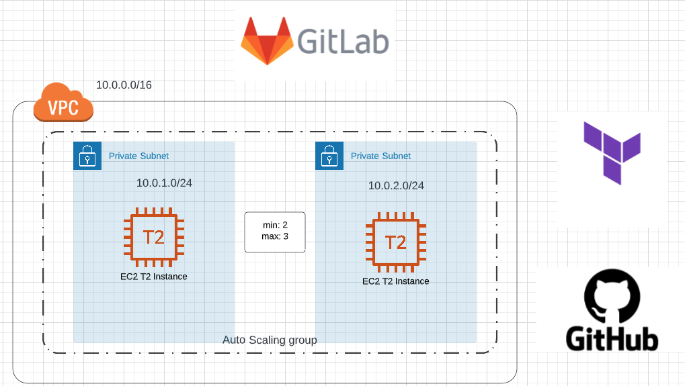
## Setting up File System
- In this demo, we will create a Gitlab CI-CD Pipeline with Terraform.

- First create a `terraform-cicd` directory and change directory to that folder with below command and move all terraform files under this repository into `terraform-cicd` directory.

```sh
mkdir terraform-cicd && cd terraform-cicd
```
## Creating S3 Bucket for Terraform Remote backend
- First we will create a s3 bucket as our remote backend to store our Terraform state files. Since s3 is a global service, make sure your bucket name is unique!

```sh
aws s3api create-bucket --bucket <bucket-name> --region us-east-1
```
- We can run `aws s3 ls` to make sure our bucket created succesfully.

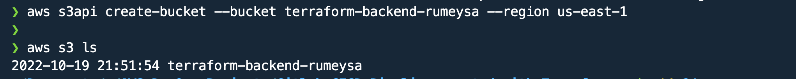

- Next in `backend.tf` file, update your bucketname.

```sh
terraform {
  required_version = ">=0.12.0"
  backend "s3" {
    region  = "us-east-1"
    profile = "default"
    key     = "FirstKey"
    bucket  = "replace_with_your_bucket_name"
  }
}
```
## Verifying Terraform Files
- Next, we will run the code to verify everything is working expected before we create the CI/CD pipeline.

- Run `terraform init` to initialize the code
  
- Run `terraform fmt` to format Terraform files

- Run `terraform validate` to check the syntax of the code.

- Run `terraform plan` to view the infrastructure that will be created.

- Run `terraform apply` to provision the infrastructure.

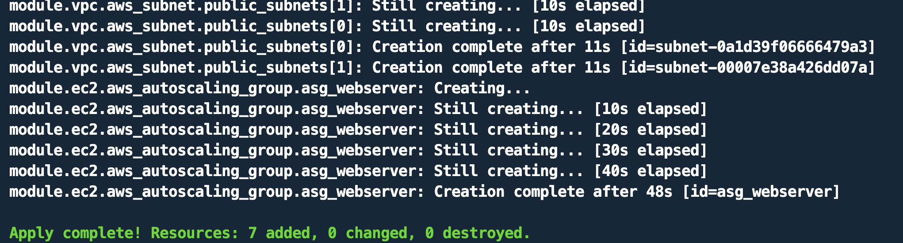

- After resources created, we can destroy them by running `terraform destroy -auto-approve`

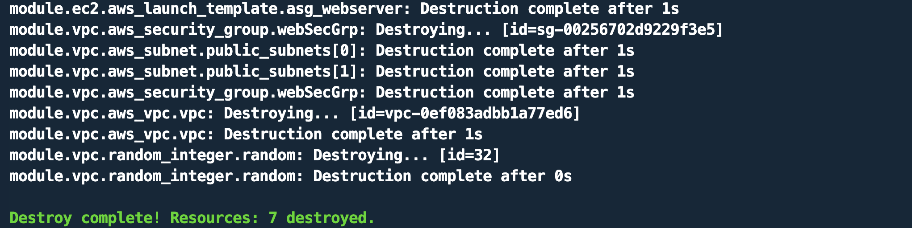

## Connecting Gitlab to Github

- Navigate to Gitlab account, create a new project, we will choose `Run CI/CD for external repository`

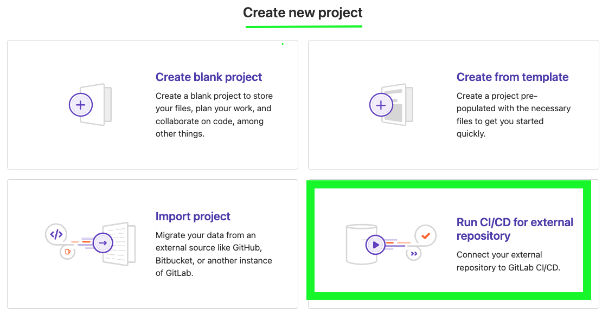

- Click Github icon, if it is your first time it may ask you to Authenticate Gitlab to access your repository by using your Personal Access Token. If you don't have one, go to your Github click your account icon, navigate `Settings` -> `Develeoper Settings` -> `Personal Access Tokens`
Generate a new one and provide in Gitlab screen. 

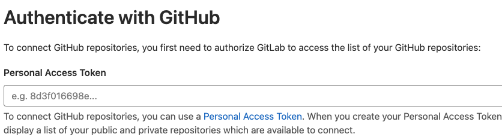

- Once you have authenticated Gitlab, you may see your repository named `terraform-cicd`. Click `Connect`.


## Setting Environment Variables for GitLab

- Now go to your imported project, click `Settings`, then choose `CICD`.
  
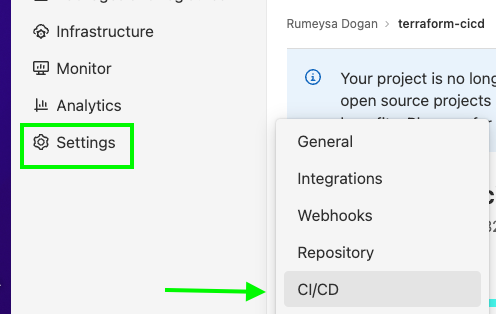

- We will expand `Variables` section and setup following environment variables and mask them.

  * AWS_ACCESS_KEY_ID
  * AWS_DEFAULT_REGION
  * AWS_SECRET_ACCESS_KEY
  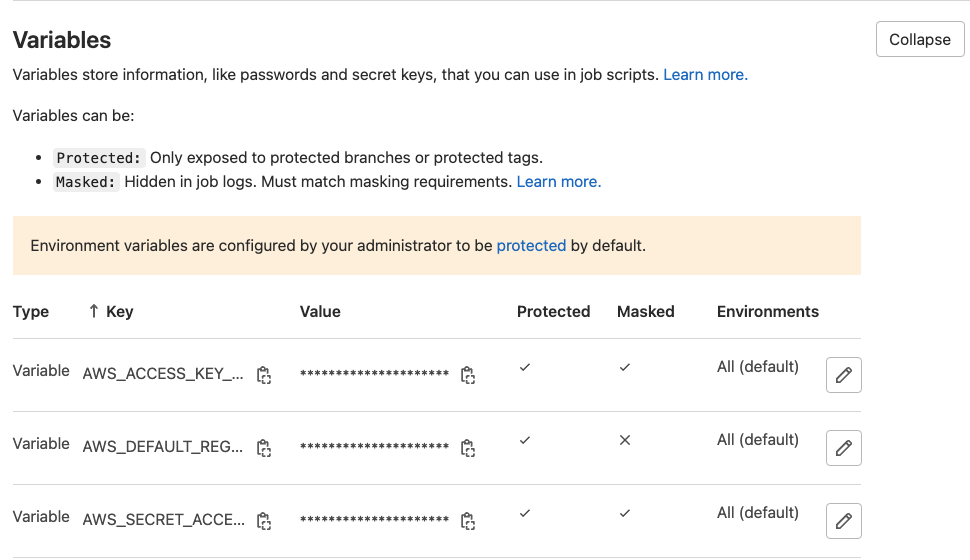

## Creating Gitlab CICD Pipeline

- Next, we will navigate to `CICD` -> `Pipeline` section. Gitlab uses `.gitlab-ci.yml` file to run pipelines. 

- We have already created a `.gitlab-ci.yml` file under repository which basically runs terraform validate, plan, apply and destroy commands.

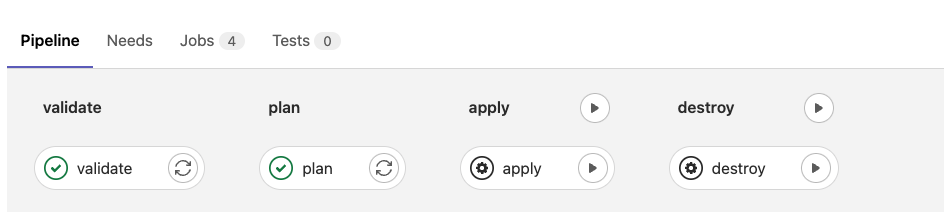 

-  Apply and destroy stages require manual intervention, first click on `Apply`, then choose `Trigger this manual action`.

- Check if apply job succeeded or not. If yes, we can validate the resources in AWS console.

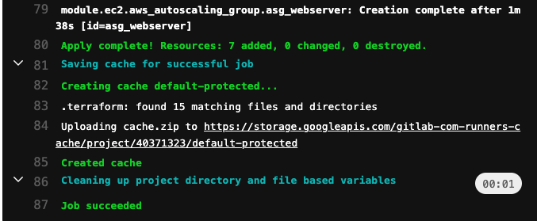

## Validating resources created by pipeline in AWS Console

- First check your tfstate file is stored in S3 bucket you created.

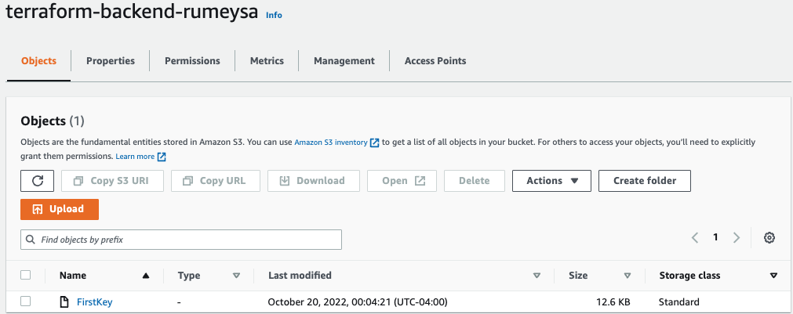

- Next we can check our VPC and subnets.
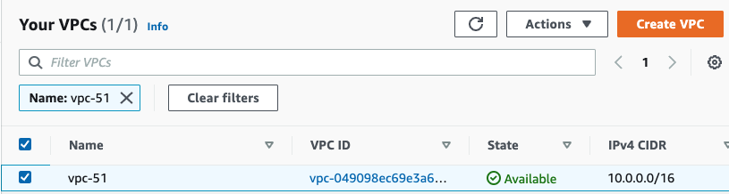
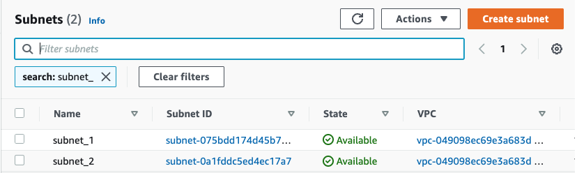

- Finally, we can check our instances.

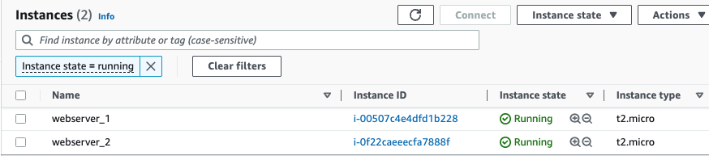

## Test Pipeline Automation

- Next we will test Gitlab pipeine trigger. Once a new change is committed to repository, Gitlab will automatically discover changes, and run pipeline. Go to your repository and make below changes under `ec2` -> `main.tf` file. 

```sh
  min_size            = 1
  max_size            = 2
  desired_capacity    = 1
```


- Once you commit changes, you will see new pipeline triggered automatically.

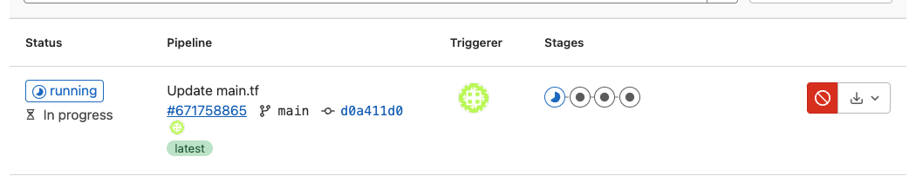

- Again we will manually approve `apply` action, and verify in AWS Console.

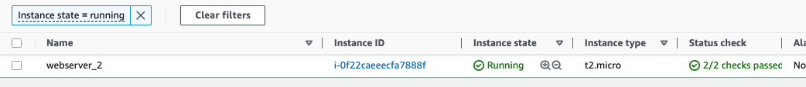

## Destroying Infrastructure in Gitlab

- Now we can manually trigger destroy in pipeline, and clean our resources.

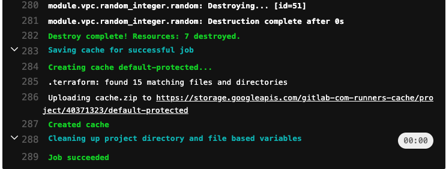


  

  


