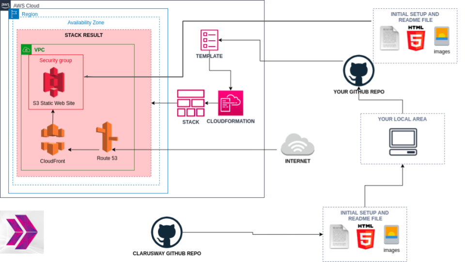
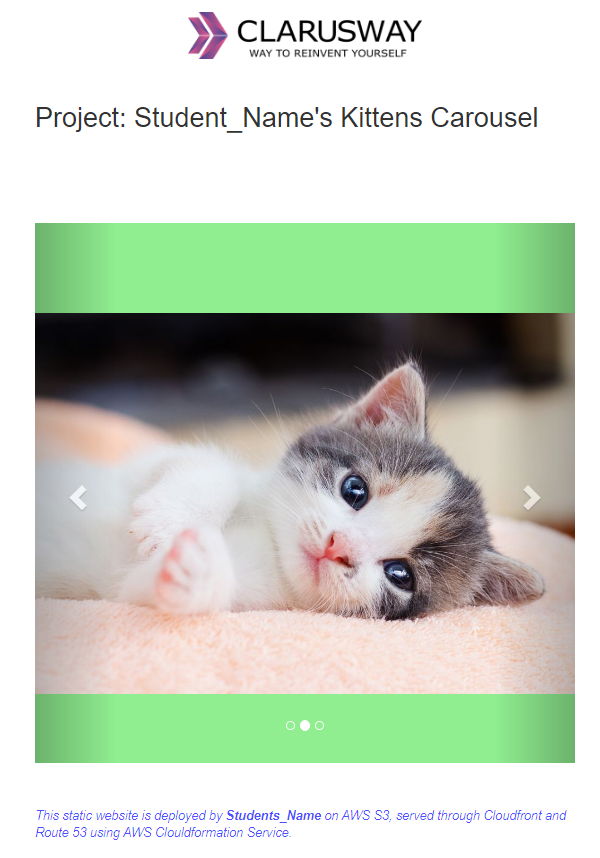

# Project-105: Kittens Carousel Static Website deployed on AWS Cloudfront, S3 and Route 53 using Cloudformation

## Description

Kittens Carousel is a static website application deployed on AWS Simple Storage Service (S3), served through Cloudfront and Route 53 using AWS Cloudformation Service.

## Problem Statement



- Your company has recently started a web application project that will serve as an attraction point for pet lovers. As a first step of the project, you have deployed the app on EC2 instance and showed that design is good and working, thus you can go to next step. Developers in your team have prepared kittens carousel application and pushed necessary files for the project to the repository on Github.

- Your task is to deploy the application as static web page in the production environment. Thus, you need to deploy the web application using the `index.html` and an images given within the `static-web` folder. Note the followings for your web application.
  
  - User should face first with `index.html` when web app started.

  - Application should be deployed on AWS S3 as static website.

  - Application should be served to public through domain name of the company using AWS Cloudfront and Route 53. Thus, you need to prepare a Cloudformation template with following configurations;

    - The application stack should be created with new AWS resources.

    - The application stack should take two parameters from the user;

      - The DNS name of an existing Amazon Route 53 hosted zone e.g. `clarusway.us`

      - The full domain name e.g. `kittens.clarusway.us` for the web application

    - The Web Application files should be served from S3 bucket which should be configured as a static website host and the content should be reachable from anywhere.

    - Cloudfront should be set as a cache server which points to S3 bucket of the web app with following configurations;

      - The cloudfront distribution should be connected to the full domain name of the application.

      - The cloudfront distribution should communicate with S3 bucket securely.

      - The cloudfront distribution should default to `index.html`.

      - HTTP version 2 should be employed.

      - As cache behavior;

        - `GET` and `HEAD` methods should be allowed.

        - Cookies should not be forwarded to bucket.

        - All request should be redirected to HTTPS.

        - Newly created ACM Certificate should be used for securing connections.

    - Within Route 53 a record set should be configured to send requests to the Cloudfront distribution.  

    - After the stack created, following outputs should be given;

      - Full DomainName of Kittens Carousel Application

      - Endpoint for Kittens Cloudfront Distribution

      - Name of S3 Bucket for Kittens Website

  - The Application files should be uploaded to the application S3 bucket from local git repo using AWS CLI commands.

## Project Skeleton

```text
006-kittens-carousel-static-web-s3-cf (folder)
|
|----readme.md              # Given to the students (Definition of the project)
|----cfn-template.yml       # To be delivered by students (Cloudformation template)
|----upload-script.sh       # To be delivered by students (Script to upload website content to S3)
|----static-web
        |----index.html     # Given to the students (HTML file)
        |----cat0.jpg       # Given to the students (image file)
        |----cat1.jpg       # Given to the students (image file)
        |----cat2.jpg       # Given to the students (image file)
```

## Expected Outcome



### At the end of the project, following topics are to be covered;

- Static Website Deployment

- Bash scripting

- AWS Simple Storage Service

- AWS Cloudfront Distribution

- AWS Certificate Manager

- AWS Route 53 Service

- AWS Cloudformation Service

- AWS Cloudformation Template Design

- Git & Github for Version Control System

### At the end of the project, students will be able to;

- demonstrate bash scripting skills using AWS CLI to upload the application files to S3 bucket.

- configure S3 buckets through Cloudformation.

- configure ACM Certificate through Cloudformation.

- configure Cloudfront through Cloudformation.

- configure Route 53 record set through Cloudformation.

- configure Cloudformation template to use AWS Resources.

- use AWS Cloudformation Service to launch stacks.

- use git commands (push, pull, commit, add etc.) and Github as Version Control System.

## Steps to Solution
  
- Step 1: Download or clone project definition from `clarusway` repo on Github

- Step 2: Create project folder for local public repo on your pc

- Step 3: Prepare a cloudformation template to deploy your app

- Step 4: Deploy your application on AWS Cloud using Cloudformation template

- Step 5: Upload your application files into S3 bucket from your local git repo

## Notes

- Customize the application by hard-coding your name instead of `student_name` within `index.html`.

- Use `bash upload-script.sh` to invoke upload script.

## Resources

- [AWS Cloudformation User Guide](https://docs.aws.amazon.com/AWSCloudFormation/latest/UserGuide/Welcome.html)

- [AWS CLI Command Reference](https://docs.aws.amazon.com/cli/latest/index.html)
