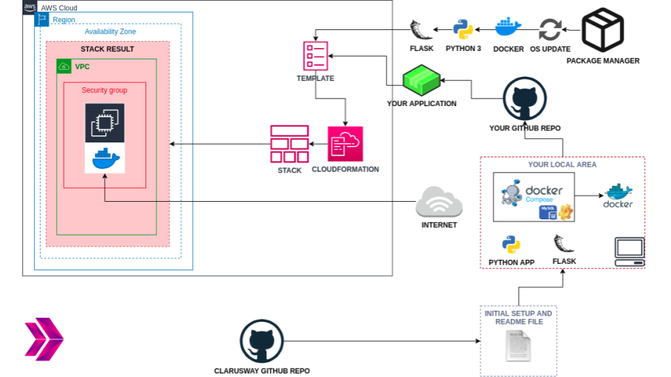
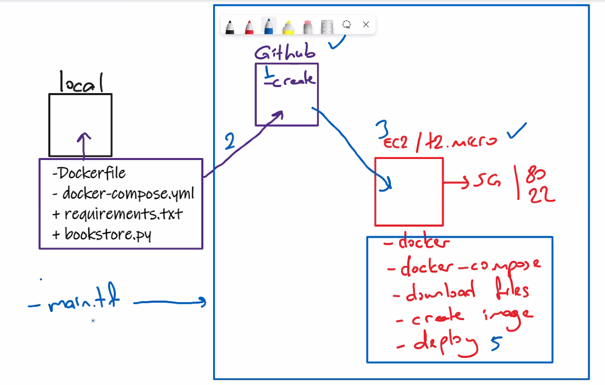
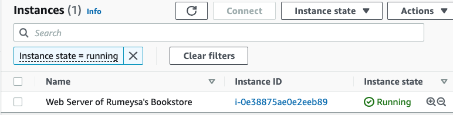

# Project-107: Dockerization of Bookstore Web API (Python Flask) with MySQL

## Description

Bookstore Web API Application aims to create a bookstore web service using Docker to give students the understanding to dockerization of an application. The application code is to be deployed as a RESTful web service with Flask using Dockerfile and Docker Compose on AWS Elastic Compute Cloud (EC2) Instance using Terraform.

## Problem Statement

 

- Your team has started working on a project to create a `Bookstore` Application as Web Service.  

- Software Developers in your team have already developed first version of `Bookstore` application. They have designed a database to keep book records with following fields.

  - book_id: unique identifier for books, type is numeric.

  - title: title of the book, type is string.

  - author: author of the book. type is string.

  - is_sold: book availability status, type is boolean.

- Your teammates also created the RESTful web service as given in [Bookstore API](./bookstore-api.py) using Python Flask Framework. Below table shows how the HTTP methods are designed to affect the given resources identified by URIs.

| HTTP Method  | Action | Example|
| --- | --- | --- |
| `GET`     |   Obtain information about a resource | http://[ec2-hostname]/books (retrieves list of all books) |
| `GET`     |   Obtain information about a resource | http://[ec2-hostname]/books/123 (retrieves book with id=123) |
| `POST`    |   Create a new resource               | http://[ec2-hostname]/books (creates a new book, from data provided with the request) |
| `PUT`     |   Update a resource                   | http://[ec2-hostname]/books/123 (updates the book with id=123, from data provided with the request) |
| `DELETE`  |   Delete a resource                   | http://[ec2-hostname]/books/123 (delete the book with id=123) |

- You are, as a cloud engineer, requested to deploy the app in the development environment on a Docker Machine on AWS EC2 Instance using Terraform to showcase your project. To do that you need to;

  - Get the app code from GitHub repo of your team.

  - Create docker image using the `Dockerfile`.

  - Deploy the app using `docker compose`. To do so;

    - Create a database service using MySQL.

    - Configure the app service to run on `port 80`.

    - Use a custom network for the services.

- In the development environment, you can configure your Terraform config file using the followings,

  - The application should be created with new AWS resources.

  - The application should run on Amazon Linux 2 EC2 Instance

  - EC2 Instance type can be configured as `t2.micro`.

  - Instance launched by Terraform should be tagged `Web Server of Bookstore`

  - The Web Application should be accessible via web browser from anywhere.

  - The Application files should be downloaded from Github repo and deployed on EC2 Instance using user data script within Terraform configuration file.

  - Bookstore Web API URL should be given as output byTerraform, after the resources created.

## Project Skeleton

```text
203-dockerization-bookstore-api-on-python-flask-mysql (folder)
|
|----readme.md          # Given to the students (Definition of the project)
|----bookstore-api.py   # Given to the students (Python Flask Web API)
|----requirements.txt   # Given to the students (List of Flask modules for Web API)
|----main.tf            # To be delivered by students (Terraform config file)
|----docker-compose.yml # To be delivered by students
|----Dockerfile         # To be delivered by students
|----cfn-template.yml   # To be delivered by students (Optional)
```

## Expected Outcome

### At the end of the project, following topics are to be covered;

- MySQL Database Configuration

- Bash scripting

- Docker Images

- Docker Compose

- AWS EC2 Service

- AWS Security Group Configuration

- AWS Cloudformation Service (Optional)

- Terraform Configuration with AWS

- Git & Github for Version Control System

### At the end of the project, students will be able to;

- configure connection to the `MySQL` database.

- build a Docker image.

- configure Docker Compose to run Python Flask app.

- improve bash scripting skills using `user data` section in Terraform to install and setup web application on EC2 Instance

- configure AWS EC2 Instance and Security Groups.

- configure Terraform files to use AWS Resources.

- use git commands (push, pull, commit, add etc.) and Github as Version Control System.

- run the web application on AWS EC2 instance using the GitHub repo as codebase.

## Steps to Solution

- Step 1: Download or clone project definition from `clarusway-aws-workshop` repo on Github

- Step 2: Create project folder for local public repo on your pc

- Step 3: Prepare scripts to build a Python Flask App Image using Dockerfile and Docker Compose

- Step 4: Prepare a Terrform configuration file to deploy your app on EC2 Instance

- Step 5: Push your application into your own public repo on Github

- Step 6: Deploy your application on AWS Cloud using Terraform to showcase your app within your team.




## Notes

- To showcase your projects REST functions, use `curl` command for each HTTP methods namely, `GET`, `POST`, `PUT`, `DELETE`.

## Resources

- [REpresentational State Transfer](https://en.wikipedia.org/wiki/Representational_state_transfer)

- [Terraform AWS Provider Documentaion](https://registry.terraform.io/providers/hashicorp/aws/latest/docs)

- [AWS Cloudformation User Guide](https://docs.aws.amazon.com/AWSCloudFormation/latest/UserGuide/Welcome.html) (Optional)
