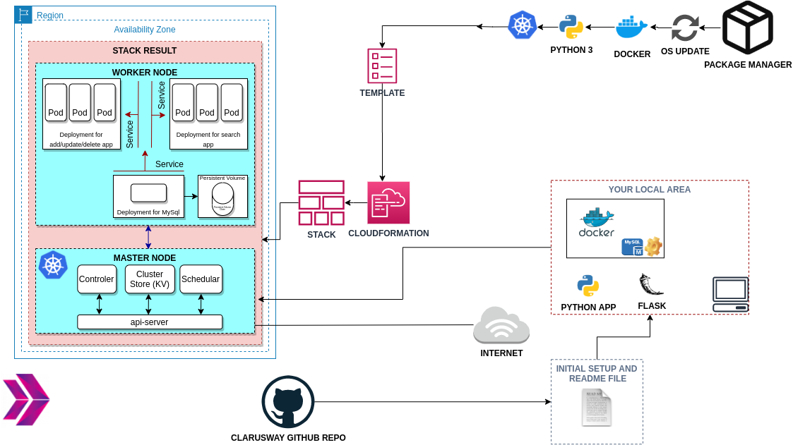

# Project-108: Microservice Architecture for Phonebook Web Application (Python Flask) with MySQL using Kubernetes.

## Description

Phonebook Microservice Web Application aims to create a web application with MySQL Database using Docker and Kubernetes to give students the understanding of Microservice architecture. In this application, we have a frontend service and a backend service to interact with database service. Each service will be managed by a Kubernetes deployment. The backend service will be a gateway for the application and it will serve the necessary web pages for create, delete and update operations while the frontend service will serve a search page in order to conduct read operations. To preserve the data in the database, persistent volume and persistent volume claim concepts should be adopted.

## Problem Statement

 

- Your team has started working on a project to create a `Phonebook` Application as Web Service.  

- Software Developers in your team have already developed first version of `Phonebook` application. They have designed a database to keep phonebook records with following fields.

  - id: unique identifier for records, data type is integer and it will be auto increment.

  - name: name of record, data type is string.

  - number: phone number belonging to the recorded person.

- Your teammates also created the RESTful web service as given in [Phonebook API](./Phonebook-api.py) using Python Flask Framework. Below table shows how the HTTP methods are designed to affect the given resources identified by URIs.

| HTTP Method  | Action | Example|
| --- | --- | --- |
| `GET`     |   Read the records | http://[ec2-hostname]:30001/  |
| `POST`    |   Create a new record | http://[ec2-hostname]:30001/add  |
| `POST`    |   Update an existing record | http://[ec2-hostname]:30001/update  |
| `POST`    |   Delete an existing record | http://[ec2-hostname]:30001/delete  |
| `POST`    |   Delete a resource | http://[ec2-hostname]:30002  |

- As a cloud engineer, you're requested to deploy the app on an AWS EC2 Instance using Docker and Kubernetes to showcase your project. In order to achieve this goal, you need to;

  - Pull the application code from GitHub repo of your team.

  - Create two docker images for create/update/delete and search pages using `Dockerfile`s.

  - Deploy the app using `Kubernetes`. To do so;

    - Create a database service using MySQL.

    - Use a custom network for the services.

- In the Kubernetes environment, you will configure three deployements with their services and a persistent volume for MySQL deployments. You can find the definitions below for the objects you should create:

  1.1. CREATE/DELETE/UPDATE DEPLOYMENT

    - Deployment definition file should configure create/delete/update operations with one or more replicas.
    - Expose the container port on `port 80`.
    - Deployment definition file should set the proper Environmental Variables for the db connection.
    - Passwords should be protected by kubernetes-secrets.
    - Database Host's value should be defined in the deployment using Kubernetes-ConfigMap.

  1.2. CREATE/DELETE/UPDATE SERVICE
    - This service should be attached to `CREATE/DELETE/UPDATE Deployment`.
    - Service type should be NodePort published on `port:30001`.
    - Expose the port and target port on port `80`.

  2.1. SEARCH DEPLOYMENT

    - Deployment definition file should configure search operations with one or more replicas.
    - Expose the container port on `port 80`.
    - Deployment definition file should set the proper Environmental Variables for the db connection.
    - Passwords should be protected by kubernetes-secrets.
    - Database Host's value should be defined in the deployment using Kubernetes-ConfigMap.

  2.2. SEARCH SERVICE
    - This service should be attached to `SEARCH Deployment`.
    - Service type should be NodePort published on `port:30002`.
    - Expose the port and target port on port `80`.

  3.1. DATABASE DEPLOYMENT
    - Deployment should use mysql:5.7 image pulled from Docker hub.
    - Expose the container port on `port 3306`.
    - Deployment definition file should set the proper Environmental Variables.
    - Persistent volume should be attached to this deployment.
    - Passwords should be protected by kubernetes-secrets.

  3.2. DATABASE SERVICE
    - This service should be attached to `DATABASE Deployment`.
    - Service type should be ClusterIP.
    - Expose the port and target port on port `3306`.

  3.3. Persistent Volume
    - Volume capacity should be set as `20Gi`.
    - Access Mode should be set as `ReadWriteOnce`.
    - Host path should be set as `/mnt/data`.
    - To be able to attache this volume, a persistent volume claim should be defined.
  
  4.1. Kubernetes Environment
  - Assign two EC2 machines as the project's infrastructure. One should be configured as the master and the other should be configured as the worker. 

  - Minimum `t2.medium` instance type should be selected.

  - The Web Application should be accessible via web browser from anywhere. 

  - The Application files should be downloaded from Github repo and deployed on EC2 Instance using user data script within cloudformation template.


## Project Skeleton

```text
206-Kubernetes-Microservice-Phonebook (folder)

Initial files:

1. README.md                      # Given to the students (Definition of the project)
2. Image_for_web_server           # Given to the students (Image components of Python Flask Web API for Update/delete/add record)
  - app.py      
  - requirements.txt              
  - templates
    - index.html
    - add-update.html
    - delete.html
3. image_for_result_server        # Given to the students (Image components of Python Flask Web API for search record)
  - app.py           
  - requirements.txt              
  - templates
    - index.html
4. kubernetes-env-cf.yaml         # Given to the students (Cloudformation template for Kubernetes architecture)

Requested files:

ADD/DELETE/UPDATE DEPLOYMENT AND SERVICE
1. Dockerfile                     # To be delivered by students 
2. web_server_deployment.yml      # To be delivered by students
3. web_server_service.yaml        # To be delivered by students

SEARCH DEPLOYMENT AND SERVICE
1. Dockerfile                     # To be delivered by students
2. result_server_deployment.yml   # To be delivered by students
3. result_server_service.yaml     # To be delivered by students

DATABASE DEPLOYMENT AND SERVICE
1. mysql_deployement.yml          # To be delivered by students
2. mysql_service.yaml             # To be delivered by students
3. persistent_volume.yaml         # To be delivered by students
4. persistent_volume_claim.yaml   # To be delivered by students

SECRETS AND CONFIGMAP
1. mysql-secret.yaml              # To be delivered by students
2. database_configmap.yaml        # To be delivered by students
3. servers_configmap.yaml         # To be delivered by students

```

## Expected Outcome

### At the end of the project, following topics are to be covered;

- MySQL Database Configuration

- Docker Images

- Kubernetes architecture configuration

- AWS EC2 Service

- AWS Security Group Configuration

- Git & Github for Version Control System

- AWS Cloudformation Service

### At the end of the project, students will be able to;

- configure a connection to the `MySQL` database.

- build Docker images.

- configure Kubernetes to run Python Flask app.

- improve network skills using `service` objects in Kubernetes

- configure AWS EC2 Instance and Security Groups.

- use git commands (push, pull, commit, add etc.) and Github as Version Control System.

- run the web application on AWS EC2 instance using the GitHub repo as codebase.

- build a Kubernetes infrastructure using Cloudformation.

## Steps to Solution
  
- Step 1: Download or clone project definition from `clarusway` repo on Github

- Step 2: Create your Kubernetes environment with cloudformation template

- Step 3: Prepare Dockerfiles for search and delete/update/create pages using Python Flask Apps, create images and push to your Docker Hub Repository.

- Step 4: Prepare search, delete/update/create and mysql parts.

- Step 5: Deploy your work on Kubernetes to showcase your application within your team.


## Resources

- [Kubernetes Documentations](https://kubernetes.io/docs/home/)
