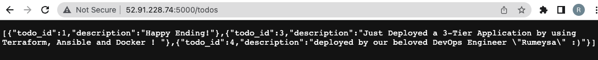

## Part 1 - Launch the instances

- Create 4 `Red Hat Enterprise Linux 8 (HVM), ami-0f095f89ae15be883 ami. 

- ansible_control (t2.medium) (tag: Name=ansible_control)

- ansible_postgresql, ansible_nodejs, ansible_react (t2.micro) (Add 5000, 3000, 5432 to security grıops)

## Part 2 - Prepare the scene

Connect the ansible_control node
   
   - Copy the student files

   - Run the commands below to install Python3 and Ansible. 

```bash
$ sudo yum update -y
```

```bash
$ sudo yum install -y python3 
```

```bash
$ pip3 install --user ansible
```

- Check Ansible's installation with the command below.

```bash
$ ansible --version
```

- Create ansible directory and change directory to this directory.

```bash
mkdir ansible
cd ansible
```

- Create `ansible.cfg` files.

```
[defaults]
host_key_checking = False
inventory=inventory_aws_ec2.yml
interpreter_python=auto_silent
private_key_file=/home/ec2-user/aduncan.pem 
remote_user=ec2-user
```

- copy pem file from local to home directory of ec2-user.

```bash
scp -i <pem-file> <pem-file> ec2-user@<public-ip of ansible_control>:/home/ec2-user
```

## Part 3 - Creating dynamic inventory

- go to AWS Management Consol and select the IAM roles:

- click the  "create role" then create a role with "AmazonEC2FullAccess"

- go to EC2 instance Dashboard, and select the control-node instance

- select actions -> security -> modify IAM role

- select the role thay you have jsut created for EC2 full access and save it.

- install "boto3"

```bash
pip3 install --user boto3
```

- Tag the postgresql, nodejs and react instances as below.

```
Name=ansible_postgresql
Name=ansible_nodejs
Name=ansible_react
```

- Tag ansible_control, ansible_postgresql, ansible_nodejs, ansible_react instances as below.

```
stack=ansible_project
```

- Tag ansible_postgresql, ansible_nodejs, ansible_react instances as below.

```
environment=development
```

- Create `inventory_aws_ec2.yml` file under the ansible directory. 

```yaml
plugin: aws_ec2
regions:
  - "us-east-1"
filters:
  tag:stack: ansible_project
keyed_groups:
  - key: tags.Name
  - key: tags.environment
compose:
  ansible_host: public_ip_address
```

```bash
$ ansible-inventory -i inventory_aws_ec2.yml --graph
```

```
@all:
  |--@_ansible_control:
  |  |--ec2-3-80-96-146.compute-1.amazonaws.com
  |--@_ansible_nodejs:
  |  |--ec2-3-239-243-194.compute-1.amazonaws.com
  |--@_ansible_postgresql:
  |  |--ec2-3-236-160-236.compute-1.amazonaws.com
  |--@_ansible_react:
  |  |--ec2-3-236-197-117.compute-1.amazonaws.com
  |--@_development:
  |  |--ec2-3-236-160-236.compute-1.amazonaws.com
  |  |--ec2-3-236-197-117.compute-1.amazonaws.com
  |  |--ec2-3-239-243-194.compute-1.amazonaws.com
  |--@aws_ec2:
  |  |--ec2-3-236-160-236.compute-1.amazonaws.com
  |  |--ec2-3-236-197-117.compute-1.amazonaws.com
  |  |--ec2-3-239-243-194.compute-1.amazonaws.com
  |  |--ec2-3-80-96-146.compute-1.amazonaws.com
  |--@ungrouped:
```

- To make sure that all our hosts are reachable with dynamic inventory, we will run various ad-hoc commands that use the ping module.

```bash
$ ansible all -m ping 
```

## Part 4 - Prepare the playbook files

- Create `ansible-Project` directory under home directory and change directory to this directory.

```bash
mkdir ansible-project
cd ansible-project
```

- Create `postgres`, `nodejs`, `react` directories.

```bash
mkdir postgres nodejs react
```

- Copy `~/student_files/todo-app-pern` directory to this directory.

- Change directory to `postgres` directory.

```bash
cd postgres
```


- Create a Dockerfile

```Dockerfile
FROM postgres

COPY ./init.sql /docker-entrypoint-initdb.d/

EXPOSE 5432
```

- change directory `~/ansible` directory.

```bash
cd ~/ansible
```

- Create a yaml file as postgres playbook and name it `docker_postgre.yml`.

```yaml
- name: Install docker
  gather_facts: No
  any_errors_fatal: true
  hosts: _ansible_postgresql
  become: true
  vars_files:
    - secret.yaml
  tasks:
    - name: upgrade all packages
      yum: 
        name: '*'
        state: latest
    # we may need to uninstall any existing docker files from the centos repo first. 
    - name: Remove docker if installed from CentOS repo
      yum:
        name: "{{ item }}"
        state: removed
      with_items:
        - docker
        - docker-client
        - docker-client-latest
        - docker-common
        - docker-latest
        - docker-latest-logrotate
        - docker-logrotate
        - docker-engine
    - name: Install yum utils
      yum:
        name: "{{ item }}"
        state: latest
      with_items:
        - yum-utils
  # yum-utils is a collection of tools and programs for managing yum repositories, installing debug packages, source packages, extended information from repositories and administration.
    - name: Add Docker repo
      get_url:
        url: https://download.docker.com/linux/centos/docker-ce.repo
        dest: /etc/yum.repos.d/docker-ce.repo
    - name: Install Docker
      package:
        name: docker-ce
        state: latest
    - name: Install pip
      package: 
        name: python3-pip
        state: present
        update_cache: true
    - name: Install docker sdk
      pip:
        name: docker
    - name: Add user ec2-user to docker group
      user:
        name: ec2-user
        groups: docker
        append: yes
    - name: Start Docker service
      service:
        name: docker
        state: started
        enabled: yes
    - name: create build directory
      file:
        path: /home/ec2-user/postgresql
        state: directory
        owner: root
        group: root
        mode: '0755'
    - name: copy the sql script
      copy:
        src: /home/ec2-user/ansible-project/postgres/init.sql
        dest: /home/ec2-user/postgresql
    - name: copy the Dockerfile
      copy:
        src: /home/ec2-user/ansible-project/postgres/Dockerfile
        dest: /home/ec2-user/postgresql
    - name: remove cla_postgre container and clacw/postgre if exists
      shell: "docker ps -q --filter 'name=cla_postgre' && docker stop cla_postgre && docker rm -fv cla_postgre && docker image rm -f clacw/postgre || echo 'Not Found'"
    - name: build container image
      docker_image:
        name: clacw/postgre
        build:
          path: /home/ec2-user/postgresql
        source: build
        state: present
    - name: Launch postgresql docker container
      docker_container:
        name: cla_postgre
        image: clacw/postgre
        state: started
        ports: 
        - "5432:5432"
        env:
          POSTGRES_PASSWORD: "{{password}}"
        volumes:
          - /db-data:/var/lib/postgresql/data
      register: container_info
    
    - name: print the container info
      debug:
        var: container_info
```

- Execute it.
ansible-vault create secret.yaml

```
ansible-playbook --ask-vault-pass docker_postgre.yml
```

```
ansible _ansible_postgresql -m shell -a "docker ps"
```

```
ansible-inventory --graph #if you get ansible host match error
```

- Change directory to `~/ansible-project/nodejs` directory.

```bash
cd ~/ansible-project/nodejs
```

- Create a Dockerfile.

```Dockerfile
FROM node:14

# Create app directory
WORKDIR /usr/src/app


COPY package*.json ./

RUN npm install
# If you are building your code for production
# RUN npm ci --only=production


# copy all files into the image
COPY . .

EXPOSE 5000

CMD ["node","app.js"]
```

- Change the `~/ansible-project/todo-app-pern/server/.env` file as below.

```
SERVER_PORT=5000
DB_USER=postgres
DB_PASSWORD=Pp123456789
DB_NAME=clarustodo
DB_HOST=172.31.12.133 # (private ip of postgresql instance)
DB_PORT=5432
```

- change directory `~/ansible` directory.

```bash
cd ~/ansible
```

- Create a yaml file as nodejs playbook and name it `docker_nodejs.yml`.

```yaml
- name: Install docker
  gather_facts: No
  any_errors_fatal: true
  hosts: _ansible_nodejs
  become: true
  tasks:
    - name: upgrade all packages
      yum: 
        name: '*'
        state: latest
    # we may need to uninstall any existing docker files from the centos repo first.
    - name: Remove docker if installed from CentOS repo
      yum:
        name: "{{ item }}"
        state: removed
      with_items:
        - docker
        - docker-client
        - docker-client-latest
        - docker-common
        - docker-latest
        - docker-latest-logrotate
        - docker-logrotate
        - docker-engine
    - name: Install yum utils
      yum:
        name: "{{ item }}"
        state: latest
      with_items:
        - yum-utils
    - name: Add Docker repo
      get_url:
        url: https://download.docker.com/linux/centos/docker-ce.repo
        dest: /etc/yum.repos.d/docker-ce.repo
    - name: Install Docker
      package:
        name: docker-ce
        state: latest
    - name: Install pip
      package:
        name: python3-pip
        state: present
        update_cache: true
    - name: Install docker sdk
      pip:
        name: docker
    - name: Add user ec2-user to docker group
      user:
        name: ec2-user
        groups: docker
        append: yes
    - name: Start Docker service
      service:
        name: docker
        state: started
        enabled: yes
    - name: create build directory
      file:
        path: /home/ec2-user/nodejs
        state: directory
        owner: root
        group: root
        mode: '0755'
    # at this point do not forget change DB_HOST env variable for postgresql node
    - name: copy files to the nodejs node
      copy:
        src: /home/ec2-user/ansible-project/todo-app-pern/server/
        dest: /home/ec2-user/nodejs
    - name: copy the Dockerfile
      copy:
        src: /home/ec2-user/ansible-project/nodejs/Dockerfile
        dest: /home/ec2-user/nodejs
    - name: remove cla_nodejs container if exists
      shell: "docker ps -q --filter 'name=cla_nodejs' && docker stop cla_nodejs && docker rm -fv serdar_nodejs && docker image rm clacw/nodejs || echo 'Not Found'"
    - name: build container image
      docker_image:
        name: clacw/nodejs
        build:
          path: /home/ec2-user/nodejs
        source: build
        state: present
    - name: Launch nodejs docker container
      docker_container:
        name: cla_nodejs
        image: clacw/nodejs
        state: started
        ports:
        - "5000:5000"
      register: container_info
    - name: Print the container_info
      debug:
        msg: "{{ container_info }}"
```

- Execute it.

```
ansible-playbook docker_nodejs.yml
```

```
ansible _ansible_nodejs -m shell -a "docker ps"
```

```
ansible-inventory --graph #if you get ansible host match error
```



- Change directory to `~/ansible-Project/react` directory.

```bash
cd ~/ansible-project/react
```

- Create a Dockerfile.

```Dockerfile
FROM node:14

# Create app directory
WORKDIR /app


COPY package*.json ./

RUN yarn install

# copy all files into the image
COPY . .

EXPOSE 3000

CMD ["yarn", "run", "start"]
```

- Change the `~/ansible-project/todo-app-pern/client/.env` file as below.

```
REACT_APP_BASE_URL=http://<public ip of nodejs>:5000/
```

- change directory `~/ansible` directory.

```bash
cd ~/ansible
```

- Create a yaml file as react playbook and name it `docker_react.yml`.

```yaml
- name: Install docker
  gather_facts: No
  any_errors_fatal: true
  hosts: _ansible_react
  become: true
  tasks:
    - name: upgrade all packages
      yum: 
        name: '*'
        state: latest
    # we may need to uninstall any existing docker files from the centos repo first.
    - name: Remove docker if installed from CentOS repo
      yum:
        name: "{{ item }}"
        state: removed
      with_items:
        - docker
        - docker-client
        - docker-client-latest
        - docker-common
        - docker-latest
        - docker-latest-logrotate
        - docker-logrotate
        - docker-engine
    - name: Install yum utils
      yum:
        name: "{{ item }}"
        state: latest
      with_items:
        - yum-utils
    - name: Add Docker repo
      get_url:
        url: https://download.docker.com/linux/centos/docker-ce.repo
        dest: /etc/yum.repos.d/docker-ce.repo
    - name: Install Docker
      package:
        name: docker-ce
        state: latest
    - name: Install pip
      package:
        name: python3-pip
        state: present
        update_cache: true
    - name: Install docker sdk
      pip:
        name: docker
    - name: Add user ec2-user to docker group
      user:
        name: ec2-user
        groups: docker
        append: yes
    - name: Start Docker service
      service:
        name: docker
        state: started
        enabled: yes
    - name: create build directory
      file:
        path: /home/ec2-user/react
        state: directory
        owner: root
        group: root
        mode: '0755'
    # at this point do not forget change DB_HOST env variable for postgresql node
    - name: copy files to the nodejs node
      copy:
        src: /home/ec2-user/ansible-project/todo-app-pern/client/
        dest: /home/ec2-user/react
    - name: copy the Dockerfile
      copy:
        src: /home/ec2-user/ansible-project/react/Dockerfile
        dest: /home/ec2-user/react
    - name: remove cla_react container and clacw/react image if exists
      shell: "docker ps -q --filter 'name=cla_react' && docker stop cla_react && docker rm -fv cla_react && docker image rm -f clacw/react || echo 'Not Found'"
    - name: build container image
      docker_image:
        name: clacw/react
        build:
          path: /home/ec2-user/react
        source: build
        state: present
    - name: Launch react docker container
      docker_container:
        name: cla_react
        image: clacw/react
        state: started
        ports:
        - "3000:3000"
      register: container_info
    - name: Print the container_info
      debug:
        msg: "{{ container_info }}"
```

- Execute it.

```
ansible-playbook docker_react.yml
```

## Part 5 - Prepare one playbook file for all instances.

- Create a `docker_project.yaml` file under `the ~/ansible` folder.

```yaml
- name: Docker install and configuration
  gather_facts: No
  any_errors_fatal: true
  hosts: _development
  become: true
  tasks:
    - name: upgrade all packages
      yum: 
        name: '*'
        state: latest
    # we may need to uninstall any existing docker files from the centos repo first.
    - name: Remove docker if installed from CentOS repo
      yum:
        name: "{{ item }}"
        state: removed
      with_items:
        - docker
        - docker-client
        - docker-client-latest
        - docker-common
        - docker-latest
        - docker-latest-logrotate
        - docker-logrotate
        - docker-engine
    - name: Install yum utils
      yum: 
        name: "{{ item }}"
        state: latest
      with_items:
        - yum-utils
    - name: Add Docker repo
      get_url:
        url: https://download.docker.com/linux/centos/docker-ce.repo
        dest: /etc/yum.repos.d/docker-ce.repo
    - name: Install Docker
      package:
        name: docker-ce
        state: latest
    - name: Install pip
      package:
        name: python3-pip
        state: present
        update_cache: true
    - name: Install docker sdk
      pip:
        name: docker
    - name: Add user ec2-user to docker group
      user:
        name: ec2-user
        groups: docker
        append: yes
    - name: Start Docker service
      service:
        name: docker
        state: started
        enabled: yes

- name: Postgre Database configuration
  hosts: _ansible_postgresql
  become: true
  gather_facts: No
  any_errors_fatal: true
  vars: 
    postgre_home: /home/ec2-user/ansible-project/postgres
    postgre_container: /home/ec2-user/postgresql
    container_name: cla_postgre
    image_name: clacw/postgre
  tasks:
    - name: create build directory
      file:
        path: "{{ postgre_container }}"
        state: directory
        owner: root
        group: root
        mode: '0755'
    - name: copy the sql script
      copy:
        src: /home/ec2-user/ansible-project/postgres/init.sql
        dest: "{{ postgre_container }}"
    - name: copy the Dockerfile
      copy:
        src: /home/ec2-user/ansible-project/postgres/Dockerfile
        dest: "{{ postgre_container }}" 
    - name: remove {{ container_name }} container and {{ image_name }} if exists
      shell: "docker ps -q --filter 'name={{ container_name }}' && docker stop {{ container_name }} && docker rm -fv {{ container_name }} && docker image rm -f {{ image_name }} || echo 'Not Found'"
    - name: build container image
      docker_image:
        name: "{{ image_name }}"
        build:
          path: "{{ postgre_container }}"
        source: build
        state: present
    - name: Launch postgresql docker container
      docker_container:
        name: "{{ container_name }}"
        image: "{{ image_name }}"
        state: started
        ports: 
        - "5432:5432"
        env:
          POSTGRES_PASSWORD: "Pp123456789"
        volumes:
          - /db-data:/var/lib/postgresql/data
      register: docker_info
- name: Nodejs Server configuration
  hosts: _ansible_nodejs
  become: true
  gather_facts: No
  any_errors_fatal: true
  vars: 
    nodejs_home: /home/ec2-user/ansible-project/nodejs
    container_path: /home/ec2-user/nodejs
    container_name: cla_nodejs
    image_name: clacw/nodejs
  tasks:
    - name: create build directory
      file:
        path: "{{ container_path }}"
        state: directory
        owner: root
        group: root
        mode: '0755'
    # at this point do not forget change DB_HOST env variable for postgresql node
    - name: copy files to the nodejs node
      copy:
        src: /home/ec2-user/ansible-project/todo-app-pern/server/
        dest: "{{ container_path }}"
    - name: copy the Dockerfile
      copy:
        src: /home/ec2-user/ansible-project/nodejs/Dockerfile
        dest: "{{ container_path }}"
    - name: remove {{ container_name }} container and {{ image_name }} if exists
      shell: "docker ps -q --filter 'name={{ container_name }}' && docker stop {{ container_name }} && docker rm -fv {{ container_name }} && docker image rm -f {{ image_name }} || echo 'Not Found'"
    - name: build container image
      docker_image:
        name: "{{ image_name }}"
        build:
          path: "{{ container_path }}"
        source: build
        state: present
    - name: Launch nodejs docker container
      docker_container:
        name: "{{ container_name }}"
        image: "{{ image_name }}"
        state: started
        ports:
        - "5000:5000"
- name: React UI Server configuration
  hosts: _ansible_react
  become: true
  gather_facts: No
  any_errors_fatal: true
  vars: 
    react_home: /home/ec2-user/ansible-project/react
    container_path: /home/ec2-user/react
    container_name: cla_react
    image_name: clacw/react
  tasks:
    - name: create build directory
      file:
        path: "{{ container_path }}"
        state: directory
        owner: root
        group: root
        mode: '0755'
    # at this point do not forget change DB_HOST env variable for postgresql node
    - name: copy files to the react node
      copy:
        src: /home/ec2-user/ansible-project/todo-app-pern/client/
        dest: "{{ container_path }}"
    - name: copy the Dockerfile
      copy:
        src: /home/ec2-user/ansible-project/react/Dockerfile
        dest: "{{ container_path }}"
    - name: remove {{ container_name }} container and {{ image_name }} image if exists
      shell: "docker ps -q --filter 'name={{ container_name }}' && docker stop {{ container_name }} && docker rm -fv {{ container_name }} && docker image rm -f {{ image_name }} || echo 'Not Found'"
    - name: build container image
      docker_image:
        name: "{{ image_name }}"
        build:
          path: "{{ container_path }}"
        source: build
        state: present
    - name: Launch react docker container
      docker_container:
        name: "{{ container_name }}"
        image: "{{ image_name }}"
        state: started
        ports:
        - "3000:3000"
```

- Execute it.

```bash
ansible-playbook docker_project.yaml
```


## Part 6 - Prepare playbook with roles solution.


- Cretae a role folder in /home/ec2-user/ansible. Then create role folders.

mkdir roles && cd roles
ansible-galaxy init docker
ansible-galaxy init postgre
ansible-galaxy init nodejs
ansible-galaxy init react

- Add the roles_path = /home/ec2-user/ansible/roles to the ansible.cfg.

- Go to the /home/ec2-user/ansible/roles/docker/tasks/main.yml and copy the following.

```yaml
    - name: update all pkgs
      yum:
        name: "*"
        state: latest

    - name: Remove docker if installed from CentOS repo
      yum:
        name: "{{ item }}"
        state: removed
      loop:
        - docker
        - docker-client
        - docker-client-latest
        - docker-common
        - docker-latest
        - docker-latest-logrotate
        - docker-logrotate
        - docker-engine

    - name: Install yum utils
      yum: 
        name: yum-utils
        state: latest

    - name: Add Docker repo
      get_url:
        url: https://download.docker.com/linux/centos/docker-ce.repo
        dest: /etc/yum.repos.d/docker-ce.repo

    - name: Install Docker
      package:
        name: docker-ce
        state: latest

    - name: Install pip
      package:
        name: python3-pip
        state: present

    - name: Install docker sdk
      pip:
        name: docker

    - name: Add user ec2-user to docker group
      user:
        name: ec2-user
        groups: docker
        append: yes

    - name: Start Docker service
      service:
        name: docker
        state: started
        enabled: yes
```


- Go to the /home/ec2-user/ansible/roles/postgre/tasks/main.yml and copy the followings.

```yaml
    - name: create build directory
      file:
        path: "{{ postgre_container }}"
        state: directory
        owner: root
        group: root
        mode: '0755'

    - name: copy the sql script
      copy:
        src: init.sql   # write only file name
        dest: "{{ postgre_container }}"

    - name: copy the Dockerfile
      copy:
        src: Dockerfile   # write only file name
        dest: "{{ postgre_container }}"

    - name: remove {{ container_name }} container and {{ image_name }} if exists
      shell: "docker ps -q --filter 'name={{ container_name }}' && docker stop {{ container_name }} && docker rm -fv {{ container_name }} && docker image rm -f {{ image_name }} || echo 'Not Found'"

    - name: build container image
      docker_image:
        name: "{{ image_name }}"
        build:
          path: "{{ postgre_container }}"
        source: build
        state: present

    - name: Launch postgresql docker container
      docker_container:
        name: "{{ container_name }}"
        image: "{{ image_name }}"
        state: started
        ports: 
        - "5432:5432"
        env:
          POSTGRES_PASSWORD: "Pp123456789"
        volumes:
          - /db-data:/var/lib/postgresql/data
```


- Copy /home/ec2-user/ansible/ansible-project/postgres/init.sql and /home/ec2-user/ansible/ansible-project/postgres/Dockerfile to /home/ec2-user/ansible/roles/postgre/files.


- Copy these variables to /home/ec2-user/ansible/roles/postgre/vars/main.yml.

```
postgre_home: /home/ec2-user/ansible/ansible-project/postgres
postgre_container: /home/ec2-user/postgresql
container_name: cla_postgre
image_name: clacw/postgre
```

- Go to the /home/ec2-user/ansible/roles/nodejs/tasks/main.yml and copy.

```yaml
    - name: create build directory
      file:
        path: "{{ container_path }}"
        state: directory
        owner: root
        group: root
        mode: '0755'

    - name: copy files to the nodejs node
      copy:
        src: server/    # write only file name
        dest: "{{ container_path }}"

    - name: copy the Dockerfile
      copy:
        src: Dockerfile    # write only file name
        dest: "{{ container_path }}"

    - name: remove {{ container_name }} container and {{ image_name }} if exists
      shell: "docker ps -q --filter 'name={{ container_name }}' && docker stop {{ container_name }} && docker rm -fv {{ container_name }} && docker image rm -f {{ image_name }} || echo 'Not Found'"

    - name: build container image
      docker_image:
        name: "{{ image_name }}"
        build:
          path: "{{ container_path }}"
        source: build
        state: present

    - name: Launch postgresql docker container
      docker_container:
        name: "{{ container_name }}"
        image: "{{ image_name }}"
        state: started
        ports:
        - "5000:5000"
```


- Copy /home/ec2-user/ansible/ansible/project/server folder and /home/ec2-user/ansible/ansible-project/nodejs/Dockerfile to /home/ec2-user/ansible/roles/nodejs/files.


- Copy these variables to /home/ec2-user/ansible/roles/nodejs/vars/main.yml.

```
nodejs_home: /home/ec2-user/ansible/ansible-project/nodejs
container_path: /home/ec2-user/nodejs
container_name: cla_nodejs
image_name: clacw/nodejs
```
- Go to the /home/ec2-user/ansible/roles/react/tasks/main.yml and copy.

```yaml
    - name: create build directory
      file:
        path: "{{ container_path }}"
        state: directory
        owner: root
        group: root
        mode: '0755'
    # at this point do not forget change DB_HOST env variable for postgresql node
    - name: copy files to the react node
      copy:
        src: /home/ec2-user/ansible-project/todo-app-pern/client/
        dest: "{{ container_path }}"
    - name: copy the Dockerfile
      copy:
        src: /home/ec2-user/ansible-project/react/Dockerfile
        dest: "{{ container_path }}"
    - name: remove {{ container_name }} container and {{ image_name }} image if exists
      shell: "docker ps -q --filter 'name={{ container_name }}' && docker stop {{ container_name }} && docker rm -fv {{ container_name }} && docker image rm -f {{ image_name }} || echo 'Not Found'"
    - name: build container image
      docker_image:
        name: "{{ image_name }}"
        build:
          path: "{{ container_path }}"
        source: build
        state: present
    - name: Launch react docker container
      docker_container:
        name: "{{ container_name }}"
        image: "{{ image_name }}"
        state: started
        ports:
        - "3000:3000"
```

- Copy /home/ec2-user/ansible/ansible-project/client folder and /home/ec2-user/ansible/ansible-project/react/Dockerfile to /home/ec2-user/ansible/roles/react/files.

- Copy these variables to /home/ec2-user/ansible/roles/react/vars/main.yml.

```
react_home: /home/ec2-user/ansible/ansible-project/react
container_path: /home/ec2-user/react
container_name: cla_react
image_name: clacw/react
```

- Go to the /home/ec2-user/ansible/ and create a playbook.

```
cd /home/ec2-user/ansible/
nano play-role.yml
```

```yaml

- name: Docker install and configuration
  hosts: _development
  become: true
  roles: 
    - docker
- name: Postgre Database configuration
  hosts: _ansible_postgresql
  become: true
  roles:
    - postgre
- name: Nodejs server configuration
  hosts: _ansible_nodejs
  become: true
  roles:
    - nodejs
- name: React UI Server configuration
  hosts: _ansible_react
  become: true
  roles:
    - react

```


```bash
ansible-playbook play-role.yml
```   
