# Project-10: Hybrid Continuous Delivery (Jenkins&AWS)

[*Project Source*](https://www.udemy.com/course/devopsprojects/?src=sac&kw=devops+projects)

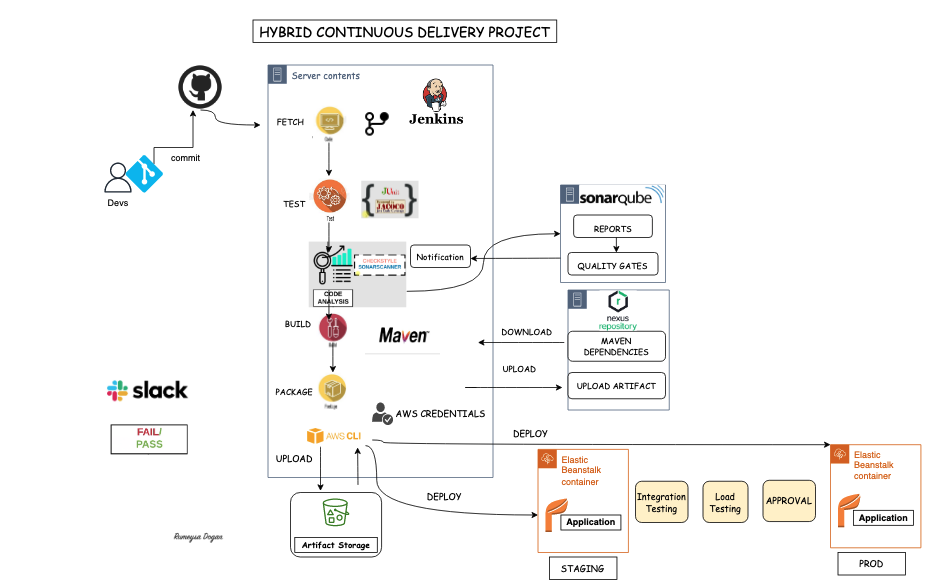

## Pre-requisities

* Project-7 Setup


### Step-1: Validate CI Pipeline in Jenkins

We have our CI pipeline ready in Jenkins server, we will run it to make sure it runs without any problem.

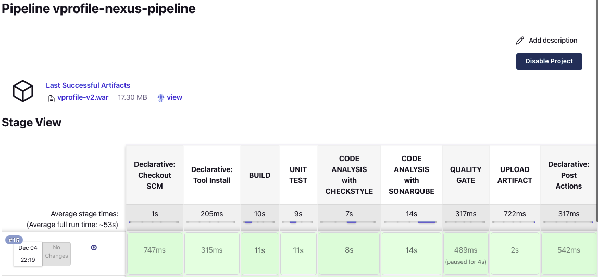

### Step-2: Setup S3, IAM and Beanstalk in AWS

#### Creating IAM user for Elastic Beanstalk

This user will be used with AWS CLI. It needs to access to S3 to download the artifact, it also need to access Benastalk environment to upload the latest artifact from S3 bucket. Download the csv credentials. 

```sh
Name: cicd-bean
Allow Programmatic Access
Policies:
* AmazonS3FullAccess
* AdministratorAccess-AWSElasticBeanstalk
```

#### Create Credentials in Jenkins for Beanstalk IAM user

Create a global credentials with below properties.
```sh
Kind: AWS Credentials
ID: awsbeancreds
Description: awsbeancreds
AccessKeyID
Secret Access Key
```

#### Create an S3 bucket for Beanstalk

Create an S3 bucket with a unique name, I will call it as `vprocicdbean-rd`

#### Create Beanstalk application

Create an application in Bealstalk with below properties.

```sh
Name: vpro-app
Platform: Tomcat
Custom configuration
##Capacity:
- Load Balanced
- Min: 2
- Max: 4
InstanceType: t2.micro
##  Rolling updates and deployments
- Policy: Rolling
- 50 %
```

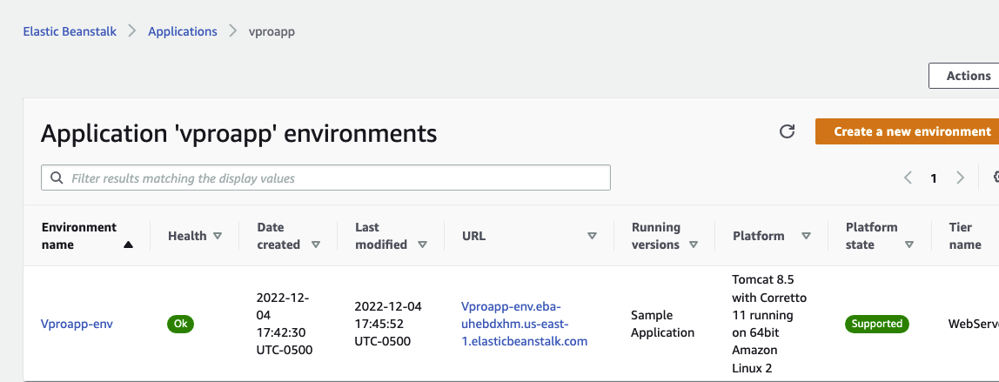

### Step-3: Pipeline Setup for Staging

#### Create Jenkinsfile in repository

Go to `vprofileciproject` repository in local. We will create a new branch and make updates in Jenkinsfile from ci-pipeline.
```sh
git checkout ci-jenkins
git checkout -b cicd-jenbean-stage
```

We will add few variables and a new stage to deploy Beanstalk environment using `awscli` commands.

```sh
## Variables to add ###
ARTIFACT_NAME = "vprofile-v${BUILD_ID}.war"
AWS_S3_BUCKET = 'vprocicdbean'
AWS_EB_APP_NAME = 'vproapp'
AWS_EB_ENVIRONMENT = 'Vproapp-env'
AWS_EB_APP_VERSION = "${BUILD_ID}"
### New stage to deploy beanstalk##
stage('Deploy to Stage Bean'){
          steps {
            withAWS(credentials: 'awsbeancreds', region: 'us-west-1') {
               sh 'aws s3 cp ./target/vprofile-v2.war s3://$AWS_S3_BUCKET/$ARTIFACT_NAME'
               sh 'aws elasticbeanstalk create-application-version --application-name $AWS_EB_APP_NAME --version-label $AWS_EB_APP_VERSION --source-bundle S3Bucket=$AWS_S3_BUCKET,S3Key=$ARTIFACT_NAME'
               sh 'aws elasticbeanstalk update-environment --application-name $AWS_EB_APP_NAME --environment-name $AWS_EB_ENVIRONMENT --version-label $AWS_EB_APP_VERSION'
            }
          }
        }
```
Once we are done with updates, commit/push to repository.

Before deployment, we need to change Health check path in Beanstalk application config settings. Our application is being stable at `/login` path.

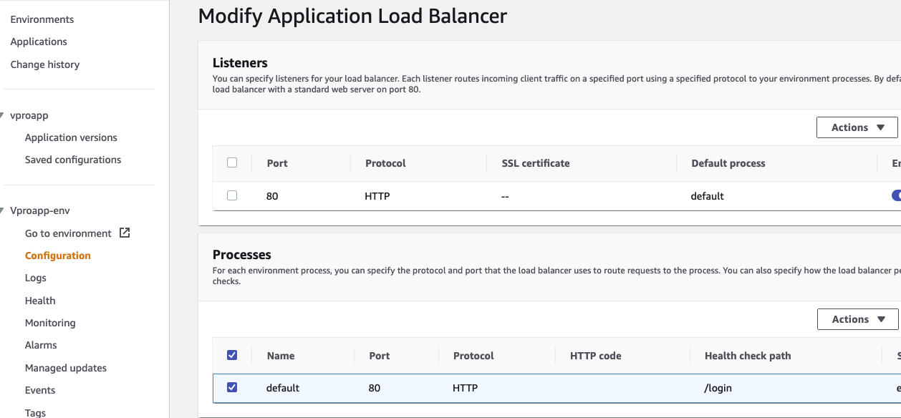

#### Create Pipeline in Jenkins

Create a pipeline with below properties.
```sh
Name: cicd-jenkins-bean-stage
Kind: pipeline
Pipeline from SCM
SSH GitHub URL
githublogin credentials
Branch: */cicd-jenbean-stage
```

Let's run this pipeline.

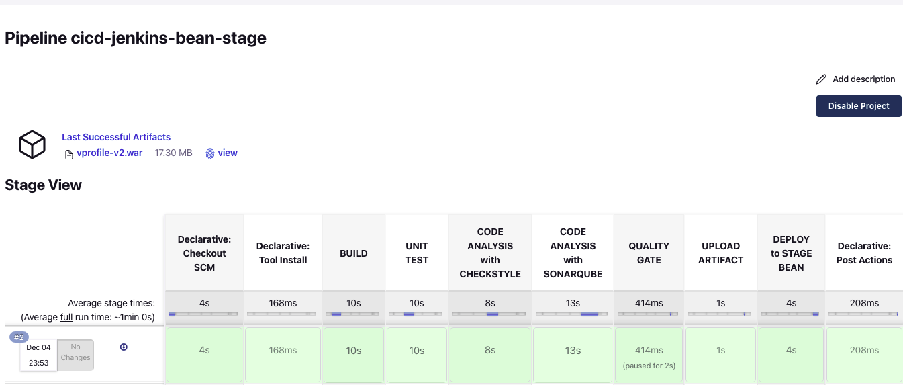

We can check S3 bucket for the artifacts and Beanstalk App version.

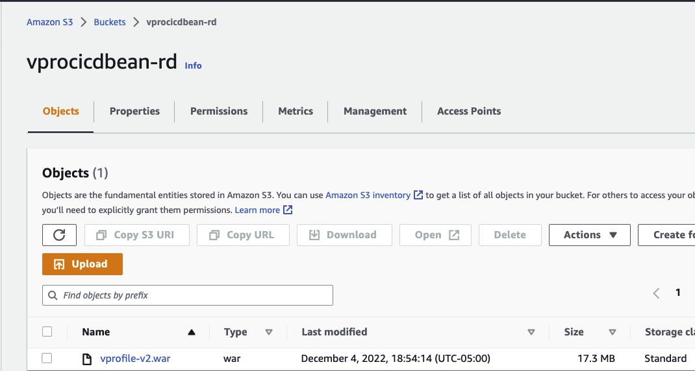

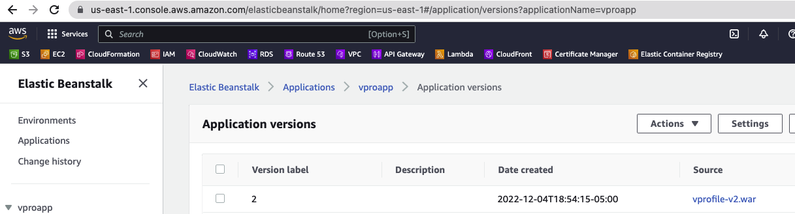

### Step-4: Pipeline Setup for Prod

#### Create Prod environment in Beanstalk

We will create a new environment for production in Beanstalk.

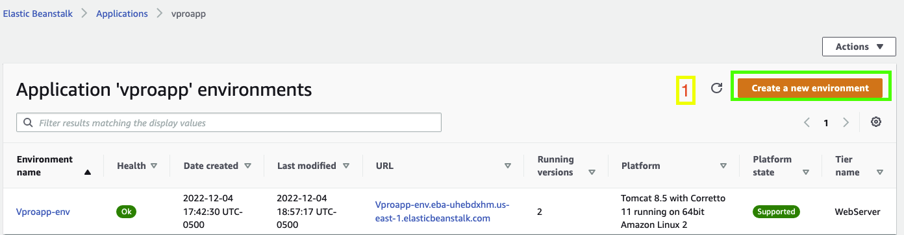

```sh
Webserver environment
Name: Vproapp-prod-env
Domain: Vproapp-prod-env
Platform: Tomcat 
Sample Application
Custom configuration
##Capacity:
- Load Balanced
- Min: 2
- Max: 4
InstanceType: t2.micro
##  Rolling updates and deployments
- Policy: Rolling
- 50 %
```

Once environment is stable, we will update Health check path to `/login` as we did in previous steps. Then apply our changes.

#### Create Jenkinsfile in repository

Go to `vprofileciproject` repository in local. We will create a new branch and make updates in Jenkinsfile from ci-pipeline.
```sh
git checkout -b cicd-jenbean-prod
```

We would like to get the artifact that is uploaded to beanstalk stage environment and deploy the same artifact to prod. We will add a login in Jenkinsfile to achieve the same.Below is the Jenkinsfile we will be using for Production deployment.

```sh
def buildNumber = Jenkins.instance.getItem('cicd-jenkins-bean-stage').lastSuccessfulBuild.number

def COLOR_MAP = [
    'SUCCESS' : 'good',
    'FAILURE' : 'danger'
]

pipeline {
    agent any
    tools {
        maven "MAVEN3"
        jdk "OracleJDK8"
    }

    environment {
        SNAP_REPO = 'vprofile-snapshot'
        NEXUS_USER = 'admin'
        NEXUS_PASS = 'admin'
        RELEASE_REPO = 'vprofile-release'
        CENTRAL_REPO = 'vpro-maven-central'
        NEXUSIP = '172.31.12.154'
        NEXUSPORT = '8081'
        NEXUS_GRP_REPO = 'vpro-maven-group'
        NEXUS_LOGIN = 'nexuslogin'
        SONARSERVER = 'sonarserver'
        SONARSCANNER = 'sonarscanner'
        ARTIFACT_NAME = "vprofile-v${buildNumber}.war"
        AWS_S3_BUCKET = 'vprocicdbean-rd'
        AWS_EB_APP_NAME = 'vproapp'
        AWS_EB_ENVIRONMENT = 'Vproapp-prod-env'
        AWS_EB_APP_VERSION = "${buildNumber}"
    }
    
    stages{
        stage('DEPLOY to Prod BEAN'){
                steps {
                    withAWS(credentials: 'awsbeancreds', region: 'us-east-1') {
                    sh 'aws elasticbeanstalk update-environment --application-name $AWS_EB_APP_NAME --environment-name $AWS_EB_ENVIRONMENT --version-label $AWS_EB_APP_VERSION'
                    }
                }
            }
   }
   
    post{
        always {
            echo 'Slack Notifications'
            slackSend channel: '#jenkinscicd',
                color: COLOR_MAP[currentBuild.currentResult],
                message: "*${currentBuild.currentResult}:* Job ${env.JOB_NAME} build ${env.BUILD_NUMBER} \n More info at: ${env.BUILD_URL}"
        }
    }
}
```

Commit/push the changes in GitHub.

#### Create Pipeline in Jenkins

Create a pipeline with below properties.
```sh
Name: cicd-jenkins-bean-prod
Kind: pipeline
Copy from: cicd-jenkins-bean-stage
branch: */cicd-jenbean-prod
```

Let's run the pipeline. Ok, it failed with below error message. Right click on blue error and Open in new tab we need to approve it.

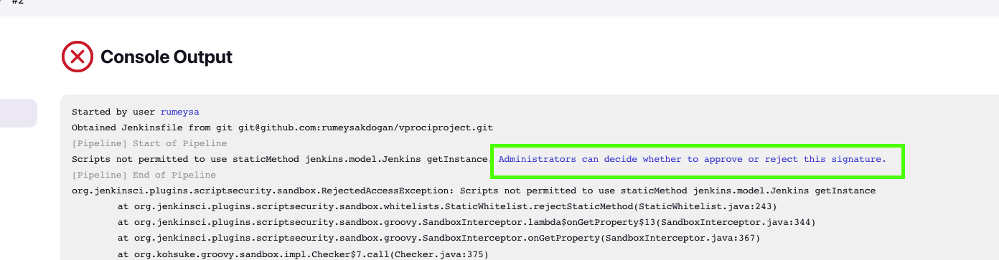

Since we are running this pipeline from another pipeline it asks this Approval. 


We need to Approve these few times, after Build Failure. Each time it is asking for different approval. This is only one time activity. At 5th time, pipeline run successfully.

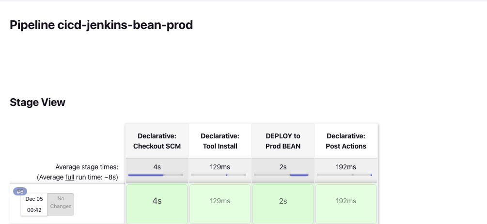

We can see that the same version of application from stage environment is deployed to Production environment now.


### Step-5: CICD Flow

Developers make code changes to staging environment. Once it is pushed to GitHub `CI/CD Stage pipeline` will be triggered. After approvals, staging branch will be merged to production branch. This will trigger `CI/CD Prod pipeline`. We will get notifications from `Slack`.

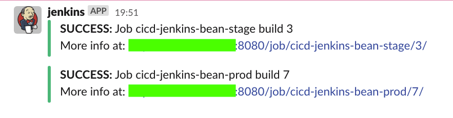

### Step-6:  Clean-up

Its time to delete resources we have craeted.