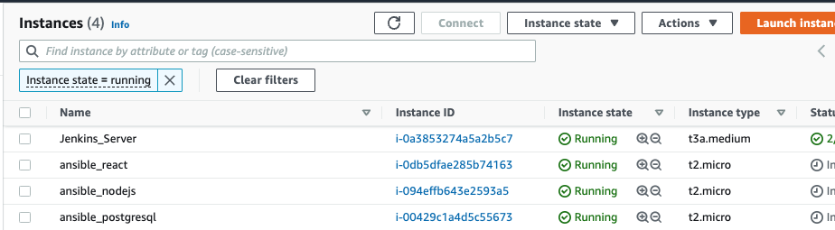
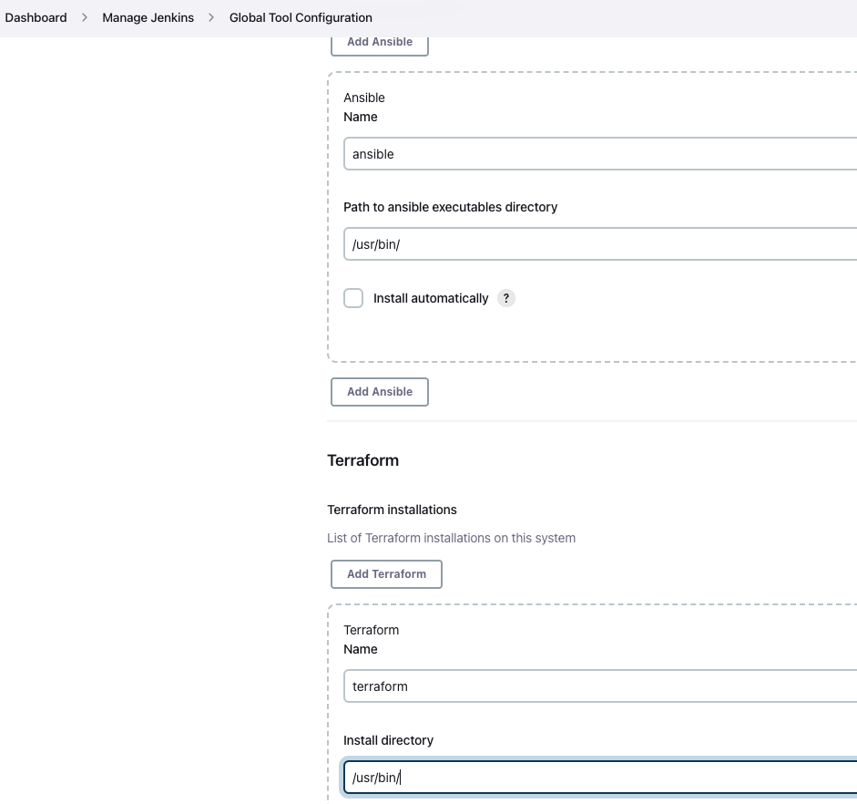
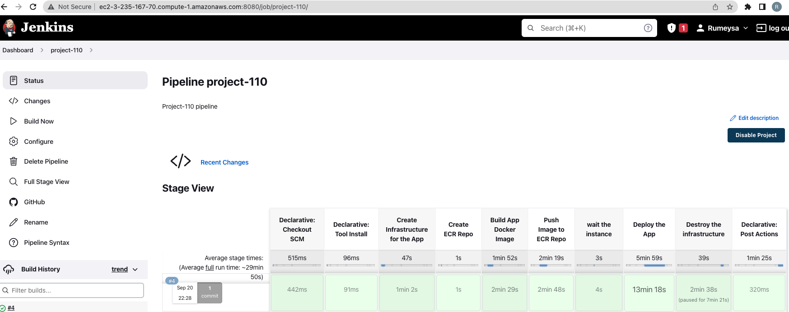

# Solution Steps

## Step 1: 

- Provision Jenkins server with terraform files given under jenkins_server.
- 
- Go to the `jenkins_server` folder and run terraform.

```bash
terraform init
terraform apply
```

### Description of Jenkins-server

```yml
- amazon linux 2 instance
- ami-008e1e7f1fcbe9b80
- security group: 
  - 22 for SSH
  - 8080 for Jenkins server

- jenkins server policy:
  - AmazonEC2ContainerRegistryFullAccess >>> to push docker images to AWS ECR
  - AmazonEC2FullAccess >>> to create managed nodes (postgresql, nodejs, react)
  - IAMFullAccess >>> to attach roles to managed nodes to pull images from AWS ECR
  
- user_data:
  - GIT >>> we run pipeline from github
  - JENKINS
  - DOCKER (install and configure) >>> we build our docker images in jenkins server nad push them to AWS ECR
  - AWS CLI >>> we run aws cli commands in pipeline (create and delete AWS ECR repo)
  - ANSIBLE >>> we install docker and run docker containers with ansible
  - BOTO3 >>> to use dynamic inventory 
  - TERRAFORM >>> we create manged nodes with terraform in pipeline

```
## Step 2:

- Create a private Github repository named as "todo-app".


## Step 3:

- Create a Personal Access Token for this private repository.
  


## Step 4:

- Clone your todo-app repository to your Jenkins server by using your TOKEN created at Step3.
```sh
git clone https://TOKEN@github.com/rumeysakdogan/todo-app.git
```
## Step 5 - Prepare the application folder.

- Go to the `todo-app` folder and create following folders.

```bash
cd todo-app && mkdir nodejs react postgresql
```

- Copy `server` folder to the `nodejs` folder.

- Copy `client` folder to the `react` folder.

- Copy `init.sql` file to the `postgresql` folder.

- Create a dockerfile for postgresql instance name `dockerfile-postgresql` in the `postgresql` folder.

```dockerfile
FROM postgres

COPY ./postgresql/init.sql /docker-entrypoint-initdb.d/

EXPOSE 5432
```

- Create a dockerfile for nodejs instance name `dockerfile-nodejs` in the `nodejs` folder.

```dockerfile
FROM node:14

# Create app directory
WORKDIR /usr/src/app


COPY ./nodejs/server/package*.json ./

RUN npm install
# If you are building your code for production
# RUN npm ci --only=production


# copy all files into the image
COPY ./nodejs/server/ .

EXPOSE 5000

CMD ["node","app.js"]
```

- Create a dockerfile for react instance name `dockerfile-react` in the `react` folder.

```dockerfile
FROM node:14

# Create app directory
WORKDIR /app


COPY ./react/client/package*.json ./

RUN yarn install

# copy all files into the image
COPY ./react/client/ .

EXPOSE 3000

CMD ["yarn", "run", "start"]
```

- Copy the `ansible.cfg` and `inventory_aws_ec2.yml` to the `todo-app` folder.

- Copy your pem key file to jenkins server by using scp.
```sh
scp -i "FirstKey.pem" FirstKey.pem ec2-user@<public_ip_of_jenkins_server>:/home/ec2-user
```
- Add below line to `ansible.cfg` file:
```sh
private_key_file=/home/ec2-user/FirstKey.pem
```
- Create a terraform confmain.tfig file name `main.tf` and create 3 Red Hat instances.

```go
terraform {
  required_providers {
    aws = {
      source  = "hashicorp/aws"
      version = "~> 4.0"
    }
  }
}

provider "aws" {
  region = "us-east-1"
}

variable "tags" {
  default = ["postgresql", "nodejs", "react"]
}

resource "aws_instance" "managed_nodes" {
  ami = "ami-0f095f89ae15be883"
  count = 3
  instance_type = "t2.micro"
  key_name = "FirstKey"
  vpc_security_group_ids = [aws_security_group.tf-sec-gr.id]
  iam_instance_profile = "jenkins-project-profile"
  tags = {
    Name = "ansible_${element(var.tags, count.index )}"
    stack = "ansible_project"
    environment = "development"
  }
}

resource "aws_security_group" "tf-sec-gr" {
  name = "project110-sec-gr"
  tags = {
    Name = "project110-sec-gr"
  }

  ingress {
    from_port   = 22
    protocol    = "tcp"
    to_port     = 22
    cidr_blocks = ["0.0.0.0/0"]
  }
  ingress {
    from_port   = 5000
    protocol    = "tcp"
    to_port     = 5000
    cidr_blocks = ["0.0.0.0/0"]
  }
  ingress {
    from_port   = 3000
    protocol    = "tcp"
    to_port     = 3000
    cidr_blocks = ["0.0.0.0/0"]
  }
  ingress {
    from_port   = 5432
    protocol    = "tcp"
    to_port     = 5432
    cidr_blocks = ["0.0.0.0/0"]
  }

  egress {
    from_port   = 0
    protocol    = -1
    to_port     = 0
    cidr_blocks = ["0.0.0.0/0"]
  }
}

output "react_ip" {
  value = "http://${aws_instance.managed_nodes[2].public_ip}:3000"
}

output "node_public_ip" {
  value = aws_instance.managed_nodes[1].public_ip

}

output "postgre_private_ip" {
  value = aws_instance.managed_nodes[0].private_ip

}
```

### main.tf

```yml
- we give the same role (jenkins project profile). normally we only need `AmazonEC2ContainerRegistryFullAccess`, but we created a role for jenkins server, so we used it here, too.

- we attach some tags to managed nodes for using dynamic inventory.
```

- Create a playbook name `docker_project.yml` and configure the instances.

```yml
- name: install docker and config
  hosts: _development
  become: true
  vars:
    aws_region: us-east-1
    ecr_registry: <AWS_Account_ID>.dkr.ecr.us-east-1.amazonaws.com
  tasks:
    - name: update all packages
      yum:
        name: '*'
        state: latest

    # we may need to uninstall any existing docker files from the centos repo first.
    - name: Remove docker if installed from CentOS repo
      yum:
        name: "{{ item }}"
        state: removed
      with_items:
        - docker
        - docker-client
        - docker-client-latest
        - docker-common
        - docker-latest
        - docker-latest-logrotate
        - docker-logrotate
        - docker-engine

    - name: Install yum utils
      yum:
        name: "{{ item }}"
        state: latest
      with_items:
        - yum-utils
        - device-mapper-persistent-data
        - lvm2
        - unzip

    - name: Add Docker repo
      get_url:
        url: https://download.docker.com/linux/centos/docker-ce.repo
        dest: /etc/yum.repos.d/docer-ce.repo

    - name: Install Docker
      package:
        name: docker-ce
        state: latest

    - name: Install pip
      package:
        name: python3-pip
        state: present
        update_cache: true

    - name: Install docker sdk
      pip:
        name: docker

    - name: Add user ec2-user to docker group
      user:
        name: ec2-user
        groups: docker
        append: yes

    - name: Start Docker service
      service:
        name: docker
        state: started
        enabled: yes

    - name: install aws cli
      get_url:
        url: https://awscli.amazonaws.com/awscli-exe-linux-x86_64.zip
        dest: /home/ec2-user/awscliv2.zip

    - name: unzip zip file
      unarchive:
        src: /home/ec2-user/awscliv2.zip
        dest: /home/ec2-user
        remote_src: True

    - name: run the awscli
      shell: ./aws/install

    - name: log in to AWS ec2-user
      shell: |
        export PATH=/usr/local/bin:$PATH
        source ~/.bash_profile
        aws ecr get-login-password --region {{ aws_region }} | docker login --username AWS --password-stdin {{ ecr_registry }}

- name: postgre database config
  hosts: _ansible_postgresql
  become: true
  vars:
    postgre_container: /home/ec2-user/postgresql
    container_name: rumeysa_postgre
    image_name: <AWS_Account_ID>.dkr.ecr.us-east-1.amazonaws.com/rumeysa-repo/todo-app:postgr
  tasks:
    - name: remove {{ container_name }} container and {{ image_name }} if exists
      shell: "docker ps -q --filter 'name={{ container_name }}' && docker stop {{ container_name }} && docker rm -fv {{ container_name }} && docker image rm -f {{ image_name }} || echo 'Not Found'"

    - name: Launch postgresql docker container
      docker_container:
        name: "{{ container_name }}"
        image: "{{ image_name }}"
        state: started
        ports:
          - "5432:5432"
        env:
          POSTGRES_PASSWORD: "Pp123456789"
        volumes:
          - /db-data:/var/lib/postgresql/data

- name: Nodejs Server configuration
  hosts: _ansible_nodejs
  become: true
  vars:
    container_path: /home/ec2-user/nodejs
    container_name: rumeysa_nodejs
    image_name: <AWS_Account_ID>.dkr.ecr.us-east-1.amazonaws.com/rumeysa-repo/todo-app:nodejs
  tasks:
    - name: remove {{ container_name }} container and {{ image_name }} if exists
      shell: "docker ps -q --filter 'name={{ container_name }}' && docker stop {{ container_name }} && docker rm -fv {{ container_name }} && docker image rm -f {{ image_name }} || echo 'Not Found'"

    - name: Launch postgresql docker container
      docker_container:
        name: "{{ container_name }}"
        image: "{{ image_name }}"
        state: started
        ports:
          - "5000:5000"

- name: React UI Server configuration
  hosts: _ansible_react
  become: true
  vars:
    container_path: /home/ec2-user/react
    container_name: rumeysa_react
    image_name: 046402772087.dkr.ecr.us-east-1.amazonaws.com/rumeysa-repo/todo-app:react
  tasks:
    - name: remove {{ container_name }} container and {{ image_name }} image if exists
      shell: "docker ps -q --filter 'name={{ container_name }}' && docker stop {{ container_name }} && docker rm -fv {{ container_name }} && docker image rm -f {{ image_name }} || echo 'Not Found'"

    - name: Launch react docker container
      docker_container:
        name: "{{ container_name }}"
        image: "{{ image_name }}"
        state: started
        ports:
          - "3000:3000"
```

### -------------- ###

### description of playbook:

```yml
- _development: all managed nodes
  - install and configure docker
  - install unzip to install AWS CLI
  - install AWS CLI to login AWS ECr with aws cli commands
  - install "device-mapper-persistent-data" and "lvm2" for device mapper
    note: Docker's devicemapper storage driver leverages the thin provisioning and snapshotting capabilities of this framework for image and container management. (https://docs.docker.com/storage/storagedriver/device-mapper-driver/)
- nodes:
  - firstly, remove old docker images and containers
  - run docker container 
    note: we pull docker images from aws ecr

```
## Step 6: Configure Jenkins server

- Connect to the jenkins server `http://<jenkins-server public ip>:8080`.

- Connect Jenkins server with SSH and take the initial password with the following commands:

```bash
ssh -i FirstKey.pem ec2-user@<jenkins server public ip>
sudo cat /var/lib/jenkins/secrets/initialAdminPassword
```

- Use initial password in `http://<jenkins-server public ip>:8080`

- configure jenkins server. (create user > install suggested plugins > start jenkins)

- Learn Ansible terraform's executable path from the instance. We use them in jenkins plugins.

```bash
which ansible         # output: /usr/bin/ansible
which terraform       # output: /usr/bin/terraform
```

- Go to the `http://<jenkins-server public ip>:8080`.

- Add the `Ansible` and `Terraform` plugins. (`Locale` for making language english)
  
  

- Follow these steps `manage jenkins - manage plugins - add ansible and terraform plugins (locale plugin if it is necessary) - global tool configuration`.

  - write `/usr/bin/` to plugins paths.

### adding credentials:

```yml
- Go to the `manage jenkins > manage credentials`
- Add github token to credentials to use github for pipeline.
- Define your pem file to credentials for ansible ssh connection.
```


## Step 7: Create a jenkinsfile for jenkins pipeline.

- Create a `Jenkinsfile` for the pipeline.

```go
pipeline {
    agent any
    tools {
        terraform 'terraform'
}
    environment {
        PATH=sh(script:"echo $PATH:/usr/local/bin", returnStdout:true).trim()
        AWS_REGION = "us-east-1"
        AWS_ACCOUNT_ID=sh(script:'export PATH="$PATH:/usr/local/bin" && aws sts get-caller-identity --query Account --output text', returnStdout:true).trim()
        ECR_REGISTRY="${AWS_ACCOUNT_ID}.dkr.ecr.${AWS_REGION}.amazonaws.com"
        APP_REPO_NAME = "rumeysa-repo/todo-app"
        APP_NAME = "todo"
        HOME_FOLDER = "/home/ec2-user"
        GIT_FOLDER = sh(script:'echo ${GIT_URL} | sed "s/.*\\///;s/.git$//"', returnStdout:true).trim()
    }

    stages {

        stage('Create Infrastructure for the App') {
            steps {
                echo 'Creating Infrastructure for the App on AWS Cloud'
                sh 'terraform init'
                sh 'terraform apply --auto-approve'
            }
        }

        stage('Create ECR Repo') {
            steps {
                echo 'Creating ECR Repo for App'
                sh """
                aws ecr create-repository \
                  --repository-name ${APP_REPO_NAME} \
                  --image-scanning-configuration scanOnPush=false \
                  --image-tag-mutability MUTABLE \
                  --region ${AWS_REGION}
                """
            }
        }

        stage('Build App Docker Image') {
            steps {
                echo 'Building App Image'
                script {
                    env.NODE_IP = sh(script: 'terraform output -raw node_public_ip', returnStdout:true).trim()
                    env.DB_HOST = sh(script: 'terraform output -raw postgre_private_ip', returnStdout:true).trim()
                }
                sh 'echo ${DB_HOST}'
                sh 'echo ${NODE_IP}'
                sh 'envsubst < node-env-template > ./nodejs/server/.env'
                sh 'cat ./nodejs/server/.env'
                sh 'envsubst < react-env-template > ./react/client/.env'
                sh 'cat ./react/client/.env'
                sh 'docker build --force-rm -t "$ECR_REGISTRY/$APP_REPO_NAME:postgr" -f ./postgresql/dockerfile-postgresql .'
                sh 'docker build --force-rm -t "$ECR_REGISTRY/$APP_REPO_NAME:nodejs" -f ./nodejs/dockerfile-nodejs .'
                sh 'docker build --force-rm -t "$ECR_REGISTRY/$APP_REPO_NAME:react" -f ./react/dockerfile-react .'
                sh 'docker image ls'
            }
        }

        stage('Push Image to ECR Repo') {
            steps {
                echo 'Pushing App Image to ECR Repo'
                sh 'aws ecr get-login-password --region ${AWS_REGION} | docker login --username AWS --password-stdin "$ECR_REGISTRY"'
                sh 'docker push "$ECR_REGISTRY/$APP_REPO_NAME:postgr"'
                sh 'docker push "$ECR_REGISTRY/$APP_REPO_NAME:nodejs"'
                sh 'docker push "$ECR_REGISTRY/$APP_REPO_NAME:react"'
            }
        }

        stage('wait the instance') {
            steps {
                script {
                    echo 'Waiting for the instance'
                    id = sh(script: 'aws ec2 describe-instances --filters Name=tag-value,Values=ansible_postgresql Name=instance-state-name,Values=running --query Reservations[*].Instances[*].[InstanceId] --output text',  returnStdout:true).trim()
                    sh 'aws ec2 wait instance-status-ok --instance-ids $id'
                }
            }
        }
// put the same ID you give to SSH credentials in place of credentialsId below
        stage('Deploy the App') {
            steps {
                echo 'Deploy the App'
                sh 'ls -l'
                sh 'ansible --version'
                sh 'ansible-inventory --graph'
                ansiblePlaybook credentialsId: 'rumeysa', disableHostKeyChecking: true, installation: 'ansible', inventory: 'inventory_aws_ec2.yml', playbook: 'docker_project.yml'
             }
        }

        // stage('Test the Infrastructure') {

        //      steps {
        //          echo "Testing if the Clarusway TODO app is ready or not, by checking Public Ip Address of react instance"
        //          script {
        //          while(true) {

        //          try {
        //             react_ip = sh(script: 'terraform output -raw react_ip')
        //             sh "curl -s --connect-timeout 60 $react_ip"
        //             echo "Successfully connected to Viz App."
        //             break
        //             }
        //          catch(Exception) {
        //             echo 'Could not connect Viz App'
        //             sleep(5)
        //              }
        //            }
        //          }
        //      }
        //  }

        stage('Destroy the infrastructure'){
            steps{
                timeout(time:5, unit:'DAYS'){
                    input message:'Approve terminate'
                }
                sh """
                docker image prune -af
                terraform destroy --auto-approve
                aws ecr delete-repository \
                  --repository-name ${APP_REPO_NAME} \
                  --region ${AWS_REGION} \
                  --force
                """
            }
        }

    }

    post {
        always {
            echo 'Deleting all local images'
            sh 'docker image prune -af'
        }
        failure {

            echo 'Delete the Image Repository on ECR due to the Failure'
            sh """
                aws ecr delete-repository \
                  --repository-name ${APP_REPO_NAME} \
                  --region ${AWS_REGION}\
                  --force
                """
            echo 'Deleting Terraform Stack due to the Failure'
                sh 'terraform destroy --auto-approve'
        }
    }
}

```
### description of jenkinsfile

```yml
- Firstly, we define environmental varables.
- stage1: Create Infrastructure for the App
  - create managed nodes
- stage2: Create ECR Repo
  - we create ecr repo to storage our docker images
- stage3: Build App Docker Image
  - we build docker images in jenkins server
  - we have to take postgresql private ip and nodejs public ip  before copying files to docker image. So we use "node-env-template" and "react-env-template" to take nodes ip's dynamically in the pipeline. we use "envsubst" command to edit ".env" files.
- stage4: Push Image to ECR Repo
  - login to aws ecr and push to docker images
- stage5: wait the instance
  - we wait managed nodes to complete configurations
- stage6: Deploy the App
  - run ansible playbook to install docker and run docker containers in the managed nodes.
  - we can use pipeline syntax to generate pipeline syntax. we have to define ansible metadatas.
- stage7: 'Destroy the infrastructure
  - After deploying application, this stage is used to destroy the infrastructure, docker images and ecr repo.

- post-stage: this stage is used to destroy the infrastructure, docker images and ecr repo if we fail in pipeline.
```
## Step 8: Run the pipeline.

- Select `new item` and `pipeline`, name `project110`.

- Define your github url to the jenkins.

- Push files to the github `todo-app` repo.

### push these files to the `todo-app` repo

```yml
├── Jenkinsfile
├── ansible.cfg
├── docker_project.yml
├── inventory_aws_ec2.yml
├── main.tf
├── node-env-template
├── nodejs
│   ├── dockerfile-nodejs
│   └── server
├── postgresql
│   ├── dockerfile-postgresql
│   └── init.sql
├── react
│   ├── client
│   └── dockerfile-react
└── react-env-template
```

- Next run the pipeline with selecting `Build Now`. 
  * if build fails due to ansible playbook inventory failure, run below command to download botocore in jenkins server control node. And run command to see if ping gets successful  `ansible all -m ping --private-key <path_to_your_key> -u ec2-user`
  ```sh
  sudo yum install python-boto3
  ```
  


## Step 9: Check the applications

- First check React app running on 3000.


- Second check nodejs app running on 5000.
  


* ansible-jenkins : https://youtu.be/PRpEbFZi7nI