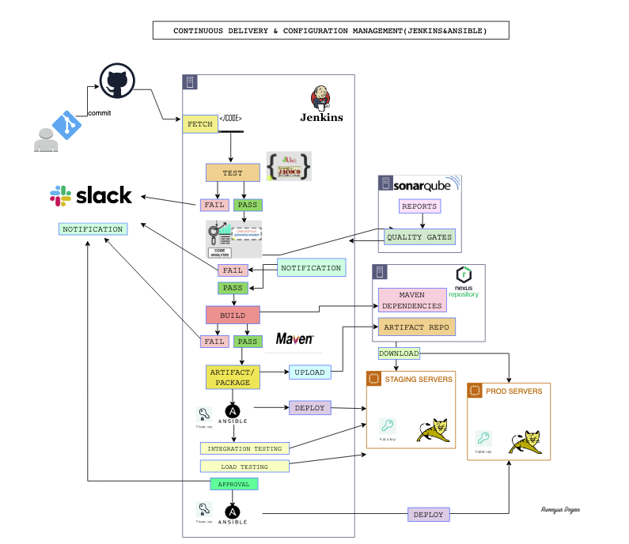
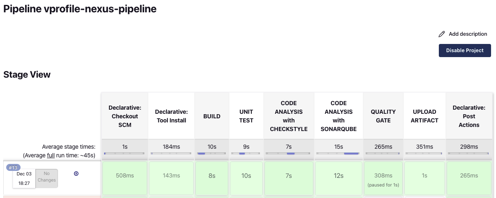
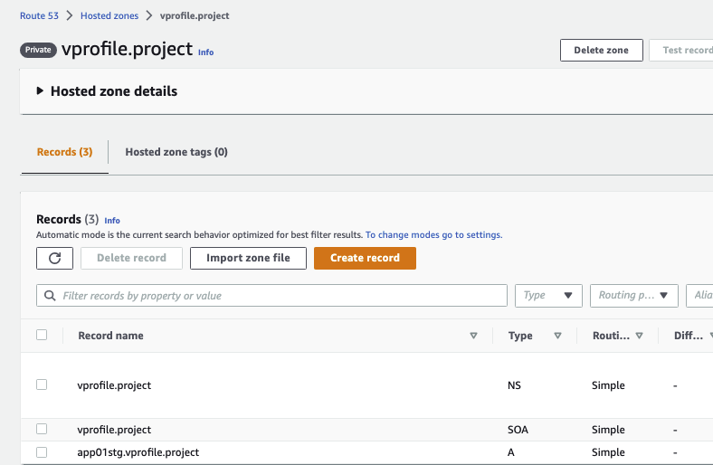
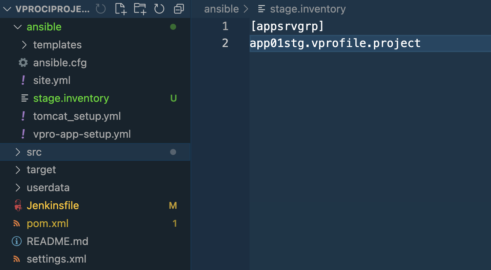
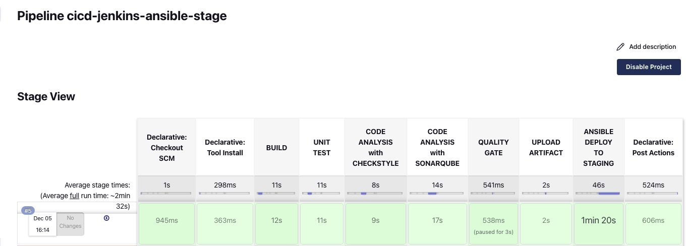
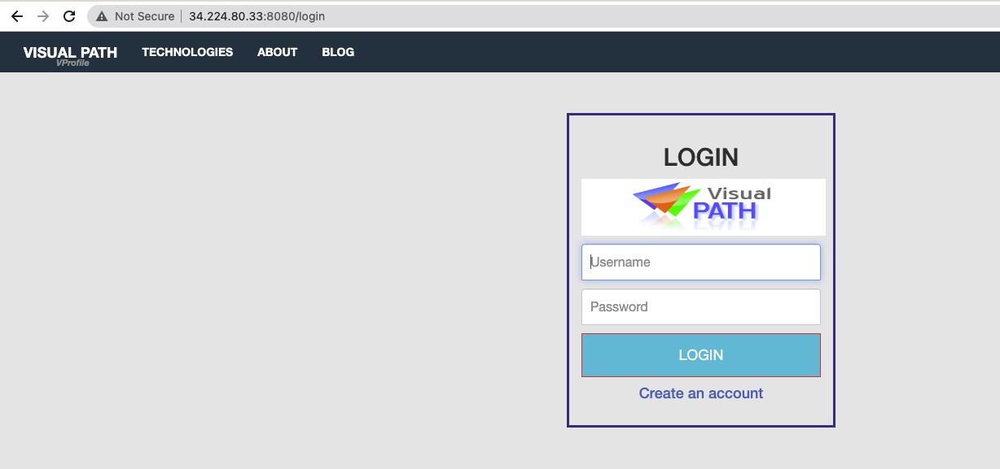
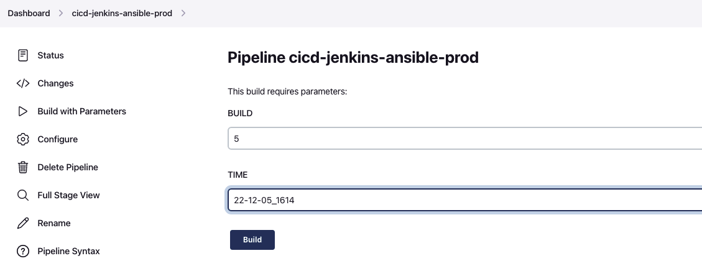
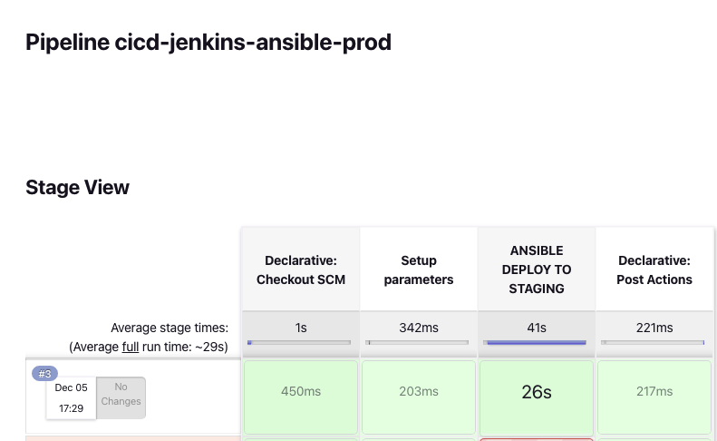
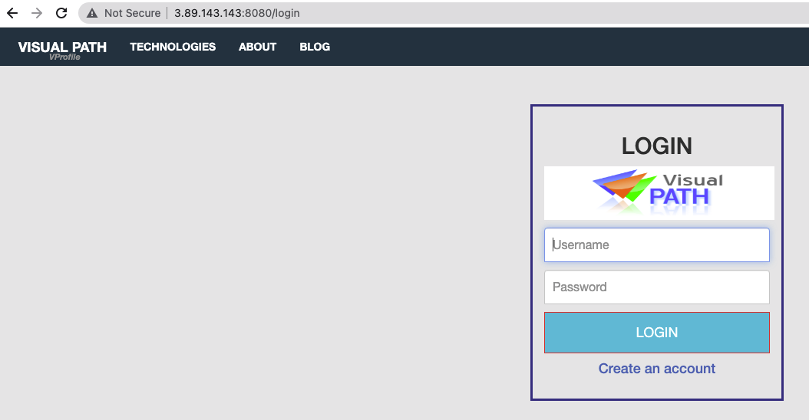

# Project-11: Continuous Delivery & Configuration Management (Jenkins&Ansible)

[*Project Source*](https://www.udemy.com/course/devopsprojects/?src=sac&kw=devops+projects)



## Pre-Requisities:

* Jenkins server from Project-5
* Nexus Server from Project-5
* SonarQube server from Project-5
* AWS Account
* Git
* GitHub Account
* Slack

### Step-1: Continuous Integration & Webhook

IMPORTANT: This project is continuation of Project-5. All setup is needed from Project-5 to be able to start to this project. Tokens, credentials, github webhook and sonarqube webhook may need to be updated before run the job.

We need to update `Jenkins URL` in `vprofileciproject` GitHub Webhook.

Once everything is in place, we will run our `ci-job` in Jenkins.



### Step-2: Prepare App-Server Staging

#### Launch App Staging Server

We will launch an EC2 instance with below details.
```sh
Name: app01-staging
AMI: Ubuntu 18.04
InstanceType: t2.micro
Keypair: Create a new .pem keypair
SecGrp: 
* Allow SSH on port 22 from MyIP ((To be able to connect to server)
* Allow Custom TCP on port 8080 from MyIP (To be able to check app from browser)
* Allow SSH from Jenkins-SG (Ansible will SSH into this server to run the playbook)
```

#### Create Route53 DNS record for App-staging

We will create a Private Hosted zone to be used in the project.
```sh
Name: vprofile.project
Private Zone
Region: us-east-1
VPC: default-vpc
```

Once our Hosted Zone is created we need to create an `A Record` by using `private_ip_of_app_server`.



#### Add private SSH key to Jenkins credentials 

Go to Jenkins `Manage Jenkins` ->  `Credentials` -> `global`. Ansible will use this credential to SSH into App server.
```sh
Type SSH login with private key
ID: applogin
description: applogin
user: ubuntu
Private Key: copy the content from app-key.pem
```

### Step-3: Ansible in Jenkins

We need to install Ansible in Jenkins server, then add Ansible plugin to Jenkins. We will get Ansible installation steps for Ubuntu from official documentation: [Ansible Installation steps for Ubuntu](https://docs.ansible.com/ansible/latest/installation_guide/installation_distros.html)

```sh
ssh -i keyname.pem ubuntu@<public_ip_of_server>
sudo -i
apt update
apt install software-properties-common
add-apt-repository --yes --update ppa:ansible/ansible
apt install ansible -y
ansible --version
```

Go to Jenkins dasboard, then `Manage Jenkins` -> `Manage Plugins` -> Available, search for `Ansible`.
```
Ansible
```

### Step-4: Prepare Source Code

Go to your local repository for `vprofileciproject`.This is a private repository we created in Project-5. We will create a new branch from`ci-jenkins` branch and call it as `cicd-jenkins-ansible`.

```sh
git checkout ci-jenkins
git checkout -b cicd-jenkins-ansible
```

We will add code from `jenkins-ansible-code` branch of `https://github.com/rumeysakdogan/vprofileproject-all.git` repository. Download zip from this branch.We will extract and copy `ansible` directory under our local `vprofileciproject` directory when we are in `cicd-jenkins-ansible` branch.

```sh
git add .
git commit -m "adding ansible code"
git push origin cicd-jenkins-ansible
```

### Step-5: Tomcat Playbook

In this step, we prepare our playbooks to deploy our artifact to Tomcat server.
Under `ansible/` directory we have `templates` folder which have files to setup systemd file for Tomcat in different `OS`.

Then we use those in our `tomcat_setup.yml` playbook to setup our Tomcat server, After setup is complete, Ansible will run `vpro-app-setup.yml` to deploy our application.

### Step-6: Jenkinsfile & Inventory

We uploaded `ansible/` directory with files in our `vprofileciproject` repository. Now we will update our Jenkinsfile to use those playbooks.

#### Prepare Inventory file

In our playbooks we have use below values. Now we will create an inventory file to define those servers.
```sh
  hosts: appsrvgrp
```

In `vprofileciproject` repository, under `ansible` directory, we will create `stage.inventory` file. Instead of IP address, we will use the DNS record we created in Route53 like below.



Before updating our `Jenkinsfile`, we need to add another credential to Jenkins for `nexus password`.
```
Type: Secret text
Secret: <pass your nexus password>
ID: nexuspass
description nexuspass
```

We create a `Jenkinsfile` for this job and push it to `vprofileciproject` repository.

We need to go to AWS console and add a `Inbound` rule to `Nexus ` server.
```sh
Allow on port 8081 from app-SG (since app server will download the artifact from Nexus)
```

Create a pipeline in Jenkins, call it as `cicd-jenkins-ansible-stage`.
```sh
Build Trigger: GitSCM pollong
Pipeline from: SCM
Git
URL: SSH url of vprofileci project 
Credentials: githublogin
Branch: cicd-jenkins-ansible
```

We need to go to Jenkins, `Manage Jenkins` -> `Configure System`. Here under Build Timestap we need to give format as `yy-MM-dd_HHmm`. Save it.

Now we can trigger our pipeline.



We can also check from browser if application working properly. 



### Step-6: Prepare App-Server for Prod

In this project, we are deploying only for one instance. But we can deploy application to many servers as well just by adding the server names to under `appsrvgrp` in inventory file we created as below:
```sh
[appsrvgrp]
app01stg.vprofile.project
```

#### Launch App Server for Prod

We will launch an EC2 instance with below details.
```sh
Name: app01-staging
AMI: Ubuntu 18.04
InstanceType: t2.micro
Keypair: Create a new .pem keypair for prod
SecGrp: app-SG
```

#### Create Route53 DNS record for App-prod

Once our Hosted Zone is created we will create an `A Record` by using `private_ip_of_app_prod_server` in `vprofile.project` Private Hosted Zone.

#### Add private SSH key to Jenkins credentials 

Go to Jenkins `Manage Jenkins` ->  `Credentials` -> `global`. Ansible will use this credential to SSH into App server.
```sh
Type SSH login with private key
ID: applogin-prod
description: applogin-prod
user: ubuntu
Private Key: copy the content from app-key-prod.pem
```

### Step-7: Jenkinsfile for Prod

We will go to our local repository and create a new branch like below. Then I will open it in VS Code.
```sh
git checkout cicd-jenkins-ansible
git checkout -b cicd-jenkins-ansible-prod
code .
```

First I renamed the inventory as `prod.inventory` and add DNS record for prod.
```sh
[appsrvgrp]
app01prd.vprofile.project
```

Then I create a new Jenkinsfile as below. We remove many stages in this file, since we will use an artifact which is already deployed to stage env and well-tested there before prod deployment. Below is the new Jenkinsfile content:
```sh
def COLOR_MAP = [
    'SUCCESS' : 'good',
    'FAILURE' : 'danger'
]

pipeline {
    agent any

    environment {
        NEXUSPASS = credentials('nexuspass')
    }

    stages {

         stage('Setup parameters') {
            steps {
                script { 
                    properties([
                        parameters([
                            string(
                                defaultValue: '', 
                                name: 'BUILD', 
                            ),
							              string(
                                defaultValue: '', 
                                name: 'TIME', 
                            )
                        ])
                    ])
                }
            }
		       }

        stage('ANSIBLE DEPLOY TO STAGING'){
            steps {
                 ansiblePlaybook([ 
                 inventory: 'ansible/prod.inventory',
                 playbook: 'ansible/site.yml',
                 installation: 'ansible',
                 colorized: true,
                 credentialsId: 'applogin-prod',
                 disableHostKeyChecking: true,
                 extraVars: [
                     USER: "admin",
                     PASS: "${NEXUSPASS}",
                     nexusip: "172.31.12.154",
                     reponame: "vprofile-release",
                     groupid: "QA", 
                     time: "${env.TIME}",
                     build: "${env.BUILD}",
                     artifactid: "vproapp",
                     vprofile_version: "vproapp-${env.BUILD}-${env.TIME}.war"
                 ]
               ]) 
            }
        }

    }
    post{
        always {
            echo 'Slack Notifications'
            slackSend channel: '#jenkinscicd',
                color: COLOR_MAP[currentBuild.currentResult],
                message: "*${currentBuild.currentResult}:* Job ${env.JOB_NAME} build ${env.BUILD_NUMBER} \n More info at: ${env.BUILD_URL}"
        }
    }
}
```

Create a new pipeline in Jenkins like below and save it.
```sh
Name: cicd-jenkins-ansible-prod
Kind: Pipeline
Copy from: cicd-jenkins-ansible-stage
### We only need to update branch in this setup ###
Branch: cicd-jenkins-ansible-prod
```

Refresh the page to see `Build with Parameters` option. You may need to `Build Now` and `Cancel` if it does not show.

We setup the pipeline with user input, we need to specify exactly which Build artifact should be deployed to Prod from Nexus.

We get the exact artifact from Nexus with `Build #` and `Time`.


We enter them in Jenkins before click `Build`.



Pipeline is successfully completed.



We can also verify from browser that our application successfully deployed to prod server.


