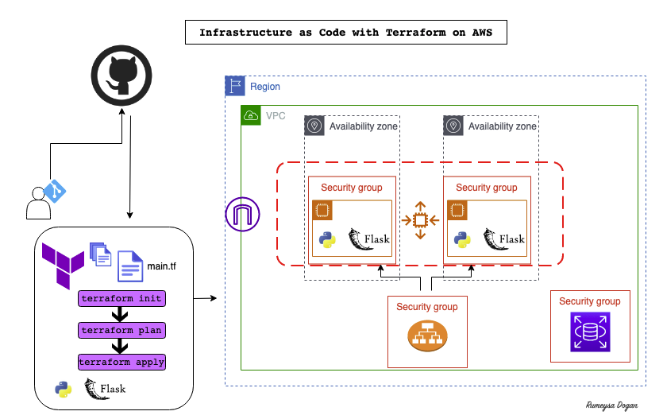
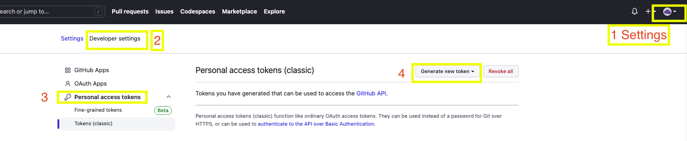
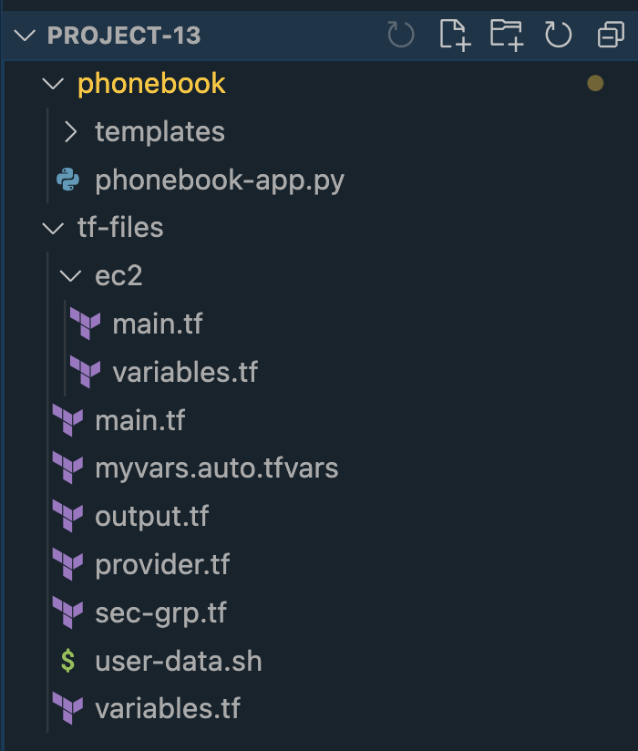
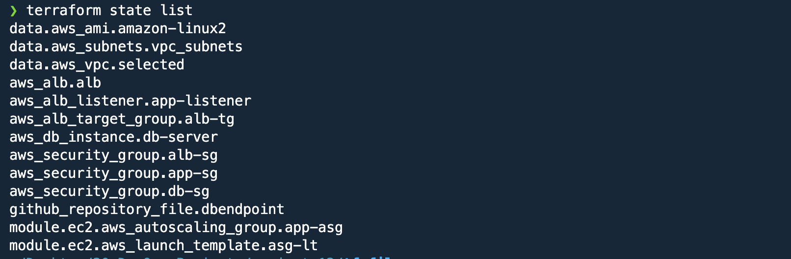
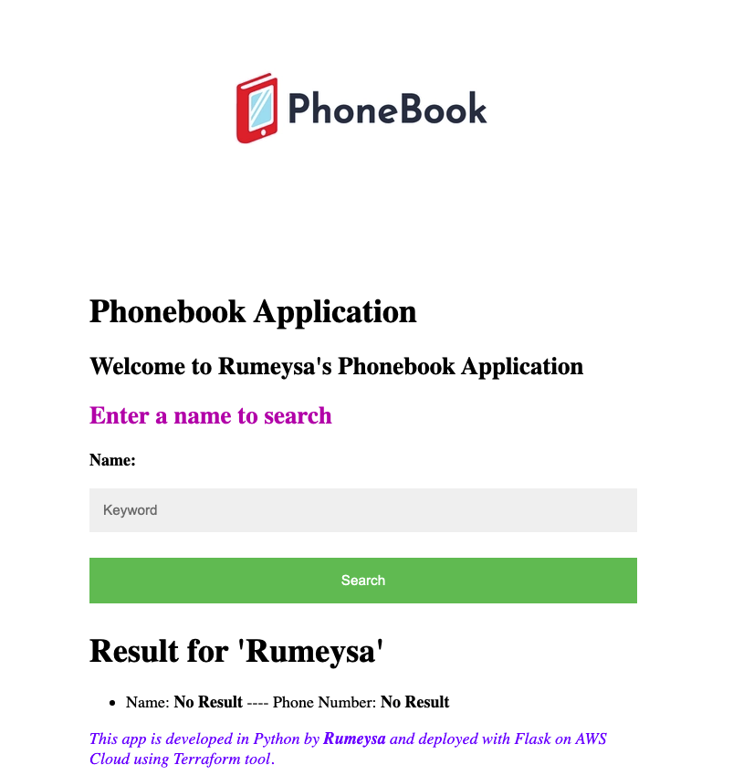

# Project-13: Infrastructure as Code with Terraform in AWS



## Pre-requisites:

* AWS Account
* Terraform installed on your local system
* AWS CLI installed and configured on your local system
  
_Note: If you don't want to install Terraform on your local, you can spin up an EC2 instance and create an IAM role for the EC2 with necessary permisions._ 

### Step-1: Setup Local & Remote Repository

We will create a private GitHub repository and name it as `phonebook` with the content given under `application-files`.

Create a folder in your local name as `project-13`. Clone the repository you created under this directory. We will create empty terraform files under `project-13` directory by using below command:
```sh
mkdir tf-files && cd tf-files && touch main.tf output.tf provider.tf sec-grp.tf user-data.sh
```

### Step-2: Create Terraform files

#### providers.tf && variables files

We will use code snippets of providers we will need for this project from official [terraform documentation](https://registry.terraform.io/browse/providers).

First we need `AWS` provider to create an environment to deploy our application in cloud. We need to configure `region` and user credentials for the aws provider. I will create `variables.tf` file to store my variable names and `myvars.auto.tfvars` to pass my variable values.

We need to configure `aws credentials`. For this you can run `aws configure` command and provide your `Access Keys ID` and `Secret Access Key`.

We also need `GitHub` provider to be able to fetch the code from our GitHub repository with Terraform. As security credentials for GitHub, we will create a TOKEN and provide it in github provider block. 



Below is the content for our `providers.tf`:
```sh
terraform {
  required_providers {
    aws = {
      source = "hashicorp/aws"
      version = "4.45.0"
    }
     github = {
      source = "integrations/github"
      version = "5.11.0"
    }
  }
}

provider "github" {
  token = var.token
}

provider "aws" {
  region = var.region
}
```

#### myvars.auto.tfvars file

We will create `myvars.auto.tfvars` file to provide values to our variables.
```sh
region = "us-east-1"
token = "XXXXXXXXXXXXXXXXXXXXXXXXX"
db_username = "admin"  # username used in phonebook-app.py file as MYSQL_DATABASE_USER 
db_password = "Oliver_1" # password used in phonebook-app.py file as MYSQL_DATABASE_PASSWORD 
database_name = "phonebook" # db_name used in phonebook-app.py file as MYSQL_DATABASE_DB
db_instance_class = "db.t2.micro"
load_balancer_type = "application"
repo_name = "phonebook" # GitHub repository name we created
```

#### sec-grp.tf file

For this project we need to create 3 different security group.
1. App-SG (Allow HTTP on port 80 from ALB-SG we can also allow SSH on port 22 to be able to connect server)
2. RDS-SG (Allow access on port 3306 from App-SG)
3. ALB-SG (Allow HTTP on port 80 from App-SG )

#### ec2 module

I will create a module for EC2 containing ASG and LT which will have its own variables file.

#### main.tf file

Main file to have modules and other resources to be created is specified in it. 

#### output.tf file

This file will create website url as an output, it can be reached from terminal to check the application form browser.

All the terraform files are located under `tf-files` directory. 

### Step-3: Update user-data.sh file

We will bootstrap our instances with user-data script to prepare to run the application. We need to install dependencies for our application to run first. Then we will clone application repository to server by using GitHub TOKEN we have created.

```sh
#!/bin/bash
yum update -y
yum install python3 -y
pip3 install flask
pip3 install flask_mysql
yum install git -y
TOKEN="xxxxxxxxxxxxxxxxxxxxxxxxx"
cd /home/ec2-user && git clone https://$TOKEN@github.com/<your_github_account>/phonebook.git
python3 /home/ec2-user/phonebook/phonebook-app.py
```

### Step-4: Run Terraform commands

Now our tf-files are ready. Our local setup should look like below. We have created a directory called `project-13`. Then we have cloned our `phonebook` application to same directory and we created our tf files.




Go to `tf-files` directory, and first run below command to initialize the terraform providers.
```sh
terraform init
```

Then we can run below command to validate our terraform files.
```sh
terraform validate
```

We can also reformat our terraform files with below command:
```sh
terraform fmt
```

Next we can run `terraform plan` to see the resources to be created. Once we are ready to apply, run below command:
```sh
terraform apply -auto-approve
```

Our resources are created.



Now we can validate the application from browser by using `website_url` output value.



This is a simple Phonebook application. Below are the functionality of resources:
```sh
<url>/ : is used to search contact names
<url>/add : is used to add new contact
<url>/update: is used to update an existing contact
<url>/delete: is used to delete an existing contact
```

### Step-5: Clean-up

We can run `terraform destroy` command to delete all resources created via Terraform.