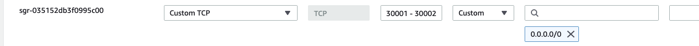
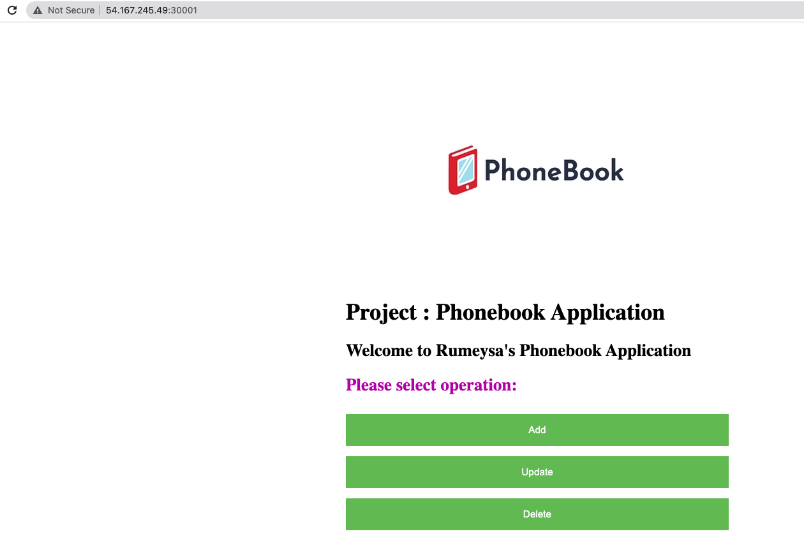

# Project-15: Deploying MS Architecture with Kubernetes and Terraform


## Pre-requisites

* AWS Account
* Terraform installed locally (you can also create an Ec2 instance and install terraform onto ec2) or use CFN template
* DockerHub account
  
### Step-1: Create K8s cluster with Terraform or CloudFormation

#### With Terraform

We will create a 1 Master Node & 1 Worker Node K8s cluster with Terraform files given under `terraform-files-to-create-K8s-cluster` directory. While we are inside of this directory, we will run below commands:
```sh
terraform init
terraform validate
terraform plan
terraform apply
```

#### With Cloudformation

If we dont want to install Terraform, we can create K8s cluster using cfn template given under `cfn-template-to-create-K8s-cluster`. We need to go to AWS Console and upload this file to create our stack. It can be also done with awscli command.

### Step-2: Write Dockerfile for WebServer

Go to `image_for_web_server` directory and create a Dockerfile with below content.
```sh
FROM python:alpine
COPY . /app
WORKDIR /app
RUN pip install -r requirements.txt
EXPOSE 80
CMD python app.py
```

### Step-3: Write Dockerfile for ResultServer

Go to `image_for_web_server` directory and create a Dockerfile with below content.
```sh
FROM python:alpine
COPY . /app
WORKDIR /app
RUN pip install -r requirements.txt
EXPOSE 80
CMD python app.py
```

### Step-4: Create Docker images and push to DockerHub

#### Create Image
SSH into your K8s master node. Move the `image_for_result_server` and `image_for_web_server` folders to master node. (You can use VSCode remote SSH extension and drag/drop the files or create repo with those files and clone it )

Go to `image_for_web_server` directory, run below command
```bash
docker build -t <your_dockerhub_account_name>/phonebook-webserver .
``` 

Create Docker image from Dockerfile under result_server/create_image/ directory with below command
```bash
docker build -t <your_dockerhub_account_name>/phonebook-resultserver .
``` 


#### Push images

First login to your dockerHub account
```bash
docker login
Username:
Password:
```

Then push your images to DockerHub
```bash
docker push <your_dockerhub_account_name>/phonebook-webserver
docker push <your_dockerhub_account_name>/phonebook-resultserver
``` 


### Step-5: Change image names 

Go to `resultserver_deployment.yml` change image name to you have pushed to DockerHub
```sh
 spec:
      containers:
        - name: result-app
          image: rumeysakdogan/phonebook-resultserver 
```

Go to `webserver_deployment.yml` change image name to you have pushed to DockerHub
```sh
 spec:
      containers:
        - name: result-app
          image: rumeysakdogan/phonebook-webserver 
```

### Step-6: Create secret/configMap

We will create a secret manifest to store DB_passwords. Before we create Secret we need to encode passwords by using base64. 

I will use Clarusway_1 as my `mysql-admin-password` and `R1234r` `mysql-root-password`. So I need to encode it with below command, and use it in secret file.
```sh
echo -n 'CLarusway_1' | base64
> Q2xhcnVzd2F5XzE=
echo -n 'R1234r' | base64
> UjEyMzRy
```

We can also decode the secrets with below command:
```sh
echo -n 'UjEyMzRy' | base64 --decode 
echo -n 'Q2xhcnVzd2F5XzE=' | base64
```

Go to `kubernetes-manifests/secrets_configMap` directory, and create secret and configmap:
```sh
kubectl apply -f mysql_secret.yaml
kubectl apply -f database_configmap.yaml
kubectl apply -f servers_configmap.yaml
```

### Step-6: Create my_sql database

Go to `kubernetes-manifests/mysql_deployment` directory,and create manifests with below command:
```sh
kubectl apply -f . 
```

### Step-7: Create webserver

Go to `kubernetes-manifests/mysql_deployment` directory,and create manifests with below command:
```sh
kubectl apply -f . 
```
Now we can see our deployments, services, pods and replicasets with `kubectl get all` command:


### Step-8: Add Nodeports to security group of Worker Node

Resultserver is running on NodePort: 30002
Webserver is running on NodePort: 30001

We will add these ports to SecGrp of Worker Node.



### Step-9: Check your application is up and running

Check your application from browser with below urls:

* Webserver: <worker_node_public_ip>:30001



* Resultserver: <worker_node_public_ip>:30002


