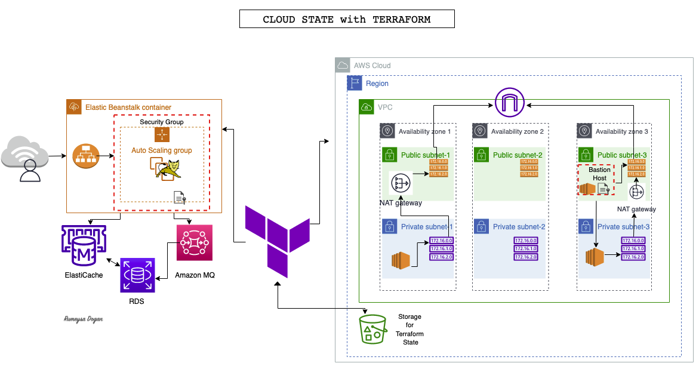
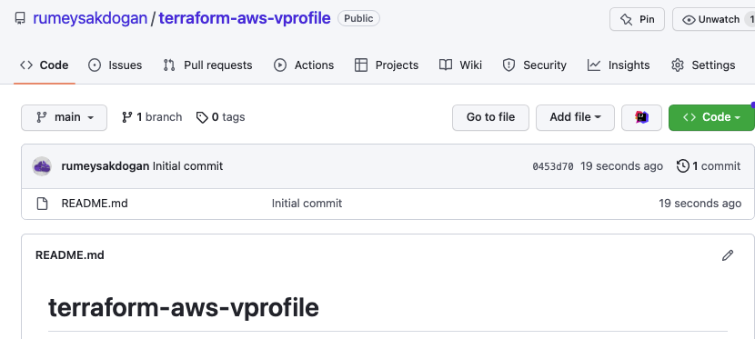
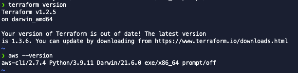
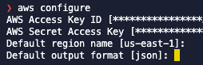
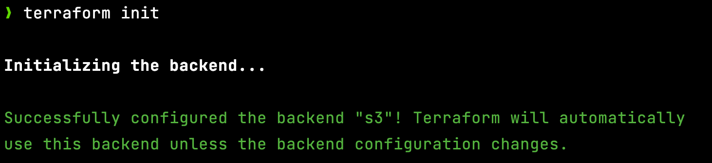
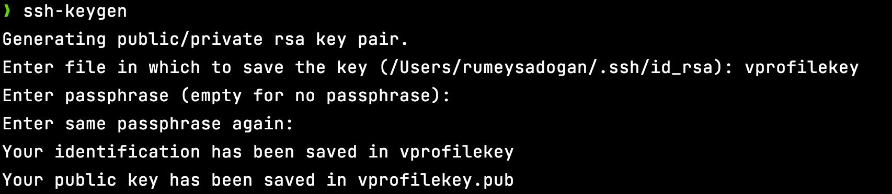
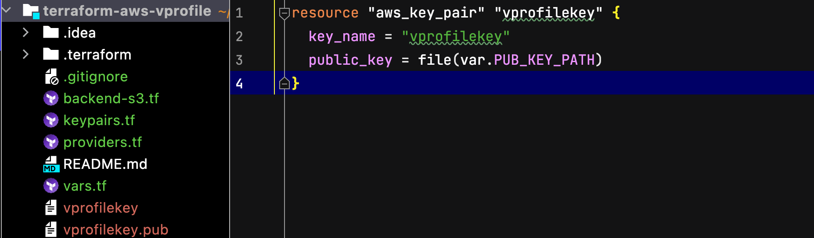
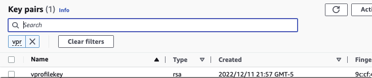
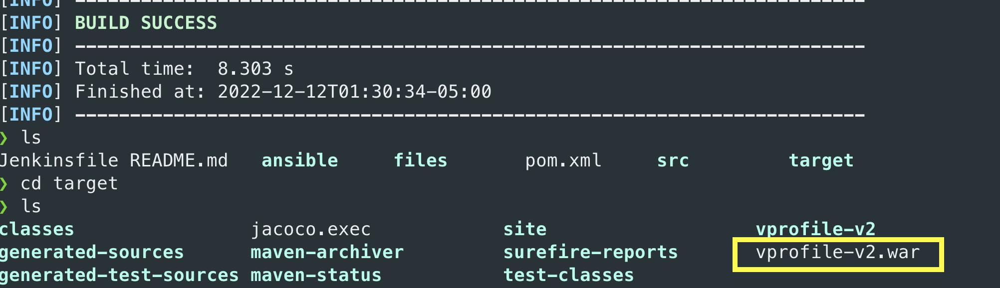
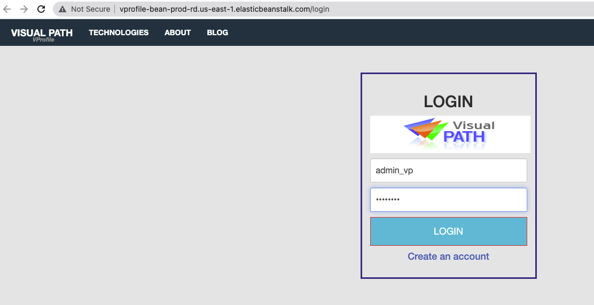

# Project-16: Cloud State with Terraform

[*Project Source*](https://www.udemy.com/course/devopsprojects/?src=sac&kw=devops+projects)



## Pre-requisites

* AWS Account
* GitHub account
* Terraform, Maven, JDK installed locally
* Any IDE (VS Code, IntelliJ, etc)

### Step-1: Create a repository in GitHub

We will create a repo in GitHub and name it as `terraform-aws-vprofile`.
You can make it private not to expose any Access keys you are using, since my AWS credentials are configured with awscli, I will create thsi repo as public.



### Step-2: Clone the repo to your local

We will clone the repository to the IDE that we will be using. I will be using IntelliJ for this project.

### Step-3: Terraform Setup

We need to install Terraform and awscli locally for this project.
You can follow documentation to do so.

[Install Terraform](https://developer.hashicorp.com/terraform/tutorials/aws-get-started/install-cli)
[Install AWSCLI](https://docs.aws.amazon.com/cli/latest/userguide/getting-started-install.html)

Once both are installed, check their version from terminal/powershell.



You need to create an IAM user with Programmatic Access keys. Download credentials. configure aws from cli:



### Step-4: S3 for Backend

First we will create an s3 bucket to store the state in AWS. I will create bucket with awscli command:
```sh
aws s3 mb s3://terra-state-vprofile-rd --region=us-east-1
aws s3 ls
```

Create `backend-s3.tf` file under `terraform-aws-vprofile` repo with below content:
```sh
terraform {
 backend "s3" {
 bucket = "terra-state-vprofile-rd" # replace with your s3 bucketname
 key = "terraform"
 region = "us-east-1"
 }
}
```

Go to project directory and run `terraform init` to initialize backend.



### Step-5: Variables and Providers

We will create a HA infrastructure for our vprofile project. We will create a VPC with 3 Public subnets and 3 Private subnets. We will create Elasticache, ActiveMQ and RDS-MySQL services for our application. To be able to create a reusable code, we will use variables in our Terraform code.

Create `vars.tf` file and `providers.tf` file as in given under `terraform-files` directory.

### Step-6: KeyPairs

We will create an SSH key with name of `vprofilekey` as we mentioned in `vars.tf` file. Go to `terraform-aws-vprofile` directory, run below command:



Now we can create `keypairs.tf` file with below content. We will use `file` function to get the content from path instead of copy-pasting whole content.



We can commit/push files  to GitHub except private/public key files.

Run below commands from local:
```sh
terraform init
terraform validate
terraform fmt
terraform plan
terraform apply
```

Our first resource keypair is created with terraform.



### Step-7: VPC Module & Setup

One easier way to create resources with terraform is using modules. we can find modules in terraform registry. We will use official [VPC module](https://registry.terraform.io/modules/terraform-aws-modules/vpc/aws/latest) from AWS.

Create `vpc.tf` file similar to given file under `terraform-files` directory.

We will commit/push this file to remote repo.

Since we added a new module, first we need to run:
```sh
terraform init
terraform validate
terraform fmt
terraform plan
terraform apply
```

### Step-8: Security Groups Setup

We need to create SecGrp for below services:

* Beanstalk Load Balancer
* Bastion Host
* Beanstalk instances
* Backend services (Active MQ - Elasticache - RDS)

Create `secgrp.tf` file similar to given file under `terraform-files` directory.

We will commit/push this file to remote repo.

Run below commands to create secgrp resources:
```sh
terraform validate
terraform fmt
terraform plan
terraform apply
```

### Step-9: RDS, Elasticache and ActiveMQ Setup

Create `backend-services.tf` file similar to given file under `terraform-files` directory.

We will commit/push this file to remote repo.

### Step-10: Beanstalk ENV Setup

Create `bean-app.tf` and `bean-env.tf` files similar to given file under `terraform-files` directory.

We will commit/push this file to remote repo.

Run below commands to create secgrp resources:
```sh
terraform validate
terraform fmt
terraform plan
terraform apply
```

### Step-11: Bastion Host & DB Initialization

We will create a Bastion host then connect to RDS instance through this instance and initialize the Database.

We will use templatefile function to initialize RDS. You may checkout more about this function from [documentation](https://developer.hashicorp.com/terraform/language/functions/templatefile)

We need to get RDS-endpoint as a environment variable after it is created and replace it in template file to be able to connect to mysql database.

Create `templates` directory in project, under the same directory create a file named as `db-deploy.tftpl` with below content:
```sh
sudo apt update
sudo apt install git mysql-client -y
git clone -b vp-rem https://github.com/devopshydclub/vprofile-project.git
mysql -h ${rds-endpoint} -u ${dbuser} --password=${dbpass} accounts < /home/ubuntu/vprofile-project/src/main/resources/db_backup.sql
```
Create `bastion-host.tf` file similar to given file under `terraform-files` directory.

We will commit/push this file to remote repo.

Run below commands to create secgrp resources:
```sh
terraform validate
terraform fmt
terraform plan
terraform apply
```

### Step-12: Artifact Deployment

Clone repository to from bewlo repository, we need to do some updates in `application.properties` file.
```sh
git clone -b vp-rem https://github.com/rumeysakdogan/vprofileproject-all.git
```
We will update below parts in that file.
Replace db01 -> RDS endpoint
Replace mc01 -> elasticache Endpoint
Replace rmq01 -> Actice MQ AMQP endpoint(only take url after //) and port
rabbitmq.username=rabbit
rabbitmq.password=<replace_with_pwd_you_give_in_tf_vars>
```sh
#JDBC Configutation for Database Connection
jdbc.driverClassName=com.mysql.jdbc.Driver
jdbc.url=jdbc:mysql://db01:3306/accounts?useUnicode=true&characterEncoding=UTF-8&

#Memcached Configuration For Active and StandBy Host
#For Active Host
memcached.active.host=mc01
memcached.active.port=11211
#For StandBy Host
memcached.standBy.host=127.0.0.2
memcached.standBy.port=11211

#RabbitMq Configuration
rabbitmq.address=rmq01
rabbitmq.port=5672
rabbitmq.username=test
rabbitmq.password=test

```

Save and exit, then go to project directory where `pom.xml` exists and run `mvn install` to generate our artifact.



Our artifact is ready, we will upload it to Beanstalk manually.

Go to Beanstalk from AWS Console, click on application you created by terraform. `Upload and Deploy` 


### Step-13: Validate and CleanUp

We can validate our application now from browser, click on url given in Benstalk page.



You can run below command to clean-up your AWS account.
```sh
terraform destroy -auto-approve
```

