# Project-1: Vprofile Project:Multi Tier Web Application Stack Setup Locally

[*Project Source*](https://www.udemy.com/course/devopsprojects/?src=sac&kw=devops+projects)

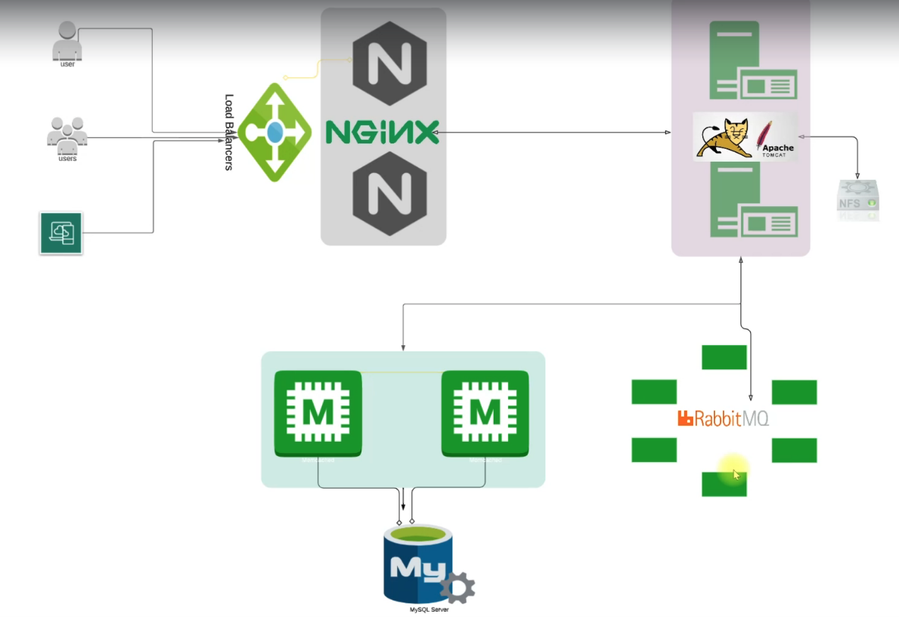

## PreRequisites Installed:
  * Oracle VM VirtualBox Manager
  * Vagrant
  * Vagrant plugins
  * Git
  * IDE (SublimeText, VSCode, etc)

## Step1: VM Setup

- First clone the repository
```sh
git clone https://github.com/rumeysakdogan/vprofile-project.git
```

- We need to go to directory that our Vagrantfile exists. Before we run our VBoxes using `vagrant`, we need to install below plugin.
```sh
vagrant plugin install vagrant-hostmanager
```

- After plugin installed, we can run below command to setup our VMs.
```sh
vagrant up
```
PS: Bringing VMs can take long time sometimes. If VM setup stops in the middle, run `vagrant up` command again.

- We can check our VMs from `Oracle VM VirtualBox Manager`.
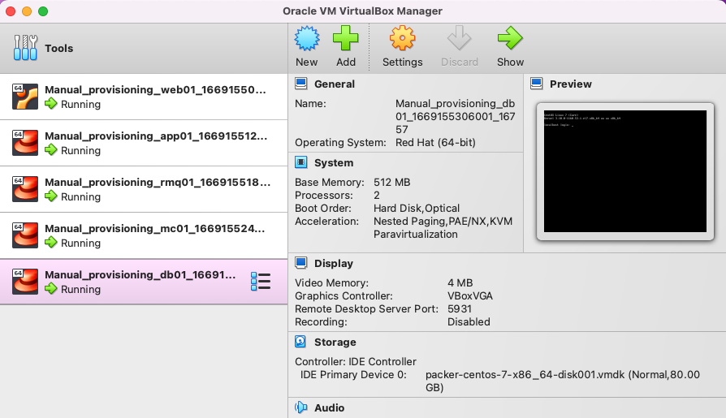

- Next we will validate our VMs one by one with command `vagrant ssh <name_of_VM_given_in_Vagrantfile>`
```sh
vagrant ssh web01
```

- First we will check `/etc/hosts` file. Since we have installed the plugin, `/etc/hosts` file will be updated automatically.
```sh
cat /etc/hosts
```
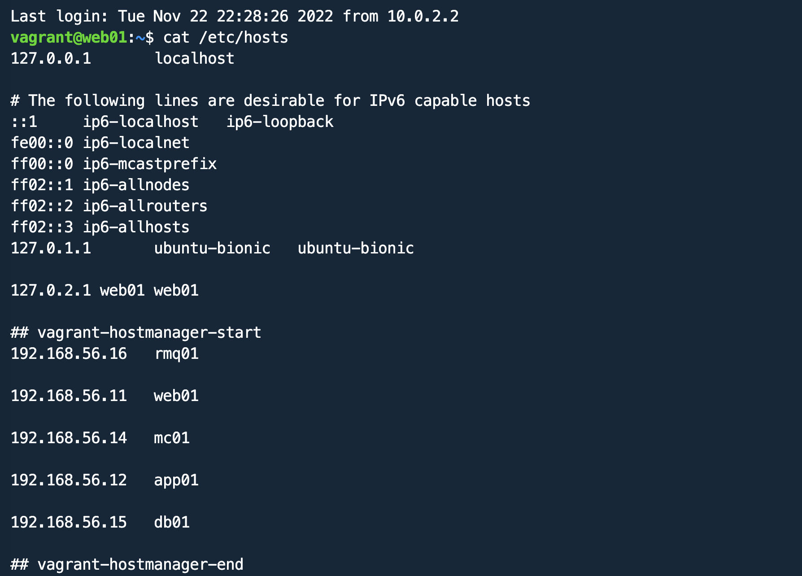
- Now we will try to ping `app01` from `web01` vbox.
```sh
ping app01
```
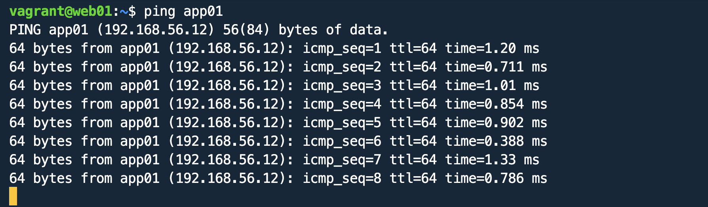

- We are able to connect `app01` successfully. Now we will check other services similarly.
```sh
logout
```

- Lets connect to `app01` vbox and check connectivity of `app01` with `rmq01`, `db01` and `mc01`.
```sh
cat /etc/hosts
ping rmq01
ping db01
ping mc01
logout
```

## Step2: Provisioning

- We have 6 different services for our application.
```sh
Services
1. Nginx:
Web Service
2. Tomcat
Application Server
3. RabbitMQ
Broker/Queuing Agent
4. Memcache
DB Caching
5. ElasticSearch
Indexing/Search service
6. MySQL
SQL Database
```
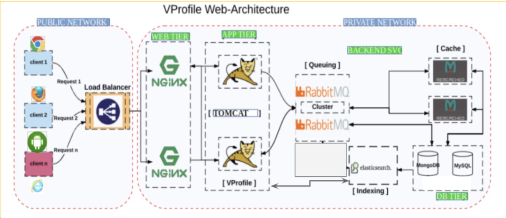

- We need to setup our services in below mentioned order.
```sh
1. MySQL (Database SVC)
2. Memcache (DB Caching SVC)
3. RabbitMQ  (Broker/Queue SVC)
4. Tomcat      (Application SVC)
5. Nginx (Web SVC)
```

### Provisioning MySQL 

- Let's start setting up our MySQL Database first.
```sh
vagrant ssh db01
```

- Switch to root user and update all packages. It is always a good practice to update OS with latest patches, when we log into the VM. 
```sh
sudo su -
yum update -y
```

- First we will set our db password using `DATABASE_PASS` environment variable and add it to `/etc/profile` file
```sh
DATABASE_PASS='admin123'
```

- This variable will be temporary, to make it permanent we need to add it `/etc/profile` file and update file.
```sh
vi /etc/profile
source /etc/profile
```

- Next we will install the `EPEL(Extra Packages for Enterprise Linux)` repository. Extra Packages for Enterprise Linux (EPEL) is a special interest group (SIG) from the Fedora Project that provides a set of additional packages for RHEL (and CentOS, and others) from the Fedora sources.
```sh
yum install epel-release -y
```

- Now we can install Maria DB Package
```sh
yum install git mariadb-server -y
```
- Mariadb is installed, now we will start and enable mariadb service. We can also check the status of mariadb service to make sure it is `active(running)`.
```sh
systemctl start mariadb
systemctl enable mariadb
systemctl status mariadb
```

- RUN mysql secure installation script.
```sh
mysql_secure_installation
```

- NOTE: Set db root password, we will be using `admin123` as password
```
Set root password? [Y/n] Y
New password:
Re-enter new password:
Password updated successfully!
Reloading privilege tables..
... Success!
By default, a MariaDB installation has an anonymous user, allowing anyone
to log into MariaDB without having to have a user account created for
them.  This is intended only for testing, and to make the installation
go a bit smoother.  You should remove them before moving into a
production environment.
Remove anonymous users? [Y/n] Y
... Success!
Normally, root should only be allowed to connect from 'localhost'.  This
ensures that someone cannot guess at the root password from the network.
Disallow root login remotely? [Y/n] n
... skipping.
By default, MariaDB comes with a database named 'test' that anyone can
access.  This is also intended only for testing, and should be removed
before moving into a production environment.
Remove test database and access to it? [Y/n] Y
- Dropping test database...
... Success!
- Removing privileges on test database...
... Success!
Reloading the privilege tables will ensure that all changes made so far
will take effect immediately.
Reload privilege tables now? [Y/n] Y
... Success!
```

- We can check our connectivity to db with below command: Once it asks password, we will enter `admin123` as we set in previous step. After it connects successfully, we can `exit` from DB.
```sh
mysql -u root -p
exit
```
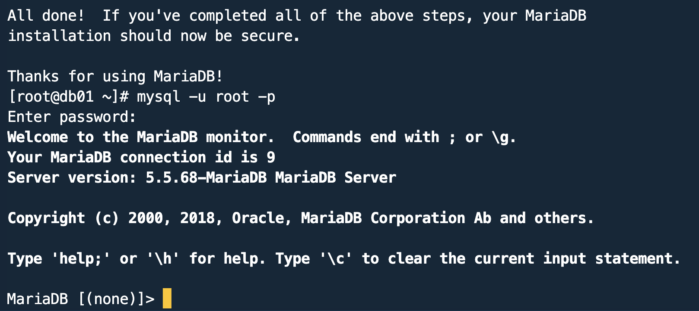
- Next we will clone source code to database vm. And change directory to `src/main/resources/` to get the `sql queries.
```
git clone https://github.com/rumeysakdogan/vprofile-project.git
cd vprofile-project/src/main/resources/
```
- First we will run below queries before initializing our database.
```sh
mysql -u root -p"$DATABASE_PASS" -e "create database accounts"
mysql -u root -p"$DATABASE_PASS" -e "grant all privileges on accounts.* TO 'admin'@'app01' identified by 'admin123' "
cd ../../..
mysql -u root -p"$DATABASE_PASS" accounts < src/main/resources/db_backup.sql
mysql -u root -p"$DATABASE_PASS" -e "FLUSH PRIVILEGES"
```

-  Now we can login to database and do a quick verification to see if SQL queries start a databases with `role` ,`user` and `user_role` tables.
```sh
mysql -u root -p"$DATABASE_PASS"
MariaDB [(none)]> show databases;
MariaDB [(none)]> use accounts;
MariaDB [(none)]> show tables;
exit
```

- As last step, we can restart our `mariadb` server and `logout`.
```sh

systemctl restart mariadb
logout
```

### Provisioning Memcache

- Lets login to memcached server first, and switch to root user.
```sh
vagrant ssh mc01
sudo su -
```

- Similar to MySQL provisioning, we will start with updating OS with latest patches and download epel repository.
```sh
yum update -y
yum install epel-release -y
```

- Now we will install `memcached` package.
```sh
yum install memcached -y
```

- Lets start/enable the memcached service and check the status of service.
```sh
systemctl start memcached
systemctl enable memcached
systemctl status memcache
```

- We will run one more command to that `memcached` can listen on TCP port `11211` and UDP port `11111`.
```sh
memcached -p 11211 -U 11111 -u memcached -d
```

- We can validate if it is running on right port with below command:
```sh
ss -tunlp | grep 11211
``` 
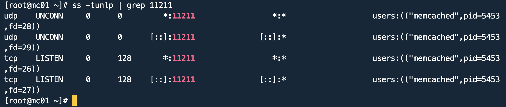
- Everthing looks good, we can exit from server with `exit` command.

### Provisioning RabbitMQ

- Lets login to Rabbit MQ server first, and switch to root user.
```sh
vagrant ssh rmq01
sudo su -
```

- We will start with updating OS with latest patches and download epel repository.
```sh
yum update -y
yum install epel-release -y
```

- Before installing `RabbitMQ`, we will install some dependecies first.
```sh
yum install wget -y
cd /tmp/
wget http://packages.erlang-solutions.com/erlang-solutions-2.0-1.noarch.rpm
sudo rpm -Uvh erlang-solutions-2.0-1.noarch.rpm
``` 

- Now we can install RabbitMQ server. With below command, we will install the script and pipe with shell to execute the script.
```sh
curl -s https://packagecloud.io/install/repositories/rabbitmq/rabbitmq-server/script.rpm.sh | sudo bash
sudo yum install rabbitmq-server -y
```

- Lets start/enable the rabbitmq service and check the status of service.
```sh
systemctl start rabbitmq-server
systemctl enable rabbitmq-server
systemctl status rabbitmq-server
```

- Lastly we need to do below config  for RabbitMQ. We will create a `test` user with password `test`. Then we will create user_tag for `test` user as `administrator`. Once we have done with these config changes, we will restart our rabbitmq service
```sh
cd ~
echo "[{rabbit, [{loopback_users, []}]}]." > /etc/rabbitmq/rabbitmq.config
rabbitmqctl add_user test test
rabbitmqctl set_user_tags test administrator
systemctl restart rabbitmq-server
```

- If your service active/running after restart, then we can move to the next service.
```sh
systemctl status rabbitmq-server
exit
```

### Provisioning Tomcat 

- Lets login to `app01` server first, and switch to root user.
```sh
vagrant ssh app01
sudo su -
```

- We will start with updating OS with latest patches and download epel repository.
```sh
yum update -y
yum install epel-release -y
```

- We will start with install dependencies for Tomcat server.
```sh
yum install java-1.8.0-openjdk -y
yum install git maven wget -y
```

- Now we can download Tomcat. First switch to `/tmp/` directory.
```sh
cd /tmp
wget https://archive.apache.org/dist/tomcat/tomcat-8/v8.5.37/bin/apache-tomcat-8.5.37.tar.
tar xzvf apache-tomcat-8.5.37.tar.gz
```

- We will add tomcat user and copy data to tomcat home directory. We can check the new user `tomcat` with `id tomcat` command.
```sh
useradd --home-dir /usr/local/tomcat8 --shell /sbin/nologin tomcat
```

- We will copy our data to `/usr/local/tomcat8` directory which is the home-directory for `tomcat` user.
```sh
cp -r /tmp/apache-tomcat-8.5.37/* /usr/local/tomcat8/
ls /usr/local/tomcat8
```

- Currently root user has ownership of all files under `/usr/local/tomcat8/` directory. We need to change it to `tomcat` user.
```sh
ls -l /usr/local/tomcat8/
chown -R tomcat.tomcat /usr/local/tomcat8
ls -l /usr/local/tomcat8/
``` 

- Next we will setup systemd for tomcat, create a file with below content. After creating this file, we will be able to start tomcat service with `systemctl start tomcat` and stop tomcat with `systemctl stop tomcat` commands.

```sh
vi /etc/systemd/system/tomcat.service
Content to add tomcat.service file:
[Unit]
Description=Tomcat
After=network.target

[Service]
User=tomcat
WorkingDirectory=/usr/local/tomcat8
Environment=JRE_HOME=/usr/lib/jvm/jre
Environment=JAVA_HOME=/usr/lib/jvm/jre
Environment=CATALINA_HOME=/usr/local/tomcat8
Environment=CATALINE_BASE=/usr/local/tomcat8
ExecStart=/usr/local/tomcat8/bin/catalina.sh run
ExecStop=/usr/local/tomcat8/bin/shutdown.sh
SyslogIdentifier=tomcat-%i

[Install]
WantedBy=multi-user.target
```

- Any changes made to file under `/etc/systemd/system/` directory, we need to run below command to be effective:
```sh
systemctl daemon-reload
```

- Now we should be able to enable tomcat service. The service name tomcat has to be same as given `/etc/systemd/system/tomcat.service` directory.
```sh
systemctl enable tomcat
systemctl start tomcat
systemctl status tomcat
```

- Our Tomcat server is active running, now we will build our source code and deploy it to Tomcat server.

#### Code Build & Deploy to Tomcat(app01) Server

- We are still in `/tmp` directory, we will clone our source code here.
```sh
git clone https://github.com/rumeysakdogan/vprofile-project.git
ls
cd vprofile-project/
```

- Before we build our artifact, we need to update our configuration file that will be connect to our backend services db, memcached and rabbitmq service.
```sh
vi src/main/resources/application.properties
```

- application.properties file: Here we need to make sure the settings are correct. First check DB configuration. Our db server is `db01` , and we have `admin` user with password `admin123` as we setup. For memcached service, hostname is `mc01` and we validated it is listening on tcp port 11211. Fort rabbitMQ, hostname is `rmq01` and we have created user `test` with pwd `test`.

```sh
#JDBC Configutation for Database Connection
jdbc.driverClassName=com.mysql.jdbc.Driver
jdbc.url=jdbc:mysql://db01:3306/accounts?useUnicode=true&characterEncoding=UTF-8&zeroDateTimeBehavior=convertToNull
jdbc.username=admin
jdbc.password=admin123

#Memcached Configuration For Active and StandBy Host
#For Active Host
memcached.active.host=mc01
memcached.active.port=11211
#For StandBy Host
memcached.standBy.host=127.0.0.2
memcached.standBy.port=11211

#RabbitMq Configuration
rabbitmq.address=rmq01
rabbitmq.port=5672
rabbitmq.username=test
rabbitmq.password=test
```

- Run `mvn install` command which will create our artifact. Our artifact will be created `/tmp/vprofile-project/target/vprofile-v2.war`
```sh
cd target/
ls
```

- We will deploy our artifact `vprofile-v2.war` to Tomcat server. But before that, we will remove default app from our server. For that reason first we will shutdown server. The default app will be in `/usr/local/tomcat8/webapps/ROOT` directory.
```sh
systemctl stop tomcat
systemctl status tomcat
rm -rf /usr/local/tomcat8/webapps/ROOT
```

- Our artifact is under vprofile-project/target directory. Now we will copy our artifact to `/usr/local/tomcat8/webapps/` directory as `ROOT.war` and start tomcat server. Once we start the server, it will extract our artifact `ROOT.war` under `ROOT` directory. 
```sh
cd ..
cp target/vprofile-v2.war /usr/local/tomcat8/webapps/ROOT.war
systemctl start tomcat
ls /usr/local/tomcat8/webapps/
```

- By the time, our application is coming up we can provision our Nginx server.

### Provisioning Nginx 

- Our Nginx server is Ubuntu, despite our servers are RedHat. To update OS with latest patches run below command:
```sh
sudo apt update && sudo apt upgrade
```

- Lets install nginx onto our server.
```sh
sudo su -
apt install nginx -y
```

- We will create a Nginx configuration file under directory `/etc/nginx/sites-available/` with below content:
```sh
vi /etc/nginx/sites-available/vproapp
Content to add:
upstream vproapp {
server app01:8080;
}
server {
listen 80;
location / {
proxy_pass http://vproapp;
}
}
```

- We will remove default nginx config file:
```sh
rm -rf /etc/nginx/sites-enabled/default
```

- We will create a symbolic link for our configuration file using default config location as below to enable our site. Then restart nginx server.
```sh
ln -s /etc/nginx/sites-available/vproapp /etc/nginx/sites-enabled/vproapp
systemctl restart nginx
```

### Validate Application from Browser

- We are in web01 server, run `ifconfig` to get its IP address. So the IP address of our web01 is : `192.168.56.11`
```sh
enp0s8: flags=4163<UP,BROADCAST,RUNNING,MULTICAST>  mtu 1500
        inet 192.168.56.11
```
- First validate Nginx is running on browser `http://<IP_of_Nginx_server>`.
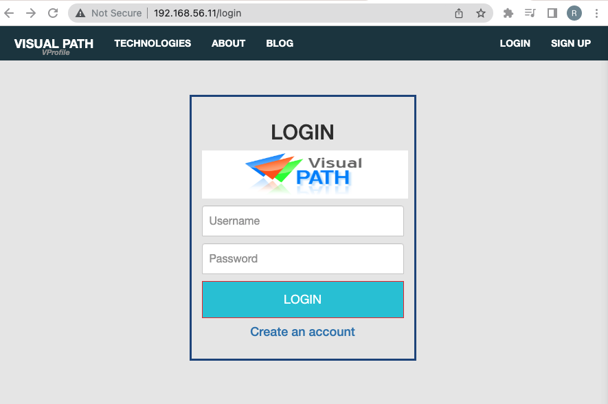

- Validate Db connection using credentials `admin_vp` for both username and password.


- Validate app is running from Tomcat server

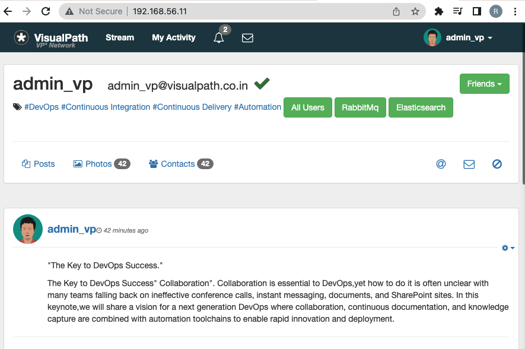

- Validate RabbitMQ connection by clicking RabbitMQ
  
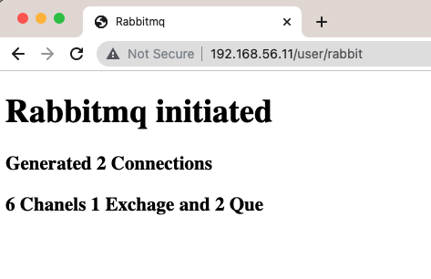

- Validate Memcache connection by clicking MemCache

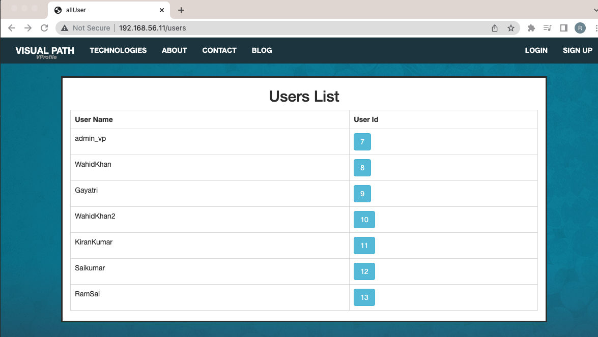

- Validate data is coming from Database when user first time requests it.

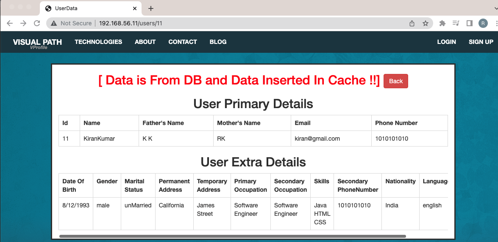

- Validate data is coming from Memcached when user second time requests it.

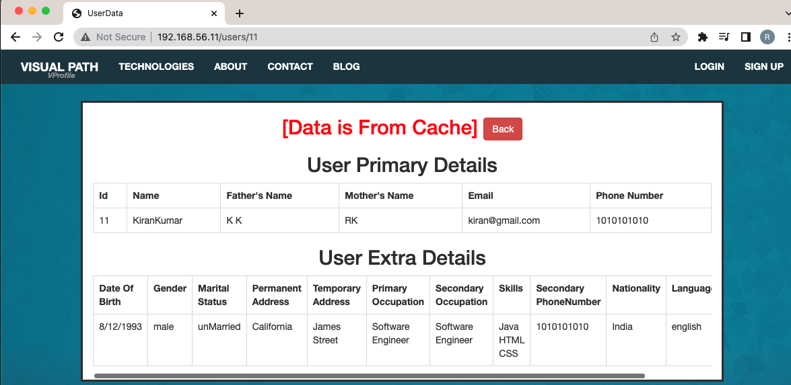

### CleanUp

- We will got to the directory that we have `Vagrantfile`, and run below command to destroy all virtual machines.
```sh
vagrant destroy
```

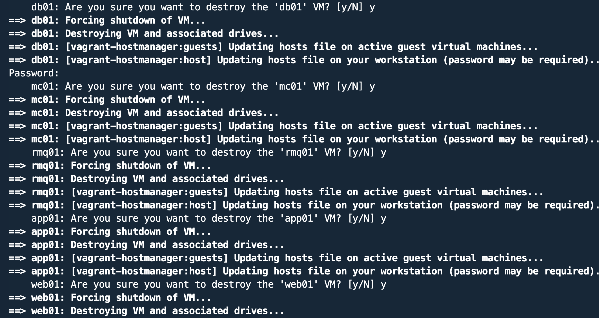

- Check Oracle VM VirtualBox Manager if Vms are destroyed.

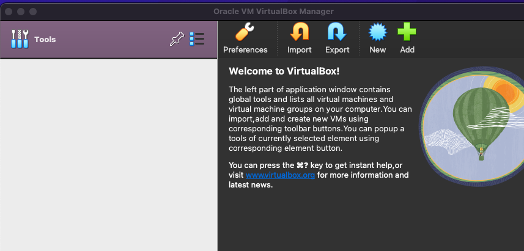


