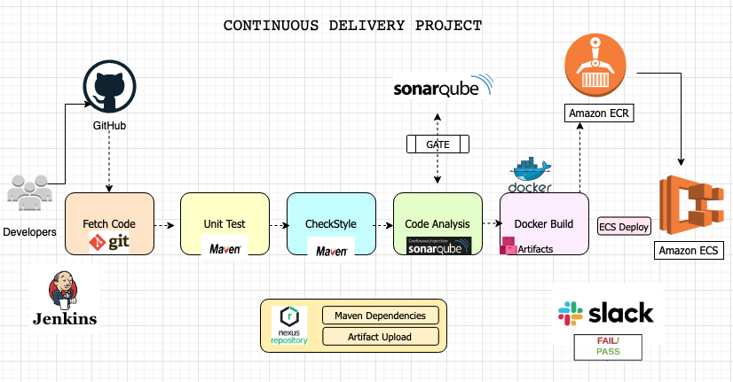
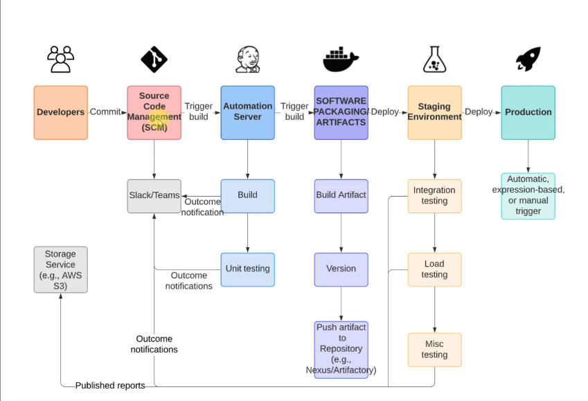

# Project-7: Continuous Delivery with Jenkins and Tools

[*Project Source*](https://www.udemy.com/course/devopsprojects/?src=sac&kw=devops+projects)

## Pre-requisities:

* AWS Account
* GitHub account
* Jenkins
* Nexus
* SonarQube
* Slack 



### Step-1: Create Keypair

- We will need a key-pair while launching our instances. Create a keypair and download the private key to your local system. Make sure to remember where to download your key. We will need this key to SSh our servers.

### Step-2: Create Security Groups for Jenkins, Nexus and SonarQube

* Jenkins SecGrp
```sh
Name: jenkins-SG
Allow: SSH from MyIP
Allow: 8080 from Anywhere IPv4 and IPv6 (We will create a Github webhook which will trigger Jenkins)
```

* Nexus SecGrp
```sh
Name: nexus-SG
Allow: SSH from MyIP
Allow: 8081 from MyIP and Jenkins-SG
```

* SonarQube SecGrp
```sh
Name: sonar-SG
Allow: SSH from MyIP
Allow: 80 from MyIP and Jenkins-SG
```

-Once we created `sonar-SG`, we will add another entry to jenkins Inbound rule as Allow access on 8080 from sonar-SG. SonarQube will send the reports back to Jenkins.

### Step-3: Create EC2 instances for Jenkins, Nexus and SonarQube

#### Jenkins Server Setup

- We will create `Jenkins-server` with below properties and userdata script.
```sh
Name: jenkins-server
AMI: Ubuntu 20.04
SecGrp: jenkins-SG
InstanceType: t2.small
KeyPair: vprofile-ci-key
Additional Details: userdata below
```

* Jenkins Userdata script
```sh
#!/bin/bash
sudo apt update
sudo apt install openjdk-11-jdk -y
sudo apt install maven -y
curl -fsSL https://pkg.jenkins.io/debian-stable/jenkins.io.key | sudo tee \
  /usr/share/keyrings/jenkins-keyring.asc > /dev/null
echo deb [signed-by=/usr/share/keyrings/jenkins-keyring.asc] \
  https://pkg.jenkins.io/debian-stable binary/ | sudo tee \
  /etc/apt/sources.list.d/jenkins.list > /dev/null
sudo apt-get update
sudo apt-get install jenkins -y
###
```

#### Nexus Server Setup

- We will create `Nexus-server` with below properties and userdata script.
```sh
Name: nexus-server
AMI: Amazon Linux-2
InstanceType: t2.medium
SecGrp: nexus-SG
KeyPair: vprofile-ci-key
Additional Details: userdata below
```

* Nexus Userdata script
```sh
#!/bin/bash
yum install java-1.8.0-openjdk.x86_64 wget -y   
mkdir -p /opt/nexus/   
mkdir -p /tmp/nexus/                           
cd /tmp/nexus/
NEXUSURL="https://download.sonatype.com/nexus/3/latest-unix.tar.gz"
wget $NEXUSURL -O nexus.tar.gz
EXTOUT=`tar xzvf nexus.tar.gz`
NEXUSDIR=`echo $EXTOUT | cut -d '/' -f1`
rm -rf /tmp/nexus/nexus.tar.gz
rsync -avzh /tmp/nexus/ /opt/nexus/
useradd nexus
chown -R nexus.nexus /opt/nexus 
cat <<EOT>> /etc/systemd/system/nexus.service
[Unit]                                                                          
Description=nexus service                                                       
After=network.target                                                            
                                                                  
[Service]                                                                       
Type=forking                                                                    
LimitNOFILE=65536                                                               
ExecStart=/opt/nexus/$NEXUSDIR/bin/nexus start                                  
ExecStop=/opt/nexus/$NEXUSDIR/bin/nexus stop                                    
User=nexus                                                                      
Restart=on-abort                                                                
                                                                  
[Install]                                                                       
WantedBy=multi-user.target                                                      

EOT

echo 'run_as_user="nexus"' > /opt/nexus/$NEXUSDIR/bin/nexus.rc
systemctl daemon-reload
systemctl start nexus
systemctl enable nexus
```

#### SonarQube Server Setup


- We will create `sonar-server` with below properties and userdata script.
```sh
Name: sonar-server
AMI: Ubuntu 18.04
InstanceType: t2.medium
SecGrp: sonar-SG
KeyPair: vprofile-ci-key
Additional Details: userdata below
```

* Sonar Userdata script
```sh
#!/bin/bash
cp /etc/sysctl.conf /root/sysctl.conf_backup
cat <<EOT> /etc/sysctl.conf
vm.max_map_count=262144
fs.file-max=65536
ulimit -n 65536
ulimit -u 4096
EOT
cp /etc/security/limits.conf /root/sec_limit.conf_backup
cat <<EOT> /etc/security/limits.conf
sonarqube   -   nofile   65536
sonarqube   -   nproc    409
EOT

sudo apt-get update -y
sudo apt-get install openjdk-11-jdk -y
sudo update-alternatives --config java

java -version

sudo apt update
wget -q https://www.postgresql.org/media/keys/ACCC4CF8.asc -O - | sudo apt-key add -

sudo sh -c 'echo "deb http://apt.postgresql.org/pub/repos/apt/ `lsb_release -cs`-pgdg main" >> /etc/apt/sources.list.d/pgdg.list'
sudo apt install postgresql postgresql-contrib -y
#sudo -u postgres psql -c "SELECT version();"
sudo systemctl enable postgresql.service
sudo systemctl start  postgresql.service
sudo echo "postgres:admin123" | chpasswd
runuser -l postgres -c "createuser sonar"
sudo -i -u postgres psql -c "ALTER USER sonar WITH ENCRYPTED PASSWORD 'admin123';"
sudo -i -u postgres psql -c "CREATE DATABASE sonarqube OWNER sonar;"
sudo -i -u postgres psql -c "GRANT ALL PRIVILEGES ON DATABASE sonarqube to sonar;"
systemctl restart  postgresql
#systemctl status -l   postgresql
netstat -tulpena | grep postgres
sudo mkdir -p /sonarqube/
cd /sonarqube/
sudo curl -O https://binaries.sonarsource.com/Distribution/sonarqube/sonarqube-8.3.0.34182.zip
sudo apt-get install zip -y
sudo unzip -o sonarqube-8.3.0.34182.zip -d /opt/
sudo mv /opt/sonarqube-8.3.0.34182/ /opt/sonarqube
sudo groupadd sonar
sudo useradd -c "SonarQube - User" -d /opt/sonarqube/ -g sonar sonar
sudo chown sonar:sonar /opt/sonarqube/ -R
cp /opt/sonarqube/conf/sonar.properties /root/sonar.properties_backup
cat <<EOT> /opt/sonarqube/conf/sonar.properties
sonar.jdbc.username=sonar
sonar.jdbc.password=admin123
sonar.jdbc.url=jdbc:postgresql://localhost/sonarqube
sonar.web.host=0.0.0.0
sonar.web.port=9000
sonar.web.javaAdditionalOpts=-server
sonar.search.javaOpts=-Xmx512m -Xms512m -XX:+HeapDumpOnOutOfMemoryError
sonar.log.level=INFO
sonar.path.logs=logs
EOT

cat <<EOT> /etc/systemd/system/sonarqube.service
[Unit]
Description=SonarQube service
After=syslog.target network.target

[Service]
Type=forking

ExecStart=/opt/sonarqube/bin/linux-x86-64/sonar.sh start
ExecStop=/opt/sonarqube/bin/linux-x86-64/sonar.sh stop

User=sonar
Group=sonar
Restart=always

LimitNOFILE=65536
LimitNPROC=4096


[Install]
WantedBy=multi-user.target
EOT

systemctl daemon-reload
systemctl enable sonarqube.service
#systemctl start sonarqube.service
#systemctl status -l sonarqube.service
apt-get install nginx -y
rm -rf /etc/nginx/sites-enabled/default
rm -rf /etc/nginx/sites-available/default
cat <<EOT> /etc/nginx/sites-available/sonarqube
server{
    listen      80;
    server_name sonarqube.groophy.in;

    access_log  /var/log/nginx/sonar.access.log;
    error_log   /var/log/nginx/sonar.error.log;

    proxy_buffers 16 64k;
    proxy_buffer_size 128k;

    location / {
        proxy_pass  http://127.0.0.1:9000;
        proxy_next_upstream error timeout invalid_header http_500 http_502 http_503 http_504;
        proxy_redirect off;
              
        proxy_set_header    Host            \$host;
        proxy_set_header    X-Real-IP       \$remote_addr;
        proxy_set_header    X-Forwarded-For \$proxy_add_x_forwarded_for;
        proxy_set_header    X-Forwarded-Proto http;
    }
}
EOT
ln -s /etc/nginx/sites-available/sonarqube /etc/nginx/sites-enabled/sonarqube
systemctl enable nginx.service
#systemctl restart nginx.service
sudo ufw allow 80,9000,9001/tcp

echo "System reboot in 30 sec"
sleep 30
reboot
```

### Step-4: Post Installation Steps

#### For Jenkins Server:

- We need to SSH our jenkins server and check system status for Jenkins. Then we will get initialAdmin password from directory `/var/lib/jenkins/secrets/initialAdminPassword` 
```sh
sudo -i
system status jenkins
cat /var/lib/jenkins/secrets/initialAdminPassword 
```

- Go to browser, `http://<public_ip_of_jenkins_server>:8080`, enter initialAdminPasswrd. We will also install suggested plugins. Then we will create our first admin user.

- We will install below plugins for Jenkins.
```sh
Maven Integration
Github Integration
Nexus Artifact Uploader
SonarQube Scanner
Slack Notification
Build Timestamp
```

#### For Nexus Server:

- We need to SSH our nexus server and check system status for nexus.
```sh
sudo -i
system status nexus
```

- Go to browser, `http://<public_ip_of_nexus_server>:8081` ,click sign-in. Initial password will be located `/opt/nexus/sonatype-work/nexus3/admin.password`
```sh
cat /opt/nexus/sonatype-work/nexus3/admin.password
```

- Username is `admin`, paste password from previous step. Then we need to setup our new password and select `Disable Anonymous Access`.

- We select gear symbol and create repository. This repo will be used to store our release artifacts.

```sh
maven2 hosted
Name: vprofile-release
Version policy: Release
```

- Next we will create a maven2 proxy repository. Maven will store the dependecies in this repository, whenever we need any dependency for our project it will check this proxy repo in Nexus first and download it for project. Proxy repo will download the dependecies from maven2 central repo at first.

```sh
maven2 proxy
Name: vpro-maven-central
remote storage: https://repo1.maven.org/maven2/
```

-  This repo will be used to store our snapshot artifacts. That means any artifact with `-SNAPSHOT` extension will be stored in this repository.

```sh
maven2 hosted
Name: vprofile-snapshot
Version policy: Snapshot
```

- Last repo, will be `maven2 group` type. We will use this repo to group all maven repositories.

```sh
maven2 group
Name: vpro-maven-group
Member repositories: 
 - vpro-maven-central
 - vprofile-release
 - vprofile-snapshot
```

#### For SonarQube Server:

- Go to browser, http://<public_ip_of_sonar_server>.

- Login with username `admin` and password `admin`.

### Step-5: Create a repository in Github

- We need to create a private repository in the Github to be used with this project. 

- The content will be cloned from below link:
```sh
git clone -b ci-jenkins git@github.com:rumeysakdogan/vprofileproject-all.git
```

### Step-6: Build Job with Nexus Repo 

- Our first job will be Build the Artifact from Source Code using Maven. We need JDK8 and Maven to be installed in jenkins to complete the job succesfully.

- Since our application is using JDK8, we need to install Java8 in jenkins. `Manage Jenkins` -> `Global Tool Configuration`
We will install JDK8 manually, and specify its PATH in here.
```sh
Under JDK -> Add JDK
Name: OracleJDK8
untick Install Automatically
JAVA_HOME: < we will get after next step >
```

- Currently our jenkins has JDK-11 install, we can SSH into our jenkins server and install JDK-8. Then get the PATH to JDK-8 to replace in above step. So after installation we will see our `JAVA_HOME` for JDK-8 is `/usr/lib/jvm/java-8-openjdk-amd64`
```sh
sudo apt update -y
sudo apt install openjdk-8-jdk -y
sudo -i
ls /usr/lib/jvm
### we should get both jdk-11 and jdk-8 in this path ###
java-1.11.0-openjdk-amd64  java-11-openjdk-amd64  openjdk-11
java-1.8.0-openjdk-amd64   java-8-openjdk-amd64
``` 

- Next we will setup our Maven.
```sh
Name: MAVEN3
version : keep same
``` 

- Next we need to add Nexus login credentials to Jenkins. Go to `Manage Jenkins` -> `Manage Credentials` ->  `Global` -> `Add Credentials`

```sh
username: admin
password: <pwd_setup_for_nexus>
ID: nexuslogin
description: nexuslogin
``` 

- We will create Jenkinsfile for Build pipeline as below. The variables mentioned in pom.xml repository part and settings.xml will be declared in Jenkinsfile with their values to be used during execution. Update Pipeline file and push to GitHub.
```sh
pipeline {
    agent any
    tools {
        maven "MAVEN3"
        jdk "OracleJDK8"
    }

    environment {
        SNAP_REPO = 'vprofile-snapshot'
        NEXUS_USER = '<user_name>'
        NEXUS_PASS = '<password>'
        RELEASE_REPO = 'vprofile-release'
        CENTRAL_REPO = 'vpro-maven-central'
        NEXUSIP = '172.31.10.139'
        NEXUSPORT = '8081'
        NEXUS_GRP_REPO = 'vpro-maven-group'
        NEXUS_LOGIN = 'nexuslogin'
    }

    stages {
        stage('Build') {
            steps {
                sh 'mvn -s settings.xml -DskipTests install'
            }
        }
    }
}
```

- We will create a New Job in Jenkins with below properties:
```sh
Pipeline from SCM 
Git
URL: <url_from_project> I will use SSH link
Crdentials: we will create github login credentials
#### add Jenkins credentials for github ####
Kind: SSH Username with private key
ID: githublogin
Description: githublogin
Username: git
Private key file: paste your private key here
#####
Branch: */ci-jenkins
path: Jenkinsfile
```

- Error is not gone, we need to login jenkins server via SSH and complete host-key checking step. After below command, our host-key will be stored in `.ssh/known_hosts` file.Then error will be gone.
```sh
sudo -i
sudo su - jenkins
git ls-remote -h -- git@github.com:rumeysakdogan/vprociproject.git HEAD
```

- Now its Build time. Our build pipeline is successful!

### Step-7: Setup GitHub Webhook and update Jenkins Job

- In this step, we will add GitHub webhook to our repository so that after a new commit Build pipeline will be triggered automatically.

- Go to Github repository, `Settings` -> `Webhooks` -> Add `JenkinsURL` with `/github-webhook/` at the end.

- Next we will go to Jenkins and add below configuration to our `vprofile-ci-pipeline` jon.
```sh
Build Trigger: GitHub hook trigger for GITScm polling
```

- We can add a post action to our pipeline script and commit/push changes to GitHub.
```sh
stage('Build') {
            steps {
                sh 'mvn -s settings.xml -DskipTests install'
            }
            post {
                success {
                    echo "Now Archiving."
                    archiveArtifacts artifacts: '**/*.war'
                }
            }
        }

stage('Test') {
           steps {
            sh 'mvn test'
           }
        }
        
        stage('Checkstyle Analysis'){
            steps {
                sh 'mvn -s settings.xml checkstyle:checkstyle'
            }
        }
```

- Our job is triggered automatically after `git push`. And build is successful.

### Step-8: Code Analysis with SonarQube

- The Unit test/Code Coverage reports are generated under Jenkins workspace target directory. But these reports are not human readable. We need a tool which can scan and analyze the coed and present it in human readable format in a Dashboard. We will use SonarQube solution of this problem. 
Two things need to setup:
 * SonarScanner tool in Jenkins to scan the code
 * We need SonarQube information in jenkins so that Jenkins will know where to upload these reports

- Lets start with SonarScanner tool configuration. Go to `Manage Jenkins` -> `Global Tool Configuration`
```sh
Add sonar scanner
name: sonarscanner
tick install automatically
```
- Next we need to go to `Configure System`, and find ` SonarQube servers` section
```sh
tick environment variables
Add sonarqube
Name: sonarserver
Server URL: http://<private_ip_of_sonar_server>
Server authentication token: we need to create token from sonar website
```

- We will add our sonar token to global credentials.
```sh
Kind: secret text
Secret: <paste_token>
name: sonartoken
description: sonartoken
```

- We will add sonarQube code for our pipeline and commit/push changes to GitHub.
```sh
##new environment variables to be added to environment##
SONARSERVER = 'sonarserver'
SONARSCANNER = 'sonarscanner'

##new stages to be added##
 stage('CODE ANALYSIS with SONARQUBE') {
          
          environment {
             scannerHome = tool "${SONARSCANNER}"
          }

          steps {
            withSonarQubeEnv("${SONARSERVER}") {
               sh '''${scannerHome}/bin/sonar-scanner -Dsonar.projectKey=vprofile \
                   -Dsonar.projectName=vprofile-repo \
                   -Dsonar.projectVersion=1.0 \
                   -Dsonar.sources=src/ \
                   -Dsonar.java.binaries=target/test-classes/com/visualpathit/account/controllerTest/ \
                   -Dsonar.junit.reportsPath=target/surefire-reports/ \
                   -Dsonar.jacoco.reportsPath=target/jacoco.exec \
                   -Dsonar.java.checkstyle.reportPaths=target/checkstyle-result.xml'''
            }

          }
```

- Our job is completed succesfully.

- We can see quality gate results in SonarQube server.

- We can create our own Quality Gates and add to our project as well. Next we will create a Webhook in SonarQube to send the anaylysis results to jenkins.

```sh
http://<private_ip_of_jenkins>:8080/sonarqube-webhook
```

- We will add below stage to our pipeline and commit changes to Github.
```sh
 stage('QUALITY GATE') {
            steps {
                timeout(time: 10, unit: 'MINUTES') {
               waitForQualityGate abortPipeline: true
            }
            }
}
```

- We can see BUILD is successful!

### Step-9: Publish Artifact to Nexus Repo

- In this step, we will automate process of publishing latest artifact to Nexus repository after successful build. 
We need to add Build-Timestamp to artifact name to get unique artifact each time. We can go to `Manage Jenkins` -> `Configure System` under `Build Timestamp` we can update the pattern as our wish.

```sh
yy-MM-dd_HHmm
```

- We will add below stage to our pipeline and see results.
```sh
stage('UPLOAD ARTIFACT') {
                steps {
                    nexusArtifactUploader(
                        nexusVersion: 'nexus3',
                        protocol: 'http',
                        nexusUrl: "${NEXUSIP}:${NEXUSPORT}",
                        groupId: 'QA',
                        version: "${env.BUILD_ID}-${env.BUILD_TIMESTAMP}",
                        repository: "${RELEASE_REPO}",
                        credentialsId: ${NEXUS_LOGIN},
                        artifacts: [
                            [artifactId: 'vproapp' ,
                            classifier: '',
                            file: 'target/vprofile-v2.war',
                            type: 'war']
                        ]
                    )
                }
        }
```

- Build is successful.

- Artifact is uploaded to Nexus repository.

### Step-10: Slack Notification

- We will Login to slack and create a workspace by following the prompts. Then we will create a channel `jenkins-cicd` in our workspace.

- Next we need to Add jenkins app to slack. Search in Google with `Slack apps`. Then search for `jenkins` add to Slack. We will choose the channel `jenkins-cicd`. It will give us to setup instructions, from there copy `Integration token credential ID` .


- We will go to Jenkins dashboard `Configure system` -> `Slack`
```sh
Workspace:  example (in the workspace url example.slack.com)
credential: slacktoken 
default channel: #jenkins-cicd
```
- We will add our sonar token to global credentials.
```sh
Kind: secret text
Secret: <paste_token>
name: slacktoken
description: slacktoken
```

- We will add below part to our Jenkinsfile in the same level with stages and push our changes.
```sh
post{
        always {
            echo 'Slack Notifications'
            slackSend channel: '#jenkinscicd',
                color: COLOR_MAP[currentBuild.currentResult],
                message: "*${currentBuild.currentResult}:* Job ${env.JOB_NAME} build ${env.BUILD_NUMBER} \n More info at: ${env.BUILD_URL}"
        }
    }
```
- We get our Notification from slack.



### Step-11: Setup Branches and Webhook

- We will create a new branch from `ci-jenkins` branch and call it as `cicd-jenkins` branch.
```sh
git checkout ci-jenkins
git checkout -b cicd-jenkins
```

- We will go to `docker` branch of below repository and download zip file and add it to your source code in your local repository for `cicd-jenkins` branch.
```sh
https://github.com/rumeysakdogan/vprofileproject-all.git
```

- Create two new directory and copy Jenkinsfile to both of them. We will write our Stage/Prod pipeline.
```sh
mkdir StagePipeline/ ProdPipeline/
cp Jenkinsfile StagePipeline/
cp Jenkinsfile ProdPipeline/
git rm Jenkinsfile
```

- We will add our files and new branch to GitHub.
```sh
git add .
git commit -m "preparing cicd-jenkins branch"
git push origin cicd-jenkins
```

### Step-11: Setup IAM User & ECR

- Create IAM user for jenkins with Programmatic access keys and add below managed policies.


- Create Private ECR repository for Docker images named as `vprofileappimg`.


### Step-12: Jenkins Configurations

- We will  download below plugins in Jenkins.
```sh
Docker Pipeline
CloudBees Docker build and Publish
Amazon ECR
Pipeline: AWS Steps
```
- We will add AWS Credentials to Global Credentials of Jenkins. As Kind, we will choose AWS Credentials and provide Access key and Secret key ID.

- Last, we will install Docker in our Jenkins server after SSh into Jenkins server. Follow documentation for installation steps `https://docs.docker.com/engine/install/ubuntu/`
```sh
sudo su - jenkins
usermod -aG docker jenkins
id jenkins
systemctl restart jenkins
```

### Step-13: Docker Build in Pipeline

- We will add below env variables and stages to the `Jenkinsfile` under `StagePipeline` directory.
```sh
#### 3 new environment variables ####
         registryCredential = 'ecr:us-east-1:awscreds'
        appRegistry = '392530415763.dkr.ecr.us-east-1.amazonaws.com/vprofileappimg'
        vprofileRegistry = "https://392530415763.dkr.ecr.us-east-1.amazonaws.com"
################################
    stage('Build App image'){
            steps{
                script{
                  dockerImage = docker.build( appRegistry + ":$BUILD_NUMBER", "./Docker-files/app/multistage/")
                }
            }
        }

        stage('Upload App Image'){
            steps{
                script{
                    docker.withRegistry( vprofileRegistry, registryCredential ) {
                        dockerImage.push("$BUILD_NUMBER")
                        dockerImage.push('latest')
                    }
                }
            }
        }
```
- Then commit/push changes to our GitHub repository.

- Next we will create a new pipeline in Jenkins.
```sh
Name: vprofile-cicd-pipeline-docker
Type: Pipeline
Build Trigger : GitSCM polling
Pipeline from SCM
URL : SSH url from GitHub
crdentials: githublogin
branch: cicd-jenkins
ScriptPath: StagePipeline/Jenkinsfile
```

- Our Docker pipeline is successful.


- Image is uploaded to ECR repository.


### Step-14: AWS ECS Setup

- We will create ECS Cluster for Stage environment.

- Then we will create Task definition which will be used to create our app containers.
```sh
Name: vproappstagetask
containerName: vproapp
Port: 8080
Image URI: paste from ECR
Environment: Fargate 1 vCPU, 2 GB memory
```
- Create service now.
```sh
Name:  vproappstagesvc
Replica: 1
task definition: vproappstagetask
LoadBalancer: create new
target group vproappstagetg HTTP 80
secGrp: vproappstagesg
HTTP 80
Health check: /login
Grace period: 30
```

- We need to update port to 8080 in both Target group and Security group.


- Our service is running, we can check app from browser using ALB url.


### Step-15: Pipeline for ECS

- We will add deploy stage to Jenkinsfile along with two new variables. Commit/push changes to GitHub which will trigger our pipeline automatically.

```sh
###### new environment variables ####
cluster = "vprostaging"
service = "vproappstagesvc"
########################
stage('Deploy to ECS Staging') {
                steps {
                    withAWS(credentials: 'awscreds', region: 'us-east-1') {
                        sh 'aws ecs update-service --cluster ${cluster} --service ${service} --force-new-deploymnet'
                    }
                }
        }
```
- Our pipeline is complete.


- Notification sent to Slack.


### Step-15: Promote Code to Production

- Lets create a new ECS cluster for production first.

- Then we will create Task definition.
```sh
Name: vproprodtask
containerName: vproapp
Port: 8080
Image URI: paste from ECR
Environment: Fargate 1 vCPU, 2 GB memory
```

- Create service now.
```sh
Name:  vproappprodsvc
Replica: 1
task definition: vproappprodtask
LoadBalancer: create new alb
name: vproappprodalb
target group vproappprodtg HTTP 80
secGrp: vproappprodsg
HTTP 80
Health check: /login
Grace period: 30
```

- We need to update port to 8080 in both Target group and Security group.

- We will create a new branch from `cicd-jenkins` branch. Push new branch to GitHub.
```sh
git checkout -b prod
```
- Then we will create new `Jenkinsfile` under `ProdPipeline` directory. Commit/push to GitHub.
```sh
def COLOR_MAP = [
    'SUCCESS' : 'good',
    'FAILURE' : 'danger'
]

pipeline {
    agent any

    environment {
        cluster = "vproprod"
        service = "vproappprodsvc"
    }
    stages{
        stage('Deploy to ECS Staging') {
                    steps {
                        withAWS(credentials: 'awscreds', region: 'us-east-1') {
                            sh 'aws ecs update-service --cluster ${cluster} --service ${service} --force-new-deployment'
                        }
                    }
            }
        }

    post{
        always {
            echo 'Slack Notifications'
            slackSend channel: '#jenkinscicd',
                color: COLOR_MAP[currentBuild.currentResult],
                message: "*${currentBuild.currentResult}:* Job ${env.JOB_NAME} build ${env.BUILD_NUMBER} \n More info at: ${env.BUILD_URL}"
        }
    }
}
```

- Create new pipeline job from Jenkins.


- We can see the application is running from ECS.


