# Project-8: Continuous Delivery on AWS

[*Project Source*](https://www.udemy.com/course/devopsprojects/?src=sac&kw=devops+projects)

### Pre-Requisites:

* AWS Account
* Sonar Cloud Account
* AWS CLI, Git installed on Local

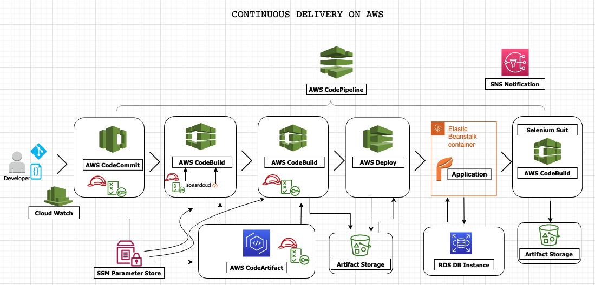

### Step-1: Setup AWS CodeCommit 

From AWS Console, and pick `us-east-1` region and go to `CodeCommit` service. Create repository.
```sh
Name: vprofile-code-repo
```

Next we will create an IAM user with `CodeCommit` access from IAM console. We will create a policy for `CodeCommit` and allow full access only for `vprofile-code-repo`.

```sh
Name: vprofile-code-admin-repo-fullaccess
```


To be able connect our repo, we will follow steps given in CodeCommit.

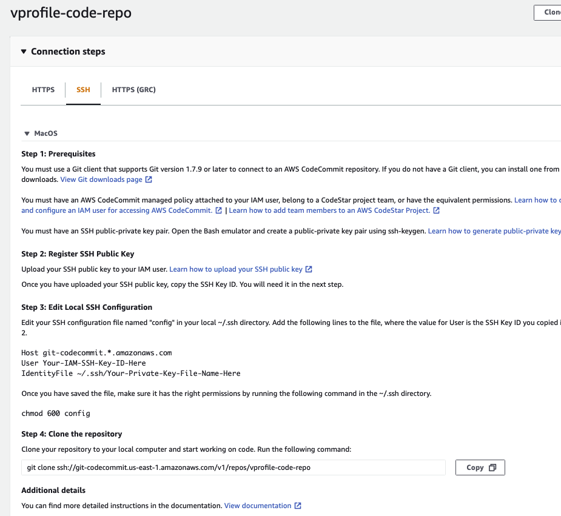

First Create SSH key in local and add public key to IAM role Security credentials.


We will also update configuration under `.ssh/config` and add our Host information. And change permissions with `chmod 600 config`
```sh
Host git-codecommit.us-east-1.amazonaws.com
    User <SSH_Key_ID_from IAM_user>
    IdentityFile ~/.ssh/vpro-codecommit_rsa
```

We can test our ssh connection to CodeCommit.
```sh
ssh git-codecommit.us-east-1.amazonaws.com
```

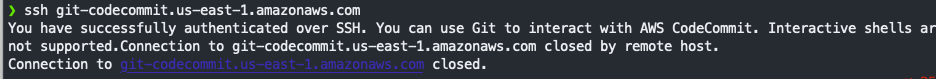

Next we clone the repository to a location that we want in our local. I will use the Github repository for `vprofile-project` in my local, and turn this repository to CodeCommit repository. When I am in Github repo directory, I will run below commands.
[Project code](https://github.com/rumeysakdogan/vprofileproject-all.git)

```sh
git checkout master
git branch -a | grep -v HEAD | cur -d'/' -f3 | grep -v master > /tmp/branches
for i in `cat  /tmp/branches`; do git checkout $i; done
git fetch --tags
git remote rm origin
git remote add origin ssh://git-codecommit.us-east-1.amazonaws.com/v1/repos/vprofile-code-repo
cat .git/config
git push origin --all
git push --tags
```
- Our repo is ready on CodeCommit with all branches.


### Step-2: Setup AWS CodeArtifact

- We will create CodeArtifact repository for Maven.
```sh
Name: vprofile-maven-repo
Public upstraem Repo: maven-central-store
This AWS account
Domain name: visualpath
```
- Again we will follow connection instructions given in CodeArtifact for  `maven-central-repo`.

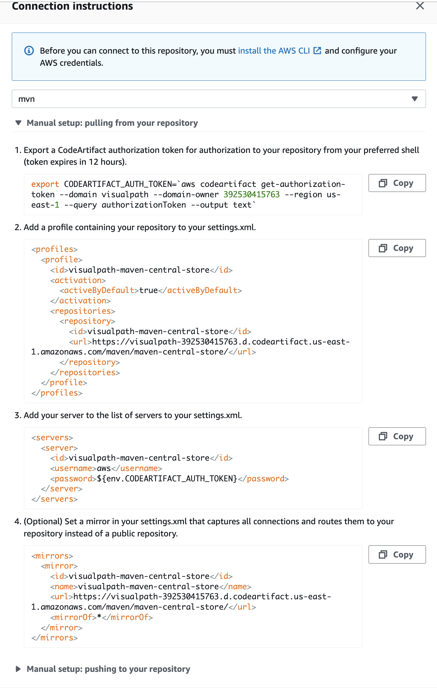

- We will need to create an IAM user for CodeArtifact and configure aws cli with its credentials. We will give Programmatic access to this user to be able to use aws cli and download credentials file.
```sh
aws configure # provide iam user credentials
```


Then we run command get token as in the instructions.
```sh
export CODEARTIFACT_AUTH_TOKEN=`aws codeartifact get-authorization-token --domain visualpath --domain-owner 392530415763 --region us-east-1 --query authorizationToken --output text`
```

Update pom.xml and setting.xml file with correct urls as suggested in instruction and push these files to codeCommit.
```sh
git add .
git commit -m "message"
git push origin ci-aws
```
### Step-3: Setup SonarCloud 

We need to have an account, from account avatar -> `My Account` -> `Security`. Generate token name as `vprofile-sonartoken`. Note the token.


Next we create a project, `+` -> `Analyze Project` -> `create project manually`. Below details will be used in our Build.
```sh
Organization: rumeysa-devops-projects
Project key: vprofile-repo-rd
Public
```

Our Sonar Cloud is ready!


### Step-4: Store Sonar variables in System Manager Parameter Store 

We will create paramters for below variables.
```sh
CODEARTIFACT_TOKEN	 SecureString	
HOST      https://sonarcloud.io
ORGANIZATION           rumeysa-devops-projects
PROJECT                vprofile-repo-rd
SONARTOKEN             SecureString
```

### Step-5: AWS CodeBuild for SonarQube Code Analysis

From AWS Console, go to `CodeBuild` -> `Create Build Project`. This step is similar to Jenkins Job.
```sh
ProjectName: Vprofile-Build
Source: CodeCommit
Branch: ci-aws
Environment: Ubuntu
runtime: standard:5.0
New service role
Insert build commands from foler aws-files/sonar_buildspec.yml
Logs-> GroupName: vprofile-buildlogs
StreamName: sonarbuildjob
```

We need to update sonar_buildspec.yml file paramater store sections with the exact names we have given in SSM Parameter store.

We need to add a policy to the service role created for this Build project. Find name of role from Environment, go to IAM add policy as below:

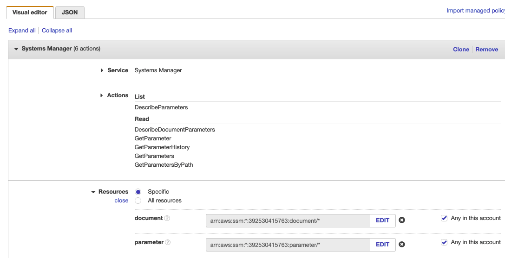

It is time to Build our project.


We can check from SonarCloud too.


I can add Quality Gate to this Build Project, we can create a Qulaity gate from SonarCloud and add to our project.

### Step-6: AWS CodeBuild for Build Artifact

From AWS Console, go to `CodeBuild` -> `Create Build Project`. This step is similar to Jenkins Job.
```sh
ProjectName: Vprofile-Build-Artifact
Source: CodeCommit
Branch: ci-aws
Environment: Ubuntu
runtime: standard:5.0
Use existing role from previous build
Insert build commands from foler aws-files/build_buildspec.yml
Logs-> GroupName: vprofile-buildlogs
StreamName: artifactbuildjob
```

Its time to build project.


### Step-7: AWS CodePipeline and Notification with SNS

First we will create an SNS topic from SNS service and subscribe to topic with email.


We need confirm our subscription from our email.

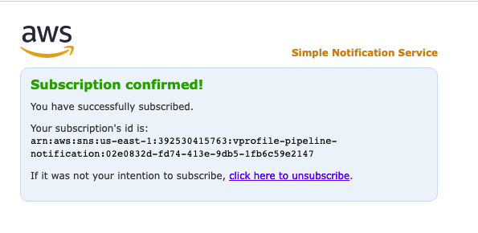

Next we create an S3 bucket to store our deploy artifacts.

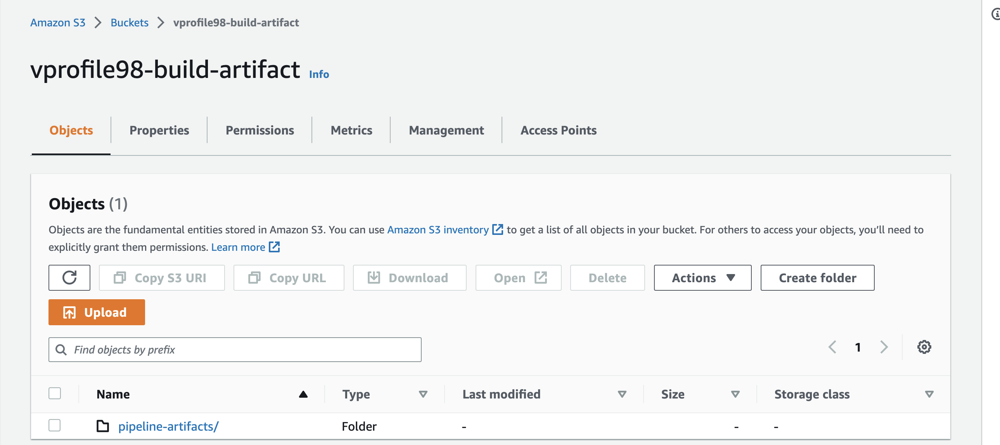

Lets create our CodePipeline.
```sh
Name: vprofile-CI-Pipeline
SourceProvider: Codecommit
branch: ci-aws
Change detection options: CloudWatch events
Build Provider: CodeBuild
ProjectName: vprofile-Build-Aetifact
BuildType: single build
Deploy provider: Amazon S3
Bucket name: vprofile98-build-artifact
object name: pipeline-artifact
```

We will add Test and Deploy stages to our pipeline.

Last step before running our pipeline is we need to setup Notifications, go to Settings in `CodePipeline` -> `Notifications`. 

Time to run our CodePipeline.

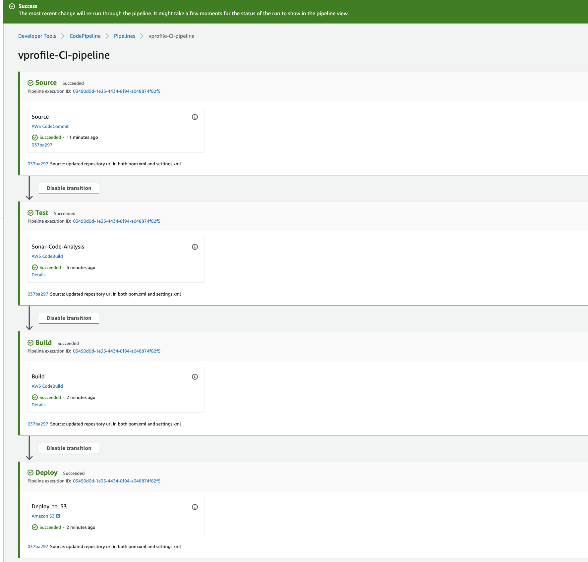

### Step-8: Validate CodePipeline

We can make some changes in README file of source code, onc we push the changes CloudWatch will detect the changes and Notification event will trigger Pipeline.

### Step-9: Create Elastic Beanstalk environment

We will create an environment using Sample application.
```sh
Name: vprofile-app
Capacity: LoadBalanced
    Min: 2
    Max: 4
Security: Choose existing key-pair usedin previous steps
Tags: 
    Name:Project
    Value: vprofile
```

### Step-10: Create RDS MySQL Database

Create an RDS service with below details. Don't forget the click `View credential details` to note down your password.

```sh
Engine: MySQL
version: 5.7
Free-Tier
DB Identifier: vprofile-cicd-mysql
credentials: admin
Auto generate password (will take note of pwd once RDS is created)
db.t2.micro
Create new SecGrp: 
* Name: vprofile-cicd-rds-mysql-sg
Additional Configurations: 
* initial db name: accounts
```
### Step-11: Update RDS Security Group

We need to go to instances, and find BeanStalk instance and copy its Secgrp ID. We will update RDS SecGrp Inbound rules to allow access for Beanstalk instances on port 3306. 

### Step-12: Use Beanstalk instance to connect RDS to deploy schemas

This is not good practice to SSH beanstalk to connect RDS instance and make some changes. Better to create a new EC2 and perform these tasks. We will go to Beanstalk SecGrp group, and change access to port 22 from `Anywhere` to `MyIP`. We need to install `mysql` client in this instance to be able to connect RDS. We also need to install `git` since we will clone our source code and get scripts to create schema in our database.

```sh
sudo -i
yum install mysql git -y
mysql -h <RDS_endpoint> -u <RDS_username> -p<RDS_password>
show databases;
git clone https://github.com/rumeysakdogan/vprofileproject-all.git
cd vprofileproject-all/
git checkout cd-aws
cd src/main/resources
mysql -h <RDS_endpoint> -u <RDS_username> -p<RDS_password> accounts < db_backup.sql
mysql -h <RDS_endpoint> -u <RDS_username> -p<RDS_password>
use accounts;
show tables;
```

We will go back to Beanstalk environment and under `Configuration` -> `loadbalancer` -> `Processes` , we will update Health check path to `/login`. Then apply changes.

### Step-13: Update Code with pom & setting.xml

Go to CodeCommit, select `cd-aws` branch. We will do the same updates that we did in `ci-aws` branch to the pom & settings.xml files. We can directory select file and `Edit` in CodeCommit, then commit our changes.

for pom.xml, add the correct url from your code artifact connection steps:
```sh
     <repository>
        <id>codeartifact</id>
        <name>codeartifact</name>
    <url>https://visualpath-392530415763.d.codeartifact.us-east-1.amazonaws.com/maven/maven-central-store/</url>
      </repository>
```
for settings.xml, update below parts with correct url from code artifact.
```sh
<profiles>
  <profile>
    <id>default</id>
    <repositories>
      <repository>
        <id>codeartifact</id>
    <url>https://visualpath-392530415763.d.codeartifact.us-east-1.amazonaws.com/maven/maven-central-store/</url>
      </repository>
    </repositories>
  </profile>
</profiles>
<activeProfiles>
        <activeProfile>default</activeProfile>
    </activeProfiles>
<mirrors>
  <mirror>
    <id>codeartifact</id>
    <name>visualpath-maven-central-store</name>
    <url>https://visualpath-392530415763.d.codeartifact.us-east-1.amazonaws.com/maven/maven-central-store/</url>
    <mirrorOf>*</mirrorOf>
  </mirror>
</mirrors>
```

### Step-14: Build Job Setup

First, we will go to CodeBuild and change `Source` for `Vprofile-Build` & `Vprofile-build-Artifact` projects. Currently these projects are triggered from `ci-aws` branch, we will change branch to `cd-aws`.

#### Create BuildAndRelease Build Project

Then we create a new `Build Project` for deploying artifacts to BeanStalk.
```sh
Name: Vprofile-BuildAndRelease
Repo: CodeCommit
branch: cd-aws
Environment
*Managed image: Ubuntu
*Standard
Image 5.0
We will use existing role from previous Build project which has access to SSM Parameter Store
Insert build commands: 
* From source code we will get spec file under `aws-files/buildAndRelease_buildspec.yml`.
Logs:
*LogGroup:vprofile-cicd-logs
*StreamnameBuildAndReleaseJob
```

We need to create 3 new parameters that we used in BuilAndRelease_buildspec.yml file in SSM Parameter store. we have noted these values from RDS creation step, we will use them now.
```sh
RDS-Endpoint: String
RDSUSER: String
RDSPASS: SecureString
```

Let's run the project. It is successful!

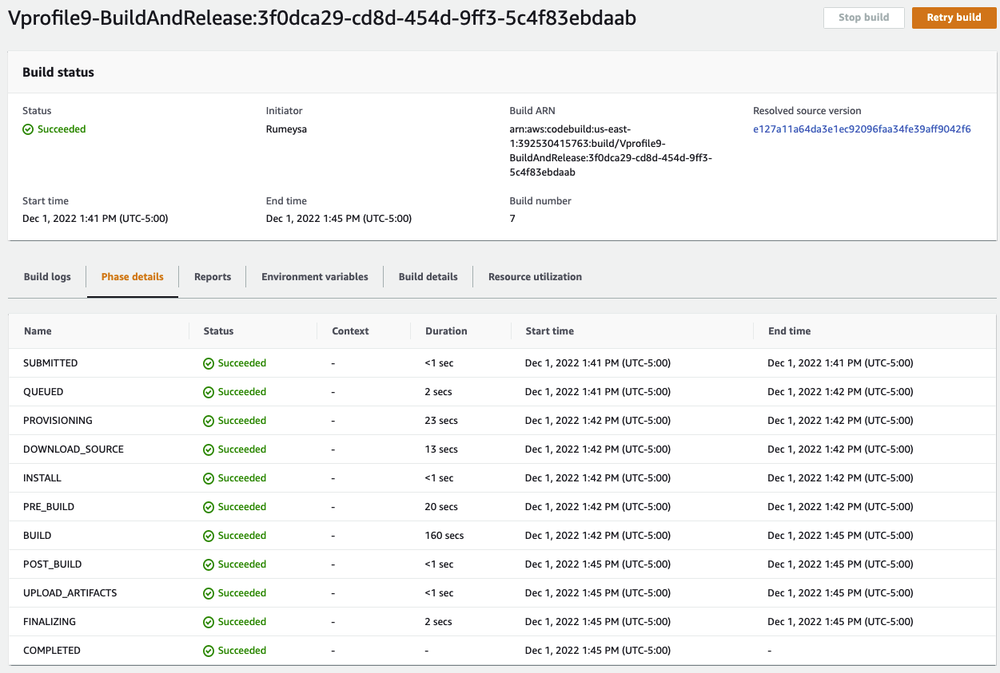

#### Create SoftwareTesting Build Project

In this Build Project, we will run our Selenium Automation scripts and store the artifacts in S3 bucket.

First we will create an S3 bucket.
```sh
Name: vprofile-cicd-testoutput-rd (give a unique name)
Region: it should be the same region we create our pipeline
```

Next, we will create a new Build project for Selenium Automation Tests. Create a new Build project with below details:
```sh
Name: SoftwareTesting
Repo: CodeCommit
branch: seleniumAutoScripts
Environment:
* Windows Server 2019
* Runtime: Base
* Image: 1.0
We will use existing role from previous Build project which has access to SSM Parameter Store
Insert build commands: 
* From source code we will get spec file under `aws-files/win_buildspec.yml`.
* We need to update url part to our Elastic Beanstalk URL.
Artifacts:
*Type: S3
* Bucketname: vprofile-cicd-testoutput-rd
* Enable semantic versioning
Artifcats packaging: zip
Logs:
*LogGroup: vprofile-cicd-logs
*Streamname: 
```

### Step-15: Create Pipeline

We will create CodePipeline with name of `vprofile-cicd-pipeline`
```sh
Source:
* CodeCommit
* vprofile-code-repo
* cd-aws
* Amazon CloudWatch Events

Build
* BuildProvider: CodeBuild
* ProjectName: Vprofile-BuildAndRelease
* Single Build

Deploy
* Deploy provider: Beanstalk
* application: vprofile-app
* Environment: vprofile-app-env
```

We will `Disable transitions` and `Edit` pipeline to add more stages.

First Stage added after Source:
```sh
Name: CodeAnalysis
Action provider: CodeBuild
Input artifacts: SourceArtifact
Project name: Vprofile-Build
```

Second Stage will be added after CodeAnalysis stage:
```sh
Name: BuildAndStore
Action provider: CodeBuild
Input artifacts: SourceArtifact
Project name: Vprofile-Build-artifact
OutputArtifact: BuildArtifact
```

Third Stage will be added after BuildAndStore stage:
```sh
Name: DeployToS3
Action provider: Amazon S3
Input artifacts: BuildArtifact
Bucket name: vprofile98-build-artifact
Extract file before deploy
```

We need to Edit ouput artifacts of Build and Deploy stages. Go to Build stage `Edit Stage`. Change Output artifact name as `BuildArtifactToBean`. 

Go to Deploy stage, `Edit stage`. We change `InputArtifact` to `BuildArtifactToBean`.

Last Stage will be added after Deploy stage:
```sh
Name: Software Testing
Action provider: CodeBuild
Input artifacts: SourceArtifact
ProjectName: SoftwareTesting
```

Save and Release change. It will start our CodePipeline.

### Step-16: SNS Notification

We will select our pipeline. Click `Notify`, then `Manage Notification`. We will create a new notification and save.
```sh
vprofile-aws-cicd-pipeline-notification
Select all
Notification Topic: use same topic from CI pipeline
```

### Step-17: Validate & Test

It's time to test our pipeline.

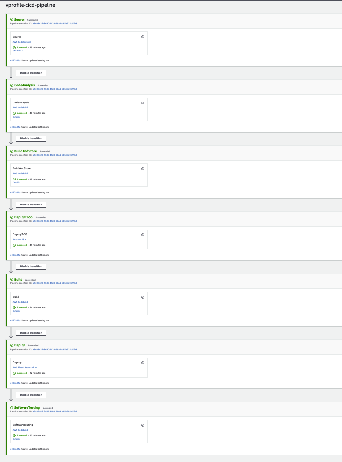

We can check the app from browser with Beanstalk endpoint.

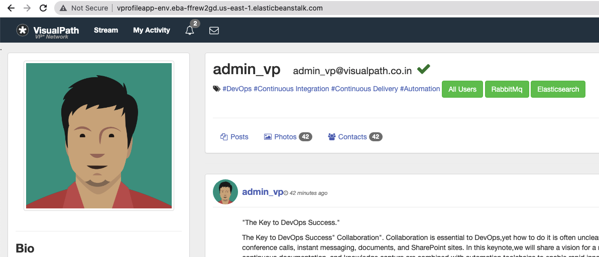