# Project-9: Ansible for AWS VPC

[*Project Source*](https://www.udemy.com/course/devopsprojects/?src=sac&kw=devops+projects)

## Pre-Requisites:

* AWS Account
* IDE (IntelliJ, VSCode, etc)
* GitHub account, git

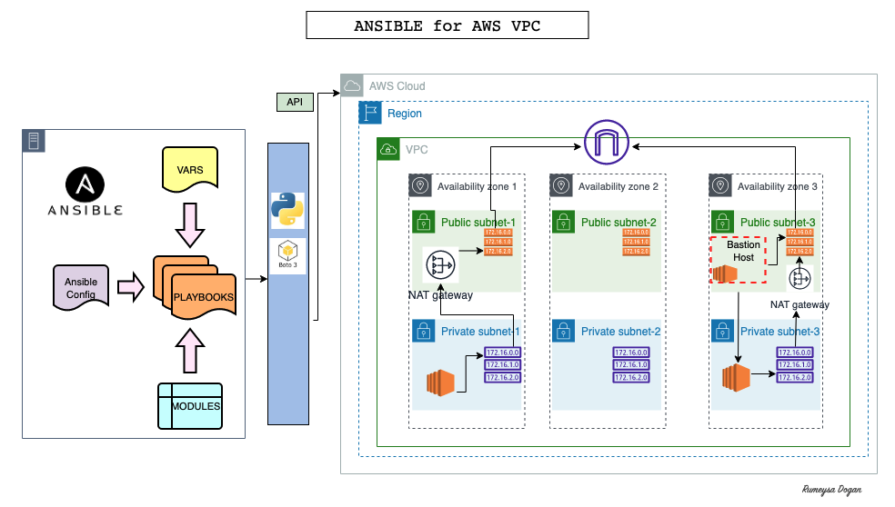

### Step-1: Ansible Setup for AWS

For this project we will use `Ohio` region which has 3 AZs. Lets create an EC2 instance with below details:
```sh
AMI: Ubuntu 20.04
Instance Type: t2.micro
SecGrp: allow SSH on port 22
Create a new keypair
UserData:
#!/bin/bash
apt update
apt install ansible -y
```

We will SSH into our Ansible Server, and we can run below command to check ansible version.
```sh
ansible --version
```

Next we will create an IAM role to use with EC2. Onec role is created, we need to attach it to our EC2 instance. `Actions` --> `Security` --> `Modify IAM Role` , select the role you create.
```sh
Service: EC2
Policy: AdministratorAccess
Name: ansible-admin-role
```

We can check our identity by running awscli command. But before that we need to install awscli in our server. We should we the IAM role we have created.
```sh
sudo apt install awscli -y
aws sts get-caller-identity
```

### Step-2: Warm-up for AWS Cloud Playbooks

We will create a new directory and create a test playbook.
```sh
mkdir vpc-stack-vprofile
cd vpc-stack-vprofile
vim test-aws.yml
```

We can find Ansible AWS cloud Automation documentation from official site: `https://docs.ansible.com/ansible/2.9/modules/list_of_cloud_modules.html`. Copy paste below content to `test-aws.yml`.
```sh
- hosts: localhost
  connection: local
  gather_facts: False
  tasks:
    - name: sample ec2 key
      ec2_key:
        name: my_keypair
        region: us-east-2
```

When we try to run this playbook it will fail. Ansible requires `Python3` to be installed. We can install either using `pip`(python package manager) or with `apt`. Since we use aws, Boto is Python SDK in AWS. we will search `boto` in `apt`. 

```sh
ansible-playbook test-aws.yml
sudo apt search boto
sudo apt install python3-boto3 -y
```

We can run again, and it is successful after `boto3` installation.
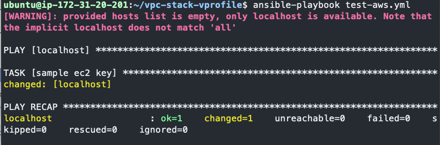

This key is created but we did not have the private downloaded on our system, to be able to do that we need to add more tasks in our `test-aws.yml` playbook.
```sh
- hosts: localhost
  connection: local
  gather_facts: False
  tasks:
    - name: sample ec2 key
      ec2_key:
        name: my_keypair
        region: us-east-2
      register: keyout

    - debug:
        var: keyout
```

This time we will be able to see our file, but still ne weed to make manual work to store the private key. We can add another task to store the key in our local. From previous run, we know the exact path to get private_key from json file.
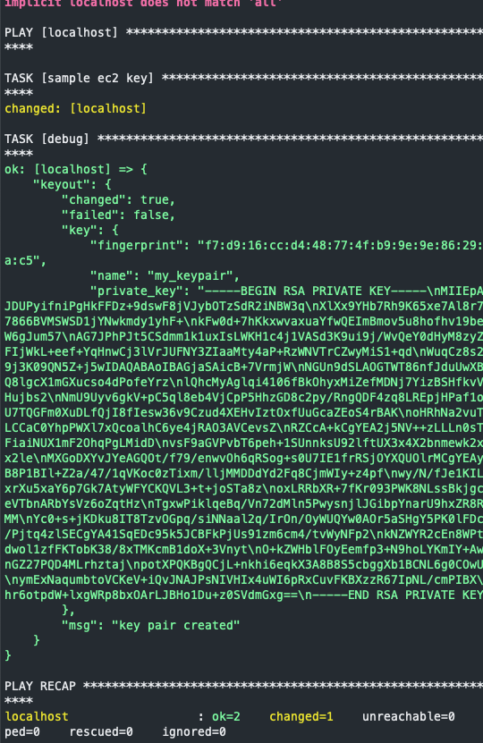

```sh
- hosts: localhost
  connection: local
  gather_facts: False
  tasks:
    - name: sample ec2 key
      ec2_key:
        name: my_keypair
        region: us-east-2
      register: keyout

    - debug:
        var: keyout

    - name: store login key
      copy:
        content: "{{keyout.key.private_key}}"
        dest: ./sample-key.pem
      when: keyout.changed
```

Our keypair is stored 
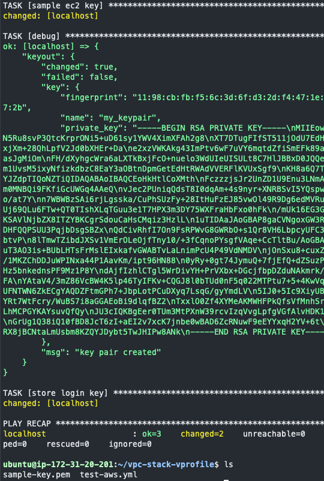

### Step-3: Variables for VPC

We will create a GitHub repository to store our ansible-playbooks and use an IDE to create playbooks. First we will create 2 variables file. One named as `vpc_setup` and second one as `bastion_setup.

* `vpc_setup` file:
```sh
vpc_name: "Vprofile-vpc"

#VPC Range
vpcCidr: '172.20.0.0./16'

#Subnets Range
PubSub1Cidr: 172.20.1.0/24
PubSub2Cidr: 172.20.2.0/24
PubSub3Cidr: 172.20.3.0/24
PrivSub1Cidr: 172.20.4.0/24
PrivSub2Cidr: 172.20.5.0/24
PrivSub3Cidr: 172.20.6.0/24

#Region Name
region: "us-east-2"

#Zone Names
zone1: us-east-2a
zone2: us-east-2b
zone3: us-east-2c

state: present
```

* `bastion_setup` file:
```sh
bastion_ami: ami-0beaa649c482330f7 # Amazon Linux-2 AMI-ID from us-east-2 region
region: us-east-2
MYIP: IP_address_of_your_laptop/32
keyName: vprofile-key
instanceType: t2.micro
```

Once these files are ready commit/push to GitHub, we will clone this repository in our Ansible server.

### Step-4: VPC Play

We will create a playbook `vpc_setup.yml` with below content:
```sh
- hosts: localhost
  connection: local
  gather_facts: False
  tasks:
    - name: Import VPC Variables
      include_vars: vars/vpc_setup

    - name: Create Vprofile VPC
      ec2_vpc_net:
        name: "{{vpc_name}}"
        cidr_block: "{{vpcCidr}}"
        region: "{{region}}"
        dns_support: yes
        dns_hostnames: yes
        tenancy: default
        state: "{{state}}"
      register: vpcout
```

Commit/push changes to GitHub, go to Ansible server. First Git pull, then run the playbook.
```sh
ansible-playbook vpc_setup.yml
```

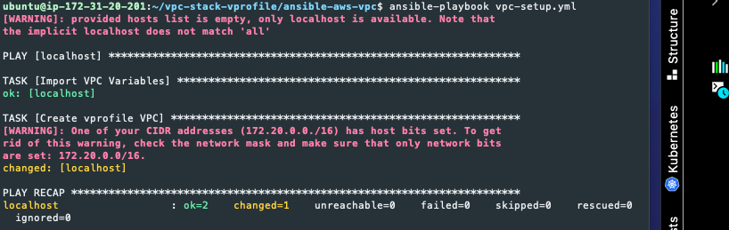

We can also check in AWS Console.

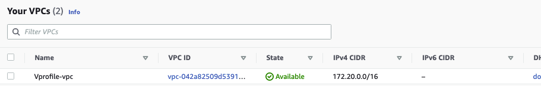

### Step-5: Subnets Play

Add below content to `vpc_setup.yml` and Commit/push changes to GitHub.
```sh
#    - debug:
#        var: vpcout

    - name: create Public Subnet 1 in Zone1
      ec2_vpc_subnet:
        vpc_id: "{{vpcout.vpc.id}}"
        region: "{{region}}"
        az: "{{zone1}}"
        state: "{{state}}"
        cidr: "{{PubSub1Cidr}}"
        map_public: yes
        tags:
            Name: vprofile-pubsub1
      register: pubsub1_out

    - name: create Public Subnet 2 in Zone2
      ec2_vpc_subnet:
        vpc_id: "{{vpcout.vpc.id}}"
        region: "{{region}}"
        az: "{{zone2}}"
        state: "{{state}}"
        cidr: "{{PubSub2Cidr}}"
        map_public: yes
        tags:
          Name: vprofile-pubsub2
      register: pubsub2_out

    - name: create Public Subnet 3 in Zone3
      ec2_vpc_subnet:
        vpc_id: "{{vpcout.vpc.id}}"
        region: "{{region}}"
        az: "{{zone3}}"
        state: "{{state}}"
        cidr: "{{PubSub3Cidr}}"
        map_public: yes
        tags:
          Name: vprofile-pubsub3
      register: pubsub3_out

    - name: create Private Subnet 1 in Zone1
      ec2_vpc_subnet:
        vpc_id: "{{vpcout.vpc.id}}"
        region: "{{region}}"
        az: "{{zone1}}"
        state: "{{state}}"
        cidr: "{{PrivSub1Cidr}}"
        map_public: yes
        tags:
            Name: vprofile-privsub1
      register: privsub1_out

    - name: create Private Subnet 2 in Zone2
      ec2_vpc_subnet:
        vpc_id: "{{vpcout.vpc.id}}"
        region: "{{region}}"
        az: "{{zone2}}"
        state: "{{state}}"
        cidr: "{{PrivSub2Cidr}}"
        map_public: yes
        tags:
          Name: vprofile-privsub2
      register: privsub2_out

    - name: create Private Subnet 3 in Zone3
      ec2_vpc_subnet:
        vpc_id: "{{vpcout.vpc.id}}"
        region: "{{region}}"
        az: "{{zone3}}"
        state: "{{state}}"
        cidr: "{{PrivSub3Cidr}}"
        map_public: yes
        tags:
          Name: vprofile-privsub3
      register: privsub3_out
```
Go to Ansible server. First Git pull, then run the playbook.

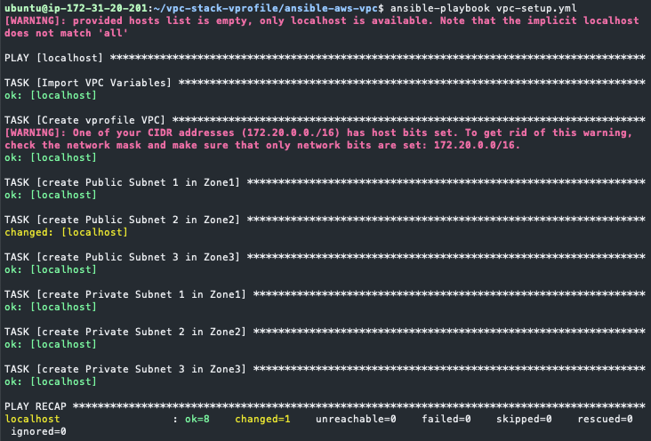

We can also check in AWS Console.

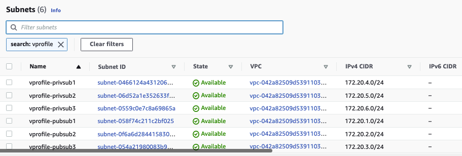

### Step-6: Internet Gateway & Public Route Table

Add below content to `vpc_setup.yml` and Commit/push changes to GitHub.

```sh
    - name: Internet Gateway Setup
      ec2_vpc_igw:
        vpc_id: "{{vpcout.vpc.id}}"
        region: "{{region}}"
        state:  "{{state}}"
        tags:
          Name: vprofile-igw
      register: igw_out

    - name: Setup Public Subnet Route Table
      ec2_vpc_route_table:
        vpc_id: "{{vpcout.vpc.id}}"
        region: "{{region}}"
        tags:
          Name: Vprofile-PubRT
        subnets:
            - "{{ pubsub1_out.subnet.id }}"
            - "{{ pubsub2_out.subnet.id }}"
            - "{{ pubsub3_out.subnet.id }}"
        routes:
          - dest: 0.0.0.0/0
            gateway_id: "{{ igw_out.gateway_id }}"
      register: pubRT_out
```

Go to Ansible server. First Git pull, then run the playbook.

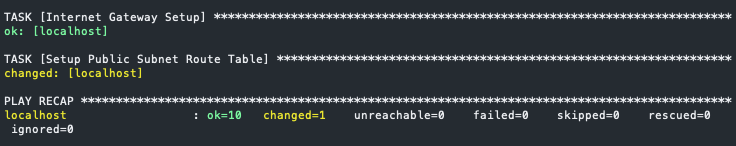

We can also check in AWS Console.

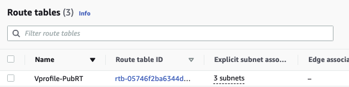

### Step-7: NAT Gateway & Private Route Table

Add below content to `vpc_setup.yml` and Commit/push changes to GitHub.

```sh
    - name: NAT Gateway1 Setup and allocate new EIP if NATGW does not exist yet in the subnet
      ec2_vpc_nat_gateway:
        subnet_id: "{{ pubsub1_out.subnet.id }}"
        region: "{{region}}"
        state:  "{{state}}"
        wait: yes
        if_exist_do_not_create: yes
      register: natgw1_out

    - name: Setup Private Subnet Route Table
      ec2_vpc_route_table:
        vpc_id: "{{vpcout.vpc.id}}"
        region: "{{region}}"
        tags:
          Name: Vprofile-PrivRT1
        subnets:
            - "{{ privsub1_out.subnet.id }}"
            - "{{ privsub2_out.subnet.id }}"
        routes:
          - dest: 0.0.0.0/0
            gateway_id: "{{ natgw1_out.nat_gateway_id }}"
      register: privRT1_out

    - name: NAT Gateway3 Setup and allocate new EIP if NATGW does not exist yet in the subnet
      ec2_vpc_nat_gateway:
        subnet_id: "{{ pubsub3_out.subnet.id }}"
        region: "{{region}}"
        state:  "{{state}}"
        wait: yes
        if_exist_do_not_create: yes
      register: natgw3_out

    - name: Setup Private Subnet Route Table2
      ec2_vpc_route_table:
        vpc_id: "{{vpcout.vpc.id}}"
        region: "{{region}}"
        tags:
          Name: Vprofile-PrivRT3
        subnets:
            - "{{ privsub3_out.subnet.id }}"
        routes:
          - dest: 0.0.0.0/0
            gateway_id: "{{ natgw3_out.nat_gateway_id }}"
      register: privRT3_out

    - debug:
        var: "{{ item }}"
      loop:
        - vpcout.vpc.id
        - pubsub1_out.subnet.id
        - pubsub2_out.subnet.id
        - pubsub3_out.subnet.id
        - privsub1_out.subnet.id
        - privsub2_out.subnet.id
        - privsub3_out.subnet.id
        - igw_out.gateway_id
        - pubRT_out.route_table.id
        - natgw1_out.nat_gateway_id
        - privRT1_out.route_table.id
        - natgw3_out.nat_gateway_id
        - privRT3_out.route_table.id

    - set_fact:
        vpcid: "{{ vpcout.vpc.id }}"
        pubsub1id: "{{ pubsub1_out.subnet.id }}"
        pubsub2id: "{{ pubsub2_out.subnet.id }}"
        pubsub3id: "{{ pubsub3_out.subnet.id }}"
        privsub1id: "{{ privsub1_out.subnet.id }}"
        privsub2id: "{{ privsub2_out.subnet.id }}"
        privsub3id: "{{ privsub3_out.subnet.id }}"
        igwid: "{{ igw_out.gateway_id }}"
        pubRTid: "{{ pubRT_out.route_table.id }}"
        natgw1id: "{{ natgw1_out.nat_gateway_id }}"
        privRT1id: "{{ privRT1_out.route_table.id }}"
        natgw3id: "{{ natgw3_out.nat_gateway_id }}"
        privRT3id: "{{ privRT3_out.route_table.id }}"
        cacheable: yes

    - name: Create variables file for vpc Output
      copy:
        content: "vpcid: {{ vpcout.vpc.id }}\npubsub1id: {{ pubsub1_out.subnet.id }}\npubsub2id: {{ pubsub2_out.subnet.id }}\npubsub3id: {{ pubsub3_out.subnet.id }}\nprivsub1id: {{ privsub1_out.subnet.id }}\nprivsub2id: {{ privsub2_out.subnet.id }}\nprivsub3id: {{ privsub3_out.subnet.id }}\nigwid: {{ igw_out.gateway_id }}\npubRTid: {{ pubRT_out.route_table.id }}\nnatgw1id: {{ natgw1_out.nat_gateway_id }}\nprivRT1id: {{ privRT1_out.route_table.id }}\nnatgw3id: {{ natgw3_out.nat_gateway_id }}\nprivRT3id: {{ privRT3_out.route_table.id }}"

        dest: vars/output_vars
```

Our playbook run successfully. Outputs copied in a file.

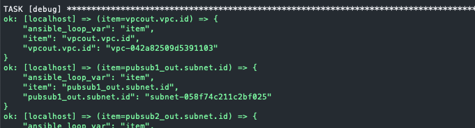
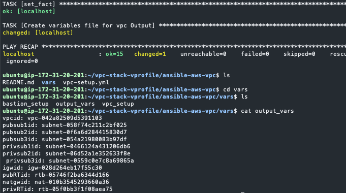

### Step-9: Bastion Host Setup

We will create `bastion-host.yml` file, commit-push to GitHub.

Go to Ansible server. First Git pull, then run the playbook.Check BastionHost from AWS console.

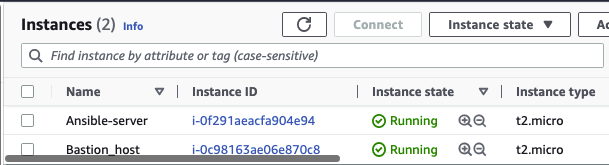

### Step-10: Cleanup 

Delete all resources to avoid any charges.