# Gitlab CI/CD Pipeline project for Python Flask App

[*Project Source*](https://www.youtube.com/watch?v=qP8kir2GUgo&t=1s&ab_channel=TechWorldwithNana)


Python App Source Code: https://github.com/benc-uk/python-demoapp   

### Step1: Setup and Run application locally

- First fork the project from the below repository.

```bash
https://gitlab.com/nanuchi/gitlab-cicd-crash-course
```
- Open the project in your code editor, in my case I am using VS Code Editor.

- We will use `make test` command to run the unit tests given under `src/app/tests/` directory.

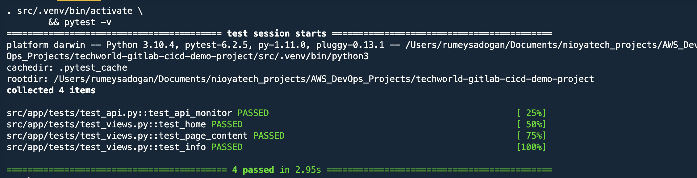

Note: If you are getting `TypeError: required field "lineno" missing from alias` after running `make test` command, go to  `requirements.txt` file under `src` directory and change ` pytest=6.2.5`

- This application runs on port 5000. Since I have another program running on port 5000, first I will change the PORT then run our application locally with `make run` command.

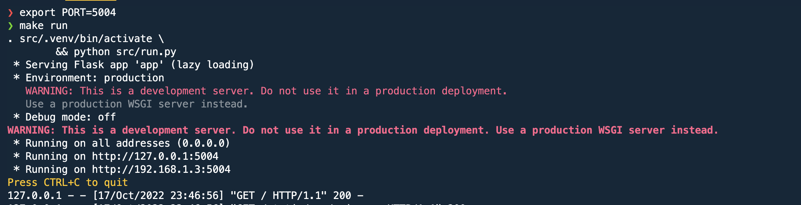

- Go to browser localhost:5004(127.0.0.1:5004), you should be able to see application running.

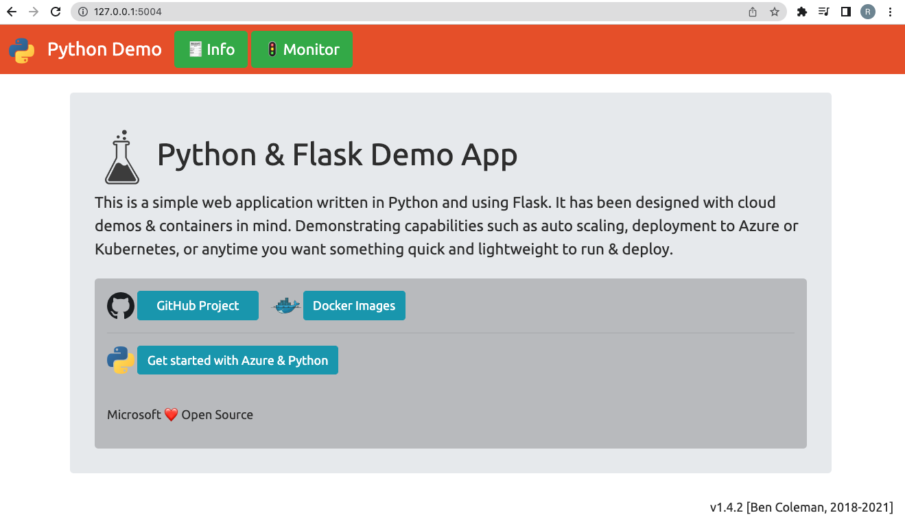


### Step2: Write a pipeline file and run in GitLab

- We will go to our GitLab account, create `.gitlab-ci.yml` file.

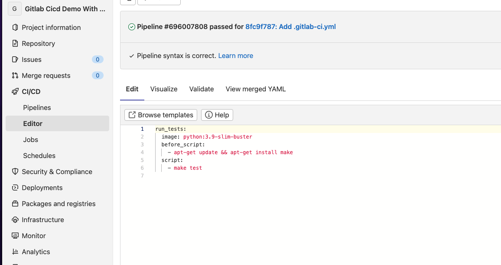

- After writing the pipeline, we can commit our changes which will trigger pipeline automatically. 
```yaml
run_tests:
  stage: test
  image: python:3.9-slim-buster
  before_script:
    - apt-get update && apt-get install make
  script:
    - make test
```
- Next, we will check our pipeline results under `CI/CD -> Pipelines` section.

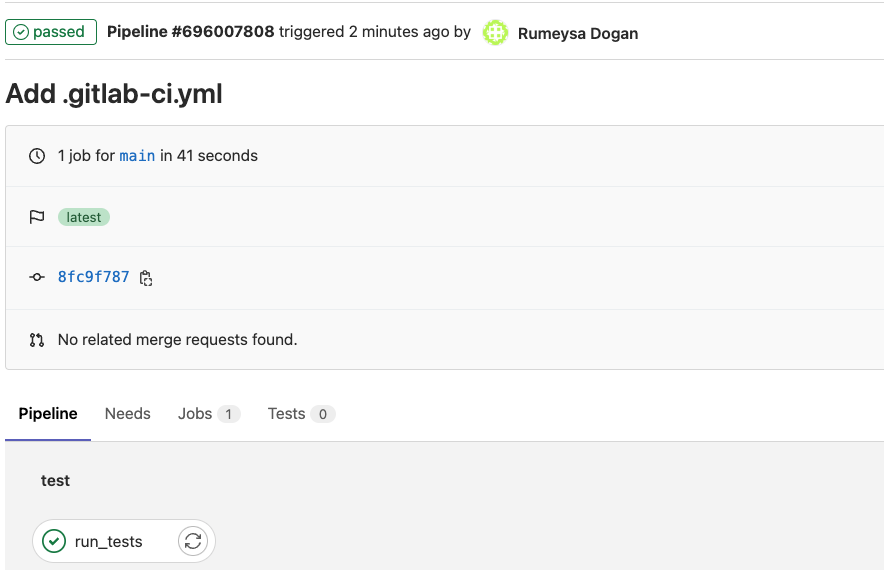

- Our first job is complete. Now we will open `.gitlab-ci.yml` file in `CI/CD -> Editor` and continue to write our next job.

- For our 2nd job, we will create/push our demo-app image to our personal DockerHub account.
To be able to achieve that, we need to provide our DockerHub credentials in pipeline. For the best practices, none of the credentials should be hardcoded in pipeline. For that reason we will create aka secret-type Variable under Project `Settings -> CI/CD -> Variables` section.

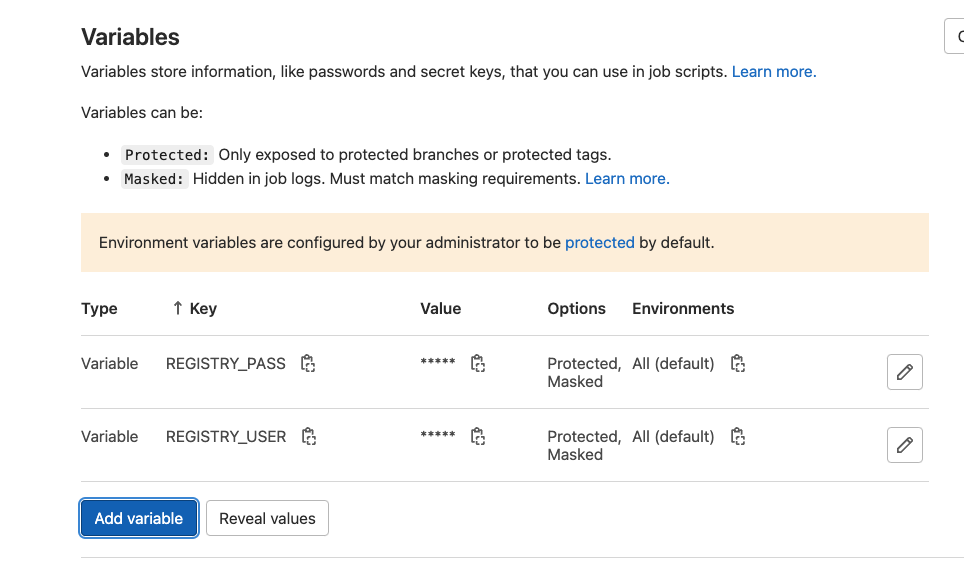
```yaml
variables:
  IMAGE_NAME: rumeysakdogan/demo-app
  IMAGE_TAG: python-app-1.0

run_tests:
  image: python:3.9-slim-buster
  before_script:
    - apt-get update && apt-get install make
  script:
    - make test

build_image:
  image: docker:20.10.21
  services:
    - docker:20.10.21-dind
  variables:
    DOCKER_TLS_CERTDIR: "/certs"
  before_script:
    - docker login -u $REGISTRY_USER -p $REGISTRY_PASS
  script:
    - docker build -t $IMAGE_NAME:$IMAGE_TAG .
    - docker push $IMAGE_NAME:$IMAGE_TAG
```

- We can commit changes, and check our pipeline results.

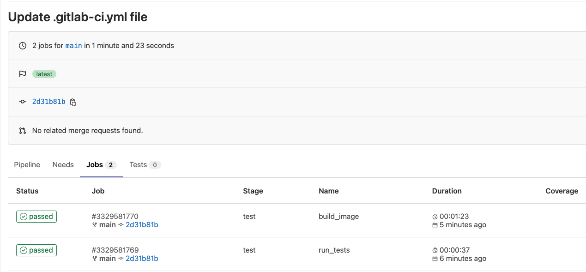

- Now we can check our DockerHub if image is pushed successfully.

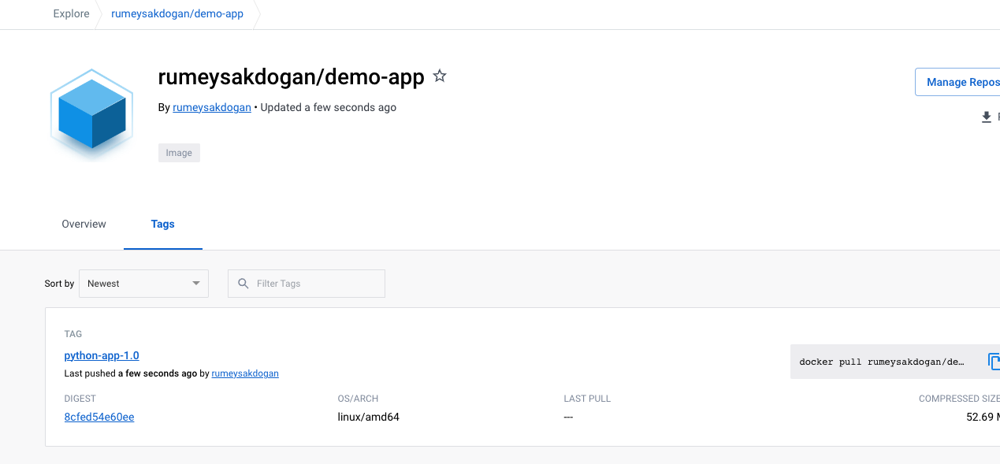

- We have a problem here, since given jobs runs in parallel, there is no guarantee that jobs we will run in the order we want. To be able to achieve that we need to use `stages` in pipeline.
```yaml
variables:
  IMAGE_NAME: rumeysakdogan/demo-app
  IMAGE_TAG: python-app-1.0

stages:
  - test
  - build

run_tests:
  stage: test
  image: python:3.9-slim-buster
  before_script:
    - apt-get update && apt-get install make
  script:
    - make test

build_image:
  stage: build
  image: docker:20.10.21
  services:
    - docker:20.10.21-dind
  variables:
    DOCKER_TLS_CERTDIR: "/certs"
  before_script:
    - docker login -u $REGISTRY_USER -p $REGISTRY_PASS
  script:
    - docker build -t $IMAGE_NAME:$IMAGE_TAG .
    - docker push $IMAGE_NAME:$IMAGE_TAG
```

- Commit the changes, thsi time we will see `build` job will wait `test` job to complete successfully before it triggers.

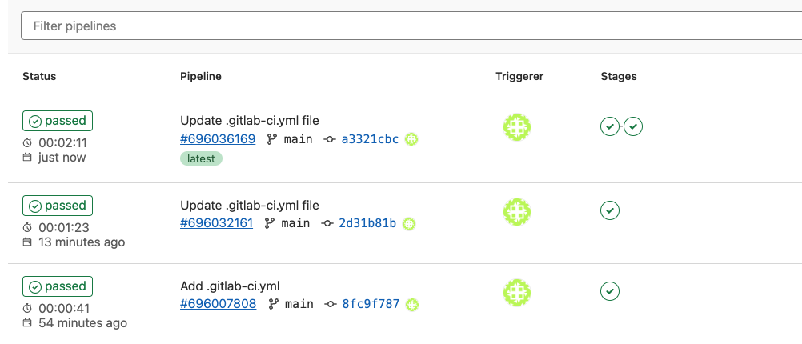

### Step3: Deploy app on Ubuntu server

- First we will create a Ubuntu server in AWS. We will create an SSH key in our local and use the public key to create this server.
```sh
ssh-keygen
```
- Once our instance is ready, we can login to instance using SSH.
  
```sh
ssh -i ~/.ssh/deployment-server-key.pem ubuntu@<public_ip_of_server>
```

- We need to install `Docker` in the deployment server. Once docker is installed, we can exit from server.
```sh
sudo apt update
sudo apt install docker.io
```

- Since we need to SSH deployment server in pipeline, we need to add private SSH key to CI/CD variables as File. Copy paste private key file content and don't forget to give an empty line at the end. It will be required to be converted the correct file format by Gitlab.


- Now we can write deploy stage of our pipeline.

```yaml
variables:
  IMAGE_NAME: rumeysakdogan/demo-app
  IMAGE_TAG: python-app-1.0

stages:
  - test
  - build
  - deploy

run_tests:
  stage: test
  image: python:3.9-slim-buster
  before_script:
    - apt-get update && apt-get install make
  script:
    - make test

build_image:
  stage: build
  image: docker:20.10.21
  services:
    - docker:20.10.21-dind
  variables:
    DOCKER_TLS_CERTDIR: "/certs"
  before_script:
    - docker login -u $REGISTRY_USER -p $REGISTRY_PASS
  script:
    - docker build -t $IMAGE_NAME:$IMAGE_TAG .
    - docker push $IMAGE_NAME:$IMAGE_TAG

deploy:
  stage: deploy
  before_script:
    - chmod 400 $SSH_KEY
  script:
    - ssh -o StrictHostKeyChecking=no -i $SSH_KEY ubuntu@44.212.71.167 "
        docker login -u $REGISTRY_USER -p $REGISTRY_PASS &&
        docker ps -aq | xargs docker stop | xargs docker rm &&
        docker run -d -p 5000:5000 $IMAGE_NAME:$IMAGE_TAG"

```

- Commit the changes and pipeline will be triggerred.

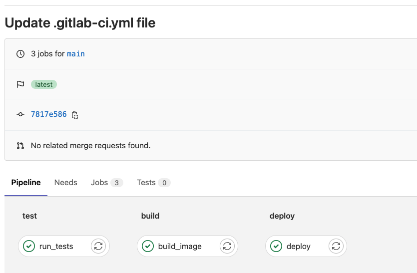

- We can also check in our deployment server if container created successfully.

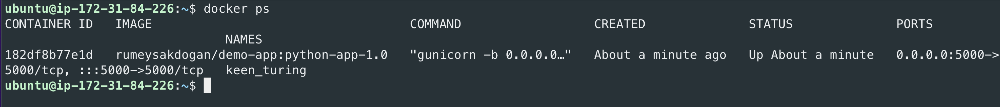

- Lastly, we can check our application from browser http://<public_ip_of_deployment_server>:5000
Make sure Security Group is configured for Port 5000 for Inbound access.

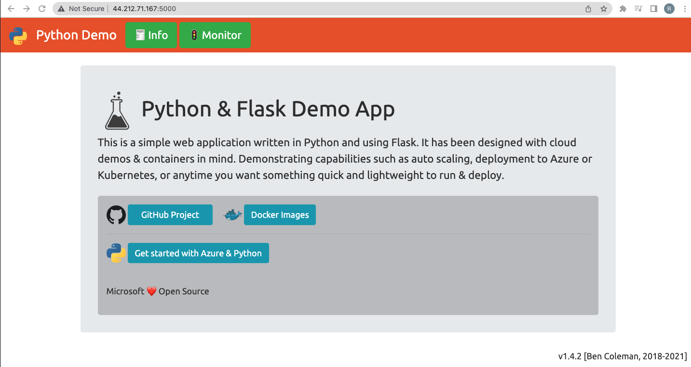

Note: Don't forget to terminate Ec2 instance.