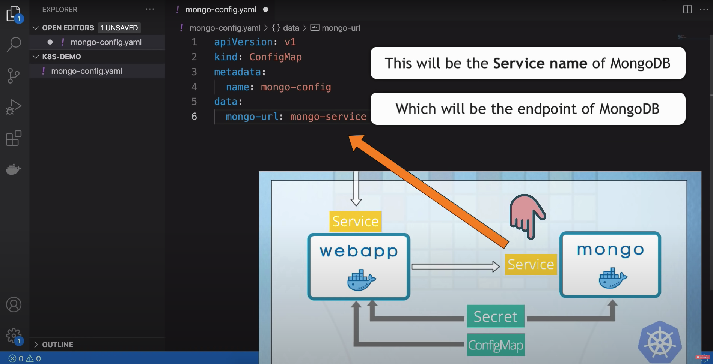
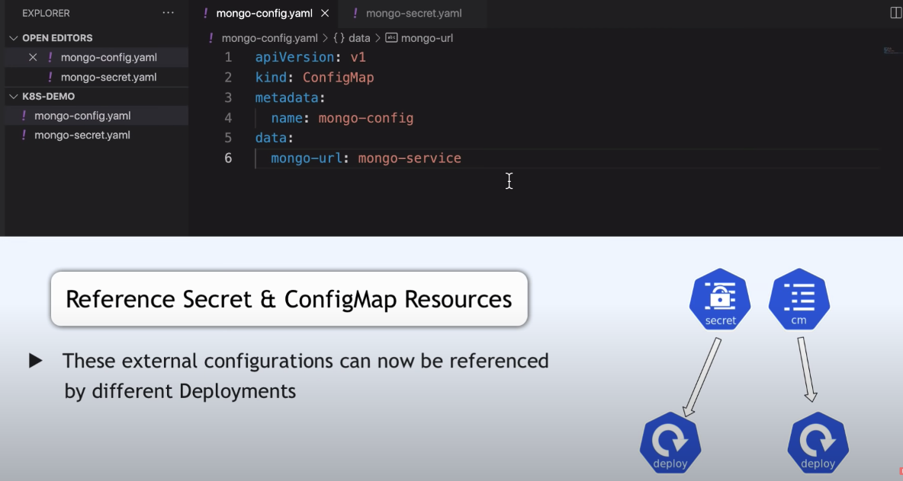
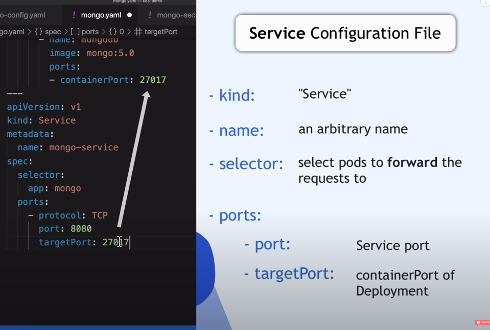
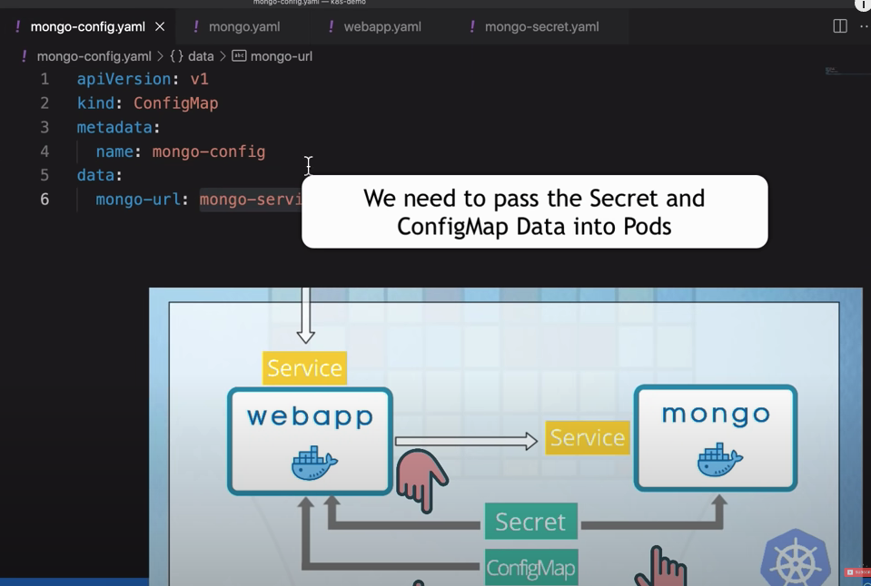
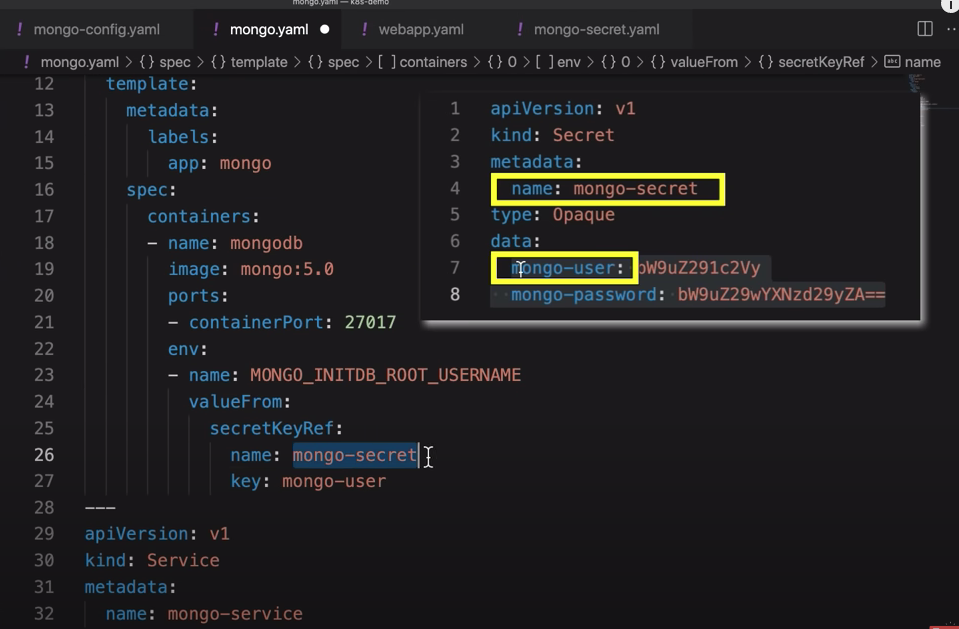
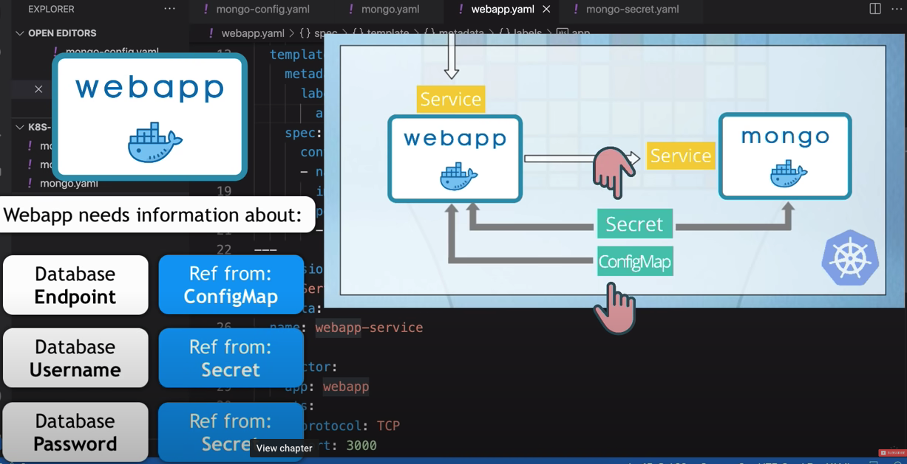
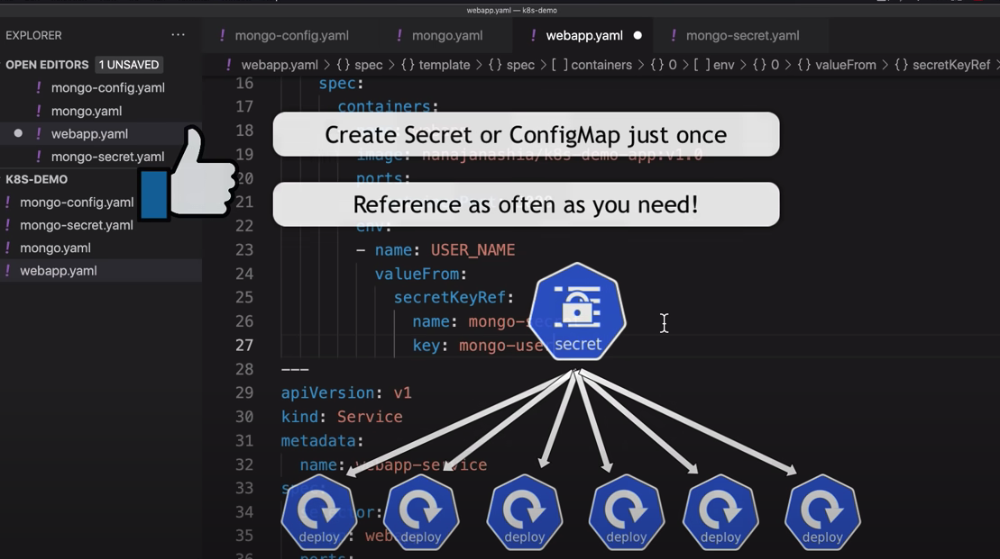
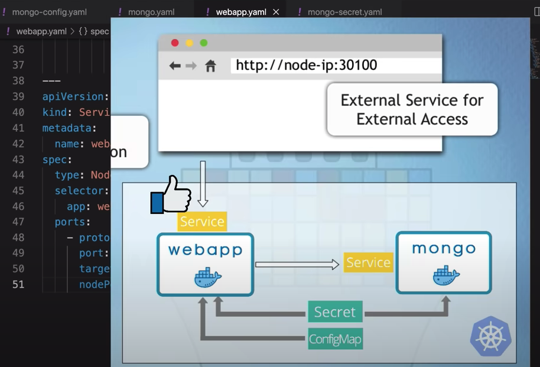
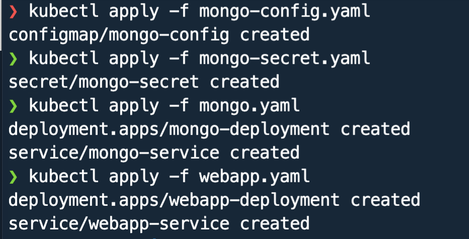
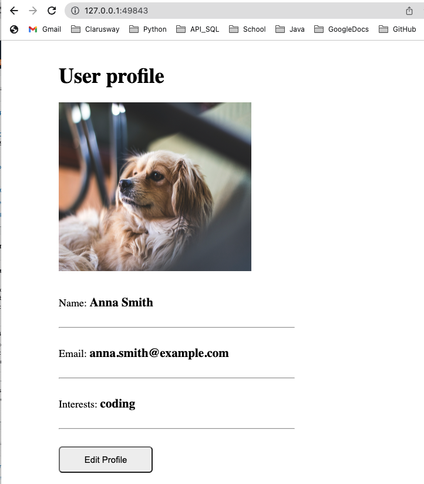

## K8s Deployment of Demo App

[*Project Source*](https://www.youtube.com/watch?v=X48VuDVv0do&t=8171s&ab_channel=TechWorldwithNana)

In this project, we will deploy 2-Tier application with using Minikube cluster step by step. 

*Step1*: We will deploy a mongodb database and a web application
which will connect to the mongodb database using external configuration data from config map and the secret and finally we will make our web application accessible externally from the browser.We're going to reference the kubernetes documentation to create our components which is a realistic way of working with kubernetes and also a docker hub where the web application image that is created for this project  which is publicly accessible so you can also pull it directly from the docker hub in your kubernetes cluster [k8s-demo-app- image](https://hub.docker.com/r/nanajanashia/k8s-demo-app)


*Step2*:
So first let's go ahead and create all the kubernetes configuration files that we need for deploying our application setup and for that i'm going to go to visual studio code where i have a kubernetes demo folder open and in this folder we're going to create four kubernetes configuration files that we need we're going to create a config map with mongodb database endpoint we're going to create a secret with username and password for mongodb and then we're going to create a configuration file for deploying a mongodb application and its service and then we're going to create kubernetes configuration file for deploying our simple demo app application with its service


*Step3*:
The first file will be called config.yml
and creating a config map in kubernetes is super simple for the syntax we can reference kubernetes documentation so i'm going to copy the first part here paste it in and that's basically the main syntax we're starting from let's call our config map config so we have the metadata and then we have the actual contents of this config map within the data attribute we have all the key value pairs that we define as external configuration within this config map in our case we just have one which we're going to call url as a key and of course we need a value for the mongodb url and the value will be the service that we're going to create for mongodb application and we're going to call that service service and in a couple of minutes you're going to see how to create this service and that will be basically all the configuration we need for creating config map so that one is done let's now go ahead and create secret.yaml which will hold the username and password for mongodb application again to reference documentation


*Step4*:
We will copy the whole thing so we have the secret kind instead of
config map let's call this secret we have type opaque which is the generic type for defining secret data basically and we have the same data attribute here and let's actually create our own values let's call this mongo-user and mongo-password and as we know the values in secret are base64 encoded so we cannot just
set the values plain text we have to encode them first and encoding values is super easy we're just gonna do echo and let's call it user and base 64. encode it and the same way let's do
password and paste those values and this will be our secret configuration
```sh
echo -n 'mongouser' | base64
❯ bW9uZ291c2Vy
echo -n 'mongopassword' | base64
❯ bW9uZ29wYXNzd29yZA==
```



*Step5*:
When we create deployments for our applications we can reference any of the values defined in the secret or config map.Let's create a new file and call this mongo.yaml this is going to be a configuration file where
we're going to create deployment and service for mongodb you can have
separate files for them but it's a very common thing to put them together because all the deployments need services so you have them grouped in one yaml file.


Let's start with the main part of the deployment which defines the blueprint for the pods and that blueprint is defined as a template so template basically is a configuration of the part within the configuration of deployment and you see that template section has
its own metadata and own spec or specification just like deployment has
its metadata and specification right so this part actually configures the pod within a deployment and in the specification of the pod we have the definition of containers so this is a list of containers as we learned we can have multiple containers in a pod but mostly one main application per pod this is where we define which image will be used to create this pod in our case this is going to be a mongodb image and if we search for in docker hub that's basically the image name and you
can find all the text in the text section and we're going to use the tag 5.0 so one go 5.0 that's where we define the image of the container within the pot we can name this mongodb this is just the name of the
container and we also have the port where the container will listen and let's check our image and as you see mongodb starts at this port so we can just copy it and paste it in here so this basically just configures our deployment to create pods with a mongodb image version 5.0 so that's the core of a deployment

We have this labels attribute in the metadata section and then we also have match labels attribute.You can give any component a key value pair labels so you can label anything from pod to deployment to configmap etc and labels basically are additional identifiers of the components in addition to the name for example so you can identify and address specific components using their labels now.
* Why do we need labels? When we have multiple replicas of the
same pod, each pod will get a unique name however they can share the same label so we can identify all the pod replicas of the same application using a specific label that all of them share and that's why in the metadata of the pod we always have this label


For pods, labels is a required field for other components like deployment configmap etc labels is optional but it is a good practice to set them now when we create pod replicas how does deployment know which parts actually belong to it or how does kubernetes know which pods belong to which deployments and that is defined using this part right here so selector match labels is in the specification of the deployment as you see and this defines that all the parts that match this label belong to this deployment so that's why we have match labels here so this selector will match the pods created with this configuration because they have label app engine x now are these labels given or can you select any key value pairs well these are totally up to you you can call it whatever you want you can call it my key my value it doesn't really matter however the standard and a common practice in kubernetes is to use app key in the labels when labeling your applications and the value will obviously be whatever application you have so let's actually change and set the values to instead of nginx because that's our application and of course we want to match label app and let's also change this one right here to deployment 

*Step6*:


let's add a service configuration because every application needs a service in kubernetes and that's going to be a separate yaml unit or yaml section and we're going to separate it using three dashes which is basic yaml syntax nothing specific to kubernetes and again let's grab a service example and adjust it as we need now service configuration is much easier than the deployment as you see first let's change
the name let's call it service and remember this is the end point
which we will use to access and that's what we defined right here so this is the name of the service and in the specification we have
service specific attributes first of all we have the selector attribute which you already know from here now why do we need a selector in service because as you know service needs to forward the request that it gets to its endpoint pods how does service know which pods belong to it and which ones it should forward the requests to well using the same label selector as we saw on deployment so this should match the label of the pods that will belong to the service which is and that's how service and pods will find each other and then we have the ports configuration which is also super simple service is accessible within the cluster using its own ip address and the port and we define its port right here and this can be any port that we decide on this could be 80 8080 doesn't really matter and we have the target port which is the port of the pods that belong to the service and logically enough the target port should always be the same as the container port because that's where the
application in the pod is accessible that's where the service should forward the request to so again very important port attribute sets the port of the service and target port tells service to which port it should forward the request to the pods and this should be same as the container port.Port and target port values can be different, but it's a common standard to select the same port for the service as well.


*Step7:*


We will copy this whole thing and create a deployment in service for web
application for our kubernetes demo application and let's call this webapp.yaml paste everything in and we can just adjust all these
values in the service and deployment all the labels and label selectors of course and right here we of course need the correct image of our web application going back to our docker hub this is the name of my image and again this is publicly accessible so you can use it as well and the tag is v1.0 and there you go so this is a very simple node.js application which starts on port 3000 so that's why we need to define container port on 3000 and container port is same as target port on the service and we can set the service port to the same value and this will configure deployment and service for our web application so this is
the basic configuration for deployment and service for any application in
kubernetes cluster.

*Step8*:
We need to pass the data defined in the config and secret components
first of all when starting a mongodb application we need to set user name and password so when mongodb application starts it will automatically generate username and password for mongodb and we can then use that to access it in our cluster now how do we know how username and password can be configured in a mongodb on startup well we go to the image documentation and right here we see the environment variable names
for username and password and these are actually required fields in most of the databases we have to set them otherwise we won't be able to access them.

* How do we configure environment variables in a container configuration so how do we pass environment variables to this application running inside the container?


we have an attribute for that which is a list of environment variables with names and values. name is the environment variable name and value is the environment variable value so let's copy the name so this is the environment variable name that mongodb expects and we have to set a value whatever we want the username to be now we can directly set the username right here or in our case we're going to reference them from secret and config components how do we do that also pretty simple we do valueFrom .we want to reference it from the secret so we do secretKeyRef and under that we have the name of the secret which we called secret and the key which is user so kubernetes will basically find a secret with this name and get the value set for this key and substitute it as a value for this environment variable. Same way we will configure password as well.



*Step9*:
when our web application starts it will need to connect to the database so we need to give this web application information about the database endpoint where can it access the database and which username and password to use to authenticate with the database and i have already configured this application inside to expect all these values as environment variables with specific names so we're going to pass these three pieces of data as environment variables to the web app application 

Similary we will configure env variables for webapp.yaml, again we will reference from Secret and ConfigMap files in similar way.

*Step10*:
One last thing missing in our web application configuration before we deploy all this which is making it accessible from the browser we want to be able to type in some url and access our web application from the browser right. We have external services for that so we will need to adjust the service configuration a little bit right now these service configurations both of them are internal services so to make it external all we need to do is set a type which is by default cluster ip so that's the default type if we don't specify the type. But we're going to set it to nodePort. so nodePort is an external service type and it requires a third port which is called a nodePort.

NodePort is a port which will open on the kubernetes nodes on which the application will be accessible so on the node ip address in node port combination we will be able to access this service which will then access the pods behind it and nodePort range is actually defined in kubernetes so we can't just type anything we want here like this it has to be within the range of 30000-32767 so anything within this range is fine as a value so we can do 30 000 or 30100 doesn't really matter so let's set this as a value and this completes the web app configuration file.


*Step11*:
Final step we're just gonna create all these components one by
one in kubernetes so i'm gonna open a terminal and we already have a minikube cluster running but there are no components inside so first we need to create the external configurations because they need to be there when we create mongodb and web application deployments because they reference those configurations so let's create config and secret first to do that we have cube ctl apply command with minus f which stands for file which takes a kubernetes configuration file as an input like this
and creates whatever is defined inside and as you see config was created
now let's create longer secret next we're gonna create a database
because our web application depends on it so it should start first
and again let's do kubectl apply with mongo.yaml as an input and as you
see deployment and service were created and finally let's deploy our web application and there you go so everything seems fine but of course we want to check all the parts and all the components that were created in the cluster.



*Step12:*
Final step we want to validate that our application is also accessible from the browser. Since we run minikube with `--driver docker` option, we need to get the service url with below command:


This is our application running!! 




#### K8s manifest files 
* mongo-config.yaml
* mongo-secret.yaml
* mongo.yaml
* webapp.yaml

#### K8s commands

##### start Minikube and check status
    minikube start --driver docker 
    minikube status

##### get minikube node's ip address
    minikube ip

##### get basic info about k8s components
    kubectl get node
    kubectl get pod
    kubectl get svc
    kubectl get all

##### get extended info about components
    kubectl get pod -o wide
    kubectl get node -o wide

##### get detailed info about a specific component
    kubectl describe svc {svc-name}
    kubectl describe pod {pod-name}

##### get application logs
    kubectl logs {pod-name}
    
##### stop your Minikube cluster
    minikube stop


#### Links
* mongodb image on Docker Hub: https://hub.docker.com/_/mongo
* webapp image on Docker Hub: https://hub.docker.com/repository/docker/nanajanashia/k8s-demo-app
* k8s official documentation: https://kubernetes.io/docs/home/
* webapp code repo: https://gitlab.com/nanuchi/developing-with-docker/-/tree/feature/k8s-in-hour
